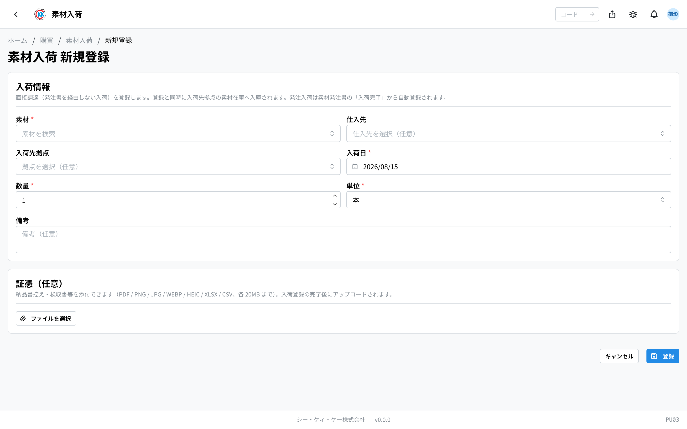
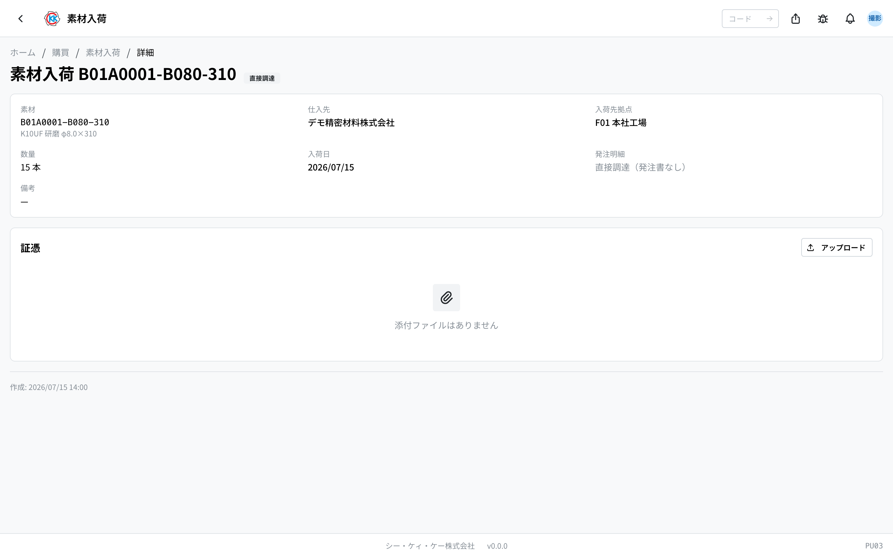

素材が届いたことを記録する **素材入荷** のアプリです。操作コードは `PU03` です。

> ⚠️ このアプリはまだ準備中のため、本番の画面には出ていないことがあります。見当たらないときは、社内の担当者にご確認ください。

## このアプリでできること

- 素材が届いたことを記録できます。記録すると、その拠点の **在庫がその分だけ増えます**。
- これまでに届いた素材を、いつ・どこに・何本届いたかで振り返れます。
- 納品書控えや検収書のファイルを、入荷の記録にくっつけて保管できます。
- 発注書を通さずに買った素材（持ち込み分など）が届いたときに使います。

## 用語（このページで出てくる言葉）

- **入荷（にゅうか）** … 素材が実際に届くことです。
- **発注入荷（はっちゅうにゅうか）** … [素材発注書](/manual/ja/apps/purchase-order/user)で注文したものが届いた入荷です。**自動で記録されます。**
- **直接調達（ちょくせつちょうたつ）** … 発注書を通さずに買った素材の入荷です。**この画面で手入力します。**
- **入荷先拠点（にゅうかさききょてん）** … その素材を受け取る拠点（工場・事業所）のことです。
- **証憑（しょうひょう）** … 納品書控え・検収書など、あとから見返す書類のことです。

## はじめる前に

- 届いた **素材が[素材マスタ](/manual/ja/masters/material/user)に登録されている** 必要があります。登録されていない素材は選べません。
- 在庫を増やしたい拠点を選ぶには、その **[拠点](/manual/ja/masters/plant/user)が登録されている** 必要があります。
- 登録には素材入荷の権限が必要です。ボタンが出ないときは社内の担当者にご確認ください。

> ⚠️ 発注書で注文した素材が届いたときは、この画面では登録しません。[素材発注書](/manual/ja/apps/purchase-order/user)の画面で「**入荷完了**」を押すと、入荷の記録が自動でできます。

## 画面の見かた

アプリを開くと、これまでの入荷の記録が新しい順に並びます。

- **素材** … 上が素材コード、下が素材の名前です。
- **発注明細** … 発注書から届いたものは `PO-` で始まる発注番号が青いリンクで出ます。発注書を通さないものは灰色の「**直接調達**」バッジが出ます。
- 上の検索欄に素材コード・名前・仕入先・発注番号を入れると、探している記録を絞り込めます。
- 右の「**入荷区分**」で「発注入荷」だけ、「直接調達」だけを表示できます。
- 行をクリックすると、その入荷の詳しい画面が開きます。

## 届いた素材を登録する（直接調達）

1. 一覧画面の右上にある「**新規作成**」を押します。
2. 「**素材**」の欄をクリックし、素材コードや名前で検索して選びます（必ず選んでください）。
3. 「**仕入先**」を選びます（空欄のままでもかまいません）。
4. 「**入荷先拠点**」で、素材を受け取った拠点を選びます。
5. 「**入荷日**」を確認します（はじめは今日の日付が入っています）。
6. 「**数量**」に届いた本数を入れます。
7. 「**単位**」を確認します（はじめは「本」が入っています）。
8. 納品書控えなどを一緒に保管したいときは、「**証憑（任意）**」の「**ファイルを選択**」を押してファイルを選びます。
9. 最後に「**登録**」を押します。

登録すると、選んだ拠点の素材在庫がその分だけ増え、詳しい画面が開きます。

> ⚠️ 「入荷先拠点」を空欄のまま登録すると、どの拠点の在庫にも入らず「拠点なし」の在庫として扱われます。あとから直せないので、受け取った拠点を必ず選んでください。

添付できるファイルは PDF / PNG / JPG / WEBP / HEIC / XLSX / CSV で、1 つあたり 20MB までです。

## 記録した内容を見る

一覧で行をクリックすると、その入荷の詳しい画面が開きます。

- 素材・仕入先・入荷先拠点・数量・入荷日・備考を確認できます。
- **発注明細** … 発注書から届いたものは、元の[素材発注書](/manual/ja/apps/purchase-order/user)へのリンクが出ます。クリックすると発注の内容を確認できます。
- 直接調達のときは「**直接調達（発注書なし）**」と表示されます。

- **証憑** の枠から、あとからファイルを追加したり削除したりできます。

## よくある質問・困ったとき

**Q. 発注した素材が届きました。ここで登録しますか？**
A. いいえ。[素材発注書](/manual/ja/apps/purchase-order/user)の画面で「**入荷完了**」を押してください。入荷の記録はそこから自動で作られます。この画面で手入力すると、同じ素材を二重に在庫へ入れてしまいます。

**Q. 一部だけ先に届きました。**
A. 発注書の「入荷完了」は残り全部をまとめて処理します。分けて届いた分は、この画面で届いた本数だけを登録してください。

**Q. 登録した内容を直したいです。**
A. 入荷の記録は在庫を動かしたあとの確定した記録なので、直したり消したりはできません。「編集」「削除」のボタンもありません。登録する前に、数量と拠点をよく確認してください。

**Q.「素材を選択してください」と出て登録できません。**
A. 「素材」の欄が空のままです。欄をクリックして素材コードや名前で検索し、候補から選んでください。手で打ち込むだけでは選んだことになりません。

**Q.「20MB を超えるファイルは添付できません」と出ます。**
A. 選んだファイルが大きすぎます。写真であれば小さいサイズで撮り直すか、PDF にまとめてから選び直してください。

**Q. 登録したのに、その拠点の在庫が増えていません。**
A. 「入荷先拠点」が空欄のまま登録されていないか、詳しい画面で確認してください。拠点を選んでいないと、その拠点の在庫ではなく「拠点なし」の在庫として記録されます。
