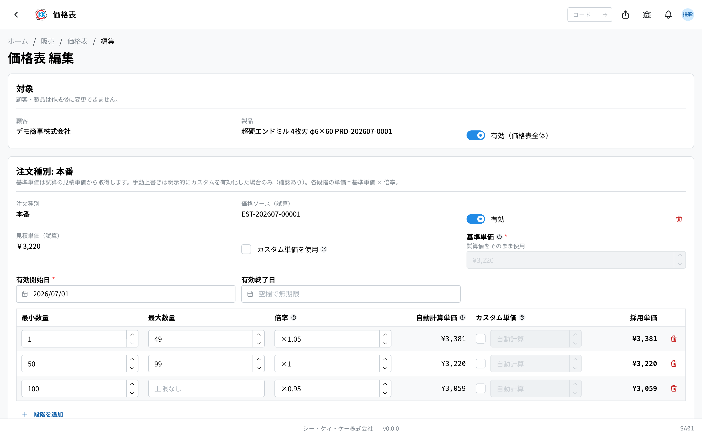
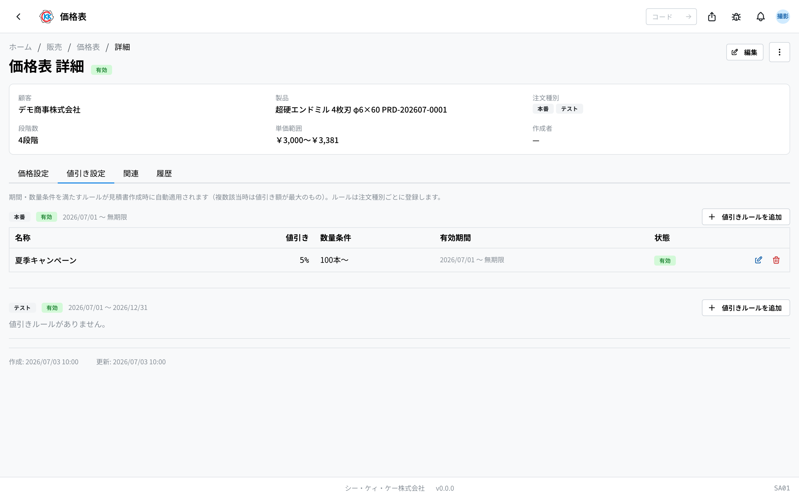

操作码 **SA01**。管理每个客户的产品单价。报价单的单价会自动从这里解析。

## 本应用能做什么

按[客户](/manual/zh/masters/customer/user)登记"这个[产品](/manual/zh/masters/product/user)卖多少钱"的 **销售单价** 台账。登记后，创建[报价单](/manual/zh/apps/quote/user)时单价与折扣会自动填入（报价单侧没有手动输入）。

- 基准单价通常从关联到产品的 **已确定试算（SA05）** 中取得（也可手动设置 — 需确认）。
- 1 个价格表（客户×产品）中可设置 **按订单类型的价格** 和数量越多越便宜的 **数量阶梯（数量范围 → 倍率）**。
- 登记 **折扣规则**（期间・数量条件）后，创建报价单时会自动适用。
- **有效期** 按变体（订单类型）单位设置。测试・样品必须设置结束日。

## 价格表条目

1 条 = **客户 + 产品**（创建后不可更改・同组合仅 1 条）。按订单类型（正式 / 测试 / 样品 / 其他）的价格作为条目内的 **变体** 保存。

- 每个变体拥有 **基准单价**・**有效期**・有效/无效・试算关联（价格来源）。
- **数量阶梯**：每个数量范围一个倍率（例：1〜49 支 = ×1.05、50〜99 支 = ×1.00、100 支〜 = ×0.95）。阶梯单价 = 基准单价 × 倍率。也可按阶梯覆盖为手动固定单价（需确认 — 采用单价显示"手动"）。

## 创建方法

1. 从列表的"新建"选择 **客户与产品**。若同一客户×产品的价格表已存在会显示警告（请编辑现有条目。保存时也会报重复错误）。
2. 按订单类型设置价格。所选产品若有 **已关联的确定试算（SA05）**，可将其选为 **价格来源（试算）**，其报价单价会填入基准单价（推荐）。
3. 没有试算、或想用其他单价时，勾选"**使用自定义单价**"手动设置基准单价（需确认）。
4. 设置 **有效开始日**。测试・样品还必须设置 **有效结束日**。
5. 通过"添加订单类型"可在同一条目中追加其他类型的价格。
6. 以试算为来源保存后，该试算会被锁定为 **已登记价格表（REGISTERED）**。

## 编辑・折扣规则

- 详情页 →"编辑"可以添加/删除订单类型、更改基准单价（仅自定义时）・有效期・数量阶梯。已保存变体的订单类型与价格来源不可更改。

- **折扣规则** 在详情页的"折扣设置"标签页按订单类型登记。可设置名称・折扣类型（率 % / 金额 ¥/支）・数量条件・有效期，满足条件的规则会在创建报价单时自动适用（多条符合时采用折扣额最大的）。

## 列表・检索・其他操作

- 可按客户・产品搜索，按客户・产品・订单类型筛选。1 行 = 客户×产品（订单类型为徽标、单价为范围显示，还有试算来源・折扣件数・有效期列）。
- 行菜单可执行"**创建报价单**"（用此价格表起草报价单）・"**变更有效期并复制**"・"**复制到其他客户・产品**"（试算关联会解除、变为手动）・"**删除**"。
- 选中行后可批量 **启用 / 停用 / 批量删除**。
- 详情的"关联"标签页显示试算来源和由此价格表创建的报价单一览。
