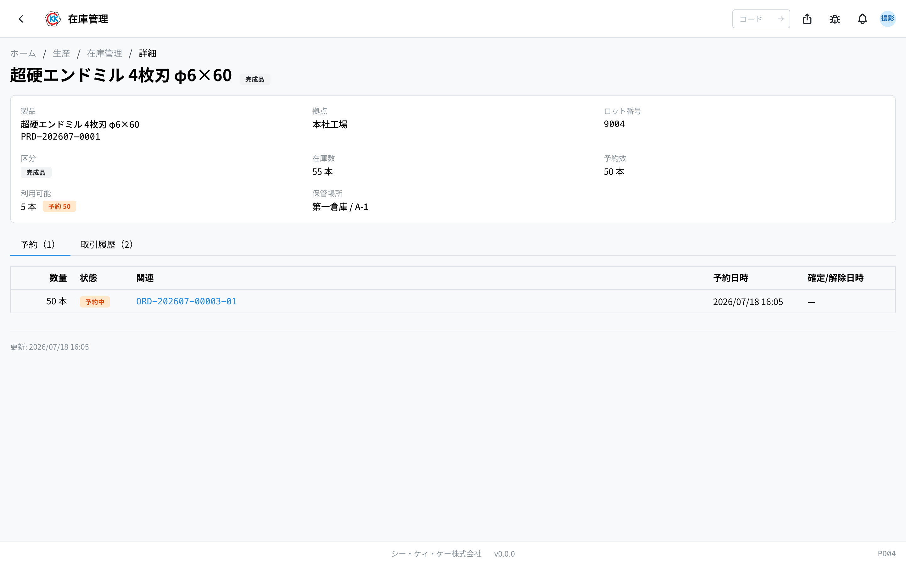
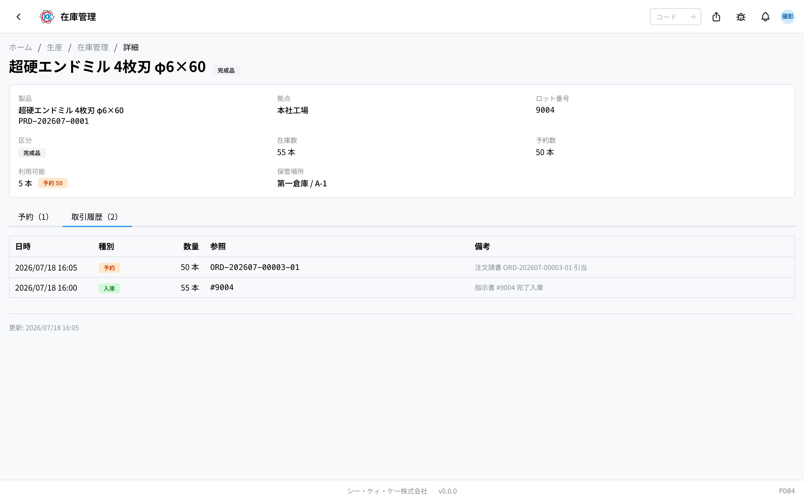
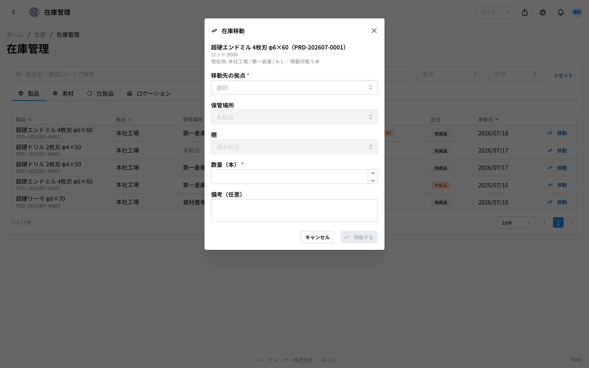

This app is for checking **where products and materials are and how many there are**. You also record here when you move something to a different place. The operation code is `PD04`.

> ⚠️ For now this app works **only in the test environment**. The screens and the steps may change before it can be used for real work.

## What you can do with this app

- You can check how many finished products are on which shelf at which site.
- You can see separately how many pieces are set aside (reserved) and how many are still free to use.
- When you move items to a different shelf or a different warehouse, you can record it.
- You can look back at the record of stock movements — when, what, and how many.

The screen is split into four tabs.

- **製品** (products) … stock of finished products and semi-finished items. This page explains it.
- **素材** / **仕掛品** (materials / work in progress) … material stock and how many pieces are being made right now. → [Inventory management (materials and work in progress)](/manual/en/apps/material-inventory/user)
- **ロケーション** (locations) … a screen that shows what is where, in the order site → storage place → shelf. This page explains it.

Products and materials used to be separate apps, but now they are together in this one app. If you open an old link to those screens, it takes you to this app automatically.

> 💡 You cannot change the stock numbers directly here. The numbers **move automatically** as everyday work is done. The only thing you can do by hand on this screen is 「**在庫移動**」 (stock transfer), which changes where something is kept.

## Words used on this page

- **拠点** (site) … a large place such as a factory or a warehouse.
- **保管場所 / 棚** (storage place / shelf) … places inside a site. They are managed in two levels, such as shelf 「A-1」 in 「第一倉庫」 (warehouse 1).
- **ロット** (lot) … the number given to a batch of products made together. The work order number is used as it is.
- **予約（取り置き）** (reserved / set aside) … the amount held for a particular order. It cannot be used for other orders.
- **利用可能** (available) … the part of the stock that is not reserved yet. This is what you can really use.
- **半製品** (semi-finished item) … an item put back into stock before it was finished.

## Where stock goes up and down

Stock does not move on this screen; it moves automatically along with everyday work.

- **In** … when all the steps of a [work order](/manual/en/apps/work-order/user) are finished, the good pieces go into stock with the lot number. Pieces marked as 「半製品」 (semi-finished) go into stock as semi-finished items.
- **Set aside** … when you run 「**在庫照合**」 (Check stock) on the sales order screen, the stock you can use is reserved for that order.
- **Out** … when you ship with a [shipping order](/manual/en/apps/shipping-order/user), the stock goes out and the reservation is released.

## How to read the products tab

- **製品** (product) … the product name and the product code.
- **拠点** (site) … which site it is at.
- **保管場所** (storage place) … shown as "place name / shelf code". Items with no place decided yet show 「**未割当**」 (not assigned).
- **ロット** (lot) … the lot number of that stock.
- **在庫数** (stock quantity) … how many pieces there really are.
- **利用可能** (available) … how many of those you are free to use. If some are reserved, a badge such as 「予約 50」 (50 reserved) is shown.
- **区分** (category) … either 「**完成品**」 (finished product) or 「**半製品**」 (semi-finished item).
- **移動** (transfer) … the button you press to change where it is kept.
- Type a product name or product code into the search box at the top to find one. You can also narrow it down with 「**拠点**」 (site) and 「**区分**」 (category).
- Click a row to open the detail screen for that stock.

## Looking at the detail screen

Click a row to open the detail screen for that one stock record.

Near the top you see the product, site, lot number, category, stock quantity, reserved quantity, available quantity, and storage place. For a semi-finished item, 「**発生工程**」 (step it came from — which step of which work order) is also shown.

Below there are two tabs.

- **予約** (reservations) … the list of orders that have set this stock aside. The status goes 「**予約中**」 (reserved) → 「**確定**」 (confirmed) → 「**解除**」 (released). You can also check the related sales order number and work order number.
- **取引履歴** (transaction history) … the record of stock movements.

The 「**種別**」 (type) in the transaction history is one of these five.

- **入庫** (in) … when stock went up
- **出庫** (out) … when stock went down
- **予約** (reserve) … when it was set aside for an order
- **解除** (release) … when the reservation was removed
- **調整** (adjust) … when the number was corrected, for example after a stocktake

A stock transfer leaves two lines: an 「出庫」 (out) at the place it left and an 「入庫」 (in) at the place it went to.

## Changing where something is kept (stock transfer)

When you move items to a different shelf or a different warehouse, record it like this.

1. Press the 「**移動**」 (Transfer) button on the right of the row in the list. You can also press it from the stock chips on the locations tab.
2. The 「在庫移動」 (stock transfer) screen opens. At the top you see where it is now and how many pieces can be moved.
3. Choose the 「**移動先の拠点**」 (site to move to).
4. Choose the 「**保管場所**」 (storage place).
5. Choose the 「**棚**」 (shelf).
6. Enter how many pieces to move in 「**数量（本）**」 (quantity in pieces).
7. If you like, write something in 「**備考（任意）**」 (notes, optional).
8. Press 「**移動する**」 (Transfer).

> ⚠️ Reserved pieces cannot be moved. The most you can enter is the 「利用可能」 (available) number. For products you cannot enter a decimal number.

## How to read the locations tab

This screen shows what is where, arranged by place.

- Choose a 「**拠点**」 (site) at the top and the **storage place cards** for that site (name and code) are shown.
- Inside each card are **shelf squares**, showing the items there and how many. Shelves with nothing in them show 「**空き**」 (empty).
- Stock with a storage place but no shelf decided is collected in the 「**棚未割当**」 (no shelf assigned) box. Stock with no storage place either is collected in the 「**未割当（保管場所なし）**」 (not assigned — no storage place) box.
- If a floor map (a layout drawing of the site) is registered for the site and the storage places have pins on it, the **floor map** is shown too. Click a pin and the screen scrolls to that storage place card and highlights it.
- If there is nothing at that site, a note says there are no storage places or stock at this site.

Storage places and shelves themselves are registered in [storage location](/manual/en/masters/storage-location/user).

You need inventory permission to use this app.

## Questions and problems

**Q. I want to correct a stock number by hand.**
A. The only thing you can do from this screen is 「在庫移動」 (stock transfer), which changes where something is kept. If a number is wrong, a stocktake adjustment is needed, so please talk to an administrator.

**Q. 「利用可能」 (available) is 0 but there is 「在庫数」 (stock quantity).**
A. That amount is set aside (reserved) for other orders. Open the 「予約」 (reservations) tab to see which orders it is set aside for.

**Q. I tried to transfer, but it will not accept the number I want.**
A. You can only move up to the 「利用可能」 (available) number. Reserved pieces cannot be moved.

**Q. The storage place shows 「未割当」 (not assigned).**
A. Stock that came in automatically, for example when a work order finished, comes in with no place decided. Once you have put it on a real shelf, record the place with 「移動」 (Transfer).

**Q. A product I am still making does not appear on the 「製品」 (products) tab.**
A. Pieces being made are not stock yet. You can check them on the 「**仕掛品**」 (work in progress) tab. They go into stock when all the steps are finished.

**Q. Nothing appears on the locations tab.**
A. Either no storage places are registered for that site yet, or there is no stock. Please talk to an administrator about registering storage places.
