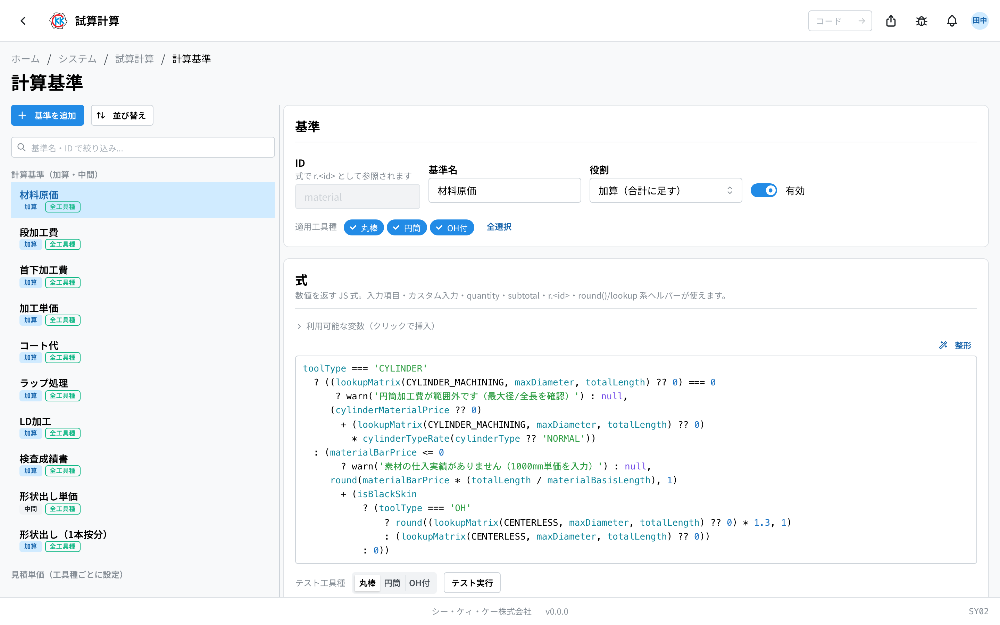
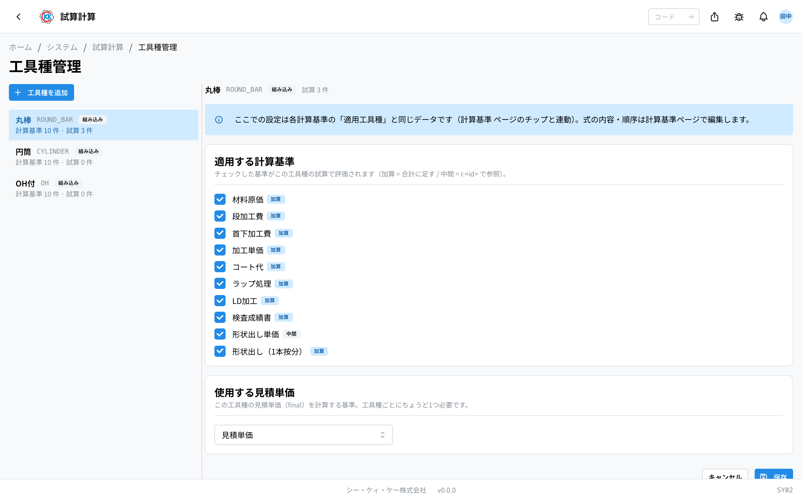
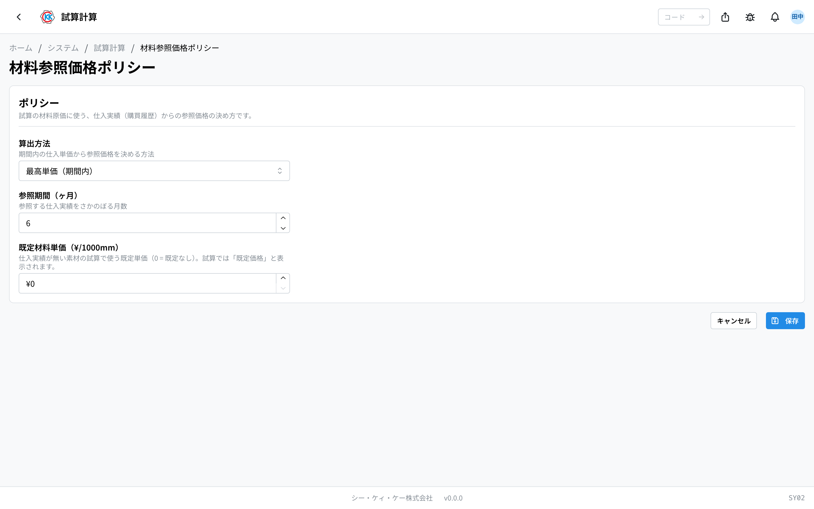
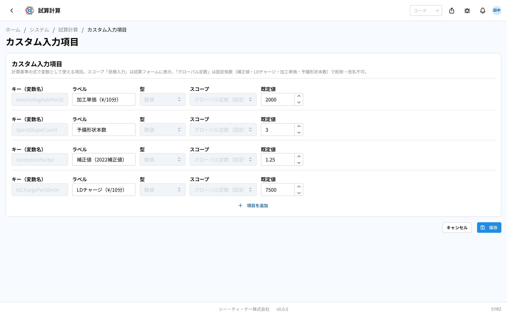
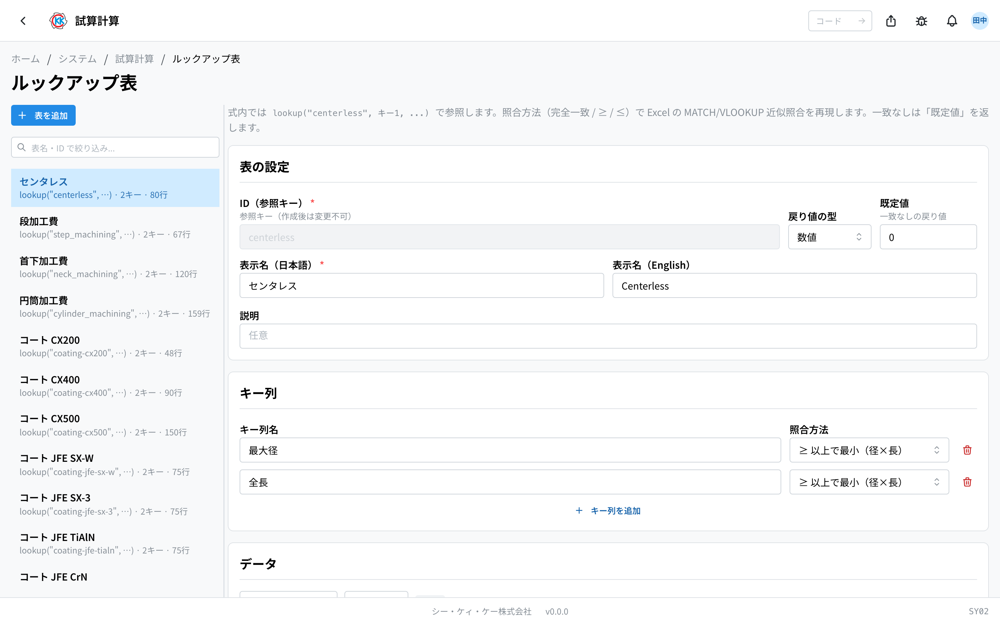

这是管理员用来决定 [試算](/manual/zh/apps/trial-estimate/user)（试算）应用 **如何计算单价** 的应用。操作码是 `SY02`。

这个界面会改变计算方式本身，所以 **请只让了解公司规定的负责人** 操作。

## 这个应用能做什么

- 可以决定报价单价按什么顺序、用什么内容一步步累加出来。
- 可以增加工具的种类（圆棒、圆筒、带 OH 等），也可以为每个种类选择使用哪些计算。
- 可以决定材料的价格从哪些采购记录中取得。
- 可以增加或减少试算输入界面上显示的项目。
- 可以登记计算时使用的参照表（速查表）。

## 术语（本页出现的词）

- **計算基準（计算基准）** … 组成单价的一个一个部件。“材料的价格”“加工的工时”等，各自都是一个计算基准。
- **見積単価（报价单价）** … 把各计算基准累加后得出的、最终每支的金额。
- **工具種（工具种类）** … 指工具的种类。系统一开始就带有 **丸棒**（圆棒）/ **円筒**（圆筒）/ **OH付**（带 OH）三种。
- **式（表达式）** … 写明该计算基准“如何计算”的内容。这里由熟悉计算的负责人设置。
- **ルックアップ表（查找表）** … 指“这个直径就是这个价格”这样的速查表。计算时会被引用。

## 开始之前

- 使用本应用需要 **系统管理权限**。如果打不开，请咨询系统管理员。
- 这里的修改 **从下一次创建的试算开始** 生效。已经「確定」（确定）的试算金额不会改变（详见下面的“修改后过去的试算不会改变”）。
- 不确定该改什么、怎么改时，请不要修改，先咨询系统管理员。单价的计算是所有报价的基础。

## 打开方式

点击主页「システム」（系统）中的 **試算計算**。或者在界面上方的搜索框中输入 `SY02`。

## 修改后过去的试算不会改变

这是最重要的规则。

- 试算会 **把创建时、确定时的计算结果原样保存下来**。
- 因此，即使在这里修改了计算方式，**已经「確定」（确定）的试算金额也不会改变**。过去的报价不会事后自行变动。
- 但是，仍处于「**下書き**」（草稿）状态的试算，**在确定时会按当时的设置重新计算**。如果有试算一直放着没确定，请多加注意。

## 界面说明（首页）

打开应用后会排列出 5 张卡片。点击卡片即可打开各自的设置界面。

- 「**計算基準**」（计算基准）… 组成单价的部件一览。
- 「**工具種管理**」（工具种类管理）… 工具种类的添加、删除，以及各种类的设置。
- 「**材料参照価格ポリシー**」（材料参考价格策略）… 材料价格从哪里取得的设置。
- 「**カスタム入力項目**」（自定义输入项目）… 试算输入界面上显示的项目，以及全公司通用的固定数值。
- 「**ルックアップ表**」（查找表）… 计算时参照的速查表。

每张卡片上还会用小字显示当前的登记件数。

## 計算基準（计算基准）— 单价的组成方式

报价单价是 **把列表中排列的计算基准从上往下依次相加** 得出的。改变排列顺序，计算顺序也会随之改变。

打开「計算基準」后，左侧是一览，右侧显示所选基准的内容。一览分为两部分。

- 「**計算基準（加算・中間）**」（计算基准 — 加算・中间）… 用于累加的部件。
- 「**見積単価（工具種ごとに設定）**」（报价单价 — 按工具种类设置）… 把累加的合计在最后汇总成报价单价的部件。

一览的每一行会带有下列标记。

- 「**加算**」（加算）… 会被计入合计的部件。
- 「**中間**」（中间）… 不计入合计，只供其他计算引用的部件。
- 「**見積単価**」（报价单价）… 最后汇总的部件。
- 「**無効**」（停用）… 当前未被使用的部件。
- 「**全工具種**」（全部工具种类）… 在所有工具种类中使用。
- 「**適用なし**」（未适用）… **在任何工具种类中都没有被使用。** 这是红色标记，可能是忘记设置了。

### 改变排列顺序

1. 点击一览上方的「**並び替え**」（排序）。
2. 出现名为「**計算基準の並び替え**」（计算基准排序）的界面。
3. 用向上、向下按钮调换顺序。
4. 点击「**並び順を保存**」（保存排序）。

### 修改单个基准

1. 在一览中点击想修改的基准。
2. 右侧会显示其内容。
3. 可在「**基準名**」（基准名）中修改显示名称。
4. 关闭「**有効**」（启用）开关后，该基准就不会用于计算。
5. 在「**適用工具種**」（适用工具种类）中选择在哪些工具种类中使用。
6. 点击「**保存**」（保存）。

> ⚠️ 如果「**適用工具種**」**一个都不选，该基准就不会在任何地方被使用。** 忘记选择时，会用红字显示「**⚠ 未選択 — この基準はどの工具種にも適用されません**」（未选择 — 该基准不适用于任何工具种类）。想在全部种类中使用时，请点击「**全選択**」（全选）。

> ⚠️ 「**式**」（表达式）栏是书写计算方式本身的地方。写错了，试算金额就会算不对。**这一栏请交给系统管理员处理。**

### 修改前先试算一下

修改表达式后，在保存前可以当场确认结果。

1. 在「**テスト工具種**」（测试工具种类）中选择想试的工具种类。
2. 点击「**テスト実行**」（执行测试）。
3. 会出现「**ロット**」（批量）和「**見積単価**」（报价单价）的表格，确认金额是否符合预期。

### 添加与删除

- 新建时，点击一览上方的「**基準を追加**」（添加基准）。
- 删除时，在该基准的界面中点击「**削除**」（删除）。**删除无法撤销。**

## 工具種管理（工具种类管理）— 工具的种类

打开「工具種管理」后，会列出已登记的工具种类。

- **丸棒**（圆棒）/ **円筒**（圆筒）/ **OH付**（带 OH）这三种是一开始就有的种类。它们带有「**組み込み**」（内置）标记，**无法删除**。
- 后来添加的种类会带有「**カスタム**」（自定义）标记。
- 每一行会显示「**計算基準 N 件 · 試算 M 件**」（计算基准 N 件 · 试算 M 件）。这表示该种类使用了多少个基准，以及该种类的试算有多少件。

### 添加工具种类

1. 点击「**工具種を追加**」（添加工具种类）。
2. 在「**値**」（值）中用大写英文字母、数字和下划线输入代号（例：`BALL_END`）。**创建后无法更改。**
3. 在「**表示名**」（显示名）中输入界面上显示的名称（例：ボールエンド / 球头）。
4. 点击「**追加**」（添加）。

添加的种类会出现在试算输入界面中可供选择。设置为「全工具種」（全部工具种类）的计算基准，会自动适用于新的种类。

### 各种类的设置

在一览中点击某个种类，即可打开该种类的设置界面。

- 「**適用する計算基準**」（适用的计算基准）… 勾选该种类的试算中使用的部件。
- 「**使用する見積単価**」（使用的报价单价）… 选择 1 个最后汇总的部件。**每个种类正好需要 1 个。**

这里的设置，只是把计算基准界面上「適用工具種」的同一内容换个角度显示而已。在任何一边修改，结果都一样。

### 可以删除的条件

- 「組み込み」（内置）的 3 种无法删除。
- 添加的种类，**只有在该种类的试算一件都没有时** 才能删除。
- 删除后，该种类也会从所有计算基准中被移除。

## 材料参照価格ポリシー（材料参考价格策略）— 材料价格的决定方式

设置试算中使用的材料价格如何从实际的采购记录中取得。

1. 选择「**算出方法**」（计算方式）。
   - 「**最高単価（期間内）**」（期间内最高单价）… 使用期间内最高的价格。想按保守方式估算时选择。
   - 「**最新単価**」（最新单价）… 使用最新一次采购的价格。
   - 「**平均単価（期間内）**」（期间内平均单价）… 使用期间内的平均值。
2. 在「**参照期間（ヶ月）**」（参考期间（月））中输入向前追溯几个月（1〜36 个月）。
3. 在「**既定材料単価（¥/1000mm）**」（默认材料单价（¥/1000mm））中输入找不到采购记录时使用的价格。设为 `0` 时，视为没有价格。
4. 点击「**保存**」（保存）。

> 💡 在没有采购记录、使用了默认价格的试算上，界面会显示「**既定価格**」（默认价格）。由于该金额并非基于实绩，请确认是否可以直接用于报价。

## カスタム入力項目（自定义输入项目）— 输入栏与固定数值

可以在这里增加或减少试算中使用的项目。

每个项目需设置以下内容。

- 「**キー（変数名）**」（键（变量名））… 在计算中调用时使用的名称。请用半角英文字母和数字输入。
- 「**ラベル**」（标签）… 界面上显示的名称。
- 「**型**」（类型）… 该项目中填入内容的种类。从「**数値**」（数值）、「**ON/OFF**」、「**文字列**」（文本）、「**選択**」（选择）中选择。选择「選択」时，请用 `,`（逗号）分隔输入各选项。
- 「**スコープ**」（范围）… 该项目在哪里使用。
  - 「**見積入力（フォームに表示）**」（报价输入（显示在表单上））… **试算输入界面上会增加一个栏位。** 由人按每个项目逐一输入。
  - 「**グローバル定数（固定係数）**」（全局常量（固定系数））… 不显示在输入界面上，作为全公司通用的固定数值使用。
- 「**既定値**」（默认值）… 一开始就填入的值。

要增加项目时，点击「**項目を追加**」（添加项目）。

> ⚠️ 原本就有的固定数值（補正値 / 修正值、LDチャージ / LD 费用、加工単価 / 加工单价、予備形状本数 / 备用形状数量）**无法改名或删除**。只能修改数值和显示名称。

键的栏位变红时，是下面两种情况之一。

- 「**予約語です**」（这是保留字）… 系统已经使用了这个名称。请换一个名称。
- 「**キーが重複しています**」（键重复）… 有两个项目使用了相同的名称。请修改其中之一。

## ルックアップ表（查找表）— 速查表

登记「这个直径时用这个价格」这样的速查表后，计算时就会引用它。

1. 点击「**表を追加**」（添加表）。
2. 在「**ID（参照キー）**」（ID（引用键））中输入调用该表用的代号（半角英文字母、数字、连字符和下划线）。**创建后无法更改。**
3. 在「**表示名**」（显示名）中输入界面上显示的名称。
4. 在「**戻り値の型**」（返回值类型）中选择「**数値**」（数值）或「**文字列**」（文本）。
5. 在「**既定値**」（默认值）中输入表中都不匹配时返回的值。
6. 在「**キー列**」（键列）中确定查找时作为线索的列。「**照合方法**」（匹配方式）有下面 3 种。
   - 「**完全一致**」（完全一致）… 查找完全相同的内容。
   - 「**≥ 以上で最小（径×長）**」（≥ 以上中的最小值（径×长））… 在大于等于该值的行中选择最小的一行。
   - 「**≤ 以下で最大（LD/割引）**」（≤ 以下中的最大值（LD/折扣））… 在小于等于该值的行中选择最大的一行。
7. 在「**データ**」（数据）中点击「**行を追加**」（添加行），填入内容。
8. 点击「**保存**」（保存）。

### 从 Excel 导入

行数较多的表，可以从 Excel 一次性导入。

1. 点击「**テンプレート/CSV**」（模板/CSV），把当前内容导出为文件。
2. 用 Excel 打开并编辑内容。
3. 点击「**CSV 取込**」（导入 CSV），选择该文件。
4. 出现「**取り込みました**」（已导入）后，确认界面上的内容并点击「**保存**」（保存）。

> ⚠️ 仅仅导入并没有保存。**最后请务必点击「保存」（保存）。**

## 常见问题与疑难解答

**Q. 修改了计算基准后，过去的报价金额也会跟着变吗？**
A. 不会变。已经「確定」（确定）的试算，会把当时的计算结果原样保存下来。但仍处于「下書き」（草稿）状态的试算，在确定时会按新的设置重新计算。

**Q. 只有某个工具种类算不出金额。**
A. 可能是该种类没有设置「**使用する見積単価**」（使用的报价单价）。请从「工具種管理」（工具种类管理）打开该种类，确认是否已选择了 1 个最后汇总的部件。

**Q. 添加的工具种类删不掉。**
A. 说明还有使用该种类的试算。一览中的「試算 M 件」（试算 M 件）不为 `0` 时无法删除。不再使用的种类，即使不删除、就这样留着也没有问题。

**Q. 计算基准上用红色显示「適用なし」（未适用）。**
A. 说明该基准没有设置到任何工具种类上。想使用时，请打开该基准并选择「**適用工具種**」（适用工具种类）（若要全部使用，请点「**全選択**」（全选））。

**Q. 想在试算的输入界面上增加新的栏位。**
A. 请在「**カスタム入力項目**」（自定义输入项目）中添加项目，并把「**スコープ**」（范围）设为「**見積入力（フォームに表示）**」（报价输入（显示在表单上））。添加的项目会从下一次创建的试算开始作为输入栏显示。

**Q. 想自己自由地补写计算方式。**
A. 目前的界面没有这个功能。想改变计算方式时，请通过添加、修改「**計算基準**」（计算基准）来实现。表达式的内容请咨询系统管理员。

**Q. 修改设置后，应该确认什么？**
A. 请在修改过的计算基准界面上选择「**テスト工具種**」（测试工具种类）并点击「**テスト実行**」（执行测试），确认是否能算出预期的金额。在此基础上，再实际创建 1 件试算并对比金额，就更有把握了。
