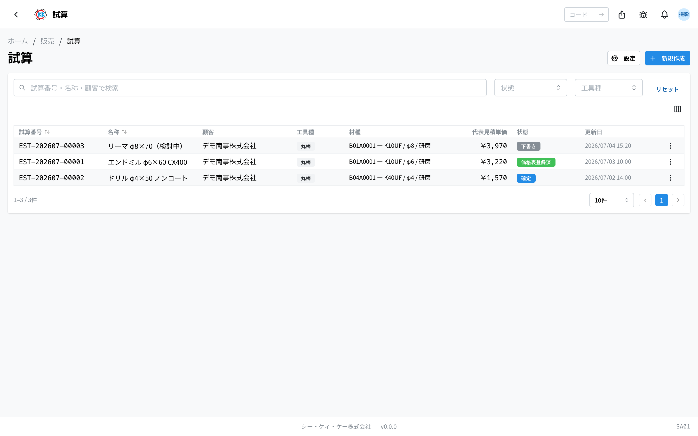
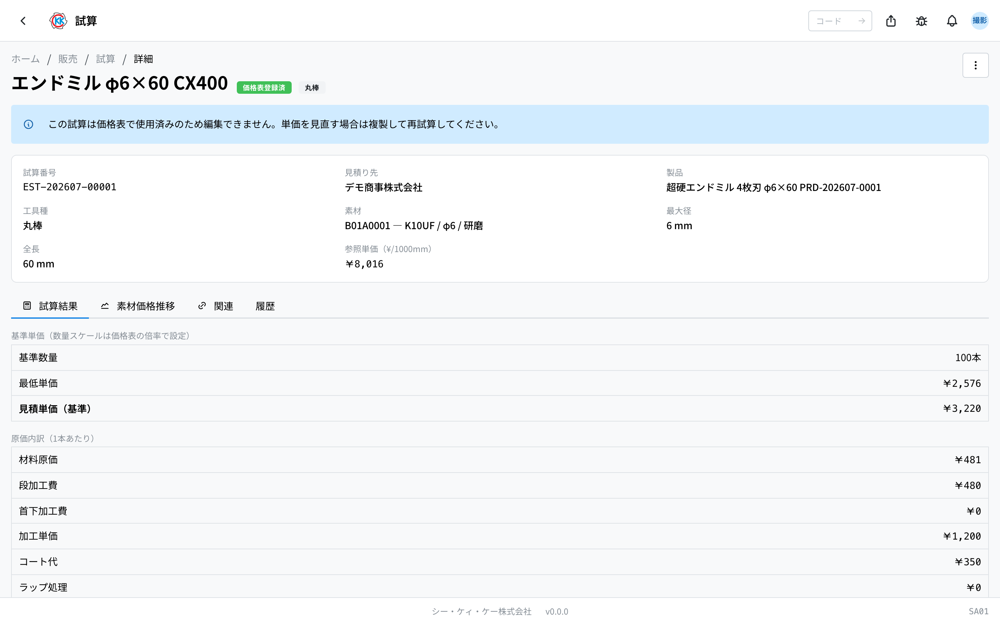

操作コード **SA01**。原価から見積単価を計算し、価格表の基準単価ソースにするアプリです。

## このアプリでできること

「この[製品](/manual/ja/masters/product/user)をいくらで売るか」を、材料費・加工費・コート代などの **原価** から自動計算します。試算は任意で製品にリンクでき（1 製品に複数可）、**確定した試算** は価格表（顧客×製品）を作るときの **基準単価ソース** になります。

- **材料費** は「**材種 × 直径 × 黒皮/研磨**」の仕入実績（＝過去いくらで買ったか＝参照単価, ¥/1000mm）から自動で入ります。仕入実績が無いときは材種に登録された **既定単価（¥/1000mm）** を使います。
- 寸法や加工条件を入力すると、画面下部の **試算結果**（原価内訳と見積単価）がその場で再計算されます。
- 数量ごとの単価スケール（数量段階）は試算では扱いません — 試算は **基準単価 1 点** を算出し、数量段階は[価格表](/manual/ja/apps/price-list/user)側の倍率で設定します。

## 新規試算の作成

1. 一覧右上の「新規作成」を押します。
2. **工具種** を選びます（組み込みは 丸棒 / 円筒 / OH付 の 3 種。管理者が[試算計算（SY02）](/manual/ja/apps/trial-estimate/settings)で追加した工具種もここに並びます）。工具種により入力項目が変わります。
3. **見積り先**（顧客）と **製品**（任意）を選びます。製品にリンクして確定すると、価格表作成時にこの試算を基準単価ソースとして選べます。
4. 材料の **材種・直径・黒皮/研磨** を選びます。3 つが揃うと、その構成の仕入実績（無ければ材種の既定単価 — 「既定価格」バッジ表示）から **参照単価（¥/1000mm）** が自動でセットされます。円筒のみ素材価格を手入力します。
5. 寸法・加工条件を入力します（最大径・全長・段加工・首下・コート・ラップ処理・検査成績書・LD・加工時間など）。管理者が追加した **カスタム項目** があれば併せて入力します。
6. **基準数量** を入力します（既定 100 本。形状出し＝予備形状分の按分にのみ使用）。
7. 最後に **試算名**（必須）を入力し、「保存」を押します。

入力に応じて下部の **試算結果**（原価内訳（1本あたり）と 最低単価・見積単価（基準））がその場で再計算されます。

## 参照単価の上書き

- 既定では、材種構成（材種 × 直径 × 黒皮/研磨）の仕入実績から算出した参照単価を使います。仕入実績が無いときは材種の既定単価（¥/1000mm）が入り、**既定価格** バッジが表示されます。
- 手動で単価を変えたい場合は「**単価を編集**」を押します。確認のうえカスタム設定にすると入力欄が編集可能になり、この試算は「**カスタム**」として記録されます（一覧・詳細にバッジ表示）。「ポリシー値に戻す」でいつでも自動値へ戻せます。
- 「**素材価格推移**」タブでは仕入実績の推移をチャートで確認でき、チャート上の点を選んでその時点の単価を採用することもできます（これもカスタム扱い）。

## 保存・確定・価格表での使用

- **保存** すると下書き（DRAFT）として登録され、その時点の価格がスナップショットとして記録されます（後で計算設定を変更しても、この試算の価格は変わりません）。保存後の再編集はできません — 内容を変えるには「**複製して再試算**」を使います。
- 詳細画面のメニューから **確定** すると、価格表（SA02）を作成・編集するときに **基準単価ソース** として選択できるようになります（**製品にリンクされていることが条件**。リンクは詳細メニューの「製品にリンク」からも設定できます）。
- 価格表で初めて使用されると **価格表登録済（REGISTERED）** にロックされ、製品リンクの変更もできなくなります（再試算は「複製して再試算」から）。登録済みの試算も、別の顧客の価格表のソースとしては引き続き選択できます。

## 一覧・検索

- 一覧は 試算番号 / 名称 / 顧客 / 工具種 / 材種 / 代表見積単価 / 状態 / 更新日 を表示します。試算番号・名称・顧客で検索、状態・工具種で絞り込みできます。
- 行をクリックすると詳細（試算結果・素材価格推移・関連・履歴）を確認できます。行メニューから「複製して再試算」も実行できます。
- 状態は **下書き**（灰）→ **確定**（青）→ **価格表登録済**（緑）の 3 つです。
