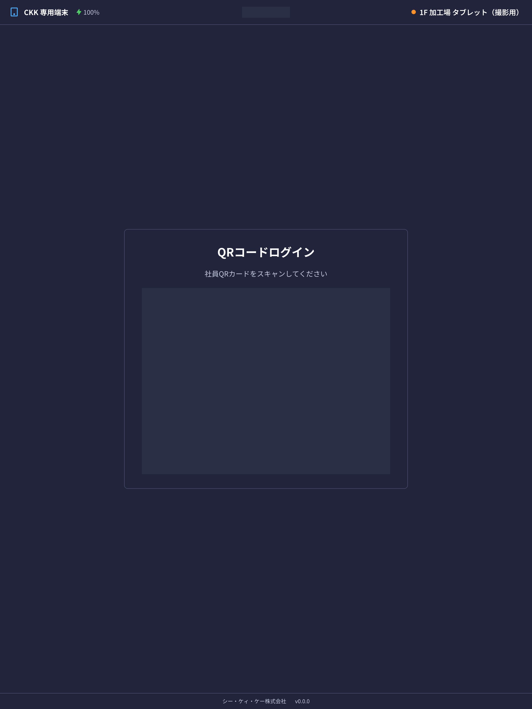
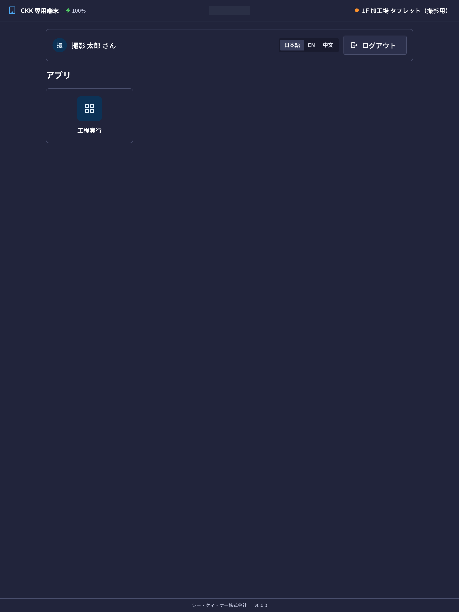

This page is about the **shared tablet** in the factory (the shop-floor device). It is not a PC. It is a tablet that stays in the work area.

## What you can do with this tablet

- You can see **today's work (the steps)** given to you.
- You can record when you **start, pause, and finish** the work.
- You can enter how many pieces you made and how many defects came out.
- You can leave inspection records.

The PC screens (quotes, stock, and so on) do not appear here. This screen is only for recording work on the shop floor.

## Words used on this page

- **QRカード** (QR card) … a card like an employee ID card. You hold it up to log in.
- **PIN** … your own secret number, at least 4 digits.
- **端末** (device) … the tablet itself. Only tablets registered by an administrator can be used.
- **工程** (step) … one stage of the work, such as cutting, step machining, or inspection.

## Before you start

- You need **your own QR card**. If you do not have one, ask an administrator to issue it.
- Only tablets **registered by an administrator** can be used. If the screen says 「この端末は登録されていません」 (This device is not registered), please contact an administrator.
- The first time you use it, **you choose your own PIN and register it** (the screen guides you during the steps below).

The steps for preparing a brand-new tablet (installing the app, the registration QR code) are in the administrator [internal documents](/internal-docs/en/system/kiosk-device-setup) (you need to log in and have permission to read them).

## Logging in

1. Check that the tablet shows 「**社員QRカードをスキャンしてください**」 (Please scan your employee QR card).
2. Hold the QR code on your card inside the frame on the screen. Hold it a little away from the screen, in a bright place, and it reads more easily.

3. When the card is read, the screen changes to the **PIN entry screen**. Enter your PIN with the number buttons on the screen.
4. The first time a card is used, you choose a new PIN and enter it twice (you enter the same number again to confirm it).

After you log in, the list of apps you can use appears.

> 💡 On a tablet you use often, you can log in just by holding up your card for a while. But **on a tablet you use for the first time, it always asks for your PIN**. Also, even if you keep using it, you must **enter your PIN once every 2 weeks**.

> ⚠️ If you get the PIN **wrong 5 times in a row**, that card **cannot be used for 15 minutes**. Please wait a while and try again. If you are in a hurry, an administrator can reset your PIN.

## How to read the screen

The bar at the very top shows the following.

- Left … the name of this tablet (for example "1F 加工場 タブレット") and the battery left.
- Centre … today's date and the time.
- Right … the connection status. When it is orange or red, the signal may not be reaching the tablet.

On the app list screen you can switch the **screen language** (日本語 / English / 中文) at the top right. Switching it does not change what gets recorded.

## Starting your work

Choose 「**工程実行**」 (Run step) from the app list to open the list of your work. For how to use it, see [Recording Work](/manual/en/kiosk/steps/user).

## When you have finished

- Press 「**ログアウト**」 (Log out) at the top right of the app list screen.
- Even if you forget to press it, you are **logged out automatically after some time with no use**. The next person should log in with their own card.

> ⚠️ This is a shared tablet. Please **log out when your work is done**. If you stay logged in, the next person's work is recorded under your name.

## Questions and problems

**Q. Nothing happens when I hold up my card.**
A. Check that the QR code is not dirty and that it is inside the frame on the screen. In a dark place it can be hard to read. If it still does not work, the card may have expired or been stopped, so please check with an administrator.

**Q. I see 「カードが無効です。管理者に確認してください。」 (This card is not valid. Please check with an administrator.)**
A. That card has been stopped, or it has not been given to anyone yet. Please contact an administrator.

**Q. I forgot my PIN.**
A. You cannot restore it yourself. Please ask an administrator to reset your PIN. After the reset, you can choose a new PIN at your next login.

**Q. It asks for my PIN every time.**
A. Your PIN is needed when you use that tablet for the first time, when you have not used that tablet for a while (more than 48 hours), and when 2 weeks have passed since you last entered your PIN.

**Q. Someone else is still logged in.**
A. They are logged out automatically after a while. If you are in a hurry, ask that person to log out.

**Q. The screen says 「この端末は登録されていません」 (This device is not registered).**
A. That tablet has not been registered yet, or its registration has been removed. Please contact an administrator.
