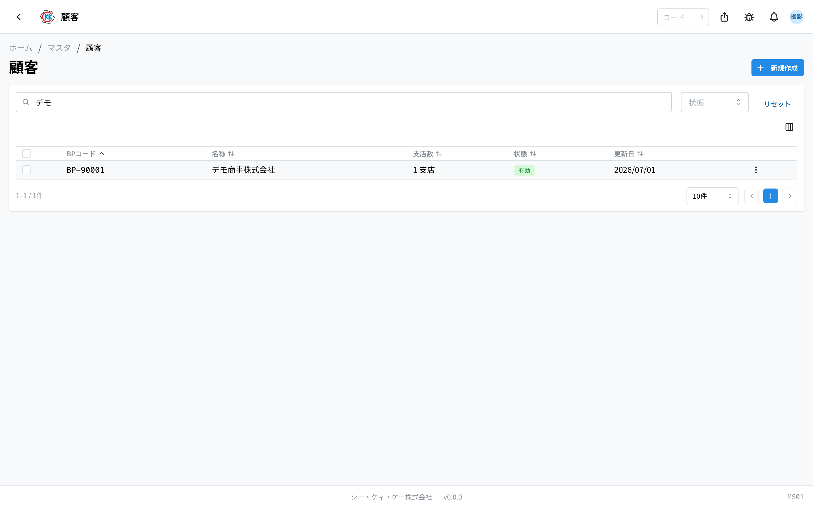
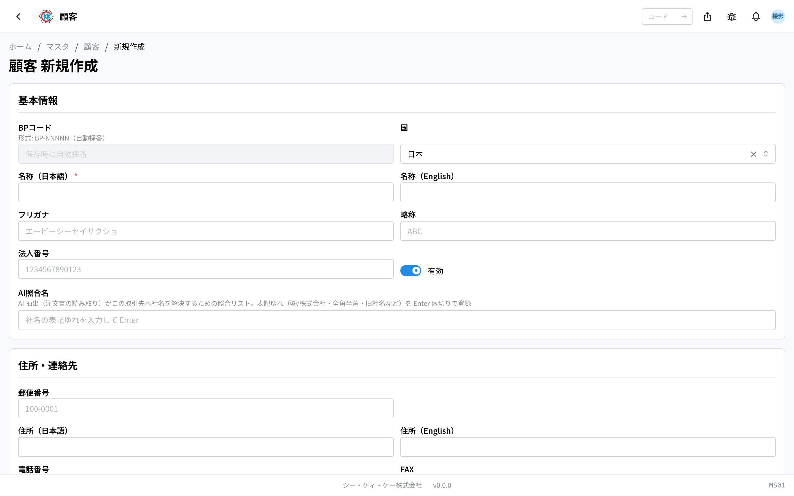
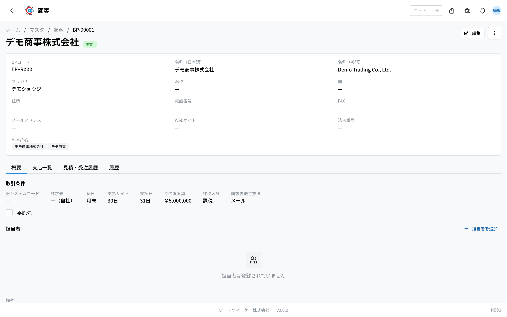
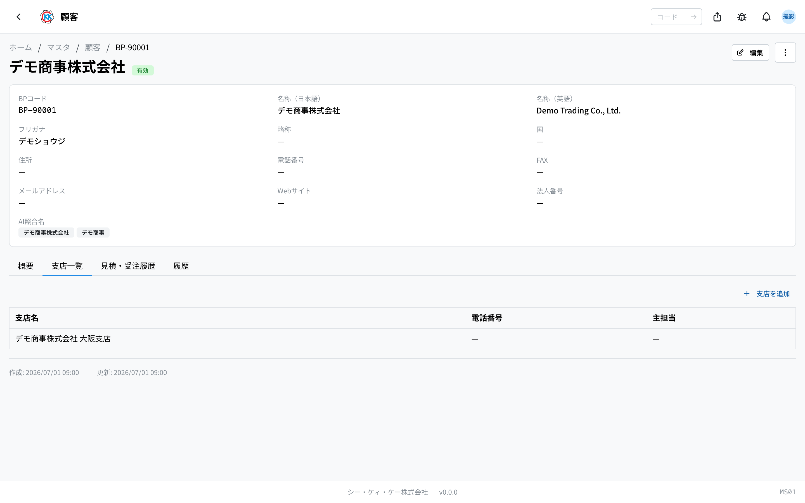
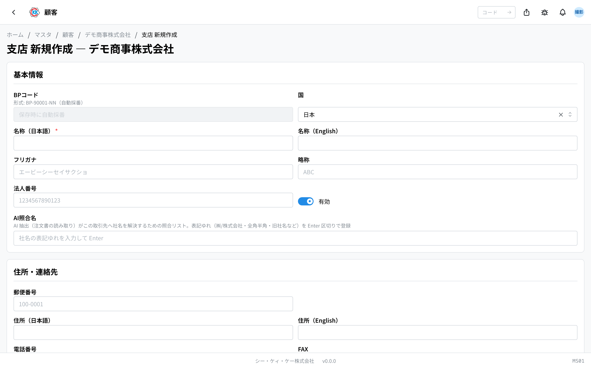

注文をくれるお客様の会社を登録しておく台帳です。操作コードは `MS01` です。

会社の名前や住所だけでなく、**締日や支払条件** もここにまとめておきます。ここに登録していない会社は、見積書などの画面で **選択肢に出てきません**。新しいお客様との取引が決まったら、まずこの画面で登録します。

## このアプリでできること

- 取引しているお客様の会社を登録できます。
- 登録すると、[価格表](/manual/ja/apps/price-list/user) や [見積書](/manual/ja/apps/quote/user) の「顧客」欄で選べるようになります。
- 会社の下に **支店** を登録できます。
- 会社ごとに **担当者**（先方の窓口の方）を何人でも登録できます。
- 締日・支払サイトなどの取引条件を登録しておけます。
- 取引が終わった会社は、消さずに **無効** にしておけます。

## 用語（このページで出てくる言葉）

- **顧客** … 注文をくれる会社のことです。実際に製品を使う会社とは別のことがあります（そちらは[最終需要家](/manual/ja/masters/end-user/user)に登録します）。
- **BPコード** … 会社ごとに 1 つ付く管理番号です。`BP-` で始まります。保存すると自動で付きます。
- **支店** … 本社の下にぶら下がる営業所や工場のことです。
- **締日 / 支払サイト** … 請求をまとめる日と、支払までの日数のことです。
- **AI照合名** … いただいた注文書を自動で読み取るときに、社名を照らし合わせるための「別の書き方」の一覧です。

## はじめる前に

特に先に用意しておくものはありません。この画面から登録を始められます。

登録した顧客は、[価格表](/manual/ja/apps/price-list/user) → [見積書](/manual/ja/apps/quote/user) → [受注請書](/manual/ja/apps/order-acceptance/user) と、後の作業でずっと使われます。**会社名の書き方は最初にきちんと決めて登録してください。**

## 画面の見かた

アプリを開くと、登録済みの顧客の一覧が表示されます。

- **BPコード** … `BP-` で始まる管理番号です。システムが自動で付けます。
- **支店数** … その会社に支店がいくつ登録されているかです。支店が無いときは「—」と出ます。
- **状態** … 緑の「**有効**」は今も使える会社、灰色の「**無効**」はもう選べない会社です。
- 上の検索欄（「**BPコード・名称で検索**」）に会社名や BPコードを入れると絞り込めます。
- 「**状態**」の欄で「有効」「無効」のどちらかだけを表示することもできます。
- 行をクリックすると、その会社の詳しい画面が開きます。

## 顧客を登録する

1. 一覧画面の右上にある「**新規作成**」を押します。
2. 「**名称（日本語）**」に会社名を入れます。**ここだけは必ず入力してください。**
3. 「**名称（English）**」「**フリガナ**」「**略称**」は、分かる範囲で入れます（空欄でも保存できます）。
4. 「**住所・連絡先**」の欄に、郵便番号・住所・電話番号などを入れます。
5. 「**取引条件**」の欄で「**締日**」「**支払サイト（日数）**」「**支払日**」を入れます。
6. 「**課税区分**」を選びます（課税 / 非課税 / 軽減税率）。
7. 請求書の送り方を「**請求書送付方法**」で選びます（メール / FAX / 郵送 / ポータル）。
8. 最後に「**保存**」を押します。

> 💡 「**BPコード**」の欄は入力できません。「保存時に自動採番」と出ているとおり、保存すると `BP-00001` のような番号が自動で付きます。

> 💡 「**締日**」に `31` を入れると「月末」の意味になります。欄の下にも「31 = 月末」と表示されます。

> ⚠️ 請求書を別の会社に送る取引のときだけ、「**請求先（別法人の場合）**」でその会社を選びます。空欄のままなら、この会社自身に請求します。

## 登録した内容を見る

保存した顧客の画面には、4 つのタブがあります。

- **概要** … 取引条件と、先方の担当者の一覧です。
- **支店一覧** … この会社の支店の一覧です。
- **見積・受注履歴** … この会社に出した見積などの記録です。
- **履歴** … いつ誰がこの登録内容を変えたかの記録です。

内容を直したいときは、画面右上の「**編集**」を押します。

## 先方の担当者を登録する

窓口になる方の名前や連絡先を登録しておけます。

1. 「**概要**」タブを開きます。
2. 「**担当者**」の右にある「**担当者を追加**」を押します。
3. 「**氏名**」を入れます。**ここは必ず入力してください。**
4. 「**部署**」「**役職**」「**メールアドレス**」「**電話番号**」を分かる範囲で入れます。
5. その方がいちばんの窓口なら「**主担当にする**」にチェックを入れます。
6. 「**追加**」を押します。

主担当にした方には「**主担当**」というバッジが付きます。

## 支店を登録する

1. 顧客の画面で「**支店一覧**」タブを開きます。
2. 「**支店を追加**」を押します。
3. 「**名称（日本語）**」に支店名を入れます。
4. 住所や電話番号を入れます。
5. 支店の窓口の方がいれば「**担当者名**」に入れます（空欄でも大丈夫です）。
6. 「**保存**」を押します。

支店の BPコードは、本社の番号のうしろに枝番が付いた形（`BP-00001-01` など）で自動で付きます。

## 取引をやめた会社の扱い

会社との取引が終わっても、**削除しないでください**。過去の見積書などがその会社を参照しているためです。代わりに「無効」にします。

1. 顧客の画面の右上にあるメニュー（点が 3 つのボタン）を押します。
2. 「**無効化**」を選びます。
3. 確認の画面で「**無効化する**」を押します。

無効にすると、新しい見積書などでは選べなくなりますが、**過去のデータはそのまま残ります**。もう一度取引が始まったら、同じ手順で「有効化」に戻せます。

## よくある質問・困ったとき

**Q.「名称（日本語）を入力してください」と出て保存できません。**
A. 会社名の日本語欄が空です。「名称（日本語）」を入れてから、もう一度「保存」を押してください。英語名は空欄のままで構いません。

**Q.「メールアドレスの形式が正しくありません」と出ます。**
A. メールアドレスの書き方が違っています。全角文字が混じっていないか、`@` が入っているかを確認してください。使わない場合は空欄にしてください。

**Q. 削除しようとしたら「この取引先を参照するデータ（試算・価格表・見積書）が存在するため削除できません。無効化を検討してください。」と出ます。**
A. その会社を使った見積書などが既にあるため、消せません。これは正常な動きです。「無効化」を使ってください。

**Q. 削除しようとしたら「支店が存在するため削除できません。先に支店を削除してください。」と出ます。**
A. その会社に支店が登録されています。どうしても削除したい場合は、先に支店をすべて削除してください。ふだんは「無効化」で十分です。

**Q. 見積書の画面でお客様を選ぼうとしたら、名前が出てきません。**
A. まだ登録されていないか、「無効」になっています。一覧画面で「状態」を「無効」にして探してみてください。見つかったら「有効化」に戻します。

**Q.「AI照合名」には何を入れればよいですか。**
A. 注文書に書かれる社名の「ゆれ」を入れておく欄です。たとえば「㈱デモ商事」「デモ商事株式会社」「デモ商事」のように、書き方が変わりそうなものを 1 つ入れるたびに Enter キーを押して足します。空欄のままでも登録はできます。
