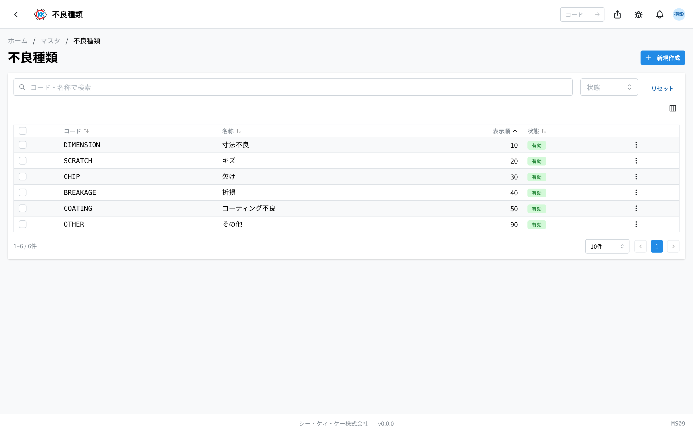

操作代码 **MS09**。用于登记制造过程中记录不良时使用的分类（划伤、缺损、尺寸不良等）的小型主数据。在此登记的类别，将成为[作业指示书（指示書）](/manual/zh/apps/work-order/user)工序执行页面中不良记录的选择项。

> 此应用目前仅在**开发环境（dev）**中开放。正式发布前，界面和操作步骤可能会有所调整。

## 此应用能做什么

- 登记不良类别（代码、名称、显示顺序）。
- 由于此主数据仅包含代码、名称和显示顺序，**没有详情页面**。编辑在列表的弹窗（小窗口）中进行。

使用此应用需要**主数据权限**。

## 查看列表

- 列表的列为**代码 / 名称 / 显示顺序 / 状态**。默认按**显示顺序**排列。
- 点击行会打开**编辑弹窗**（不会跳转到详情页面）。
- 在顶部搜索框输入**代码或名称**即可筛选。也可按**状态**（有效 / 无效）筛选。
- 勾选行后可进行**批量启用 / 批量停用 / 批量删除**。

## 新建

从列表右上角的「新建」进行登记。

- **代码** … 识别不良类别的唯一代码（例 `SCRATCH`）。**创建后不可更改**。
- **名称**（日语必填，英语可选）。
- **显示顺序** … 0 以上的整数。决定列表以及工序执行页面不良输入中的排列顺序。
- **有效** … 关闭后将不再出现在选择项中。

保存后返回列表。

## 编辑

- 点击行，或从行菜单选择**编辑**，即可打开弹窗。可修改名称、显示顺序和有效标志（代码不可更改）。
- 行菜单中还可进行**停用 / 启用**和**删除**。

## 删除与停用

- 不再使用的类别建议**停用**而非删除（将不再出现在选择项中，历史记录保留）。被不良记录引用的类别可能无法删除。

## 术语

- **不良类别** … 用于对不良进行分类的标签，用于工序中的不良记录。
- **显示顺序** … 在选择项、列表中的排列顺序。数字越小越靠前。
