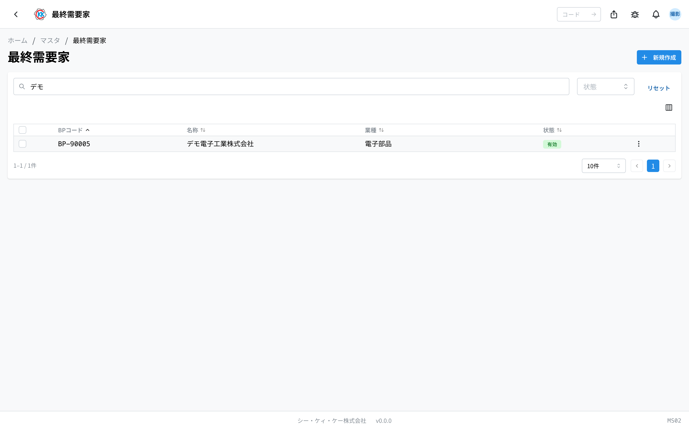
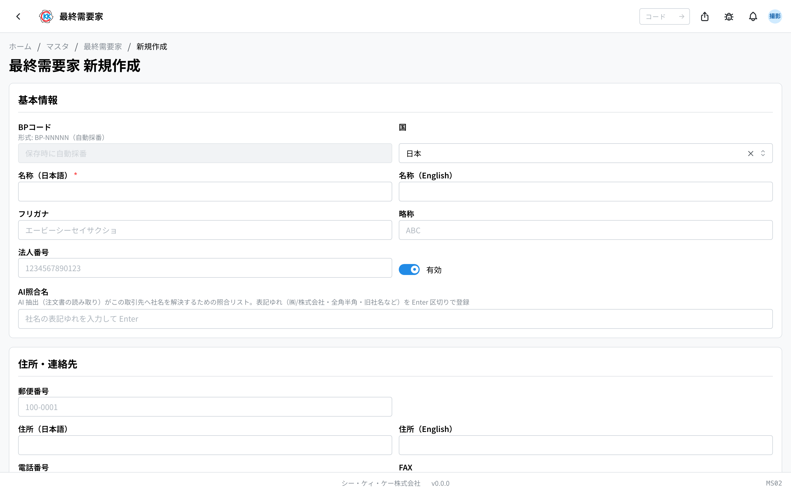
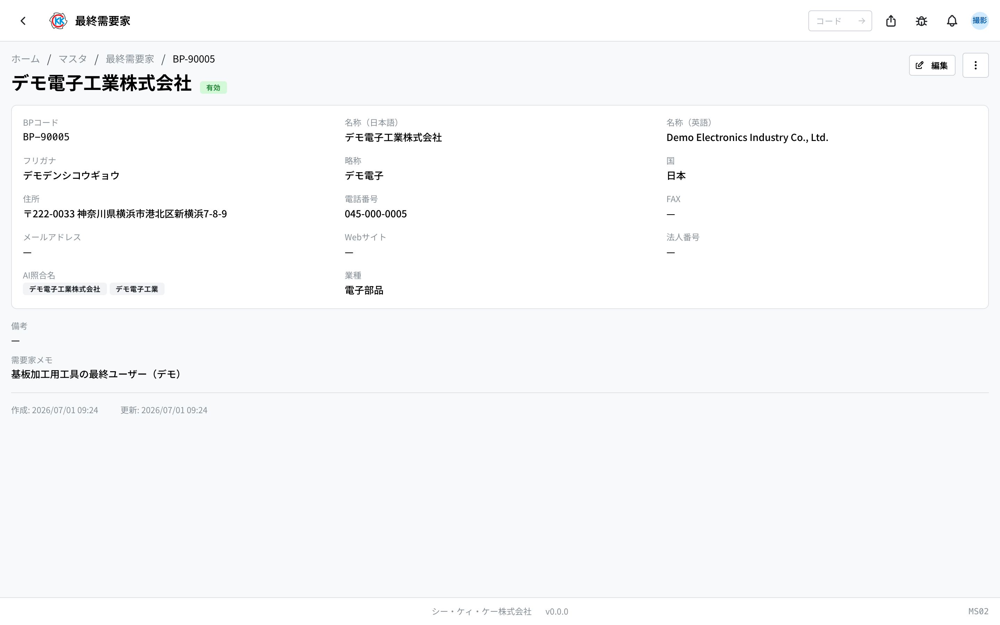
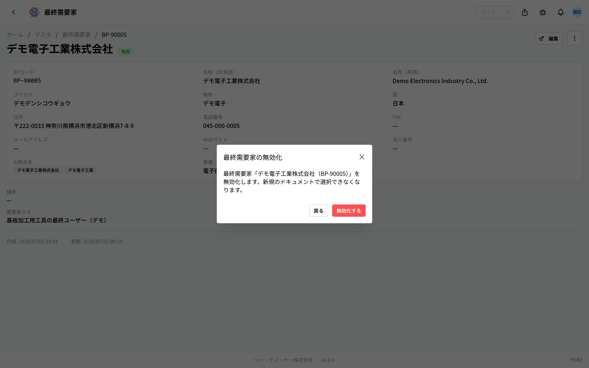

つくった製品を **実際に使う会社** を登録しておく台帳です。操作コードは `MS02` です。

注文をくれる会社（[顧客](/manual/ja/masters/customer/user)）と、その製品を実際に工場で使う会社が違うことがあります。商社を通して注文をいただく場合などです。そのようなときに、実際に使う会社をここに登録しておきます。

## このアプリでできること

- 製品を実際に使う会社を登録できます。
- 登録すると、納品書などで「最終需要家」として選べるようになります。
- 会社ごとに **業種** を記録しておけます。
- 取引が終わった会社は、消さずに **無効** にしておけます。

## 用語（このページで出てくる言葉）

- **最終需要家（さいしゅうじゅようか）** … つくった製品を実際に使う会社のことです。
- **顧客** … 注文をくれる会社のことです。最終需要家と同じ会社のこともあれば、違うこともあります。
- **BPコード** … 会社ごとに 1 つ付く管理番号です。`BP-` で始まります。保存すると自動で付きます。
- **業種** … その会社がどんな仕事をしているかです（例：自動車部品）。

## はじめる前に

このアプリの登録は **任意** です。必ず登録しなければいけないものではありません。

主に、大口のお取引で「どこの工場で使われている製品か」を社内で把握しておきたいときに使います。注文をくれる会社そのものは、[顧客](/manual/ja/masters/customer/user)のほうに登録してください。

## 画面の見かた

アプリを開くと、登録済みの最終需要家の一覧が表示されます。

- **BPコード** … `BP-` で始まる管理番号です。システムが自動で付けます。
- **業種** … 登録してあればここに表示されます。
- **状態** … 緑の「**有効**」は今も使える会社、灰色の「**無効**」はもう選べない会社です。
- 上の検索欄（「**BPコード・名称・業種で検索**」）には、会社名だけでなく **業種でも検索できます**。
- 行をクリックすると、その会社の詳しい画面が開きます。

## 最終需要家を登録する

1. 一覧画面の右上にある「**新規作成**」を押します。
2. 「**名称（日本語）**」に会社名を入れます。**ここだけは必ず入力してください。**
3. 「**フリガナ**」「**略称**」は、分かる範囲で入れます（空欄でも保存できます）。
4. 「**住所・連絡先**」の欄に、住所や電話番号を入れます。
5. 「**需要家情報**」の「**業種**」に、その会社の事業分野を入れます（例：自動車部品）。
6. 「**保存**」を押します。

> 💡 「**BPコード**」の欄は入力できません。「保存時に自動採番」と出ているとおり、保存すると番号が自動で付きます。

## 登録した内容を見る

一覧で行をクリックすると、その会社の画面が開きます。

会社名・住所・連絡先に加えて、「**業種**」「**備考**」「**需要家メモ**」が表示されます。内容を直したいときは、画面右上の「**編集**」を押します。

## 取引が終わった会社の扱い

取引が終わっても、**削除しないでください**。過去の納品の記録がその会社を参照しているためです。代わりに「無効」にします。

1. 会社の画面の右上にあるメニュー（点が 3 つのボタン）を押します。
2. 「**無効化**」を選びます。
3. 「最終需要家の無効化」という画面が出るので、「**無効化する**」を押します。

無効にすると新しい書類では選べなくなりますが、**過去のデータはそのまま残ります**。もう一度取引が始まったら、同じ手順で「有効化」に戻せます。

## まとめて有効・無効にする

会社をたくさん登録し直したときなど、まとめて切り替えられます。

1. 一覧の各行の左にあるチェックボックスにチェックを入れます。
2. 画面の上に「**一括有効化**」「**一括無効化**」「**一括削除**」が出てきます。
3. 使いたいものを押します。

> ⚠️「**一括削除**」を押すと「選択中の◯件の最終需要家を削除します。この操作は取り消せません。」と確認が出ます。取り消せないため、ふだんは「一括無効化」をお使いください。

## よくある質問・困ったとき

**Q.「名称（日本語）を入力してください」と出て保存できません。**
A. 会社名の日本語欄が空です。「名称（日本語）」を入れてから、もう一度「保存」を押してください。英語名は空欄のままで構いません。

**Q.「メールアドレスの形式が正しくありません」と出ます。**
A. メールアドレスの書き方が違っています。全角文字が混じっていないか、`@` が入っているかを確認してください。使わない場合は空欄にしてください。

**Q. 注文をくれる会社と、製品を使う会社が同じです。両方に登録が必要ですか。**
A. 必要ありません。[顧客](/manual/ja/masters/customer/user)にだけ登録してください。この画面は「注文をくれる会社と使う会社が違う」ときのためのものです。

**Q. 業種は何を書けばよいですか。**
A. 決まった選択肢はなく、自由に入力できます。社内で分かる言葉（例：自動車部品、電子部品）で構いません。空欄のままでも保存できます。

**Q. 一覧で探しても会社が出てきません。**
A. 「無効」になっている可能性があります。上の「**状態**」の欄で「無効」を選んで探してみてください。見つかったら、その会社を開いて「有効化」に戻せます。
