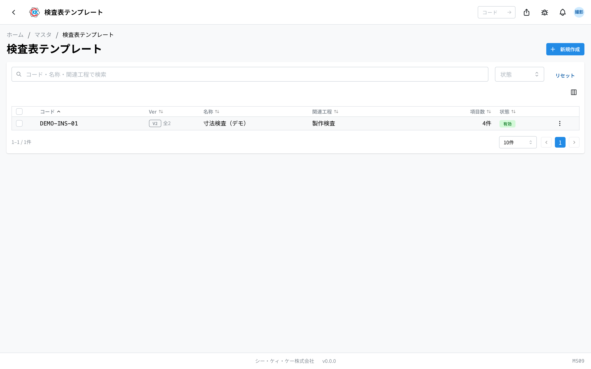
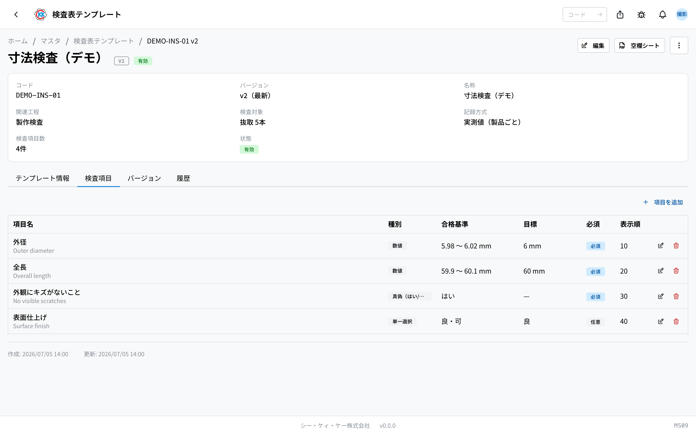

操作コード **MS09**。検査工程で使う検査項目のひな形（テンプレート）を登録・管理します。[指示書](/manual/ja/apps/work-order/user) にテンプレートを紐付けると、その検査項目に沿って検査を記録できます。

> このアプリは現在 **開発環境（dev）のみ** で公開されています。本番公開までに画面や手順が変わる場合があります。

## このアプリでできること

- 検査表テンプレート（コード・名称・関連工程・検査対象・記録方式）を登録します。
- テンプレートごとに **検査項目** を登録します。項目には **入力種別**（真偽 / 数値 / 単一選択 / 複数選択）があり、**合格基準** と **目標** を設定できます。検査項目は詳細画面の「検査項目」タブでその場で追加・編集・削除します（項目の個別ページはありません）。
- テンプレートは **バージョン管理** されます。指示書や検査記録で使用中のバージョンはロックされ、「新バージョンを作成」で改訂します。
- 手書き記入用の **空欄シート PDF** を出力できます。

利用には **マスタ権限** が必要です。

## 一覧を見る

- 一覧の列は **コード / Ver / 名称 / 関連工程 / 項目数 / 状態** です。**Ver** 列は最新バージョン（例 `v2`）を表示し、複数バージョンがある場合は「全N」も併記されます。行をクリックすると詳細画面が開きます。
- 上部の検索ボックスに **コード・名称・関連工程** を入れて絞り込めます。**状態**（有効 / 無効）でも絞り込めます。
- 行を選択すると **一括有効化 / 一括無効化 / 一括削除** ができます。

## 新規作成

一覧右上の「新規作成」から登録します。

- **コード** … 英数字・ハイフン・アンダースコア（例 `INSP-DIM-01`）。一意で、**作成後は変更できません**。
- **名称**（日本語は必須、英語は任意）。
- **関連工程** … このテンプレートを既定で使う検査工程（任意）。[工程マスタ](/manual/ja/masters/process-step/user) からコード・名称で検索して選びます。
- **検査対象** … このシートで検査する製品数を「**全数**」「**割合(%)**」「**本数**」から選びます。全数はロット全数を検査、割合・本数は一部を抜き取って検査します（割合は 0〜100%、本数は 1 以上）。
- **記録方式** … 「**実測値（製品ごと）**」は製品ごとにページ送りで全項目を記録します。「**合格数のみ**」は項目ごとに検査数・合格数だけを記録します。
- **有効** … オフにすると選択肢に出なくなります。

検査項目はこのフォームでは入力しません。保存後に開く詳細画面の「検査項目」タブで追加します。

## 検査項目の登録

詳細画面の **検査項目** タブ →「項目を追加」で登録します。既存の項目は行の編集・削除アイコンで操作します。項目一覧の列は **項目名 / 種別 / 合格基準 / 目標 / 必須 / 表示順** です。

各項目には **項目名**（日本語は必須、英語は任意）と **入力種別** を設定します。種別ごとの設定は次のとおりです。

- **数値** … **単位**（例 mm）と **合格範囲**（下限・上限。片方だけの指定もできます。上限は下限以上）。**目標値** は狙い値で、合否には影響しません。
- **真偽（はい/いいえ）** … **合格とする回答**（はい / いいえ）と **目標回答**（任意）。
- **単一選択 / 複数選択** … **選択肢**（表示名を日本語・英語で登録）と **合格とする選択肢**（未設定の場合は手動で合否を判定します）、**目標**（任意）。

共通の設定は次のとおりです。

- **合否の手動上書きを許可** … オフにすると合格基準からの自動判定のみになります（基準未設定の項目は常に手動判定）。オフの項目は一覧に「上書き不可」バッジが付きます。
- **表示順** … 検査表での並び順です。追加時は「既存の最大値 + 10」が初期値として入ります。
- **必須 / 任意** … 検査記録時に必ず入力させるかどうか。

## バージョン管理

- テンプレートのバージョンが指示書または検査記録で使用されると、そのバージョンは **ロック** され変更できなくなります（詳細画面にロックの案内が表示され、「編集」も隠れます）。
- 内容を変えたいときはメニューの「**新バージョンを作成**」を実行します。検査項目をコピーした新バージョン（v2, v3, …）が作られ、既存の指示書・検査記録は旧バージョンのまま残ります。
- **バージョン** タブに全バージョンの一覧（バージョン / 項目数 / 使用状況（使用中 / 未使用）/ 状態 / 更新日時）が表示されます。表示中のバージョンには「（表示中）」が付きます。

## 空欄シート PDF

詳細画面の「**空欄シート**」ボタンで、そのテンプレートの検査項目を並べた手書き記入用の PDF を出力できます。

## 詳細画面

- 上部のサマリにコード・バージョン（例 `v2（最新）`）・名称・関連工程・検査対象・記録方式・検査項目数・状態が表示されます。
- タブは **テンプレート情報**（名称・関連工程）/ **検査項目**（項目のサブテーブル）/ **バージョン**（バージョン一覧）/ **履歴**（変更の記録。項目の追加・変更・削除もここに残ります）です。
- 右上に **編集**（ロック中は非表示）と **空欄シート**、メニューに **新バージョンを作成** / **無効化** / **削除** があります。

## 削除と無効化

- このバージョンを参照する指示書・検査記録が存在する場合は削除できません。使わなくなったテンプレートは削除ではなく **無効化** をおすすめします。
- テンプレートを削除すると、その検査項目もまとめて削除されます。

## 用語

- **検査表テンプレート** … 検査項目のひな形。指示書に紐付けて検査記録に使います。
- **バージョン** … テンプレートの改訂単位。使用中のバージョンはロックされ、改訂は新バージョンで行います。
- **検査対象** … このシートで検査する製品数（全数 / 割合 / 本数の抜取）。
- **記録方式** … 実測値（製品ごと）か、合格数のみか。
- **合格基準** … 自動で合格と判定する条件（数値の合格範囲、真偽の合格回答、選択式の合格選択肢）。
- **目標** … 狙い値・狙いの回答。合否には影響しません。
