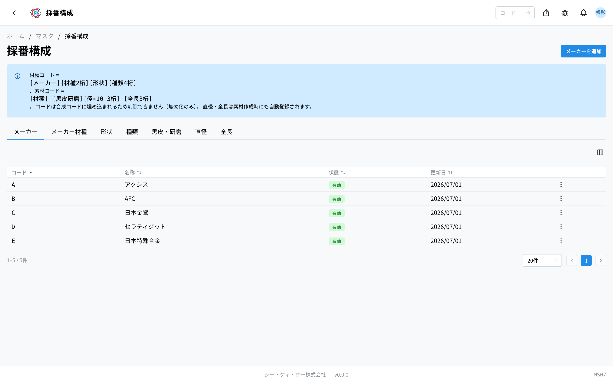

操作代码 **MS07**。用于管理组装 [材种](/manual/zh/masters/material-type/user) 代码和 [素材](/manual/zh/masters/material/user) 代码的"零件"（构成要素）的画面。

> 此应用目前仅在**开发环境（dev）**中开放。正式发布前，界面和操作步骤可能会有所调整。

## 本应用能做什么

材种代码按 `[厂商][厂商牌号2位][形状][种类4位]`、素材代码按 `[材种]-[黑皮研磨][径×10 3位]-[全长3位]` 的规则组装。本画面通过标签页对作为其零件的 7 个区分进行列表查看、添加和启用/停用切换。

- **厂商（メーカー）** … 材料厂商（大写字母 1 位。例 `B` = AFC）。
- **厂商牌号（メーカー材種）** … 厂商内的牌号（每个厂商内数字 2 位。例 `01` = K10UF）。
- **形状** … 通常 / OH / 圆筒 等（大写字母 1 位）。
- **种类** … 按形状划分的种类（字母数字 2 位。例 OH 形状的 `B5` = CH）。
- **黑皮・研磨** … 素材表面的区分（大写字母 1 位。例 `A` = 黑皮、`B` = 研磨）。
- **直径** … 由 mm 自动导出的 3 位代码（径 × 10。例 φ8.3 → `083`）。
- **全长** … 全长 mm 的 3 位代码（例 330mm → `330`）。可附加自定义标识。

## 查看列表

- 通过标签页切换区分。各标签页的列为 **代码 / 名称 / 状态 / 更新日期**（厂商牌号带 **厂商** 列，种类带 **形状** 列，直径・全长带 **mm** 列）。
- 通过行菜单可切换 **启用 / 停用**。

## 添加

从右上角的「◯◯を追加」（添加 ◯◯）按钮添加（按钮名称随当前标签页变化）。

- 厂商 / 形状 / 黑皮・研磨 … **代码**（大写字母 1 位）和 **名称**（日语必填、英语可选）。
- 厂商牌号 … 选择 **厂商**，再输入 **代码**（数字 2 位）和 **名称**。
- 种类 … 选择 **形状**，再输入 **代码**（字母数字 2 位）和 **名称**。
- 直径 … **直径 (mm)**（0.1〜99.9）。代码自动导出并显示在输入框下方。
- 全长 … **全长 (mm)**（1〜999）和 **自定义标识**（可选。例「特注 330L」）。

若相同代码已存在，则无法添加。

## 为什么不能删除・停用说明

- 代码会 **嵌入** 材种・素材的代码中，因此 **不能删除**（只能停用）。
- 停用后，在新建材种・素材时将无法选择。**对既有的材种・素材代码没有影响。**
- 直径・全长在新建 [素材](/manual/zh/masters/material/user) 时如未登记也会自动登记。在这里手动添加，是为了提前准备选项或整理名称。

## 术语

- **材种代码（材種コード）** … 厂商＋厂商牌号＋形状＋种类共 8 位（例 `B01B0001`）。
- **素材代码（素材コード）** … 在材种代码后附加黑皮研磨・直径・全长的形式（例 `B01B0001-A083-330`）。
- **构成要素** … 作为代码零件的区分值。

使用本应用需要 **主数据权限（マスタ権限）**。初次使用请同时参阅 [入门手册](/manual/zh/start)。
