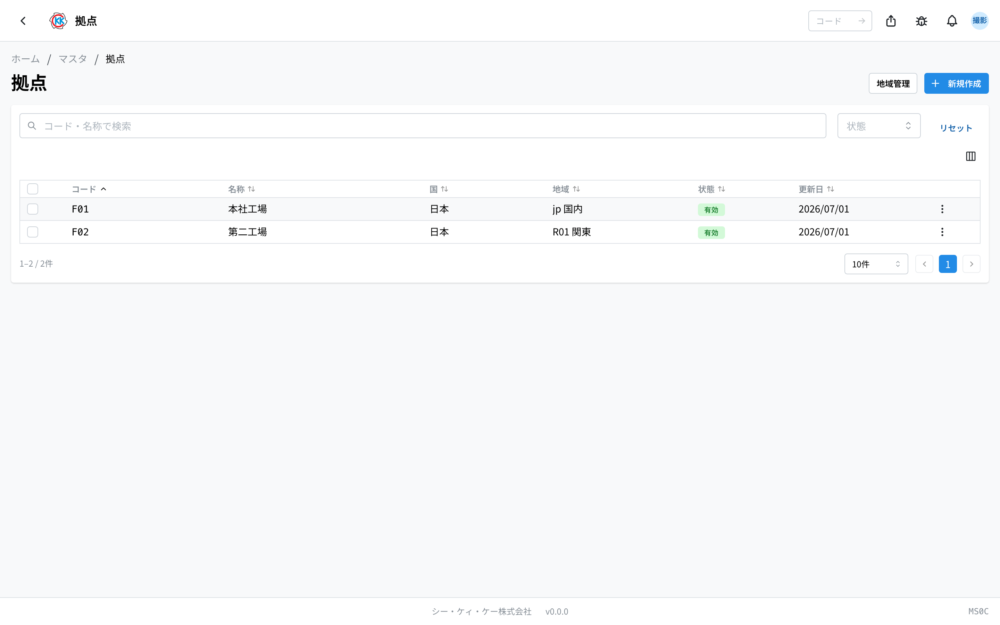
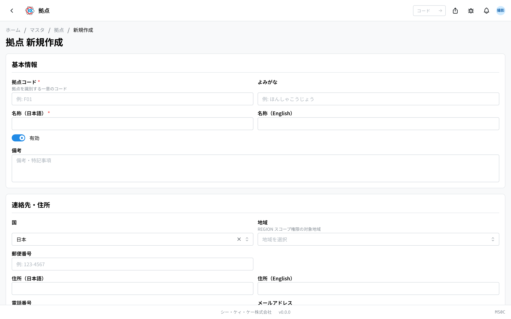
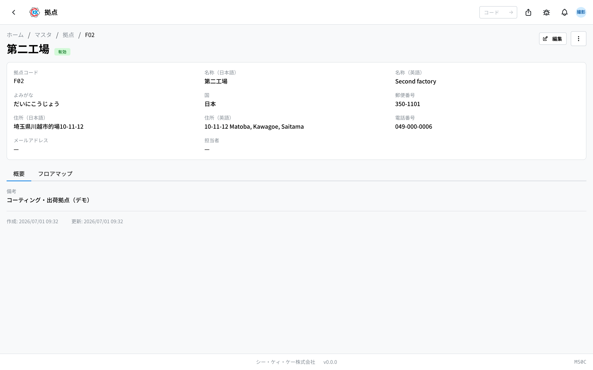
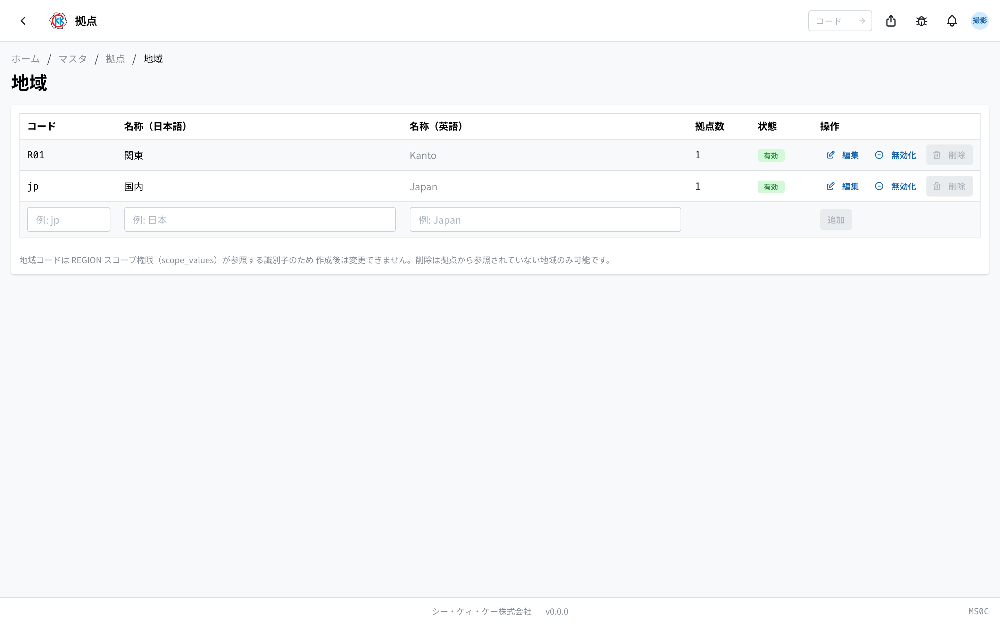
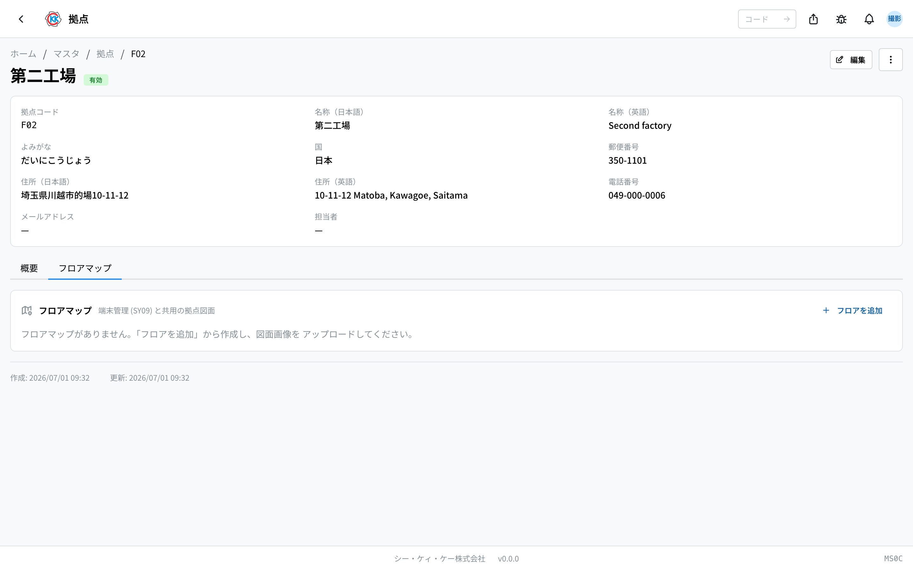

**拠点（工場・事業所）そのもの** を登録しておくアプリです。操作コードは `MS0C` です。

[製品在庫](/manual/ja/apps/product-inventory/user)や[素材在庫](/manual/ja/apps/material-inventory/user)は拠点ごとに分けて管理され、素材の入荷先などもここで登録した拠点から選びます。

> ⚠️ このアプリは試験公開中です。ご利用の環境によっては、まだ表示されないことがあります。

## 似ている 3 つのアプリの違い

場所に関するアプリが 3 つあり、まぎらわしいのでご注意ください。

| アプリ | 何を登録するか | 例 |
|--------|----------------|-----|
| **拠点**（このページ） | 工場そのもの | 本社工場、第二工場 |
| [作業場所](/manual/ja/masters/work-location/user) | 拠点の中で作業する場所・機械 | NC旋盤 1号機、研磨エリア |
| [保管場所](/manual/ja/masters/storage-location/user) | 拠点の中で物を置く倉庫・棚 | 資材倉庫A の A-1 棚 |

作業場所と保管場所は、どちらも「どの拠点にあるか」を選んで登録します。ですから **先に拠点を登録** してください。

## このアプリでできること

- 拠点の基本情報（コード・名称・住所・電話番号など）を登録できます。
- 拠点をまとめる **地域** を登録できます。
- 拠点のフロアごとの **図面**（フロアマップ）を登録できます。

## 用語（このページで出てくる言葉）

- **拠点（きょてん）** … 製造・在庫・出荷を行う工場のことです。
- **地域（ちいき）** … いくつかの拠点をまとめる区分です（例 関東）。「この地域の拠点だけを担当する」といった権限の設定に使われます。
- **フロアマップ** … 拠点のフロアの図面です。この図面の上に、保管場所や共有端末の位置を印として置けます。

## はじめる前に

- このアプリを使うには **マスタの権限** が必要です。
- 拠点の中の **倉庫や棚** は、このアプリでは登録しません。[保管場所](/manual/ja/masters/storage-location/user)で登録します。このアプリで扱うのは図面だけです。

## 画面の見かた

アプリを開くと、登録済みの拠点の一覧が表示されます。

- 一覧は **コード / 名称 / 国 / 地域 / 状態 / 更新日** の順に並んでいます。
- 上の「**コード・名称で検索**」の欄で、探している拠点を絞り込めます。「**状態**」でも絞り込めます。
- 右上には「**新規作成**」のほかに「**地域管理**」のボタンがあります。
- 行をクリックすると、その拠点の詳しい画面が開きます。

## 拠点を登録する

1. 一覧画面の右上にある「**新規作成**」を押します。
2. 「**拠点コード**」に、この拠点を表す短い文字を入れます（例 `F01`）。
3. 「**名称**」の日本語の欄に、拠点の名前を入れます（例 本社工場）。
4. 「**よみがな**」に読み方を入れます（例 ほんしゃこうじょう）。
5. 「**連絡先・住所**」の「**国**」を選びます（はじめは 日本 が入っています）。
6. 「**地域**」を選びます（登録していないときは空欄のままでかまいません）。
7. 「**郵便番号**」「**住所**」「**電話番号**」「**メールアドレス**」「**担当者**」を入れます。
8. 「**保存**」を押します。

> ⚠️ 「**拠点コード**」は、保存したあとは変えられません。名称や住所はあとから直せます。

## 登録した拠点を確認する

一覧で行をクリックすると、その拠点の詳しい画面が開きます。

上のほうに、拠点コード・名称・よみがな・国・郵便番号・住所・電話番号・メールアドレス・担当者が表示されます。下には 2 つのタブがあります。

- **概要** … 備考に書いた内容が出ます。
- **フロアマップ** … フロアの図面を管理します（次の説明をご覧ください）。

内容を直したいときは、右上の「**編集**」を押します。その右の「**…**」（点が 3 つのボタン）からは、**無効化** と **削除** ができます。

## 地域を登録する

いくつかの拠点をまとめたいときは、地域を登録します。「関東の拠点すべて」といったまとまりを作れます。

1. 一覧画面の右上にある「**地域管理**」を押します。
2. 表のいちばん下の行に、「**コード**」（例 `jp`）を入れます。
3. 「**名称（日本語）**」（例 日本）と「**名称（英語）**」（例 Japan）を入れます。
4. 「**追加**」を押します。

表には **コード / 名称（日本語） / 名称（英語） / 拠点数 / 状態 / 操作** が並びます。「**拠点数**」は、その地域を選んでいる拠点の数です。行の右のボタンから、編集・無効化・削除ができます。

登録した地域は、拠点の編集画面の「**地域**」で選べるようになります。

> ⚠️ 地域の **コード** は、作ったあとは変えられません。また、削除できるのは「拠点数」が 0 の地域だけです。

## フロアマップを登録する

拠点のフロアの図面を登録しておくと、その上に保管場所や共有端末の位置を印として置けるようになります。

1. 拠点の詳しい画面で「**フロアマップ**」タブを開きます。
2. 「**フロアを追加**」を押します。
3. 「**フロア名**」を入れます（例 `1F 加工場`）。
4. 「**追加**」を押します。
5. 追加したフロアを選び、「**図面をアップロード**」から図面の画像を選びます。

- 図面を入れ替えたいときは「**図面を差し替え**」を押します。
- フロアの名前を変えたいときは「**名称変更**」を押します。
- フロアが 2 つ以上あるときは「**重ね表示**」で別のフロアの図面をうすく重ねられます。フロアどうしの位置合わせに使えます。
- フロアを消したいときは「**フロアを削除**」を押します。

図面の登録・差し替えは、このアプリだけで行います。[保管場所](/manual/ja/masters/storage-location/user)の画面では、この図面の上に印を置くことしかできません。

## よくある質問・困ったとき

**Q. 保管場所の画面に「この拠点にはフロアマップがありません」と出ます。**
A. その拠点にまだ図面が登録されていません。このアプリの「フロアマップ」タブでフロアを追加し、図面をアップロードしてください。

**Q. フロアを削除できません。**
A. そのフロアの図面に、共有端末や保管場所の印が置かれたままです。先に印を外してから、もう一度お試しください。確認の画面にも「**端末・保管場所のピンが残っている場合は削除できません。**」と表示されます。

**Q. 拠点を削除できません。**
A. その拠点を使った在庫や工程の記録が残っていると削除できません。使わなくなった拠点は、削除ではなく「**無効化**」してください。無効にすると新しい在庫・出荷・工程では選べなくなり、これまでの記録はそのまま残ります。

**Q.「この地域は 2 件の拠点から参照されているため削除できません（先に拠点の地域を変更してください）」と出ます。**
A. その地域を選んでいる拠点が残っています。先に拠点の編集画面で「**地域**」を別のものに変える（または空にする）と、削除できるようになります。

**Q. 倉庫や棚はどこで登録しますか。**
A. このアプリではなく、[保管場所](/manual/ja/masters/storage-location/user)で登録します。

**Q. 機械や作業する場所はどこで登録しますか。**
A. このアプリではなく、[作業場所](/manual/ja/masters/work-location/user)で登録します。
