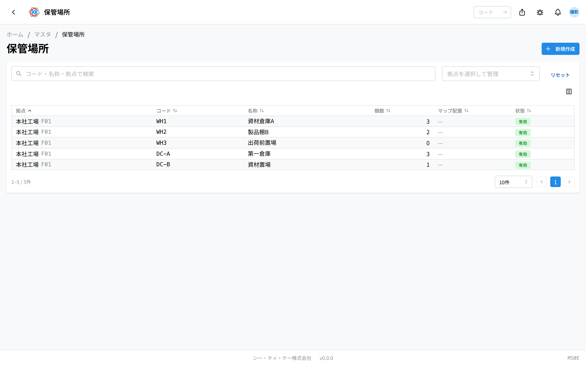
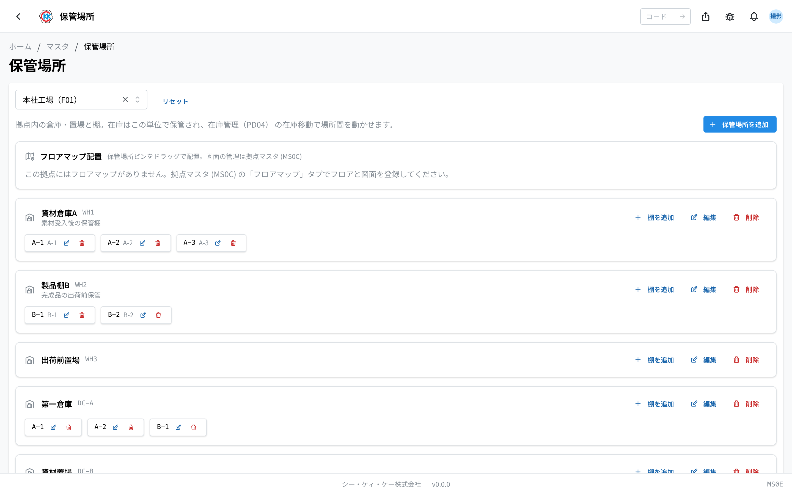

This app is for registering **warehouses and storage areas where things are kept**, such as 資材倉庫A (material warehouse A), and the **shelves** inside them. The operation code is `MS0E`.

Stock is kept separately down to "which shelf in which storage location it is on". In the stock transfer of [inventory management (在庫管理)](/manual/en/apps/product-inventory/user), you can move things between the places registered here.

> ⚠️ This app is in trial release. Depending on your environment, it may not be shown yet.

## The difference between three similar apps

There are three apps about places, and they are easy to mix up. Please take care.

| App | What you register | Example |
|--------|----------------|-----|
| [拠点 (Site)](/manual/en/masters/plant/user) | The factory itself | Head office plant, second plant |
| [作業場所 (Work location)](/manual/en/masters/work-location/user) | A place or machine inside the site where work is done | NC lathe no. 1, polishing area |
| **保管場所 (Storage location)** (this page) | A warehouse or shelf inside the site where things are kept | Shelf A-1 in material warehouse A |

**Places where things are kept** belong in this app; **places where people work** belong in the work location app.

## What you can do with this app

- For each site, you can register warehouses and storage areas (storage locations).
- You can register the **shelves** inside them.
- You can place a **mark** (a pin) for a storage location on the drawing of the site (the floor map).
- The storage locations and shelves you register become selectable as the place where stock is kept.

## Words used on this page

- **Storage location** … a warehouse or storage area inside the site, for example 資材倉庫A (material warehouse A) or 出荷前置場 (pre-shipping area).
- **Shelf** … a section inside a storage location, for example A-1 or A-2. Stock is counted in units of "storage location + shelf".
- **Floor map** … the drawing of a floor of the site. The drawing itself is registered in [site (拠点)](/manual/en/masters/plant/user).
- **Pin** … the mark placed on the drawing that shows where a storage location is.

## Before you start

- You need the **master permission** to use this app.
- A storage location always belongs to one of the sites. Please register the [site (拠点)](/manual/en/masters/plant/user) first.
- If you want to place a mark on a drawing, first register the drawing on the 「フロアマップ」 (floor maps) tab of the [site (拠点)](/manual/en/masters/plant/user). You cannot add or swap drawings in this app.

## How to read the screen (list of all sites)

When you open the app, the storage locations of all the sites are shown together.

- The list columns are **拠点** (site) / **コード** (code) / **名称** (name) / **棚数** (number of shelves) / **マップ配置** (placed on map) / **状態** (status).
- A storage location that has a mark on a drawing shows 「**配置済**」 (placed).
- Use the 「**コード・名称・拠点で検索**」 (search by code, name or site) box at the top to narrow down to the place you are looking for.
- Choose a site in 「**拠点を選択して管理**」 (choose a site to manage), or click a row in the list, and the screen changes to the management screen of that site.

## Register a storage location

You can register one from the list screen or from a site's management screen.

1. Press 「**新規作成**」 (New) at the top right of the list screen.
2. In 「**拠点**」 (site), choose the site this warehouse is in.
3. In 「**フロア**」 (floor), choose the floor you want to place it on. You can leave it empty.
4. Enter text that stands for this place in 「**コード**」 (code), for example `WH1`.
5. Enter the name of the warehouse in 「**名称（日本語）**」 (name, Japanese), for example 第一倉庫 (warehouse no. 1).
6. Enter a number in 「**表示順**」 (display order). A smaller number comes higher.
7. Press 「**保存**」 (Save).

If you choose a floor and save, a mark is placed for the time being in the middle of that drawing. You can drag it to the right position later. For a site that has no drawing yet, 「**この拠点にはフロアマップがありません（ピンなしで作成）**」 (this site has no floor map; it will be created without a pin) is shown, and it is registered with no mark.

> 💡 From a site's management screen, pressing 「**保管場所を追加**」 (Add storage location) registers it directly inside that site. The box for choosing a site does not appear.

## The management screen for each site

When you choose a site, the screen becomes the one where you manage that site's storage locations and shelves together.

- The storage locations are shown as cards. A card shows the name, the code and the remarks. A place you have made inactive shows 「**無効**」 (inactive).
- At the right of a card there are the 「**棚を追加**」 (Add shelf), 「**編集**」 (Edit) and 「**削除**」 (Delete) buttons.
- The shelves you register are lined up inside the card as small tags with the code and the name. Use the buttons on a tag to edit or delete it.

## Register a shelf

1. On the card of the storage location you want to add a shelf to, press 「**棚を追加**」 (Add shelf).
2. Enter text that stands for the shelf in 「**棚コード**」 (shelf code), for example `A-1`.
3. If you want to give it a name, enter it in 「**名称（日本語・任意）**」 (name, Japanese, optional). It can be left empty.
4. Enter a number in 「**表示順**」 (display order).
5. Press 「**保存**」 (Save).

## Place a mark on the drawing

A site's management screen has a section called 「**フロアマップ配置**」 (floor map placement). Here you can show where a storage location is in the site on the drawing.

- Below the drawing, the storage locations that are not placed yet are lined up as 「**〈名称〉 を配置**」 (Place <name>) buttons. Press one and a mark appears in the middle of the drawing.
- You can **drag** a mark to any position you like.
- The storage locations you have placed are lined up as tags below the drawing. Press the 「×」 on a tag and it comes off the drawing.
- When there are two or more floors, you can switch floors with the tabs at the top. You can also show another floor's drawing faintly on top with 「**重ね表示**」 (Overlay).

When there is no drawing yet, 「**この拠点にはフロアマップがありません。拠点マスタ (MS0C) の「フロアマップ」タブでフロアと図面を登録してください。**」 (this site has no floor map; please register a floor and a drawing on the "floor maps" tab of the site master (MS0C)) is shown.

## Questions and problems

**Q. I see 「この保管場所を参照する在庫があるため削除できません（在庫移動で空にするか、無効化してください）」 (this storage location cannot be deleted because stock refers to it; empty it with a stock transfer, or deactivate it).**
A. There is still stock in that place. Either move the contents to another place with a stock transfer in [inventory management (在庫管理)](/manual/en/apps/product-inventory/user) to empty it, or turn off 「**有効**」 (active) on the edit screen to make it inactive. It is the same when you delete a shelf.

**Q. If I delete a storage location, what happens to the shelves inside it?**
A. They are deleted with it. The confirmation screen shows how many shelves will be deleted. This cannot be undone.

**Q. There is no button for uploading a drawing.**
A. Registering and swapping drawings is done in the [site (拠点)](/manual/en/masters/plant/user) app. In this app you can only place marks on a drawing that is already registered.

**Q. The 「マップ配置」 (placed on map) column in the list stays empty.**
A. That storage location is not placed on a drawing yet. Press 「〈名称〉 を配置」 (Place <name>) in 「フロアマップ配置」 (floor map placement) on the site's management screen. Once it is placed, the column changes to 「**配置済**」 (placed).

**Q. When I tried to place a mark, I saw 「フロアマップが保管場所の拠点と一致しません」 (the floor map does not match the site of the storage location).**
A. You are trying to place it on the drawing of another site. Open the management screen of the site where that storage location is, and place it again.

**Q. The shelf I made does not appear on the stock entry screen.**
A. Please check whether 「**有効**」 (active) is turned off for that shelf. Inactive shelves do not appear in the choices.

**Q. Where do I register machines and places where work is done?**
A. Not in this app. You register them in [work location (作業場所)](/manual/en/masters/work-location/user).
