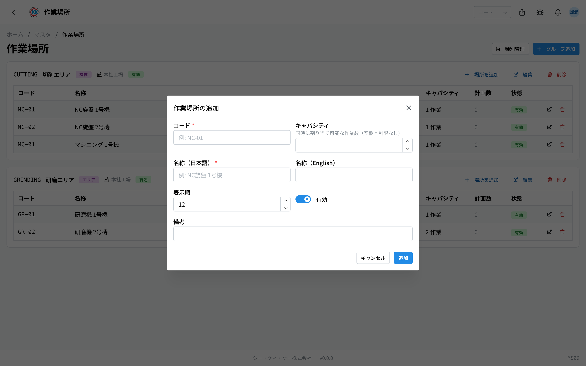
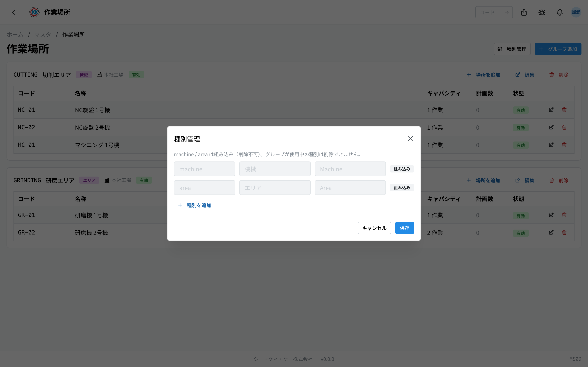

这是用于登记「NC旋盤 1号機」（NC车床1号机）这类实际 **进行作业的机器或区域** 的应用。操作代码是 `MS0D`。

这里登记的场所，可以在[指示书](/manual/zh/apps/work-order/user)工序的作业计划中，作为「在哪里作业」来选择。

> ⚠️ 本应用处于试用公开阶段。根据您使用的环境，可能还看不到它。

## 三个相似应用的区别

关于「场所」的应用有 3 个，容易混淆，请注意区分。

| 应用 | 登记什么 | 示例 |
|--------|----------------|-----|
| [拠点（据点）](/manual/zh/masters/plant/user) | 工厂本身 | 总部工厂、第二工厂 |
| **作業場所（作业场所）**（本页） | 据点内部进行作业的场所・机器 | NC车床1号机、研磨区 |
| [保管場所（保管场所）](/manual/zh/masters/storage-location/user) | 据点内部存放物品的仓库・货架 | 资材仓库A 的 A-1 货架 |

**人进行作业的场所** 用本应用，**存放物品的场所** 用保管场所应用。

## 本应用可以做什么

- 可以把机器和区域分成 **分组**（按机器种类或区域归并的集合）来登记。
- 可以为每台机器设定 **同时可以安排多少项作业**（容量）。
- 可以确认该机器目前被多少个作业计划使用。
- 可以自行增加用于划分分组的 **类别**。

## 本页出现的词语

- **分组** … 归并作业场所的单位。按「NC旋盤」（NC车床）「研磨エリア」（研磨区）这样的机器种类或区域来创建。分组必定属于某个据点。
- **作业场所** … 一台机器或一个区域。必须登记在某个分组之下。
- **容量** … 该场所可以同时安排的作业数量。留空则表示没有限制。
- **计划数** … 预定使用该场所的作业计划件数。
- **类别** … 用于划分分组的区分。一开始就有「機械」（机器）和「エリア」（区域）。

## 开始之前

- 使用本应用需要 **主数据权限**。
- 分组需要指定据点。请先登记[据点](/manual/zh/masters/plant/user)。
- 登记顺序是 **先分组，后机器**。不创建分组就无法单独登记机器。

## 界面的看法

本应用没有列表和详细界面之分，**所有操作都在一个界面上完成**。

- 界面右上角有「**種別管理**」（类别管理）和「**グループ追加**」（添加分组）按钮。
- 每个分组以卡片形式排列。卡片上方会显示该分组的代码、名称、类别、据点、状态。
- 卡片右侧排列着「**場所を追加**」（添加场所）「**編集**」（编辑）「**削除**」（删除）按钮。
- 卡片中的表格按 **コード**（代码）/ **名称**（名称）/ **キャパシティ**（容量）/ **計画数**（计划数）/ **状態**（状态）的顺序排列该分组的机器。
- 什么都还没登记时，会显示「**作業場所が未登録です。グループ（機械種別・エリアなど）を作成し、配下に物理的な場所（機械 1 台・1 区画）を追加してください。**」（尚未登记作业场所。请创建分组（机器种类・区域等），并在其下添加物理场所（1 台机器・1 个区域））。

## 创建分组

首先创建归并机器的容器。

1. 点击界面右上角的「**グループ追加**」（添加分组）。
2. 在「**コード**」（代码）中输入代表该分组的文字（例 `NC-LATHE`）。
3. 选择「**種別**」（类别）（机器 / 区域 / 自己添加的类别）。
4. 在「**名称（日本語）**」（名称，日语）中输入分组的名称（例 NC旋盤 / NC车床）。
5. 在「**拠点**」（据点）中选择该分组所在的据点。
6. 在「**表示順**」（显示顺序）中输入数字。数字越小越靠上。
7. 点击「**作成**」（创建）。

## 添加机器（作业场所）

分组创建好后，在其中一台一台地登记机器。

1. 在要添加的分组卡片上点击「**場所を追加**」（添加场所）。
2. 在「**コード**」（代码）中输入代表该机器的文字（例 `NC-01`）。
3. 在「**キャパシティ**」（容量）中输入可同时安排的作业数量。1 台机器一次做 1 项时填 `1`。留空则为「没有限制」。
4. 在「**名称（日本語）**」（名称，日语）中输入机器的名称（例 NC旋盤 1号機 / NC车床1号机）。
5. 在「**表示順**」（显示顺序）中输入数字。
6. 点击「**追加**」（添加）。

登记好的机器会排列在该分组卡片的表格中。通过表格行右侧的按钮，可以进行编辑和删除。

> 💡 把「容量」设为 `1` 后，更容易发现该机器上同时安排了 2 项以上作业的情况。

## 增加类别

划分分组的区分可以自行增加。想按「ライン」（生产线）「検査室」（检查室）这样划分时可以使用。

1. 点击界面右上角的「**種別管理**」（类别管理）。
2. 点击最下方的「**追加**」（添加），增加一行。
3. 在左侧栏中输入代表该区分的文字（例 `line`）。可以使用小写英文数字、连字符和下划线。
4. 在中间栏中输入日语显示名称（例 ライン / 生产线）。
5. 点击「**保存**」（保存）。

「**機械**」（机器）和「**エリア**」（区域）是一开始就准备好的，会显示为「**組み込み**」（内置），无法删除或改名。

## 与指示书的关联

在指示书工序的「**作業計画**」（作业计划）中，可以为每一行计划选择「**作業場所（任意）**」（作业场所，可选）。所选的作业场所会显示在计划列表中，在现场共享终端的界面上也能确认。

被选择的次数会显示在作业场所表格的「**計画数**」（计划数）列中。计划数不为 0 的场所，表示仍在使用中。

## 常见问题・遇到麻烦时

**Q. 想添加机器，却找不到「場所を追加」（添加场所）按钮。**
A. 这个按钮在分组的卡片里。还没有任何分组时，请先用「**グループ追加**」（添加分组）创建分组。

**Q. 出现「この場所は 3 件の作業計画から参照されています（削除できません — 無効化をご検討ください）。」（该场所被 3 个作业计划引用，无法删除，请考虑停用）。**
A. 该机器正被指示书的作业计划使用。请不要删除，在编辑界面上关闭「**有効**」（有效）将其停用。停用后，今后创建的计划中就无法选择它。

**Q. 出现「グループの削除に失敗しました（作業計画で使用中の場所が含まれる場合は削除できません）」（分组删除失败；若包含作业计划正在使用的场所，则无法删除）。**
A. 该分组中还有正在使用的机器。请确认是哪台机器在使用，不要整组删除，改为把那台机器停用。

**Q. 删除分组后，里面的机器会怎样？**
A. 会一起被删除。确认界面上会显示将被删除的机器数量。此操作无法撤销。

**Q. 出现「使用中の種別は削除できません」（使用中的类别无法删除）。**
A. 有分组选择着该类别。请先把那个分组的「**種別**」（类别）改为其他，然后再试。

**Q. 出现「存在しない種別です（先に種別を追加してください）」（该类别不存在；请先添加类别）。**
A. 您要选的类别还没有登记。请在「**種別管理**」（类别管理）中添加后，再保存分组。

**Q. 我想登记仓库和货架，在这里可以吗？**
A. 不可以。存放物品的场所请在[保管场所](/manual/zh/masters/storage-location/user)中登记。
