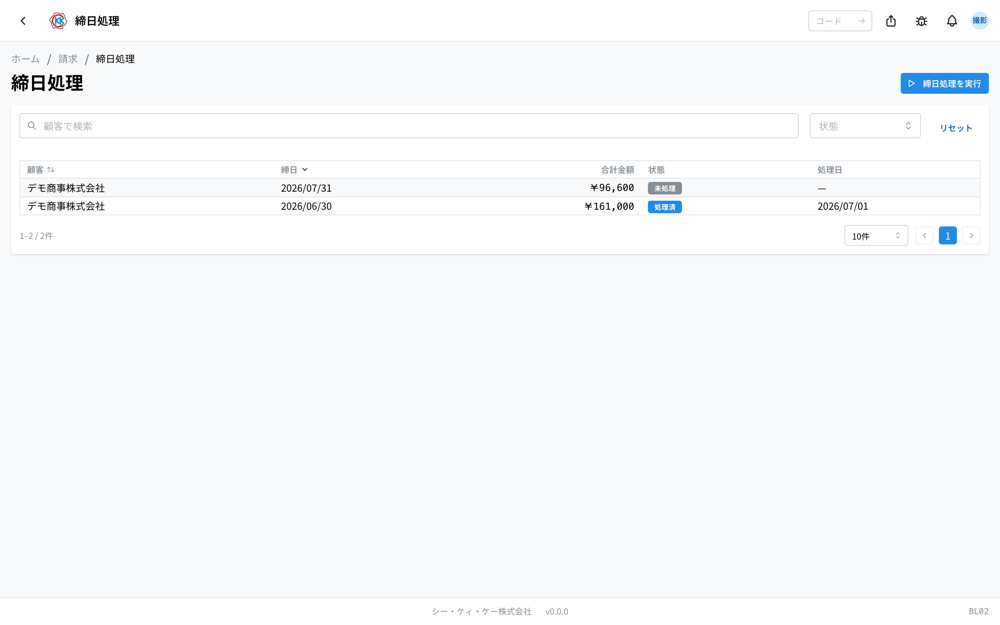
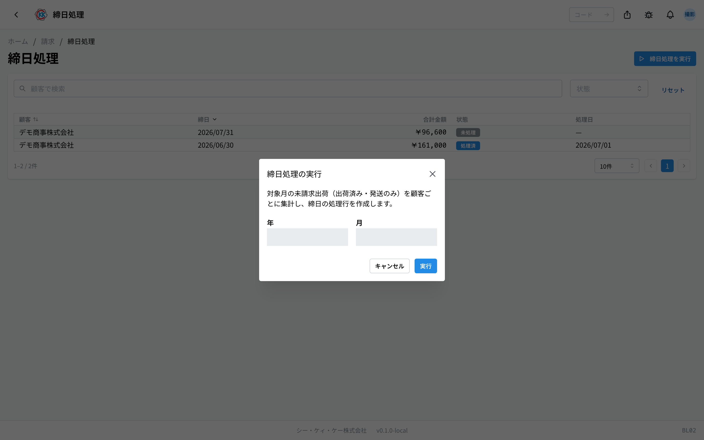
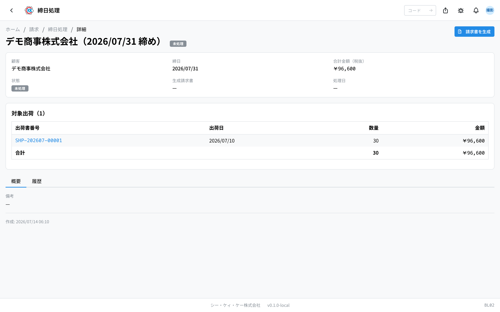
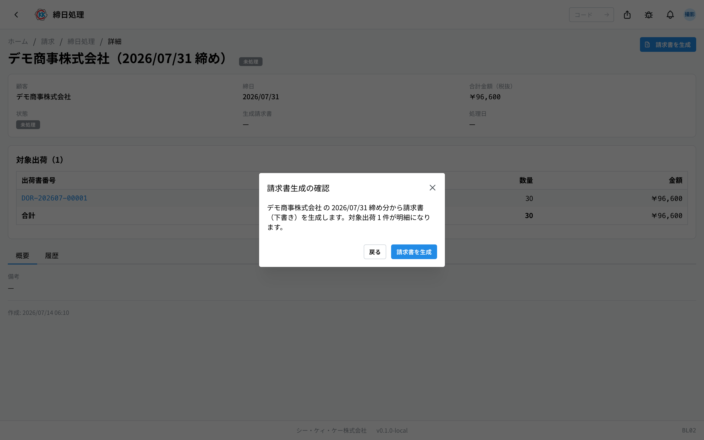
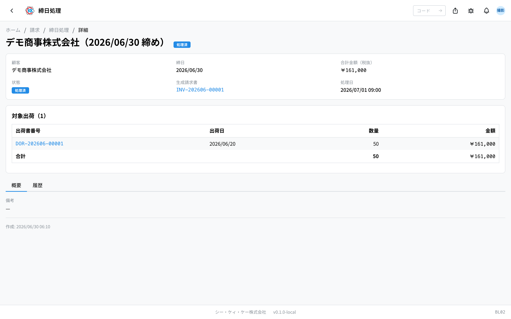

每月一次，按客户把「当月发出的部分」汇总起来，做出[发票](/manual/zh/operations/billing/invoice/user)基础的应用。操作代码是 `BL02`。

> ⚠️ 本应用还在准备中。正式启用之前，界面和步骤可能会有变化。

## 本应用能做什么

- 可以把目标月份发出的部分，**按客户分别汇总**。
- 做发票之前，可以先确认汇总的内容（哪张出货单是多少钱）。
- 一个按钮就能做出[发票](/manual/zh/operations/billing/invoice/user)的草稿。

每个月的请款工作，都从这个应用开始。

## 本页出现的词

- **締日（结算截止日）** … 约定好的每月请款分界日：「每月到这一天为止发出的部分合在一起请款」。比如「月末结算」，就是把到当月最后一天为止的部分汇总起来。
- **締日処理（结算截止处理）** … 以结算截止日为分界，把发出的部分汇总起来的作业。
- **未請求（未请款）** … 还没有进入任何一张发票的发货。
- **対象出荷（对象出货）** … 这次结算所汇总的出货单一览。
- **合計金額（税抜）（合计金额（不含税））** … 加消费税之前的合计。消费税会在做发票时加上。

## 开始之前

- 被汇总的，只有 **状态是「出荷済」（已发货）、类别是「発送」（发送）的**[出货单](/manual/zh/operations/shipping/shipping-order/user)。还停在「下書き」（草稿）「確定」（确定）的出货单不会算进去。请先完成发货记录。
- 每个客户的结算截止日，由[客户](/manual/zh/operations/masters/customer/user)的登记内容决定。没有设定的客户，按 **月末** 汇总。
- 做结算截止处理需要相应权限。如果不能用，请联系管理员。

> ⚠️ 类别是「**在庫保管**」（留库保管）的出货单，是没有发给客户、留在公司保管的部分，不会算进汇总，也不会请款。

## 界面怎么看

打开应用后，会看到以往的结算一览。一行就是「某个客户、某个月的结算」。

- **顧客（客户）** … 表示这是哪个客户的结算。
- **締日（结算截止日）** … 这次结算的分界日。
- **合計金額（合计金额）** … 这次结算汇总出的金额。
- **状態（状态）** … 灰色是「未処理」（未处理，还没做发票），蓝色是「処理済」（已处理，已做发票），绿色是「エクスポート済」（已导出）。
- 上面的搜索框里可以输入客户名称来筛选。
- 点一行就能打开这次结算的详细界面。

## 做结算截止处理

1. 点一览界面右上角的「**締日処理を実行**」（执行结算截止处理）。
2. 会弹出一个叫「締日処理の実行」（执行结算截止处理）的小窗口。
3. 在「**年**」（年）和「**月**」（月）里选要汇总的月份。
4. 点「**実行**」（执行）。

结束后，界面右上角会显示「作成 2 件 / 更新 1 件」（新建 2 件 / 更新 1 件）这样的件数，一览里会列出结算的行。还没做发票的行是「**未処理**」（未处理）。

> 💡 同一个月执行多少次都没关系。已经做过发票的行会原样保留，只有还没做的行会更新成最新金额，不会重复请款。

根据公司的设置，当月的部分有时每天早上会自动汇总。即使如此，按上面的步骤重做一遍也没有问题。

## 确认汇总的内容

从一览里点结算的行，就会打开详细界面。

- 上方会显示客户、结算截止日、合计金额（不含税）、状态。
- 「**対象出荷**」（对象出货）表里逐行列出被汇总的出货单（出货单号、发货日、数量、金额）。
- 点出货单号的蓝色文字，可以打开该[出货单](/manual/zh/operations/shipping/shipping-order/user)确认内容。
- 表格最下面会显示数量和金额的合计。

金额和预想的不一样时，请在做发票之前先在这里确认。

表格下面有两个标签页。「**概要**」（概要）可以看备注，「**履歴**」（历史）可以看谁在什么时候推进了这次结算。

## 做发票

1. 打开结算的详细界面。
2. 点右上角的「**請求書を生成**」（生成发票）。
3. 弹出「請求書生成の確認」（生成发票确认），确认对象出货有多少件。
4. 点「**請求書を生成**」（生成发票）。

发票的草稿会被做出来，并直接跳到[发票](/manual/zh/operations/billing/invoice/user)界面。消费税和付款期限，会根据客户的登记内容自动填入。

结算的行会变成「**処理済**」（已处理），从「**生成請求書**」（生成的发票）栏里，随时都能打开那张发票。

之后的发行、寄送、收款记录，以及做出会计软件用的文件，都在[发票](/manual/zh/operations/billing/invoice/user)应用里进行。

## 常见问题与困扰

**Q. 出现「対象月に未請求の出荷がありません」（目标月份没有未请款的出货）。**
A. 那个月里，一件还没请款的发货都没有。请确认出货单是不是都已经是「出荷済」（已发货），类别是不是「発送」（发送）。

**Q. 这个月发货了，却没进这次结算。**
A. 在结算截止日 **之后** 发出的部分，不算这个月，会进入下个月的结算。另外，出货单没有变成「出荷済」（已发货）时也不会被汇总。

**Q. 出现「請求対象の出荷がありません」（没有请款对象的出货），做不了发票。**
A. 这次结算的对象出货是空的。请再用「締日処理を実行」（执行结算截止处理）重新汇总一次，然后再试。

**Q. 出现「未処理の締日のみ請求書を生成できます」（只有未处理的结算才能生成发票）。**
A. 这次结算已经做过发票了。请从「生成請求書」（生成的发票）栏里打开做好的发票确认。

**Q. 不小心把发票做出来了。**
A. 没有把结算的行退回「未処理」（未处理）的操作。做出来的发票怎么处理，请联系财务的负责人。

**Q. 只有某个客户的结算截止日不对。**
A. 每个客户的结算截止日，由[客户](/manual/zh/operations/masters/customer/user)的登记内容决定。没有设定的客户会按月末处理。请修改登记内容后，再执行一次结算截止处理。
