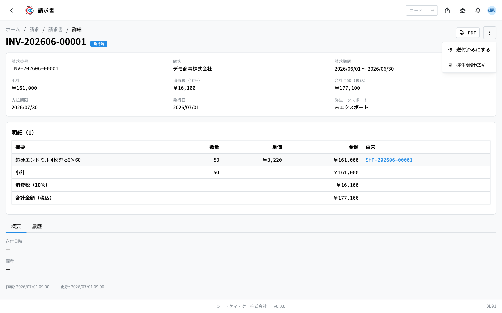
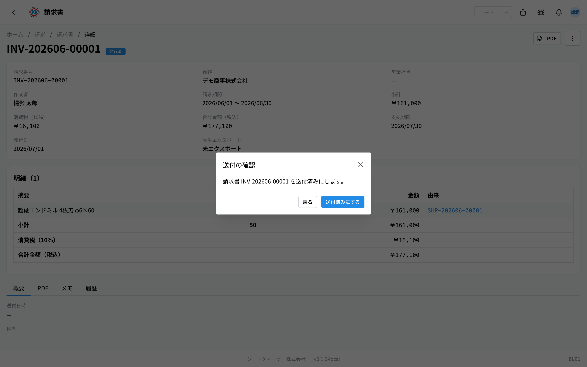

お客様へお金を請求する **請求書** を確認して、発行・送付・入金までを記録するアプリです。操作コードは `BL01` です。

> ⚠️ このアプリはまだ準備中です。正式に使えるようになるまでに、画面や手順が変わることがあります。

## このアプリでできること

- 請求書の中身（何をいくつ、いくらで請求するか）を確認できます。
- 請求書を **PDF** にして、印刷したりメールで送ったりできます。
- 「発行した」「送った」「入金があった」を順に記録できます。
- 会計ソフトに読み込ませるファイルをダウンロードできます。

このアプリに「新規作成」のボタンはありません。請求書は[締日処理](/manual/ja/operations/billing/billing-closing/user)で自動的に作られます。

## 用語（このページで出てくる言葉）

- **請求期間（せいきゅうきかん）** … 「いつからいつまでに送った分」をまとめて請求するか、その期間です。
- **小計（しょうけい）** … 消費税を入れる前の金額です。
- **消費税** … 小計にかかる税金です。お客様ごとの決まりに合わせて自動で計算されます。
- **合計金額（税込）** … 小計と消費税を足した、実際にお支払いいただく金額です。
- **支払期限** … いつまでにお支払いいただくかの期日です。
- **由来（ゆらい）** … その 1 行がどの[出荷書](/manual/ja/operations/shipping/shipping-order/user)・[納品書](/manual/ja/operations/shipping/delivery-note/user)から来たかを示します。

## はじめる前に

- 請求書はこのアプリでは作れません。先に[締日処理](/manual/ja/operations/billing/billing-closing/user)で「請求書を生成」してください。
- 請求書を発行したり記録を進めたりするには、請求書の権限が必要です。
- 会計ソフト用のファイルをダウンロードするには、締日処理の書き出しの権限も必要です。使えないときは管理者にご相談ください。

## 画面の見かた

アプリを開くと、これまでに作られた請求書の一覧が出ます。

- **請求番号** … `INV-` で始まる番号です。システムが自動で付けます。
- **状態** … 灰色は「下書き」、青は「発行済」、紫は「送付済」、緑は「支払済」です。
- 上の検索欄には、請求番号かお客様の名前を入れて絞り込めます。
- 行をクリックすると、その請求書の詳しい画面が開きます。
- まだ 1 件もないときは「**請求書がありません（締日処理から生成します）**」と出ます。

## 内容を確認する

上のほうに、請求番号・お客様・請求期間・小計・消費税・合計金額（税込）・支払期限・発行日が並びます。

- **支払期限** … 締めの日から、そのお客様と決めた日数（決めていなければ 30 日）あとの日付が自動で入ります。
- **弥生エクスポート** … 会計ソフト用のファイルを出した日時です。まだのときは「**未エクスポート**」と出ます。

下の「明細」には、請求する 1 行ずつが並びます。

- **摘要（てきよう）** … 製品名とロット番号です。
- **由来** … 青い文字をクリックすると、元になった[出荷書](/manual/ja/operations/shipping/shipping-order/user)や[納品書](/manual/ja/operations/shipping/delivery-note/user)を開けます。
- 一番下に、小計・消費税・合計金額（税込）が出ます。

明細の下には 2 つのタブがあります。「**概要**」ではお客様へ送った日時と備考を、「**履歴**」ではいつ誰がこの請求書を進めたかを確認できます。

> 💡 金額が合っているか確かめたいときは、「由来」のリンクから元の出荷書を開くと、いつ何本送ったかをその場で確認できます。

> 💡 消費税の欄には、そのお客様に適用された税率が表示されます（「**消費税（10%）**」「**消費税（8%）**」「**消費税（非課税）**」）。税率はお客様ごとの登録内容で決まります。

## 発行から入金までの記録

請求書は「下書き → 発行済 → 送付済 → 支払済」と 4 段階で進みます。この画面に編集はなく、操作は右上の「**…**」（点が 3 つのボタン）から行います。

### 1. 発行する

1. 「**…**」を押します。
2. 「**発行**」を選びます。
3. 「発行の確認」が出るので「**発行**」を押します。

その日の日付が **発行日** として記録されます。

### 2. お客様へ送ったら

1. 「**…**」を押します。
2. 「**送付済みにする**」を選びます。
3. 確認の画面が出るので「**送付済みにする**」を押します。

### 3. 入金を確認したら

1. 「**…**」を押します。
2. 「**入金済みにする**」を選びます。
3. 確認の画面が出るので「**入金済みにする**」を押します。

状態が「**支払済**」になり、その請求書は完了です。

## 印刷する（PDF）

画面右上の「**PDF**」を押すと、請求書の PDF が別のタブで開きます。そこから印刷したり保存したりできます。

## 会計ソフト用のファイルを出す

経理で会計ソフト（弥生会計 Next）に取り込むためのファイルをダウンロードできます。

1. 請求書の画面で右上の「**…**」を押します。
2. 「**弥生会計CSV**」を選びます。
3. ファイルがダウンロードされるので、会計ソフトに取り込みます。

出したあとは、詳しい画面の「**弥生エクスポート**」欄に日時が表示されます。

## 入力項目

この画面に入力欄はありません。請求書は**締日処理でまとめて作られる**ため、金額や明細を手で打つことはありません。

| 操作 | 何が起きるか |
|------|-------------|
| [発行](#field-issue) | 請求書が確定し、番号が付く |
| [送付済みにする](#field-sent) | お客様へ送ったことを記録する |
| [入金済みにする](#field-paid) | 支払いを受け取ったことを記録する |

### 発行 [#field-issue]

内容を確認したあと、請求書を確定します。**発行すると番号が付き、内容は変えられなくなります。** 間違いに気づいたときは、元の納品や締日処理をたどって直してください。

### 送付済みにする [#field-sent]

お客様へ送ったことを記録します。送り方（メール・FAX・郵送）はお客様ごとに決まっています。

### 入金済みにする [#field-paid]

支払いを受け取ったことを記録します。まだの請求書を探すときに使えます。

金額の内訳は、**納品書から自動で集められます**。合わないときは、この画面ではなく納品の側を確認してください。

## よくある質問・困ったとき

**Q. 「新規作成」のボタンが見当たりません。**
A. 請求書はこの画面では作れません。[締日処理](/manual/ja/operations/billing/billing-closing/user)を開き、対象の行で「請求書を生成」を押してください。

**Q. 金額を直したいのですが、編集の画面がありません。**
A. 請求書は直接直せません。元になった[出荷書](/manual/ja/operations/shipping/shipping-order/user)の内容が違っているはずなので、経理・営業の担当者にご相談ください。

**Q. 「下書きの請求書のみ発行できます」と出ます。**
A. その請求書はすでに発行済みです。画面をいったん閉じて開き直すと、今の状態が確認できます。

**Q. 「発行済みの請求書のみ送付済みにできます」と出ます。**
A. 順番が飛んでいます。「発行 → 送付済みにする → 入金済みにする」の順に進めてください。

**Q. 消費税が 10% で計算されていないようです。**
A. 消費税はお客様ごとの決まりで計算されます。軽減税率のお客様は 8%、非課税のお客様は 0% です。決まりを変えたいときは[顧客](/manual/ja/operations/masters/business-partner/user)の登録内容を直してください。

**Q. 「弥生会計CSV」を押してもファイルが出ません。**
A. 書き出しの権限がない可能性があります。管理者にご相談ください。
