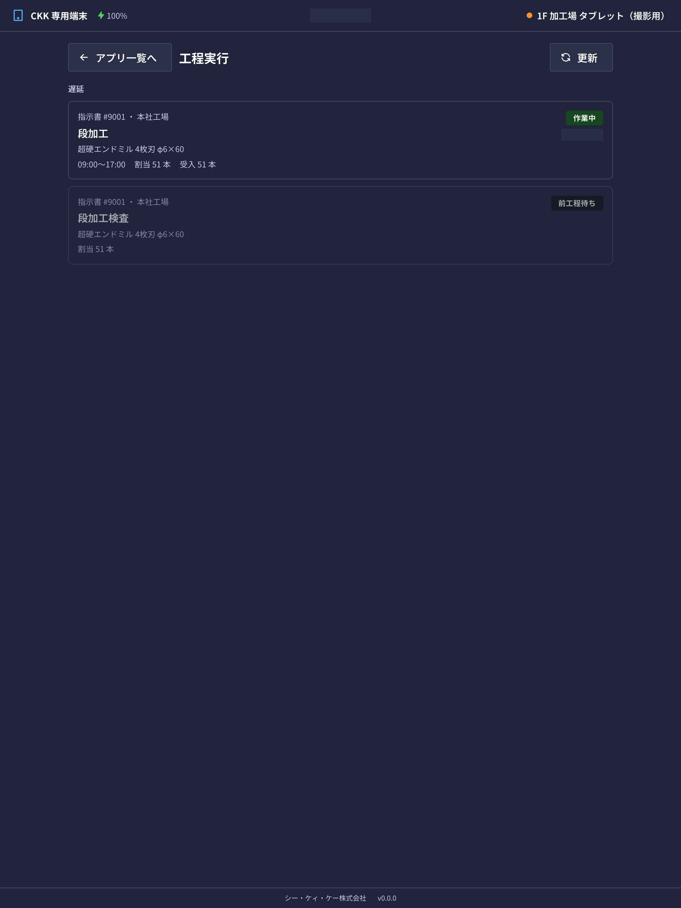
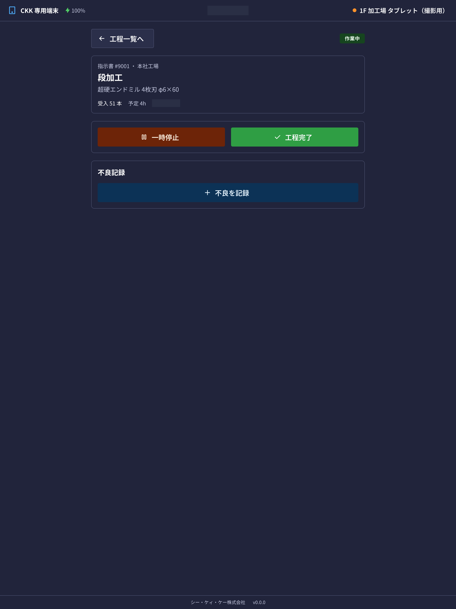

在平板的「**工程実行**」（工序执行）中，可以确认分配给自己的作业，并记录开始和完成。

## 本应用能做什么

- 可以确认今天要做的作业（工序）列表。
- 可以记录作业的 **开始、暂停、继续、完成**。
- 可以输入接收了几根、其中几根是良品。
- 出现不良品时，可以留下种类和根数。
- 在检查工序中，可以记录测量值和合格与否。

## 本页出现的词语

- **指示書**（制造指示书）… 说明「做哪种产品、做几根」的作业指示。会带有类似 `#9001` 的编号。
- **受入数**（接收数）… 进入该工序的根数。
- **良品数**（良品数）… 可以顺利交给下一道工序的根数。
- **前工程待ち**（等待前道工序）… 因为前一道作业还没结束，所以还不能开始的状态。

## 画面的看法

作业会分成 3 个部分显示。

- **遅延**（延误）… 已经超过预定日期的作业。请先从这里处理。
- **本日**（今天）… 今天的预定。
- **予定**（预定）… 更后面日期的作业。

每张卡片上会排列显示指示书编号、据点、工序名称、产品名称、分配的根数。右上角的标签表示当前状态。

- **開始可**（可开始）… 可以立即开始。
- **前工程待ち**（等待前道工序）… 前一道作业还没结束，无法开始。
- **作業中**（作业中）… 正在作业中。
- **一時停止中**（暂停中）… 已中断。点击「再開」（继续）可以从中断处继续。
- **完了**（已完成）… 已经结束的作业。

> 💡 已完成的作业可以用「**完了した工程を隠す**」（隐藏已完成的工序）从列表中隐藏。显示条数太多时可以使用。

## 开始作业

1. 从列表中点击想开始的作业卡片。
2. 点击画面下方的「**工程開始**」（开始工序）。
3. 在「工程を開始」（开始工序）画面中确认 **受入数**（接收数，进入该工序的根数）。会预先填入从前一道工序继承的数量。
4. 与实际数量不同时，请修改数字。
5. 点击「**開始する**」（开始）。

开始后状态会变成「作業中」（作业中），并开始计算作业时间。

> ⚠️ 同时只能进行 **一道工序**。想开始其他工序时，请先把当前工序设为「一時停止」（暂停）或「完了」（完成）。画面上显示「他工程を作業中」（正在进行其他工序）时，可以通过「**作業中の工程へ**」（前往作业中的工序）返回。

## 中途停止・继续

- 午休等需要中断时，点击「**一時停止**」（暂停）。作业时间的计算会停止。
- 想继续时，点击「**再開**」（继续）。

即使暂停，此前的作业时间也会保留。可以多次停止和继续。

## 结束作业

1. 点击画面下方的「**工程完了**」（工序完成）。
2. 在「工程を完了」（完成工序）画面中确认 **良品数**（良品数，可以交给下一道工序的根数）。
3. 出现不良品时，点击「**不良を追加**」（添加不良），输入 **種別**（类别：半製品 半成品・廃棄 报废・手直し 返修）和 **本数**（根数）。需要时也可以选择原因。
4. 点击「**完了する**」（完成）。

良品数会用接收数减去不良品合计 **自动计算**（显示为「自動計算」）。

> ⚠️ 不良品合计超过接收数时，会显示「**不良の合計（n）が受入数（n）を超えています**」（不良合计（n）超过了接收数（n）），无法完成。请重新核对根数。

## 检查工序

在检查工序中，完成之前要输入检查记录。

1. 在「**検査記録**」（检查记录）栏中输入「**検査数**」（检查数）和「**合格数**」（合格数）。
2. 按项目输入 **実測値**（实测值）。只要在规定的范围内，合格与否会 **自动判定**。
3. 无法自动判定的项目，请自己选择「合格」（合格）或「不合格」（不合格）。
4. 点击「**検査記録を保存**」（保存检查记录）。

## 常见问题・遇到困难时

**Q. 列表里什么都没有。**
A. 显示「**本日の担当工程はありません**」（今天没有负责的工序）时，说明今天没有分配给你的作业。分配由办公室（指示书的负责人）进行。

**Q. 显示「前工程待ち」（等待前道工序）无法开始。**
A. 前一道工序还没有完成。等做前一道作业的人完成后就可以开始了。

**Q. 「工程開始」（开始工序）按钮点不了。**
A. 可能正在进行其他工序。请确认画面上方的「他工程を作業中」（正在进行其他工序），先把那道工序暂停或完成。

**Q. 接收数与实际不符。**
A. 请在开始时修改数字。填入的只是从前一道工序继承的初始值，改成实际接收到的根数没有问题。

**Q. 不小心点了完成。**
A. 在平板上无法取消。请联系办公室的负责人（由电脑一侧处理）。

**Q. 中途画面关掉了。**
A. 记录还在。重新登录后打开同一道工序，仍然是「作業中」（作业中），可以从中断处继续操作。
