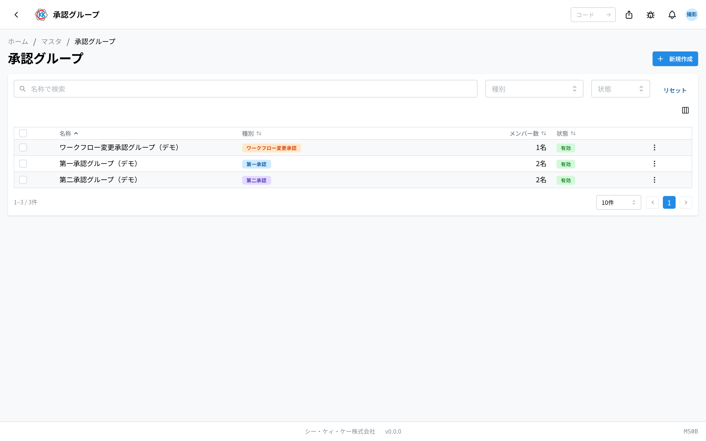
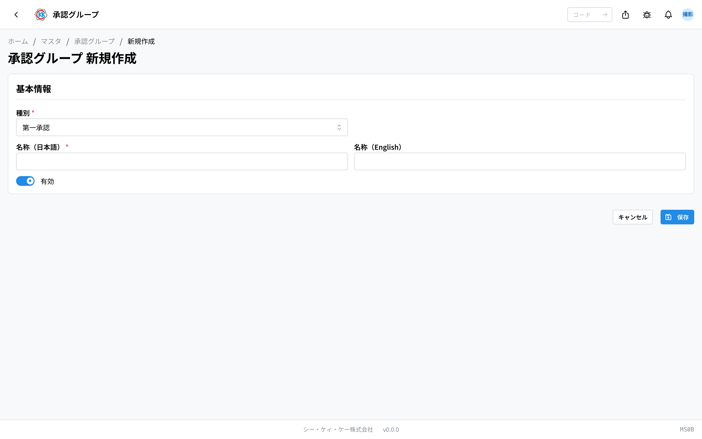
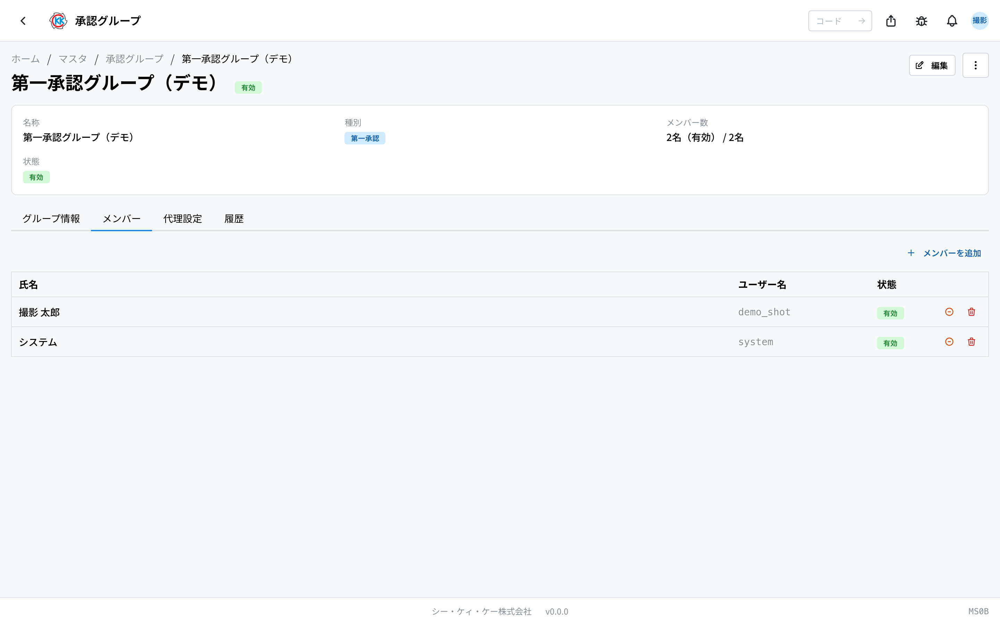
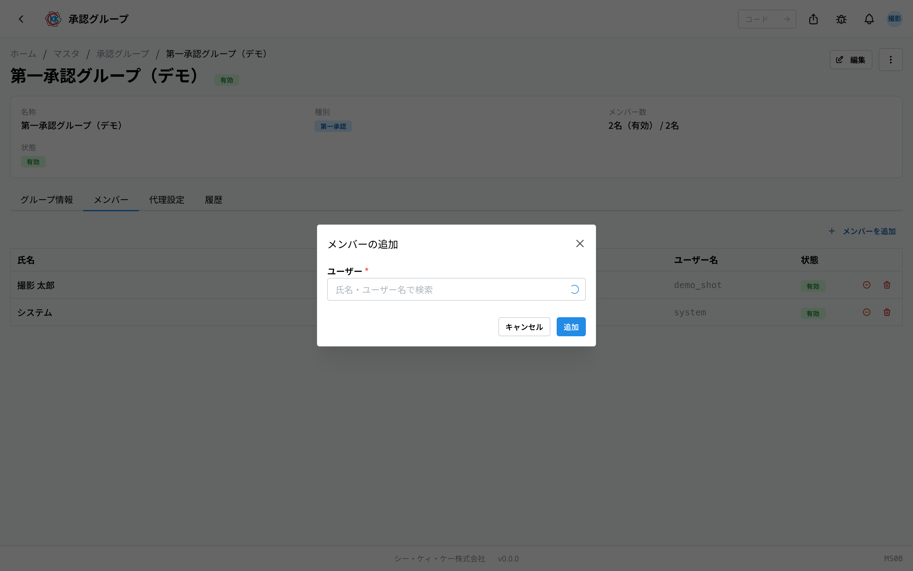
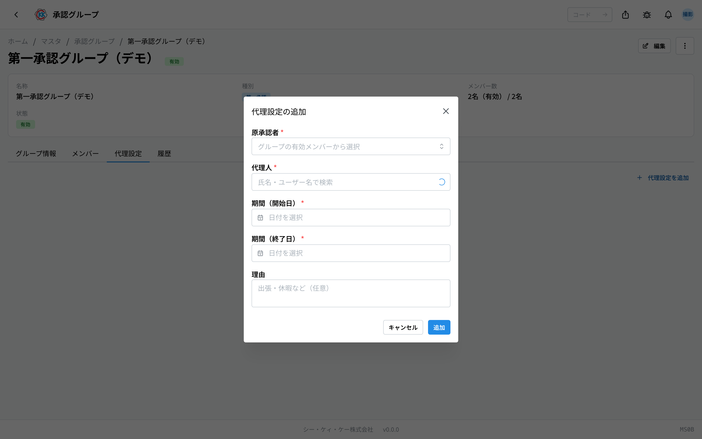

「**誰が承認できるか**」をグループで決めておくアプリです。操作コードは `MS0B` です。

指示書や素材の発注などで承認をお願いすると、そのグループに入っている人が承認できるようになります。**グループに入っていない人は承認できません。** 逆に、グループにメンバーとして追加すれば、その人は承認できるようになります。

## このアプリでできること

- 承認する人のグループを作れます。
- グループに **メンバー**（承認できる人）を追加・削除できます。
- 出張や休暇で担当者が不在のとき、期間を決めて **代理**（代わりに承認する人）を登録できます。
- 使わなくなったグループを、記録を消さずに止められます。

## 用語（このページで出てくる言葉）

- **承認（しょうにん）** … 内容を確認して「進めてよい」と認めることです。
- **グループ** … 承認できる人のまとまりです。承認をお願いする相手は、人ではなくこのグループに向けて決まります。
- **メンバー** … そのグループで承認できる人です。ここに入っている人だけが承認できます。
- **代理（だいり）** … 本来の承認者が不在のとき、期間を決めて代わりに承認する人です。
- **種別（しゅべつ）** … そのグループがどの段階の承認を担当するかの区分です。

## はじめる前に

- このアプリを使うには **マスタの権限** が必要です。
- メンバーに追加できるのは、システムに登録済みの人だけです。名前が出てこないときは、先に社内のアカウントが作られているかご確認ください。

## 種別（グループの役割）は 3 つ

グループを作るときに、どの段階の承認を担当するかを選びます。**作ったあとは変えられません。**

- **第一承認** … 「この内容で生産してよいか」など、最初の承認です。
- **第二承認** … 第一承認のあとに行う、部門としての承認です。
- **ワークフロー変更承認** … 進行中の指示書の工程を変えたいときの承認です。

## 画面の見かた

アプリを開くと、登録済みのグループの一覧が表示されます。

- 一覧は **名称 / 種別 / メンバー数 / 状態** の順に並んでいます。
- 上の「**名称で検索**」の欄で、探しているグループを絞り込めます。「**種別**」「**状態**」でも絞り込めます。
- 行をクリックすると、そのグループの詳しい画面が開きます。

## グループをつくる

1. 一覧画面の右上にある「**新規作成**」を押します。
2. 「**種別**」を選びます（第一承認 / 第二承認 / ワークフロー変更承認）。
3. 「**名称**」の日本語の欄に、グループの名前を入れます（例 第一承認グループ）。英語は空欄のままでも保存できます。
4. 「**保存**」を押します。

保存すると詳しい画面が開きます。メンバーはここで追加します。

> ⚠️ 「**種別**」は保存したあとは変えられません。編集の画面にも「**種別は作成後変更できません**」と表示されます。段階をまちがえたときは、正しい種別で新しく作り直してください。

## メンバーを追加する（承認できる人を増やす）

1. グループの詳しい画面で「**メンバー**」タブを開きます。
2. 「**メンバーを追加**」を押します。
3. 「**氏名・ユーザー名で検索**」の欄に名前を入れて、追加したい人を選びます。
4. 「**追加**」を押します。

追加した人は、その日から承認できるようになります。

メンバーの表には **氏名 / ユーザー名 / 状態** が出ます。行の右のボタンから、そのメンバーを一時的に止めたり（**メンバーを無効化**）、グループから外したり（**メンバーを削除**）できます。

> 💡 しばらく承認を外れるだけなら「無効化」、その人がもう関わらないなら「削除」を使うと分かりやすくなります。

## 代理を登録する（休みの人の代わり）

承認する人が出張や休暇で不在のとき、期間を決めて別の人に承認を任せられます。

1. グループの詳しい画面で「**代理設定**」タブを開きます。
2. 「**代理設定を追加**」を押します。
3. 「**原承認者**」で、本来の承認者を選びます。ここに出てくるのは、このグループの有効なメンバーだけです。
4. 「**代理人**」で、代わりに承認する人を選びます。
5. 「**期間（開始日）**」と「**期間（終了日）**」を入れます。
6. 必要なら「**理由**」に「出張・休暇など」を書きます（空欄でもかまいません）。
7. 「**追加**」を押します。

登録した期間が過ぎると、代理は自動で効かなくなります。手で消す必要はありません。早めに終わらせたいときは、代理設定の表の行から削除できます。

## グループの中身を確認する

詳しい画面は 4 つのタブに分かれています。

- **グループ情報** … 名称と種別の確認ができます。
- **メンバー** … 承認できる人の一覧です。
- **代理設定** … いま登録されている代理の一覧です。原承認者・代理人・期間・理由が出ます。
- **履歴** … いつ誰がメンバーや代理を変えたかの記録です。

名称を直したいときは、右上の「**編集**」を押します。その右の「**…**」（点が 3 つのボタン）からは、**無効化** と **削除** ができます。

## よくある質問・困ったとき

**Q. 承認をお願いされた人が、承認できないと言っています。**
A. その人がグループのメンバーに入っているか確認してください。入っていても「状態」が無効になっていると承認できません。「メンバー」タブから追加、または有効化してください。

**Q.「既にメンバーです」と出ます。**
A. その人はすでにこのグループに入っています。「メンバー」タブの一覧で名前を探してみてください。無効になっている場合は、行のボタンから有効に戻せます。

**Q.「原承認者はこのグループの有効なメンバーのみ選べます」と出ます。**
A. 代理をお願いする本来の承認者が、このグループのメンバーになっていないか、無効になっています。先に「メンバー」タブでその人を追加・有効化してください。

**Q.「原承認者と代理人は別のユーザーを選択してください」と出ます。**
A. 同じ人を両方に選んでいます。代わりに承認する人を、別の人にしてください。

**Q.「終了日は開始日以降の日付を選択してください」と出ます。**
A. 終了日が開始日より前になっています。日付を入れ直してください。

**Q. 代理の期間が終わったのに、設定が残っています。**
A. 期間を過ぎた代理は自動で効かなくなるので、残っていても問題ありません。一覧を整理したいときは、行から削除してください。

**Q. グループを削除できません。**
A. そのグループを使った承認の依頼や代理の設定が残っていると削除できません。使わなくなったグループは、削除ではなく「**無効化**」してください。無効にすると新しい承認では使われなくなり、これまでの記録はそのまま残ります。
