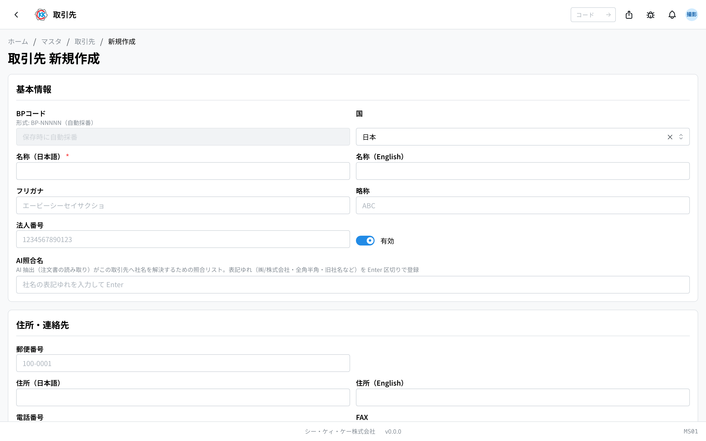
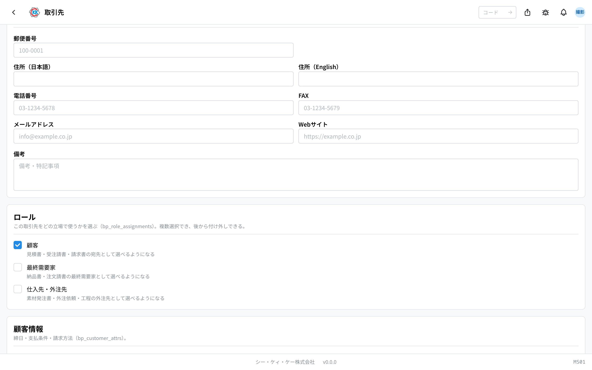
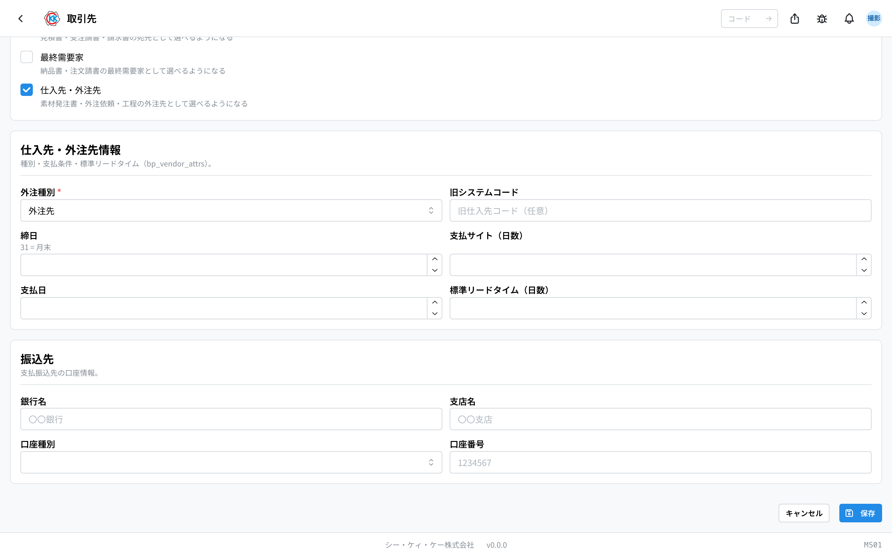
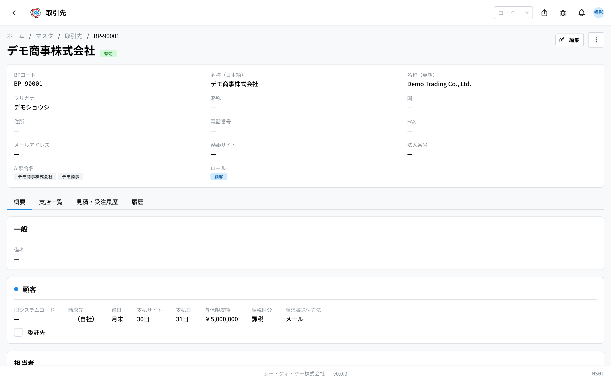
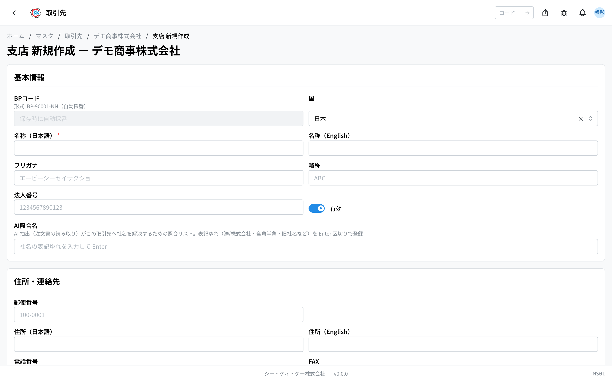

お取引のある会社を **まとめて登録しておく台帳** です。操作コードは `MS01` です。

以前は「顧客」「最終需要家」「外注企業」の 3 つのアプリに分かれていましたが、いまはこの **取引先** 1 つにまとまりました。同じ会社を 3 か所に登録し直す必要はありません。

使いかたの考え方はとてもシンプルです。

> **まず会社（取引先）を 1 件登録し、そのあと「ロール」を付けて使います。**

「ロール」とは、その会社を **どういう立場でお付き合いしているか** の印です。注文をくれる会社なら「顧客」、製品を実際に使う会社なら「最終需要家」、素材を買ったり加工をお願いしたりする会社なら「仕入先・外注先」を付けます。**1 つの会社にいくつでも付けられます。** 素材も売ってくれるし注文もくれる会社なら、両方付けておけば大丈夫です。

ロールを付けていない会社は、見積書や素材発注書などの画面で **選択肢に出てきません**。新しいお取引が決まったら、まずこの画面で会社を登録し、ロールを付けてください。

## このアプリでできること

- お取引のある会社を、1 社 1 件で登録できます。
- 会社に **ロール**（顧客 / 最終需要家 / 仕入先・外注先）を付けられます。1 社に複数付けられます。
- 「顧客」を付けると、[価格表](/manual/ja/operations/sales/price-list/user) や [見積書](/manual/ja/operations/sales/quote/user)、[受注請書](/manual/ja/operations/sales/order-acceptance/user)、請求書の宛先として選べるようになります。
- 「最終需要家」を付けると、[納品書](/manual/ja/operations/shipping/delivery-note/user) や注文請書の最終需要家として選べるようになります。
- 「仕入先・外注先」を付けると、[素材発注書](/manual/ja/operations/purchasing/purchase-order/user) や [外注依頼](/manual/ja/operations/purchasing/outsource-order/user)、指示書の工程の外注先として選べるようになります。
- 会社の下に **支店** を登録できます。
- 会社ごとに **担当者**（先方の窓口の方）を何人でも登録できます。
- 締日・支払サイト・振込先の口座・標準リードタイムなどの取引条件を登録しておけます。
- 取引が終わった会社は、消さずに **無効** にしておけます。

## 用語（このページで出てくる言葉）

- **取引先** … お取引のある会社そのもののことです。1 社につき 1 件登録します。
- **ロール** … その会社をどういう立場で使うかの印です。次の 3 つがあります。
  - **顧客** … 注文をくれる会社です。見積書・受注請書・請求書の宛先になります。
  - **最終需要家** … つくった製品を実際に工場で使う会社です。商社を通して注文をいただくときなど、注文をくれる会社と使う会社が違う場合に使います。
  - **仕入先・外注先** … 素材を買う相手（仕入先）や、研磨・コーティングなど加工の一部をお願いする相手（外注先）です。
- **外注種別** … 「仕入先・外注先」ロールの中の区分で、「**仕入先**」か「**外注先**」のどちらかを選びます。
- **BPコード** … 会社ごとに 1 つ付く管理番号です。`BP-` で始まります。保存すると自動で付きます。
- **支店** … 本社の下にぶら下がる営業所や工場のことです。
- **締日 / 支払サイト** … 請求や支払をまとめる日と、支払までの日数のことです。
- **標準リードタイム** … 依頼してから品物が届くまでの、いつもの日数です。
- **AI照合名** … いただいた注文書を自動で読み取るときに、社名を照らし合わせるための「別の書き方」の一覧です。

## はじめる前に

このアプリを使うには **マスタ権限** が必要です。画面が開かないときは、管理者にご相談ください。

特に先に用意しておくものはありません。この画面から登録を始められます。

登録した取引先は、[価格表](/manual/ja/operations/sales/price-list/user) → [見積書](/manual/ja/operations/sales/quote/user) → [受注請書](/manual/ja/operations/sales/order-acceptance/user) や、[素材発注書](/manual/ja/operations/purchasing/purchase-order/user) → [外注依頼](/manual/ja/operations/purchasing/outsource-order/user) と、後の作業でずっと使われます。**会社名の書き方は最初にきちんと決めて登録してください。**

## 画面の見かた

アプリを開くと、登録済みの取引先の一覧が表示されます。

- **BPコード** … `BP-` で始まる管理番号です。システムが自動で付けます。
- **名称** … 会社名です。
- **ロール** … その会社に付いているロールがバッジで並びます。「仕入先・外注先」ロールは、外注種別に合わせて「**仕入先**」または「**外注先**」と表示されます。ロールを 1 つも付けていない会社は「**ロール未設定**」と出ます。
- **支店数** … その会社に支店がいくつ登録されているかです。支店が無いときは「—」と出ます。
- **状態** … 緑の「**有効**」は今も使える会社、灰色の「**無効**」はもう選べない会社です。
- 上の検索欄（「**BPコード・名称で検索**」）に会社名や BPコードを入れると絞り込めます。
- 「**ロール**」の欄で、顧客だけ・仕入先・外注先だけ、といった絞り込みができます。
- 「**状態**」の欄で「有効」「無効」のどちらかだけを表示することもできます。
- 行をクリックすると、その会社の詳しい画面が開きます。

一覧に出るのは **本社（親の会社）だけ** です。支店は会社の詳しい画面の「支店一覧」タブに出ます。

たとえば「ロール」で「仕入先・外注先」を選ぶと、素材を買う相手と加工をお願いする相手だけが並びます。

## 取引先を登録する

### 1. 会社の情報を入れる

1. 一覧画面の右上にある「**新規作成**」を押します。
2. 「**名称（日本語）**」に会社名を入れます。**ここだけは必ず入力してください。**
3. 「**名称（English）**」「**フリガナ**」「**略称**」「**法人番号**」は、分かる範囲で入れます（空欄でも保存できます）。
4. 「**住所・連絡先**」の欄に、郵便番号・住所・電話番号・FAX・メールアドレスなどを入れます。

> 💡 「**BPコード**」の欄は入力できません。「保存時に自動採番」と出ているとおり、保存すると `BP-00001` のような番号が自動で付きます。

### 2. ロールを選ぶ

「**ロール**」の欄で、この会社をどういう立場で使うかにチェックを入れます。**いくつでもチェックできます。**

- **顧客** … 見積書・受注請書・請求書の宛先として選べるようになります。
- **最終需要家** … 納品書・注文請書の最終需要家として選べるようになります。
- **仕入先・外注先** … 素材発注書・外注依頼・工程の外注先として選べるようになります。

チェックを入れると、その **ロール専用の入力欄が下に出てきます**。チェックを外すと、その入力欄は隠れます。

> ⚠️ ロールを 1 つも付けなくても保存はできます。ただし、その会社は **どの書類の選択肢にも出てきません**。あとから付けられるので、まず会社だけ登録しておくのも問題ありません。

### 3. 顧客情報を入れる（「顧客」にチェックしたとき）

「**顧客情報**」という欄が出てきます。

1. 「**旧システムコード**」は、以前のシステムで使っていた顧客コードがあれば入れます（空欄で構いません）。
2. 「**締日**」「**支払サイト（日数）**」「**支払日**」を入れます。
3. 「**与信限度額**」があれば入れます。
4. 「**課税区分**」を選びます（課税 / 非課税 / 軽減税率）。
5. 請求書の送り方を「**請求書送付方法**」で選びます（メール / FAX / 郵送 / ポータル）。
6. 委託販売の相手なら「**委託先（委託販売の対象）**」にチェックを入れます。

> 💡 「**締日**」に `31` を入れると「月末」の意味になります。欄の下にも「31 = 月末」と表示されます。ここで決めた締日は [締日処理](/manual/ja/operations/billing/billing-closing/user) で使われます。

> ⚠️ 請求書を別の会社に送る取引のときだけ、「**請求先（別法人の場合）**」でその会社を選びます。空欄のままなら、この会社自身に請求します。

### 4. 最終需要家情報を入れる（「最終需要家」にチェックしたとき）

「**最終需要家情報**」という欄が出てきます。「**業種**」に、その会社の事業分野を入れます（例：自動車部品）。決まった選択肢はなく、社内で分かる言葉で構いません。空欄でも保存できます。

### 5. 仕入先・外注先の情報と振込先を入れる（「仕入先・外注先」にチェックしたとき）

「**仕入先・外注先情報**」と「**振込先**」の 2 つの欄が出てきます。

1. 「**外注種別**」を選びます。**ここは必ず選んでください。**
   - 素材や資材を買う相手 → 「**仕入先**」
   - 加工の一部をお願いする相手 → 「**外注先**」
2. 「**旧システムコード**」は、以前のシステムで使っていた仕入先コードがあれば入れます。
3. 「**締日**」「**支払サイト（日数）**」「**支払日**」を入れます。
4. 「**標準リードタイム（日数）**」に、依頼から入荷までのいつもの日数を入れます。
5. 「**振込先**」の「**銀行名**」「**支店名**」「**口座種別**」「**口座番号**」を入れます。

> 💡 「**標準リードタイム（日数）**」を入れておくと、[外注依頼](/manual/ja/operations/purchasing/outsource-order/user)をつくるときの入荷予定日の目安になります。分からなければ空欄でも保存できます。

### 6. 保存する

最後に「**保存**」を押します。保存すると、その取引先の詳しい画面が開きます。

## ロールを後から足す・外す

会社を登録したあとで「この会社からも素材を買うことになった」というときは、ロールを足すだけで済みます。

1. その会社の画面を開き、右上の「**編集**」を押します。
2. 「**ロール**」の欄で、足したいロールにチェックを入れます。
3. 出てきた入力欄を埋めて「**保存**」を押します。

外すときも同じで、チェックを外して「保存」を押します。

> 💡 **チェックを外しても、入力した内容は消えません。** ロールの割当が「使わない状態」になるだけで、締日や振込先などの内容はそのまま残ります。もう一度チェックを入れれば、前に入れた内容がそのまま戻ります。「間違えて外してしまった」ときも安心してください。

## 登録した内容を見る

一覧で行をクリックすると、その会社の画面が開きます。上のまとめ欄に **ロール** が表示され、その下は 4 つのタブに分かれています。

- **概要** … 枠がいくつかに分かれて並びます。いちばん上が「**一般**」（備考など、ロールに関係なくその会社そのものの情報）、続いて **付いているロールの枠だけ** が 1 つずつ、最後に「**担当者**」です。ロールの枠は「**顧客**」なら取引条件、「**最終需要家**」なら業種、「**仕入先・外注先**」なら取引条件と振込先が入ります。枠の見出しの左にある丸い印は、一覧のロールのバッジと同じ色です。
- **支店一覧** … この会社の支店の一覧です。
- **見積・受注履歴** … この会社に出した見積などの記録です。
- **履歴** … いつ誰がこの登録内容を変えたかの記録です。

仕入先・外注先の会社なら、「概要」タブに外注種別・標準リードタイム・振込先の口座が並びます。

内容を直したいときは、画面右上の「**編集**」を押します。

## 先方の担当者を登録する

窓口になる方の名前や連絡先を登録しておけます。顧客でも仕入先でも同じ手順です。

1. 「**概要**」タブを開きます。
2. 「**担当者**」の右にある「**担当者を追加**」を押します。
3. 「**氏名**」を入れます。**ここは必ず入力してください。**
4. 「**フリガナ**」「**部署**」「**役職**」「**メールアドレス**」「**電話番号**」を分かる範囲で入れます。
5. その方がいちばんの窓口なら「**主担当にする**」にチェックを入れます。
6. 「**追加**」を押します。

主担当にした方には「**主担当**」というバッジが付きます。

## 支店を登録する

1. 取引先の画面で「**支店一覧**」タブを開きます。
2. 「**支店を追加**」を押します。
3. 「**名称（日本語）**」に支店名を入れます。
4. 住所や電話番号を入れます。
5. 支店の窓口の方がいれば「**担当者名**」に入れます（空欄でも大丈夫です）。
6. 「**保存**」を押します。

支店の BPコードは、本社の番号のうしろに枝番が付いた形（`BP-00001-01` など）で自動で付きます。

## 取引をやめた会社の扱い

会社との取引が終わっても、**削除しないでください**。過去の見積書・発注書・納品書などがその会社を参照しているためです。代わりに「無効」にします。

1. 取引先の画面の右上にあるメニュー（点が 3 つのボタン）を押します。
2. 「**無効化**」を選びます。
3. 「取引先の無効化」という画面が出るので、「**無効化する**」を押します。

無効にすると、新しい見積書や発注書などでは選べなくなりますが、**過去のデータはそのまま残ります**。もう一度取引が始まったら、同じ手順で「有効化」に戻せます。

> 💡 「この会社にはもう発注しないが、注文はいただく」というときは、無効にするのではなく **「仕入先・外注先」のロールのチェックを外す** ほうが自然です。会社自体は有効なまま、顧客としてだけ使えます。

## まとめて有効・無効にする

会社をたくさん登録し直したときなど、まとめて切り替えられます。

1. 一覧の各行の左にあるチェックボックスにチェックを入れます。
2. 画面の上に「**一括有効化**」「**一括無効化**」「**一括削除**」が出てきます。
3. 使いたいものを押します。

> ⚠️「**一括削除**」は取り消せません。ふだんは「一括無効化」をお使いください。

## よくある質問・困ったとき

**Q. 以前の「顧客」「最終需要家」「外注企業」のアプリはどこへ行きましたか。**
A. この「取引先」1 つにまとまりました。古いアドレスを開くと、自動でこの画面に切り替わります。登録済みの会社もそのまま引き継がれていて、それぞれに対応するロールが付いています。

**Q. 1 つの会社が素材も売ってくれるし、注文もくれます。2 件登録が必要ですか。**
A. 必要ありません。1 件だけ登録して、「**顧客**」と「**仕入先・外注先**」の **両方のロールにチェック** を入れてください。

**Q. 注文をくれる会社と、製品を使う会社が同じです。両方のロールが必要ですか。**
A. 「顧客」だけで大丈夫です。「最終需要家」は、商社を通した注文などで「注文をくれる会社と使う会社が違う」ときに使います。

**Q.「名称（日本語）を入力してください」と出て保存できません。**
A. 会社名の日本語欄が空です。「名称（日本語）」を入れてから、もう一度「保存」を押してください。英語名は空欄のままで構いません。

**Q.「外注種別を選択してください」と出て保存できません。**
A. 「仕入先・外注先」ロールにチェックが入っているのに、「外注種別」がまだ選ばれていません。素材を買う相手なら「仕入先」、加工をお願いする相手なら「外注先」を選んでください。

**Q.「メールアドレスの形式が正しくありません」と出ます。**
A. メールアドレスの書き方が違っています。全角文字が混じっていないか、`@` が入っているかを確認してください。使わない場合は空欄にしてください。

**Q. 見積書の画面でお客様を選ぼうとしたら、名前が出てきません。**
A. 次の 3 つを順に確認してください。1) そもそも登録されているか。2) 「**顧客**」ロールが付いているか（付いていないと宛先の選択肢に出ません）。3) 「無効」になっていないか。一覧画面の「ロール」「状態」の欄で絞り込んで探せます。

**Q. 素材発注書の「仕入先」の欄に、この会社が出てきません。**
A. 「仕入先・外注先」ロールが付いていないか、外注種別が「外注先」になっている可能性があります。素材を買う相手として使うには「仕入先」に直してください。「無効」になっていないかもあわせて確認してください。

**Q. ロールのチェックを外したら、入力していた締日や振込先は消えますか。**
A. 消えません。ロールの割当が使わない状態になるだけです。もう一度チェックを入れれば、前に入れた内容がそのまま戻ります。

**Q. 削除しようとしたら「この取引先を参照するデータ（販売・購買・製造の書類）が存在するため削除できません。無効化を検討してください。」と出ます。**
A. その会社を使った見積書・発注書などが既にあるため、消せません。これは正常な動きです。「無効化」を使ってください。

**Q. 削除しようとしたら「支店が存在するため削除できません。先に支店を削除してください。」と出ます。**
A. その会社に支店が登録されています。どうしても削除したい場合は、先に支店をすべて削除してください。ふだんは「無効化」で十分です。

**Q.「AI照合名」には何を入れればよいですか。**
A. 注文書に書かれる社名の「ゆれ」を入れておく欄です。たとえば「㈱デモ商事」「デモ商事株式会社」「デモ商事」のように、書き方が変わりそうなものを 1 つ入れるたびに Enter キーを押して足します。空欄のままでも登録はできます。

**Q. 会社名や住所を直しても、過去の見積書や発注書の内容は変わりますか。**
A. 変わりません。過去の書類は、そのときの内容のまま残ります。

**Q. 業種は何を書けばよいですか。**
A. 決まった選択肢はなく、自由に入力できます。社内で分かる言葉（例：自動車部品、電子部品）で構いません。空欄のままでも保存できます。
