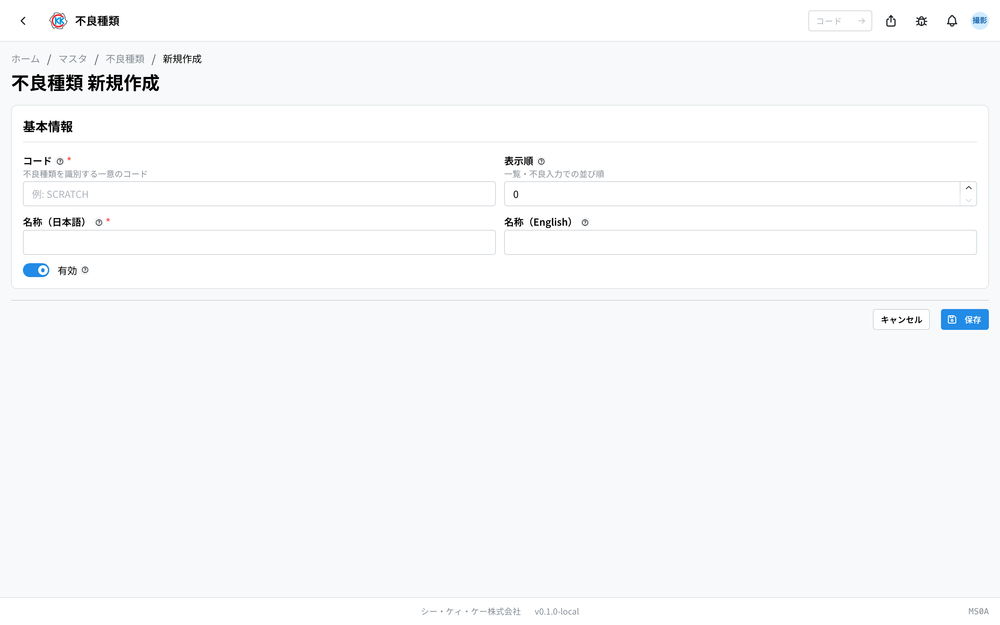
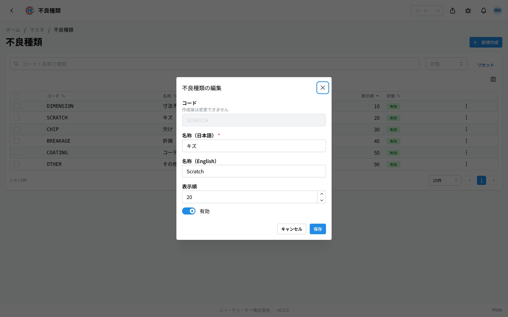
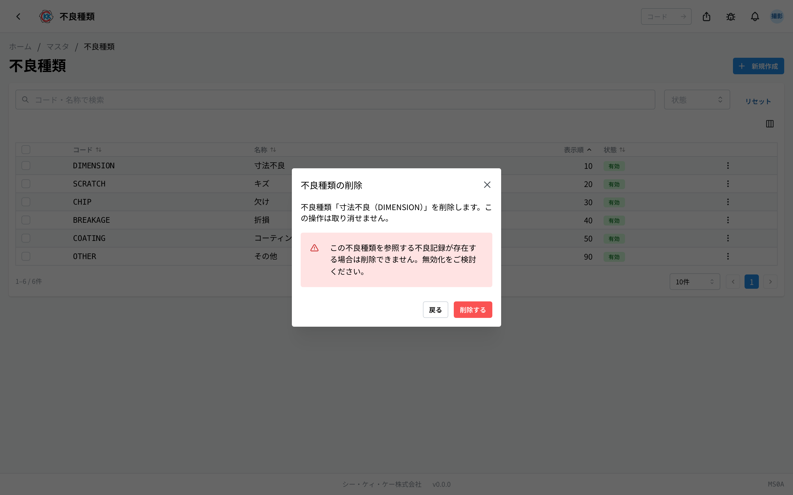

「キズ」「欠け」「寸法不良」など、不良が出たときに選ぶ **分類** を登録しておくアプリです。操作コードは `MS0A` です。

ここで登録した分類が、[指示書](/manual/ja/operations/production/work-order/user)の工程で不良を記録するときの選択肢になります。

> ⚠️ このアプリは試験公開中です。ご利用の環境によっては、まだ表示されないことがあります。

## このアプリでできること

- 不良の分類を登録できます。
- 現場の入力画面での **並び順** を決められます。よく使う分類を上に置けます。
- 使わなくなった分類を、記録を消さずに選択肢から外せます。

## 用語（このページで出てくる言葉）

- **不良種類** … 不良を分けるための名前です。「キズ」「欠け」のように、現場で使っている言い方を登録します。
- **表示順** … 一覧や現場の選択肢に出てくる順番です。数字が小さいほど上に出ます。
- **有効 / 無効** … 有効は選択肢に出る状態、無効は選択肢に出ない状態です。

## はじめる前に

- このアプリを使うには **マスタの権限** が必要です。
- よく使う分類（寸法不良・キズ・欠け・折損・コーティング不良・その他）は、はじめから登録されています。まず一覧を見て、同じものが無いかを確認してください。

## 画面の見かた

このアプリはコードと名称と並び順だけの小さなアプリなので、**詳しい画面はありません**。登録も変更も、この一覧の画面から行います。

- 一覧は **コード / 名称 / 表示順 / 状態** の順に並んでいます。
- ふだんは「**表示順**」の数字が小さいものから順に並びます。
- 上の「**コード・名称で検索**」の欄で、探している分類を絞り込めます。「**状態**」でも絞り込めます。
- 行をクリックすると、その場で **編集の小窓** が開きます（別の画面には移りません）。

## 分類を登録する

1. 一覧画面の右上にある「**新規作成**」を押します。
2. 「**コード**」に、この分類を表す文字を入れます（例 `SCRATCH`）。
3. 「**名称**」の日本語の欄に、現場で使っている言い方を入れます（例 キズ）。英語は空欄のままでも保存できます。
4. 「**表示順**」に数字を入れます。0 以上の整数が使えます。
5. 「**保存**」を押します。

保存すると一覧に戻ります。

> 💡 「**コード**」は、保存したあとは変えられません。編集の画面にも「**作成後は変更できません**」と表示されます。

## 名前や並び順を直す

1. 一覧で、直したい行をクリックします。
2. 「**不良種類の編集**」という小窓が開きます。
3. 「**名称（日本語）**」「**表示順**」「**有効**」を直します。
4. 「**保存**」を押します。

行の右にある「**…**」からも「**編集**」を開けます。

## 使わなくなった分類を外す

もう使わない分類は、消すのではなく **無効にする** のがおすすめです。無効にすると新しい記録では選べなくなり、これまでの記録はそのまま残ります。

1. 一覧で、その行の右にある「**…**」を押します。
2. 「**無効化**」を選びます。
3. 確認の小窓が出るので、「**無効化する**」を押します。

複数の行にチェックを入れて、「**一括無効化**」でまとめて外すこともできます。もう一度使いたくなったら、同じ手順で「**有効化**」を選びます。

本当に消したいときは、同じ「**…**」から「**削除**」を選びます。確認の小窓に「**この不良種類を参照する不良記録が存在する場合は削除できません。無効化をご検討ください。**」と出ます。消すと元には戻せません。

## よくある質問・困ったとき

**Q. 行をクリックしても、詳しい画面が開きません。**
A. このアプリには詳しい画面がありません。行をクリックすると編集の小窓が開くのが正しい動きです。

**Q. コードを間違えました。直せますか。**
A. 保存したあとは直せません。正しいコードで新しく登録し、間違えたほうを「無効化」してください。

**Q. 「不良種類の削除に失敗しました」と出て消せません。**
A. その分類を使った不良の記録が残っている可能性が高いです。記録を守るための仕組みなので、削除ではなく「無効化」してください。

**Q. 無効にした分類は、これまでの記録からも消えますか。**
A. 消えません。これまでの記録はそのまま残ります。これから新しく記録するときに選べなくなるだけです。

**Q. 現場の選択肢の並び順を変えたいです。**
A. 各分類の「**表示順**」の数字を変えてください。小さい数字ほど上に出ます。10・20・30 のように間隔をあけておくと、あとから間に足しやすくなります。

**Q.「表示順は整数で入力してください」と出ます。**
A. 表示順には小数点の付かない数（0、10、20 など）を入れてください。
