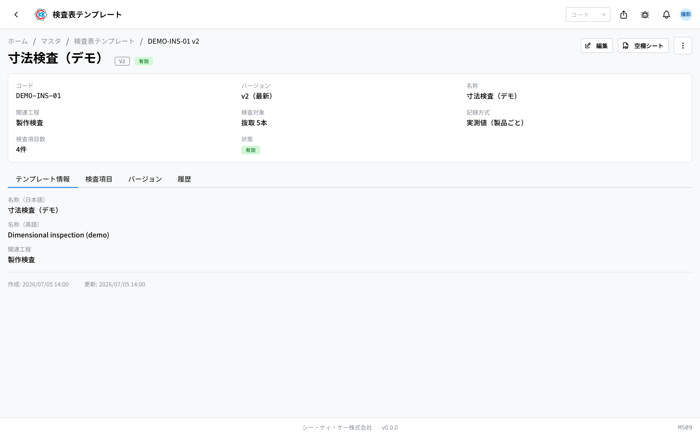
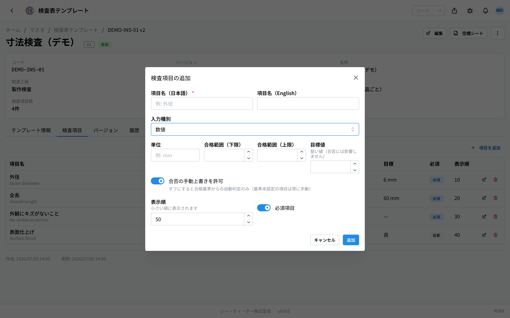
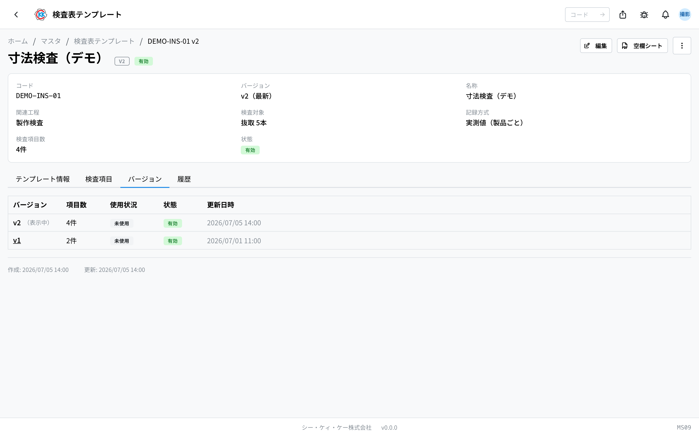

This app is for making a **template** of the inspection sheet, deciding in advance **what will be measured**. The operation code is `MS09`.

When you attach a template to a [指示書 (work order)](/manual/en/operations/production/work-order/user), the floor follows this template when entering the inspection record.

> ⚠️ This app is in trial release. Depending on your environment, it may not be shown yet.

## What you can do with this app

- You can make a template of the inspection sheet.
- You can line up **inspection items** inside the template (outer diameter, total length, whether there is a scratch, and so on).
- For each item you can decide the **pass rule**: "it passes if the value is between this and that". Once you set a pass rule, pass or fail is added by itself as soon as the floor enters a value.
- You can decide whether **the whole lot is inspected, or only a sample is taken**.
- You can print a **blank inspection sheet PDF** for writing by hand.

## Words used on this page

- **Inspection sheet template** … the template of an inspection sheet. You attach it to a work order to say "please inspect using this template".
- **Inspection item** … one line inside the template. It stands for one thing to check, such as "measure the outer diameter" or "look for scratches".
- **Pass rule** … the condition for judging something as a pass. For a number, you set something like "it passes if it is between 5.98 and 6.02 mm".
- **Sampling** … taking out only a part instead of everything made, and inspecting that. On this screen you set it in 「**検査対象**」 (what is inspected).
- **Version** … an edition of the template. When you change the content, you keep the current edition as it is and make a new edition.

## Before you start

- You need the **master permission** to use this app.
- If you want to link the template to an inspection step, the inspection step must first be registered in the [process step master (工程マスタ)](/manual/en/operations/masters/process-step/user).

## How to read the screen

When you open the app, a list of the registered templates is shown.

- The list columns are **コード** (code) / **Ver** (version) / **名称** (name) / **関連工程** (related step) / **項目数** (number of items) / **状態** (status).
- The 「**Ver**」 column shows the number of the newest edition, for example `v2`. When older editions also exist, the number of editions is shown too, such as 「全2」 (2 in total).
- Use the 「**コード・名称・関連工程で検索**」 (search by code, name or related step) box at the top to narrow down to the template you are looking for.
- Click a row to open the detail screen of that template.

## Make a template

1. Press 「**新規作成**」 (New) at the top right of the list screen.
2. Enter text that stands for this template in 「**コード**」 (code), for example `INSP-DIM-01`. Letters, numbers, hyphens and underscores can be used.
3. Enter the name of the inspection sheet in the Japanese box of 「**名称**」 (name), for example 寸法検査 (dimension inspection).
4. Type a step name in the 「**関連工程**」 (related step) box and choose the inspection step where this template is normally used. You can save with it left empty.
5. In 「**検査対象**」 (what is inspected), choose how many pieces are inspected. See the explanation below.
6. Choose 「**記録方式**」 (recording method). See the explanation below.
7. Press 「**保存**」 (Save).

You do not enter the inspection items on this form. When you save, the detail screen opens, and you add them there.

> 💡 「**コード**」 (code) cannot be changed after you save. The name and the inspection items can be corrected later.

### 検査対象 (what is inspected — how many pieces)

- **全数** (all) … every piece made is inspected.
- **割合(%)** (percentage) … only the set percentage of pieces is taken out and inspected. For example, 10 % means 10 out of 100 pieces.
- **本数** (fixed count) … only the set number of pieces is taken out and inspected, for example 5 pieces.

When you choose 「割合(%)」 (percentage) or 「本数」 (fixed count), a box for the number appears on the right. The screen also says 「**全数 = ロット全数 / 割合・本数 = 一部を抜き取って検査**」 (all = the whole lot; percentage or fixed count = take a sample and inspect it).

### 記録方式 (recording method — how it is recorded)

- **実測値（製品ごと）** (measured values, per piece) … the values of all items are recorded one piece at a time. Choose this when you want to keep the numbers you actually measured.
- **合格数のみ** (pass count only) … for each item, only "how many were inspected and how many passed" is recorded. The numbers themselves are not kept.

When you save, the detail screen for that template opens. Near the top, 「**コード**」 (code), 「**バージョン**」 (version), 「**名称**」 (name), 「**関連工程**」 (related process), 「**検査対象**」 (what is inspected), 「**記録方式**」 (recording method), 「**検査項目数**」 (number of inspection items) and 「**状態**」 (status) are shown together, so you can check here what you decided. Below them are the tabs 「**テンプレート情報**」 (template information), 「**検査項目**」 (inspection items), 「**バージョン**」 (versions) and 「**履歴**」 (history).

## Add inspection items

On the detail screen that opens after saving, open the 「**検査項目**」 (inspection items) tab.

1. Press 「**項目を追加**」 (Add item).
2. Enter what is being checked in 「**項目名（日本語）**」 (item name, Japanese), for example 外径 (outer diameter).
3. In 「**入力種別**」 (input type), choose what the floor enters.
   - **数値** (number) … a number is entered, for example 6.01.
   - **真偽（はい/いいえ）** (yes/no) … 「はい」 (yes) or 「いいえ」 (no) is chosen.
   - **単一選択** (single choice) … one option is chosen from the ones you prepared.
   - **複数選択** (multiple choice) … any number of options can be chosen from the ones you prepared.
4. Enter the pass rule that matches the type you chose. See the explanation below.
5. Check 「**表示順**」 (display order). A number is filled in by itself each time you add an item, so you can normally leave it as it is.
6. For an item that must always be filled in, leave 「**必須項目**」 (required item) turned on.
7. Press 「**保存**」 (Save).

The items you registered are listed in a table. The columns are **項目名** (item name) / **種別** (type) / **合格基準** (pass rule) / **目標** (target) / **必須** (required) / **表示順** (display order). Use the icons at the right of a row to edit or delete it.

### How to set the pass rule

What you enter changes with the type.

- **数値** (number) … enter 「**単位**」 (unit), for example mm, and 「**合格範囲（下限）**」 (pass range, lower limit) and 「**合格範囲（上限）**」 (pass range, upper limit). Only one of the two is also fine. If the entered number is inside this range, it becomes a pass by itself.
- **真偽（はい/いいえ）** (yes/no) … choose which answer counts as a pass.
- **単一選択 / 複数選択** (single choice / multiple choice) … first register the options, then choose 「**合格とする選択肢**」 (the options that count as a pass).

「**目標値**」 (target value) and 「**目標（任意）**」 (target, optional) are boxes for writing down the value you are aiming at. As the screen says, 「**狙い値（合否には影響しません）**」 (aim value; it does not affect pass or fail), they have nothing to do with passing or failing.

> 💡 If you save without setting a pass rule, that item is not judged by itself, and the floor chooses pass or fail on their own. If you turn off 「**合否の手動上書きを許可**」 (allow manual override of pass/fail), only the automatic judgement is used, and 「上書き不可」 (override not allowed) is shown in the list.

## Change the content (make a new version)

Once a template has been used even once on a work order or in an inspection record, its content can no longer be changed. This is so that the content of an inspection already done does not change afterwards. For a template in this state, the 「**編集**」 (Edit) button is no longer shown on the detail screen.

When you want to change the content, make a new version.

1. Press 「**…**」 (the three-dot button) at the top right of the detail screen.
2. Choose 「**新バージョンを作成**」 (Create new version).
3. A small confirmation window appears. Read it and press 「**新バージョンを作成**」 (Create new version).

A new edition (v2, v3 …) is made with the current inspection items copied into it. The work orders and inspection records made so far stay on the earlier edition and do not change.

Open the 「**バージョン**」 (versions) tab and all editions so far are listed. The edition you are looking at is marked 「（表示中）」 (now showing). The 「使用状況」 (usage) column tells you whether that edition is in use (使用中 = in use / 未使用 = not used).

## Print an inspection sheet for writing by hand

Press 「**空欄シート**」 (Blank sheet) at the top right of the detail screen and a blank PDF with only the inspection items lined up is produced. You can print it when you want to write by hand on the floor.

## Questions and problems

**Q. I cannot find the 「編集」 (Edit) button.**
A. That edition is already used on a work order or in an inspection record, so it cannot be changed. Choose 「**新バージョンを作成**」 (Create new version) from 「**…**」 and make your correction on the new edition.

**Q. I see 「このバージョンは指示書または検査記録で使用中のため変更できません。新バージョンを作成してください」 (this version cannot be changed because it is in use on a work order or inspection record; please create a new version).**
A. The reason is the same as above. Make a new version and then correct it.

**Q. I see 「合格範囲の上限は下限以上にしてください」 (the upper limit of the pass range must be the same as or larger than the lower limit).**
A. The upper number is smaller than the lower number. Make the upper one the larger number, for example lower 5.98 and upper 6.02.

**Q. I see 「選択肢を 1 つ以上登録してください」 (please register at least one option).**
A. For 「単一選択」 (single choice) and 「複数選択」 (multiple choice) items, you must register the options first. Make the options with 「追加」 (Add) and then save.

**Q. I entered a number, but pass or fail is not added by itself.**
A. That item may have no pass range. Edit the item and enter 「合格範囲（下限）」 (pass range, lower limit) and 「合格範囲（上限）」 (pass range, upper limit).

**Q. I entered a target value, but the judgement did not change.**
A. That is normal. The target value is only a box for writing down the value you are aiming at, and it has nothing to do with passing or failing.

**Q. I cannot delete a template.**
A. It cannot be deleted while there is a work order or inspection record using that edition. For a template you no longer use, choose 「**無効化**」 (Deactivate) instead of deleting. Once it is inactive it can no longer be chosen on new work orders, and the past records stay as they are.
