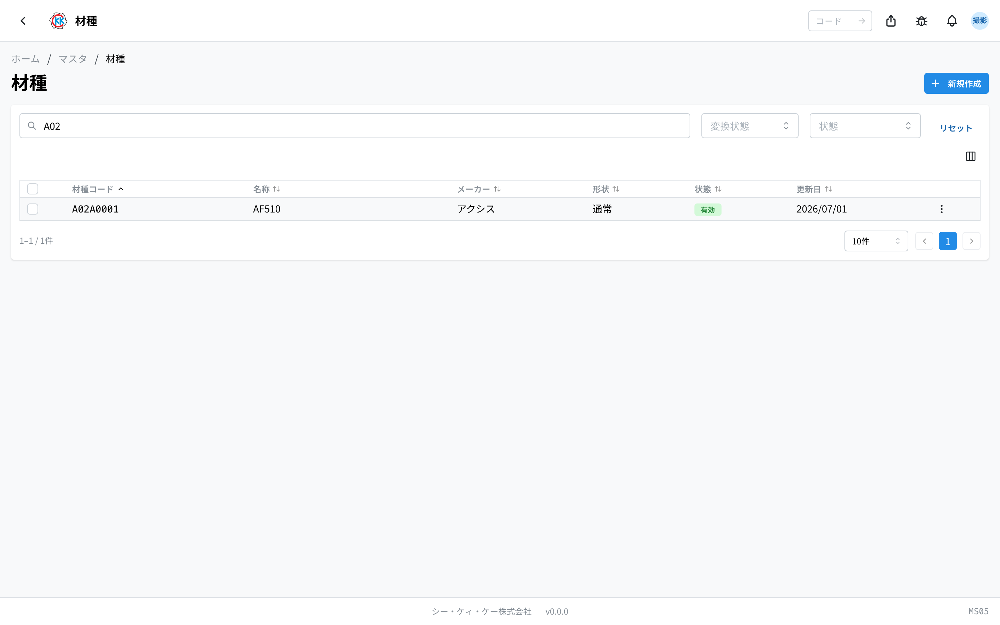
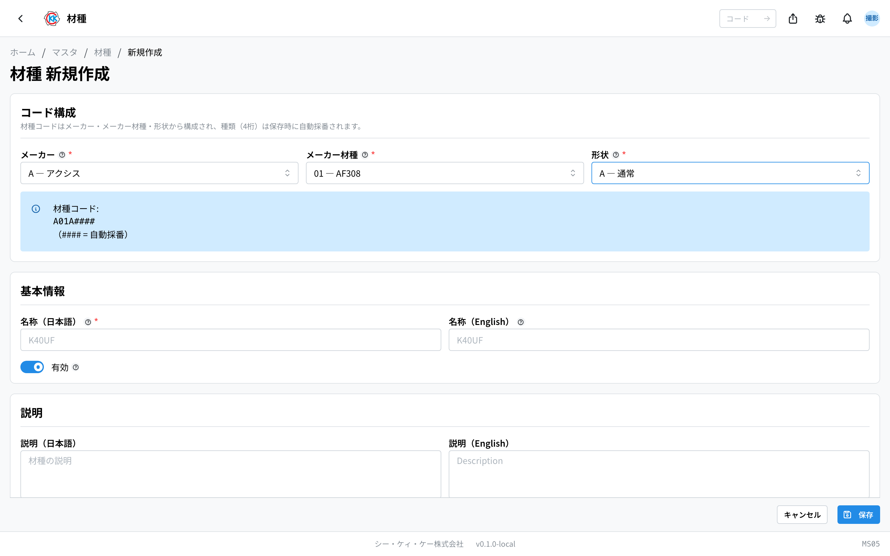

材料の種類を登録しておく台帳です。操作コードは `MS05` です。

「どのメーカーの、どんな材料か」をここに登録します。**材種が登録されていないと、[製品](/manual/ja/operations/masters/product/user)にも[素材](/manual/ja/operations/masters/material/user)にも材料を指定できません。** また[試算](/manual/ja/operations/sales/trial-estimate/user)の材料代も計算できません。

## このアプリでできること

- 材料の種類を登録できます。
- 登録すると、製品・素材・試算で選べるようになります。
- 材種ごとに、太さ・表面の仕上げ別の **標準の値段** を登録できます。
- その材種を使っている素材の一覧を確認できます。

## 用語（このページで出てくる言葉）

- **材種（ざいしゅ）** … 材料の種類のことです。「アクシス社の AF510 の丸材」といった単位です。
- **材種コード** … 材種ごとに 1 つ付く 8 文字の番号です。登録した内容から自動で組み立てられます。
- **メーカー材種** … そのメーカーの中での材料のグレード名です（AF510、K40UF など）。
- **形状** … 材料の形です（通常 / OH / 円筒）。
- **黒皮（くろかわ）/ 研磨（けんま）** … 材料の表面の仕上げの区分です。
- **既定単価（きていたんか）** … その材種の標準の値段です。

## はじめる前に

このアプリを使うには **マスタ権限** が必要です。画面が開かないときは、管理者にご相談ください。

材種を登録するには、先に **メーカー・メーカー材種・形状** が[採番構成](/manual/ja/operations/masters/material-numbering/user)に登録されている必要があります。選びたいメーカーが出てこないときは、先にそちらで登録してください。

## 材種コードのしくみ

材種コードは、4 つの部品を左から順につなげた **8 文字** です。ひとつずつ入力するのではなく、**選んだ内容から自動で組み立てられます**。

たとえば `A02A0001` は次のように読みます。

| 場所 | 見た目 | 意味 |
|---|---|---|
| はじめの 1 文字 | `A` | メーカー（この場合はアクシス） |
| 次の 2 文字 | `02` | メーカー材種（この場合は AF510） |
| 次の 1 文字 | `A` | 形状（この場合は通常） |
| 最後の 4 文字 | `0001` | 通し番号（**自動で付きます**） |

最後の 4 文字は、同じメーカー・同じ材種・同じ形状の中での通し番号です。**自分で決める必要はありません。** 保存すると自動で付きます。

## 画面の見かた

アプリを開くと、登録済みの材種の一覧が表示されます。

- **材種コード** … 8 文字の番号です。
- **メーカー / 形状** … 選んだ内容が表示されます。
- **状態** … 緑の「**有効**」は今も使える材種、灰色の「**無効**」はもう選べない材種です。
- 上の検索欄（「**材種コード・名称で検索**」）で絞り込めます。
- 行をクリックすると、その材種の詳しい画面が開きます。

> 💡 古いシステムから取り込んだ材種には、コードがまだ付いていないものがあります。その行には灰色で「**未変換**」と表示されます。名称などは直せますが、**[素材](/manual/ja/operations/masters/material/user)を作るときには選べません。** 「**変換状態**」の欄で「未変換」を選ぶと、そういう材種だけを表示できます。

## 材種を登録する

1. 一覧画面の右上にある「**新規作成**」を押します。
2. 「**メーカー**」を選びます。
3. 「**メーカー材種**」を選びます。**先にメーカーを選ぶまで、この欄は選べません。**
4. 「**形状**」を選びます。
5. 青い帯に「**材種コード:**」と、できあがるコードが表示されます。最後の 4 文字は `####` と出ますが、保存すると本当の番号に変わります。
6. 「**名称（日本語）**」に材種の名前を入れます（例：AF510）。**ここは必ず入力してください。**
7. 必要なら「**説明（日本語）**」に補足を書きます。
8. 「**保存**」を押します。

> ⚠️ **メーカー・メーカー材種・形状は、保存したあとは変えられません。** コードの一部になっているためです。選び間違えたときは、新しく登録し直してください。

## 登録した内容を見る

保存した材種の画面には、4 つのタブがあります。

- **概要** … 説明（日本語・英語）です。
- **既定単価** … 太さ・表面仕上げ別の標準の値段です。
- **関連** … この材種を使っている素材の一覧です。クリックするとその素材が開きます。
- **履歴** … いつ誰がこの登録内容を変えたかの記録です。

名前や説明を直したいときは、画面右上の「**編集**」を押します。**編集できるのは名称・説明・有効の 3 つだけです。**

## 標準の値段を登録する

材料の仕入れ実績がまだ無いとき、[試算](/manual/ja/operations/sales/trial-estimate/user)の材料代はここに登録した値段を使います。**ここが空だと、試算で材料代が出せません。**

1. 材種の画面で「**既定単価**」タブを開きます。
2. 「**直径を追加**」を押します。行が 1 つ増えます。
3. 追加された行の「**直径**」の欄で、太さを選びます。
4. 表面仕上げごとの欄（「黒皮」「研磨」）に、値段を入れます。
5. 太さを増やしたいときは、また「**直径を追加**」を押します。
6. 最後に「**既定単価を保存**」を押します。

> 💡 ここに入れる値段は **1000mm あたりの金額** です。画面の上にも「¥/1000mm」と書かれています。
> 全長 330mm の材料 1 本の値段ではないことにご注意ください。

> 💡 値段が決まっていない組み合わせは、**空欄のままにしてください**。空欄は「値段なし」の扱いになります。

いらなくなった行は「**行を削除**」で消してから、「既定単価を保存」を押します。

## 使わなくなった材種の扱い

その材種を使わなくなっても、**削除しないでください**。その材種でつくった素材や製品が参照しているためです。代わりに「無効」にします。

1. 材種の画面の右上にあるメニュー（点が 3 つのボタン）を押します。
2. 「**無効化**」を選びます。
3. 確認の画面で「**無効化する**」を押します。

無効にすると新しい素材の登録では選べなくなりますが、**過去のデータはそのまま残ります**。

## 入力項目

材種の登録画面で入力する項目の一覧です。材種コードは、下の 4 つの選択から**自動で組み立てられます**。

| 項目 | 必須 | 何を入れるか |
|------|------|-------------|
| [メーカー](#field-manufacturer) | 必須 | 材料のメーカー |
| [メーカー材種](#field-grade) | 必須 | そのメーカーの中での材質 |
| [形状](#field-shape) | 必須 | 通常・OH・円筒 など |
| [種類（自動採番）](#field-kind) | 自動 | 上の 3 つの中での連番 |
| [名称](#field-name) | 必須 | 材種の名前 |
| [説明（日本語 / English）](#field-description) | 任意 | 補足 |
| [有効](#field-active) | — | 選択肢に出すかどうか |

### メーカー [#field-manufacturer]

材料のメーカーです。選択肢は[採番構成](/manual/ja/operations/masters/material-numbering/user)で登録します。

### メーカー材種 [#field-grade]

そのメーカーの中での材質です。メーカーを選ぶと、そのメーカーの材質だけが出ます。

### 形状 [#field-shape]

通常・OH・円筒などの形状です。

### 種類（自動採番）[#field-kind]

メーカー・材質・形状の組み合わせの中での連番です。**自動で決まります。**

### 名称 [#field-name]

材種の名前です。素材や製品の画面でこの名前が出ます。

### 説明（日本語 / English）[#field-description]

補足です。両方の言語で入れておくと、英語表示のときにも読めます。

### 有効 [#field-active]

外すと、素材や製品の材種の選択肢に出なくなります。

## よくある質問・困ったとき

**Q.「メーカー材種」の欄が灰色で選べません。**
A. まず「メーカー」を選んでください。欄には「先にメーカーを選択」と表示されています。メーカーを選ぶと、そのメーカーの材種だけが出てきます。

**Q.「名称（日本語）を入力してください」と出て保存できません。**
A. 名称の日本語欄が空です。材種の名前（例：AF510）を入れてから、もう一度「保存」を押してください。

**Q. 編集画面でメーカーや形状を直せません。**
A. 直せない仕組みです。これらはコードの一部になっているため、保存後は変えられません。画面にも「コード構成は作成後変更できません。」と出ています。選び間違えたときは、新しく登録し直してください。

**Q. 削除しようとしたら「この材種に紐づく素材が存在するため削除できません。無効化を検討してください。」と出ます。**
A. その材種でつくった素材が既にあるため、消せません。これは正常な動きです。「無効化」を使ってください。

**Q. 既定単価を保存しようとしたら「同一の直径 × 黒皮/研磨 の行が重複しています」と出ます。**
A. 同じ太さの行を 2 つ作ってしまっています。どちらか一方を「行を削除」で消してから、もう一度保存してください。

**Q.「採番が競合しました。再度お試しください」と出ます。**
A. ほかの方が同時に同じ種類の材種を登録したときに出ます。そのままもう一度「保存」を押してください。

**Q. 一覧に「未変換」と出ている材種は使えますか。**
A. 名称などは直せますが、**素材を作るときには選べません**。素材で使いたいときは、この画面から新しく登録し直してください。
