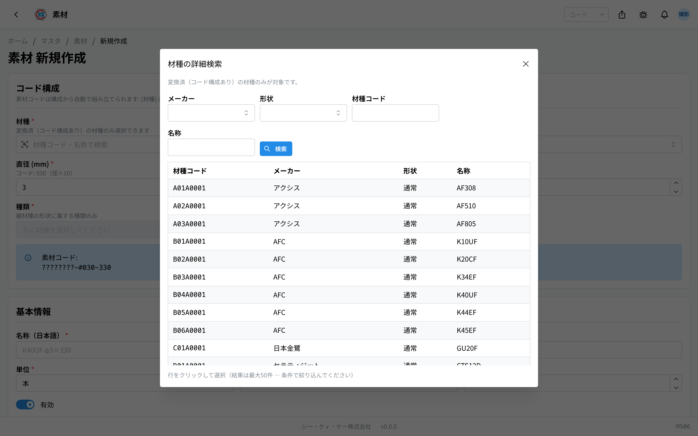
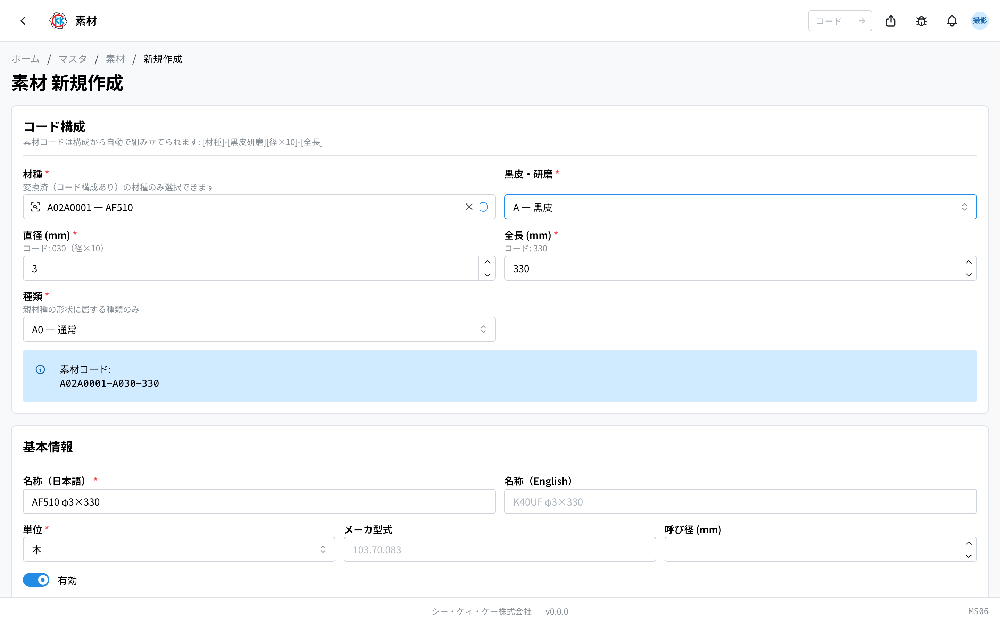
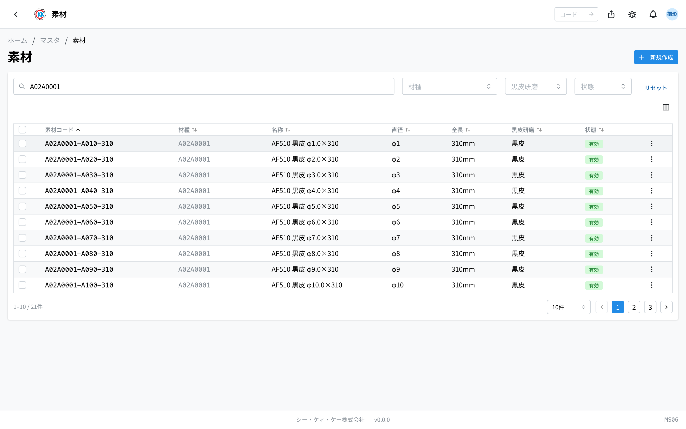

这是用于逐一登记采购并库存的材料棒的台账。操作码是 `MS06`。

如果说[材种](/manual/zh/operations/masters/material-type/user)表示「是什么样的材料」，那么「素材」（材料）就是 **「该材种中，这个直径、这个长度、这种表面处理的那一根」**，也就是实际买回来放在货架上的那一根。没有在这里登记的材料，在[材料订购单](/manual/zh/operations/purchasing/purchase-order/user)和[库存管理（材料・在制品）](/manual/zh/operations/production/material-inventory/user)中 **无法选择**。

> ⚠️ 本应用目前 **仅在开发环境（测试用环境）** 中可用。在正式投入使用之前，画面和操作步骤可能会有变化。

## 本应用可以做什么

- 可以按直径、长度、表面处理登记要采购的材料棒。
- 登记后，就可以在材料的采购、入库、库存画面中选择。
- 材料代码会 **由所选内容自动组合而成**，不需要手动输入。
- 不再采购的材料不要删除，可以设为 **無効**（无效）。

## 本页出现的词语

- **素材（材料）** … 实际采购并库存的材料棒。
- **材種（材种）** … 材料的种类，相当于材料的「上级」（在[材种](/manual/zh/operations/masters/material-type/user)中登记）。
- **黒皮 / 研磨（黑皮 / 研磨）** … 材料表面处理的区分。
- **種類（种类）** … 按形状细分的类别。普通圆棒材会自动确定。
- **メーカ型式（厂商型号）** … 厂商给出的品号。
- **呼び径（公称直径）** … 样本目录等使用的大致直径。

## 开始之前

要登记材料，必须先 **登记好[材种](/manual/zh/operations/masters/material-type/user)**。材料一定隶属于某一个材种。

另外，使用本应用需要 **主数据权限**。画面打不开时，请咨询管理员。

另请注意，[产品](/manual/zh/operations/masters/product/user)是以「材种 + 直径 + 全长」来指定材料的。**产品并不会与某个特定的材料绑定。** 本台账只用于采购和库存。

## 材料代码的构成

材料代码是在材种代码后面接上 **表面处理・直径・长度** 的形式。不需要一个一个输入，而是 **由所选的内容自动组合而成**。

例如 `A02A0001-A080-310` 可以这样解读。

| 位置 | 显示 | 含义 |
|---|---|---|
| 开头 8 位 | `A02A0001` | 材种代码（上级材种） |
| 连字符后 1 位 | `A` | 表面处理（此处为黑皮） |
| 接下来 3 位 | `080` | 直径 8.0mm |
| 最后 3 位 | `310` | 全长 310mm |

直径填入的是 **乘以 10 后的数字**。8.0mm 是 `080`，12.5mm 是 `125`。输入栏下方也会显示换算后的数字，不需要自己计算。

## 界面说明

打开应用后，会显示已登记材料的列表。

- **素材コード（材料代码）** … 用连字符连接起来的编号。
- **材種 / 直径 / 全長 / 黒皮研磨（材种 / 直径 / 全长 / 黑皮研磨）** … 该材料的内容会分列显示。
- **状態（状态）** … 绿色的「**有効**」（有效）表示现在还能使用的材料，灰色的「**無効**」（无效）表示已经不能选择的材料。
- 通过上方的搜索栏（「**素材コード・名称で検索**」／按材料代码・名称搜索）可以筛选。
- 在「**材種**」（材种）、「**黒皮研磨**」（黑皮研磨）栏中，可以只显示特定材种或特定表面处理的材料。
- 点击某一行，即可打开该材料的详情画面。

## 登记材料

### 选择上级材种

1. 点击列表画面右上角的「**新規作成**」（新建）。
2. 点击「**材種**」（材种）栏，输入材种名称或材种代码。
3. 从出现的候选中选择。

想不起材种名称时，请点击栏位左侧的 **放大镜按钮**。会打开名为「材種の詳細検索」（材种详细搜索）的画面，可以按厂商或形状筛选查找。

### 输入直径、长度和表面处理

4. 选择「**黒皮・研磨**」（黑皮・研磨）。
5. 在「**直径 (mm)**」（直径・毫米）中输入粗细（0.1 到 99.9）。
6. 在「**全長 (mm)**」（全长・毫米）中输入长度（1 到 999）。
7. 选择「**種類**」（种类）。普通圆棒材时会自动选好。
8. 蓝色提示条上会显示「**素材コード:**」（材料代码）以及将要生成的代码。

### 确认名称和单位后保存

9. 「**名称（日本語）**」（名称・日文）会以「材种名 φ直径×全长」的形式 **自动填入**。保持原样也可以，改写也可以。
10. 确认「**単位**」（单位）（通常是「本」）。
11. 「**メーカ型式**」（厂商型号）、「**呼び径 (mm)**」（公称直径・毫米）、「**備考**」（备注）在知道的范围内填写即可（留空也能保存）。
12. 点击「**保存**」（保存）。

> ⚠️ **材种、黑皮研磨、直径、全长、种类在保存后无法更改**，因为它们是代码的一部分。填错时，请重新登记一个新的材料。

> ⚠️ 直径、长度、表面处理完全相同的材料，无法登记两条。请使用已有的材料。

## 查看已登记的内容

保存后的材料画面有 3 个标签。

画面上方会依次显示材料代码、材种、黑皮研磨、直径、全长、种类、公称直径、厂商型号、单位。

- **概要**（概要）… 名称（日文・英文）和备注。
- **関連**（关联）… 关于与产品之间关系的说明。
- **履歴**（历史）… 何时、由谁修改过本登记内容的记录。

想修改内容时，请点击画面右上角的「**編集**」（编辑）。**可以修改的是名称、单位、厂商型号、公称直径、有效、备注。**

## 不再采购的材料如何处理

即使不再采购该材料，也 **请不要删除**。因为过去的采购和库存记录仍然引用着该材料。请改为设成「無効」（无效）。

1. 点击材料画面右上角的菜单（三个点的按钮）。
2. 选择「**無効化**」（停用）。
3. 在确认画面点击「**無効化する**」（确定停用）。

设为无效后，新的采购单和指示书中就无法再选择它，但是 **过去的数据会原样保留**。

## 输入项

材料登记画面的输入项一览。材料编码由材种与下列 3 项**自动组合而成**。

| 项目 | 必填 | 填什么 |
|------|------|--------|
| [材种](#field-material-type) | 必填 | 作为基础的材种 |
| [黑皮・研磨](#field-surface-finish) | 必填 | 表面状态 |
| [直径 (mm) / 全长 (mm)](#field-dimensions) | 必填 | 材料的尺寸 |
| [种类](#field-kind) | 必填 | 各形状对应的种类 |
| [材料编码](#field-code) | 自动 | 由上述组合决定 |
| [名称](#field-name) | 必填 | 材料的名称 |
| [单位](#field-unit) | 必填 | 支・kg 等 |
| [厂商型号 / 公称直径 (mm)](#field-model) | 选填 | 厂商型号与公称直径 |
| [「キーワード」（关键词）](#field-keywords) | 任意 | 该素材的其他叫法（用于检索和 AI 导入） |
| [有效](#field-active) | — | 是否出现在选项中 |
| [备注](#field-notes) | 选填 | 补充说明 |

### 材种 [#field-material-type]

作为基础的材种。请先登记[材种](/manual/zh/operations/masters/material-type/user)。

### 黑皮・研磨 [#field-surface-finish]

表面状态。**可选黑皮・研磨・已研磨黑皮。** 在试算中，该差异会改变材料单价。

### 直径 (mm) / 全长 (mm) [#field-dimensions]

材料的尺寸。这两项构成材料编码的一部分。

### 种类 [#field-kind]

各形状所定义的种类（如 OH 的 CH・2V30 等）。

### 材料编码 [#field-code]

由材种・表面・直径・全长的组合决定。**由系统自动组合。**

### 名称 [#field-name]

材料的名称，会显示在采购与到货画面。

### 单位 [#field-unit]

计数单位，作为采购与到货的默认单位。

### 厂商型号 / 公称直径 (mm) [#field-model]

厂商的型号与公称直径，用于采购时向对方说明。

### 「キーワード」（关键词） [#field-keywords]

该素材的**其他叫法**：简称、读音（平假名・片假名）、英文、尺寸的其他写法（φ8.3 / 8.3mm）等，凡是与登记名称写法不同的都可以填。

登记之后有两个好处。

1. **能搜到** — 在列表的搜索框里输入这些词也能找到它。
2. **能自动匹配** — 读取收到的单据时，可以判断上面写的名字就是这个素材。

点击「**AI で候補を出す**」（用 AI 生成候选），系统会根据当前已输入的内容（名称、材种・尺寸・厂商型号等）生成候选。**只有点过的候选才会加入，保存之前不会登记** — 请确认后只挑选合适的。

同一个词如果同时挂在两个素材上，就无法判断是哪一个。请使用**只指向这个素材**的词。

### 有效 [#field-active]

取消后，采购与到货的材料选项中将不再显示。

### 备注 [#field-notes]

补充说明。写下决定的理由或注意事项，有助于日后查阅的人了解来龙去脉。

## 常见问题与故障处理

**Q. 出现「同一構成（材種 × 黒皮研磨 × 直径 × 全長）の素材が既に存在します」（相同构成・材种 × 黑皮研磨 × 直径 × 全长 的材料已存在），无法保存。**
A. 完全相同组合的材料已经登记过了。请在列表中找到该材料使用，不需要新建。

**Q. 出现「未変換（レガシー）の材種では素材を作成できません。変換済の材種を選択してください。」（无法用未转换・旧数据的材种创建材料。请选择已转换的材种）。**
A. 所选材种还没有代码。请在[材种](/manual/zh/operations/masters/material-type/user)画面重新登记后，再选择那个材种。

**Q. 在材种栏中输入后，找不到想用的材种。**
A. 只有带代码的材种才能选择。栏位下方也会显示「変換済（コード構成あり）の材種のみ選択できます」（仅可选择已转换・具有代码结构的材种）。请在[材种](/manual/zh/operations/masters/material-type/user)画面重新登记。

**Q.「種類」（种类）栏是灰色的，无法选择。**
A. 请先选择「材種」（材种）。栏位上会显示「先に材種を選択してください」（请先选择材种）。

**Q. 出现「直径は 0.1〜99.9mm で入力してください」（直径请输入 0.1〜99.9mm）。**
A. 直径请填写 0.1 到 99.9 之间的数值。全长的范围是 1 到 999。

**Q. 在编辑画面中无法修改直径或全长。**
A. 这是系统的限制。它们是代码的一部分，保存后无法更改。填错时，请重新登记一个新的材料。

**Q. 尝试删除时出现「関連するデータが存在するため実行できません」（存在关联数据，因此无法执行）。**
A. 因为已经存在使用该材料的采购或库存记录，所以无法删除。这是正常现象。请使用「無効化」（停用）。
