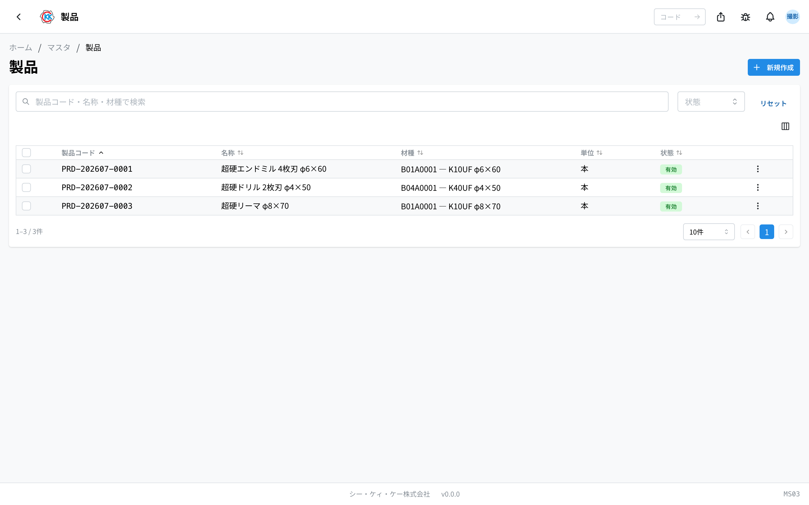
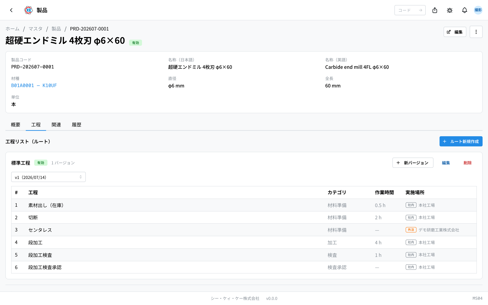
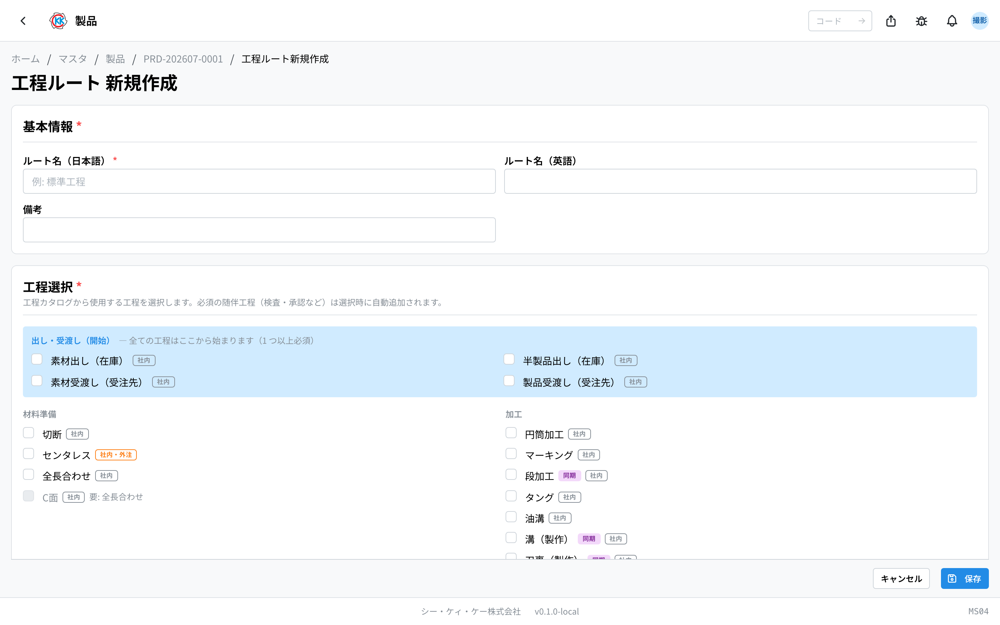

这是用于登记本公司生产的产品的台账。操作码是 `MS04`。

**如果没有登记产品，就无法制作[试算](/manual/zh/operations/sales/trial-estimate/user)、[价格表](/manual/zh/operations/sales/price-list/user)和[报价单](/manual/zh/operations/sales/quote/user)。** 有新产品的业务时，请先在本画面登记。

## 本应用可以做什么

- 可以登记本公司生产的产品。
- 登记后，就可以在试算、价格表、报价单的「製品」（产品）栏中选择。
- 可以记录该产品 **用什么材料制作**（材种、直径、长度）。
- 可以记录硬度、公差等每个产品的规定。
- 可以登记制作该产品时的 **工序顺序**。
- 相似的产品可以 **复制**，只修改需要变更的地方后登记。

## 本页出现的词语

- **製品コード（产品代码）** … 每个产品一个的管理编号，以 `PRD-` 开头。保存时自动生成。
- **材種（材种）** … 材料的种类，表示是哪家厂商的、什么样的材料（在[材种](/manual/zh/operations/masters/material-type/user)中登记）。
- **単位（单位）** … 数量的计数方式（本・個・kg・m・セット）。
- **製品種別（产品种别）** … 像「標準品」（标准品）、「コーティング品」（涂层品）那样，按产品类型整理好的一组输入栏。
- **仕様（规格）** … 硬度、公差、图号等该产品的规定。
- **工程リスト（ルート）（工序清单・路线）** … 制作该产品时的工序顺序。

## 开始之前

要登记产品，必须先 **登记好[材种](/manual/zh/operations/masters/material-type/user)**。材种用于选择「使用什么材料」的栏位。

不选材种也可以登记产品，但之后做[试算](/manual/zh/operations/sales/trial-estimate/user)时就算不出材料费。建议尽量把材种也一并填写。

## 界面说明

打开应用后，会显示已登记产品的列表。

- **製品コード（产品代码）** … 以 `PRD-` 开头的管理编号，由系统自动生成。
- **材種（材种）** … 以「材种代码 — 材种名 φ直径×全长」的形式，显示该产品用什么材料制作。未确定材料的产品显示「—」。
- **状態（状态）** … 绿色的「**有効**」（有效）表示现在还能使用的产品，灰色的「**無効**」（无效）表示已经不能选择的产品。
- 上方的搜索栏（「**製品コード・名称・材種で検索**」／按产品代码・名称・材种搜索）不仅可以按产品名称搜索，**还可以按材种搜索**。
- 点击某一行，即可打开该产品的详情画面。

> 💡 从旧系统导入的产品中，有些没有产品代码。这些行会以灰色显示「**未採番**」（未编号）。可以照常使用。

## 登记产品

### 输入名称和单位

1. 点击列表画面右上角的「**新規作成**」（新建）。
2. 在「**名称（日本語）**」（名称・日文）中输入产品名称。**这一栏必须填写。**
3. 选择「**単位**」（单位）。**这一项也必须选择**（通常是「本」）。

### 指定材料

4. 点击「**素材仕様**」（材料规格）中的「**材種**」（材种）栏，输入材种名称或材种代码。
5. 从出现的候选中选择要使用的材种。
6. 在「**直径 (mm)**」（直径・毫米）中输入材料的粗细。
7. 在「**全長 (mm)**」（全长・毫米）中输入材料的长度。
8. 点击「**保存**」（保存）。

> 💡 输入直径或全长后，栏位下方会出现 3 位数字（例如直径 6.0mm 时显示「060」）。这是系统自动生成的编号，无需在意。

> ⚠️ 选择了材种时，直径和全长也 **必须填写**。只填其中一项无法保存。

> ⚠️ 「**製品コード**」（产品代码）栏无法输入。正如画面上显示的「保存時に自動採番」（保存时自动编号），保存后会自动生成 `PRD-202607-0001` 这样的编号。

### 输入每个产品的规定（可选）

有「**製品種別**」（产品种别）栏时，可从「標準品」（标准品）、「コーティング品」（涂层品）等中选择。选择后，该类别中预先设定的输入栏（表面处理、硬度、公差等）会显示在下方。

想再增加栏位时，请从「**追加項目**」（追加项目）的「**項目を追加**」（添加项目）中选择。**不能创建自定义名称的栏位**，只能从预先准备好的项目中选择。要删除已添加的栏位时，请点击该行的「−」按钮。

> 💡 可选择的项目和类别由管理员设定。没有需要的项目时，请咨询[产品种别](/manual/zh/operations/system/product-type/settings)的负责人。

## 查看已登记的内容

保存后的产品画面有 4 个标签。

- **概要**（概要）… 产品种别、规格（项目与数值的表格）、备注。
- **工程**（工序）… 制作该产品的工序顺序。
- **関連**（关联）… 按客户列出该产品的价格表。点击即可打开对应的价格表。
- **履歴**（历史）… 何时、由谁修改过本登记内容的记录。

想修改内容时，请点击画面右上角的「**編集**」（编辑）。

## 登记工序顺序

在「工程」（工序）标签中，可以登记制作该产品时的工序顺序。登记好之后，在制作[制造指示书](/manual/zh/operations/production/work-order/user)时工序会 **预先填好**，不必每次都从零开始选择工序。

1. 打开「**工程**」（工序）标签。
2. 点击「**ルート新規作成**」（新建路线）。
3. 输入「**ルート名（日本語）**」（路线名称・日文）（例如：標準工程／标准工序）。**这一栏必须填写。**
4. 在「**工程選択**」（工序选择）中，勾选要使用的工序。
5. 勾选的工序会排列在「**選択済み工程・実施場所**」（已选工序・实施地点）中。
6. 对于可以在公司内做也可以外发的工序，请选择「**社内**」（公司内）或「**外注**」（外协）。
7. 选择「**外注**」（外协）时，还要选择「**仕入先（外注先）**」（供应商・外协厂）。
8. 对于清楚的工序，请填入「**作業時間**」（作业时间）（留空也可以）。
9. 点击「**保存**」（保存）。

> 💡 检查、承认等工序必须与其他工序成套出现。这类工序在选择时会自动补上，并以蓝色提示条告知「必須工程を自動追加しました」（已自动添加必需工序）。

### 想修改工序顺序时

工序顺序按 **版本** 管理。之前的内容也会保留，因此之后可以查到何时做了怎样的修改。

- 想修改工序时 → 点击路线的「**新バージョン**」（新版本）。会以之前的内容为基础开始编辑。
- 只想修改名称时 → 点击「**編集**」（编辑）。
- 想删除整条路线时 → 点击「**削除**」（删除）。

## 制作相似的产品

要添加与之前登记的产品几乎相同的产品时，不必从头输入，可以复制。

1. 打开作为复制来源的产品。
2. 从右上角的菜单（三个点的按钮）中点击「**複製**」（复制）。
3. 「**名称（日本語）**」（名称・日文）中会填入带有「（コピー）」（副本）的名称，请改成正确的名称。
4. 确认「**単位**」（单位）。
5. 点击「**複製して新規作成**」（复制并新建）。

材种、直径、全长会从复制来源继承。产品代码会自动生成新的编号。

## 不再生产的产品如何处理

即使不再生产该产品，也 **请不要删除**。因为过去的报价单等文件仍然引用着该产品。请改为设成「無効」（无效）。

1. 点击产品画面右上角的菜单（三个点的按钮）。
2. 选择「**無効化**」（停用）。
3. 在确认画面点击「**無効化する**」（确定停用）。

设为无效后，新的试算、价格表、报价单中就无法再选择该产品，但是 **过去的数据会原样保留**。

## 输入项

产品登记画面的输入项一览。

| 项目 | 必填 | 填什么 |
|------|------|--------|
| [产品编码](#field-code) | 必填 | 产品的管理编号 |
| [名称](#field-name) | 必填 | 产品的名称 |
| [单位](#field-unit) | 必填 | 支・个 等 |
| [产品类别](#field-product-type) | 选填 | 类别（不同类别项目不同） |
| [材种](#field-material-type) | 选填 | 使用的材料种类 |
| [直径 (mm) / 全长 (mm)](#field-dimensions) | 选填 | 材料的尺寸 |
| [有效](#field-active) | — | 是否出现在选项中 |
| [备注](#field-notes) | 选填 | 补充说明 |

### 产品编码 [#field-code]

产品的管理编号。报价单・订单明细・指示书等各类单据均使用该编号。

### 名称 [#field-name]

产品的名称，会打印在单据上。

### 单位 [#field-unit]

计数单位。默认为「支」。

### 产品类别 [#field-product-type]

产品的类别。**选择类别后，会显示该类别所定义的项目（规格）。** 类别与项目由管理员在[产品类别](/manual/zh/operations/system/product-type/settings)中设定。

### 材种 [#field-material-type]

制造该产品所使用的材料种类。

### 直径 (mm) / 全长 (mm) [#field-dimensions]

所需材料的尺寸。**不指定具体某一材料，而以「材种 + 直径 + 全长」指定** — 因为符合相同条件的材料均可使用。

### 有效 [#field-active]

取消后，报价单与价格表的产品选项中将不再显示。

### 备注 [#field-notes]

补充说明。写下决定的理由或注意事项，有助于日后查阅的人了解来龙去脉。

## 常见问题与故障处理

**Q. 出现「単位を選択してください」（请选择单位），无法保存。**
A.「基本情報」（基本信息）中的「単位」（单位）还没有选择。通常选「本」。

**Q. 出现「直径は 0.1〜99.9mm で入力してください」（直径请输入 0.1〜99.9mm）。**
A. 选择了材种时，直径为必填项。请填写 0.1 到 99.9 之间的数值。全长的范围是 1 到 999。

**Q. 在材种栏中输入后，找不到想用的材种。**
A. 只有「已登记代码结构」的材种才能选择。栏位下方也会显示「変換済（コード構成あり）の材種のみ選択できます」（仅可选择已转换・具有代码结构的材种）。从旧系统导入的材种无法选择，请在[材种](/manual/zh/operations/masters/material-type/user)中重新登记。

**Q. 尝试删除时出现「この製品を参照するデータ（価格表・見積書）が存在するため削除できません。無効化を検討してください。」（存在引用该产品的数据・价格表・报价单，因此无法删除。请考虑停用）。**
A. 因为已经存在使用该产品的价格表或报价单，所以无法删除。这是正常现象。请使用「無効化」（停用）。

**Q. 保存工序路线时出现「工程を1つ以上選択してください」（请至少选择 1 个工序）。**
A. 一个工序都没有勾选。请在「工程選択」（工序选择）中勾选要使用的工序。

**Q. 保存新版本时出现「最新バージョン v◯ と同じ構成です（変更がありません）」（与最新版本 v◯ 的构成相同・没有变更）。**
A. 工序内容与上一版本完全相同。请修改一些内容后再保存；如果保持原样也可以，请点击「キャンセル」（取消）返回。

**Q. 追加项目里无法创建自己起名的栏位。**
A. 这是系统的限制，只能从预先准备好的项目中选择。没有需要的项目时，请咨询管理员。
