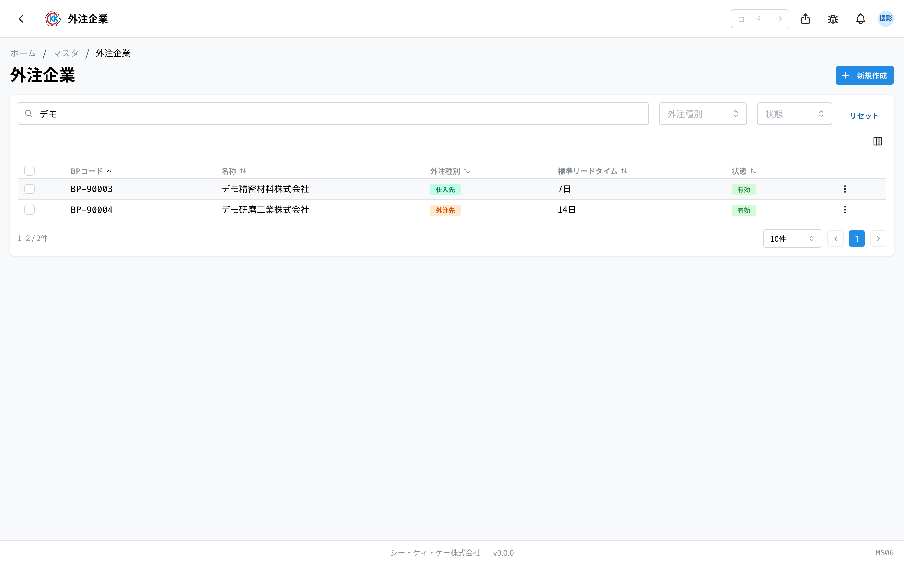
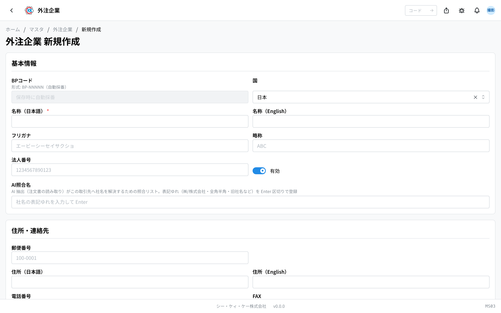
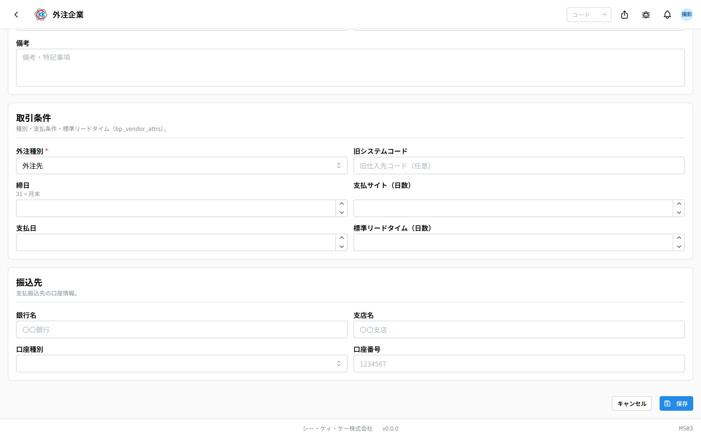
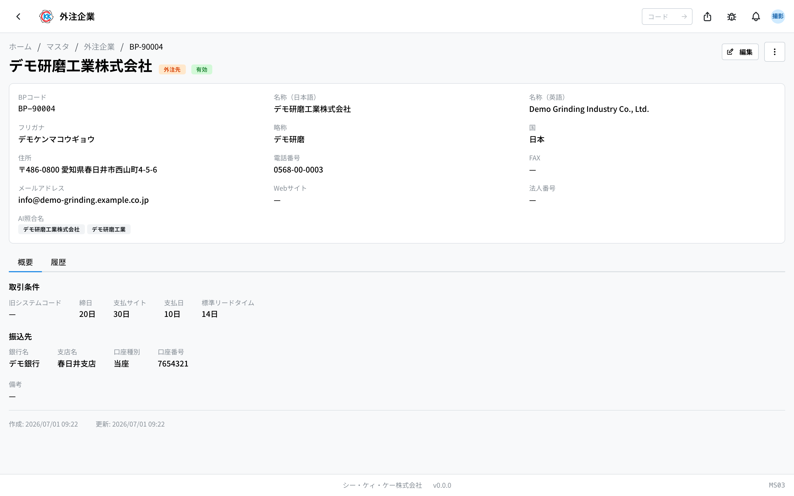

这是用于登记采购材料的公司和委托部分加工的公司的台账。操作码是 `MS03`。

这里不只登记公司名称和地址，还把 **结算截止日、付款条件、汇款账户** 一起记在这里。没有在这里登记的公司，**无法**作为[材料订购单](/manual/zh/operations/purchasing/purchase-order/user)或[外协委托](/manual/zh/operations/purchasing/outsource-order/user)的对象来选择。

> ⚠️ 本应用目前 **仅在开发环境（测试用环境）** 中可用。在正式投入使用之前，画面和操作步骤可能会有变化。

## 本应用可以做什么

- 可以登记采购材料的公司（供应商）。
- 可以登记委托研磨、涂层等部分加工的公司（外协厂）。
- 登记后，就可以在[材料订购单](/manual/zh/operations/purchasing/purchase-order/user)和[外协委托](/manual/zh/operations/purchasing/outsource-order/user)中作为对象选择。
- 可以登记结算截止日、付款条件和汇款账户。
- 可以登记从委托到货品送达为止的大致天数（标准交货周期）。

## 本页出现的词语

- **仕入先（供应商）** … 采购材料或物资的对象公司。
- **外注先（外协厂）** … 委托部分加工的对象公司。
- **外注種別（外协类别）** … 区分该公司是「供应商」还是「外协厂」。
- **標準リードタイム（标准交货周期）** … 从委托到货品送达为止通常需要的天数。
- **BPコード（BP代码）** … 每家公司一个的管理编号，以 `BP-` 开头。保存时自动生成。
- **締日 / 支払サイト（结算截止日 / 付款账期）** … 汇总付款的日期，以及到付款为止的天数。

## 开始之前

使用本应用需要 **主数据权限**。画面打不开时，请咨询管理员。

采购材料之前，需要先把该公司登记在这里。没有登记的话，在[材料订购单](/manual/zh/operations/purchasing/purchase-order/user)的「仕入先」（供应商）栏中就无法选择。

## 界面说明

打开应用后，会显示已登记外协企业的列表。

- **BPコード（BP代码）** … 以 `BP-` 开头的管理编号，由系统自动生成。
- **外注種別（外协类别）** … 以标记显示「**仕入先**」（供应商）或「**外注先**」（外协厂）。
- **標準リードタイム（标准交货周期）** … 以「7日」这样的形式显示。未登记时显示「—」。
- **状態（状态）** … 绿色的「**有効**」（有效）表示现在还能使用的公司，灰色的「**無効**」（无效）表示已经不能选择的公司。
- 通过上方的搜索栏（「**BPコード・名称で検索**」／按 BP 代码・名称搜索）可以按公司名称筛选。
- 在「**外注種別**」（外协类别）栏中，也可以只显示供应商或只显示外协厂。
- 点击某一行，即可打开该公司的详情画面。

## 登记外协企业

### 输入公司信息

1. 点击列表画面右上角的「**新規作成**」（新建）。
2. 在「**名称（日本語）**」（名称・日文）中输入公司名称。**这一栏必须填写。**
3. 「**フリガナ**」（假名读音）、「**略称**」（简称）、「**法人番号**」（法人编号）在知道的范围内填写即可。
4. 在「**住所・連絡先**」（地址・联系方式）区域，输入邮编、地址、电话号码等。

### 输入交易条件和汇款账户

5. 选择「**取引条件**」（交易条件）中的「**外注種別**」（外协类别）。**这一项也必须选择。**
   - 采购材料或物资的对象 →「**仕入先**」（供应商）
   - 委托部分加工的对象 →「**外注先**」（外协厂）
6. 输入「**締日**」（结算截止日）、「**支払サイト（日数）**」（付款账期・天数）、「**支払日**」（付款日）。
7. 在「**標準リードタイム（日数）**」（标准交货周期・天数）中，输入从委托到入库通常需要的天数。
8. 在「**振込先**」（汇款账户）中输入「**銀行名**」（银行名称）、「**支店名**」（支行名称）、「**口座種別**」（账户种类）、「**口座番号**」（账号）。
9. 点击「**保存**」（保存）。

> 💡 在「**締日**」（结算截止日）中输入 `31`，表示「月末」。栏位下方也会显示「31 = 月末」。

> 💡 填写「**標準リードタイム（日数）**」（标准交货周期・天数）后，在制作[外协委托](/manual/zh/operations/purchasing/outsource-order/user)时可作为预计入库日期的参考。不清楚时留空也能保存。

> ⚠️ 「**BPコード**」（BP代码）栏无法输入。正如画面上显示的「保存時に自動採番」（保存时自动编号），保存后会自动生成编号。

## 查看已登记的内容

在列表中点击某一行，即可打开该公司的画面。

公司名称旁边会并列显示「**仕入先**」（供应商）或「**外注先**」（外协厂）标记，以及「**有効**」（有效）「**無効**」（无效）标记。下方分为 2 个标签。

- **概要**（概要）… 交易条件（结算截止日、付款账期、标准交货周期等）、汇款账户和备注。
- **履歴**（历史）… 何时、由谁修改过本登记内容的记录。

想修改内容时，请点击画面右上角的「**編集**」（编辑）。

## 已停止往来的公司如何处理

即使与该公司的业务结束了，也 **请不要删除**。因为过去的采购和入库记录仍然引用着这家公司。请改为设成「無効」（无效）。

1. 点击公司画面右上角的菜单（三个点的按钮）。
2. 选择「**無効化**」（停用）。
3. 在确认画面点击「**無効化する**」（确定停用）。

设为无效后，新的采购单等就无法再选择这家公司，但是 **过去的数据会原样保留**。如果重新开始往来，可以按同样的步骤用「有効化」（启用）恢复。

## 常见问题与故障处理

**Q. 出现「名称（日本語）を入力してください」（请输入名称・日文），无法保存。**
A. 公司名称的日文栏是空的。请填入「名称（日本語）」（名称・日文）后，再点击一次「保存」（保存）。

**Q. 出现「外注種別を選択してください」（请选择外协类别），无法保存。**
A.「取引条件」（交易条件）中的「外注種別」（外协类别）还没有选择。采购材料的对象请选「仕入先」（供应商），委托加工的对象请选「外注先」（外协厂）。

**Q. 材料订购单的「仕入先」（供应商）栏中找不到这家公司。**
A. 外协类别可能被设成了「外注先」（外协厂）。若要作为采购材料的对象使用，请改为「仕入先」（供应商）。同时也请确认是否被设为了「無効」（无效）。

**Q. 尝试删除时出现「関連するデータが存在するため実行できません」（存在关联数据，因此无法执行）。**
A. 因为已经存在使用该公司的采购或入库记录，所以无法删除。这是正常现象。请使用「無効化」（停用）。

**Q. 有一家公司既卖材料，也帮我们做加工，应该选哪一个？**
A. 外协类别只能选一个。请选择使用较多的那一个，并把另一方面的内容写在备注里，这样更容易理解。

**Q. 修改公司名称或地址后，过去采购单的内容会跟着变吗？**
A. 不会变。过去的文件会保留当时的内容。
