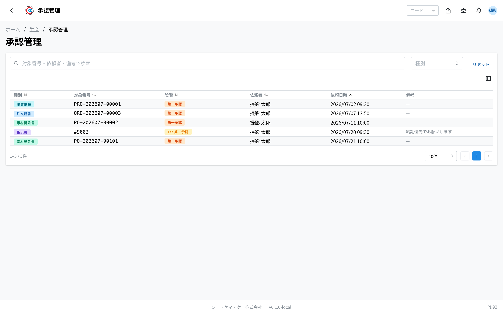
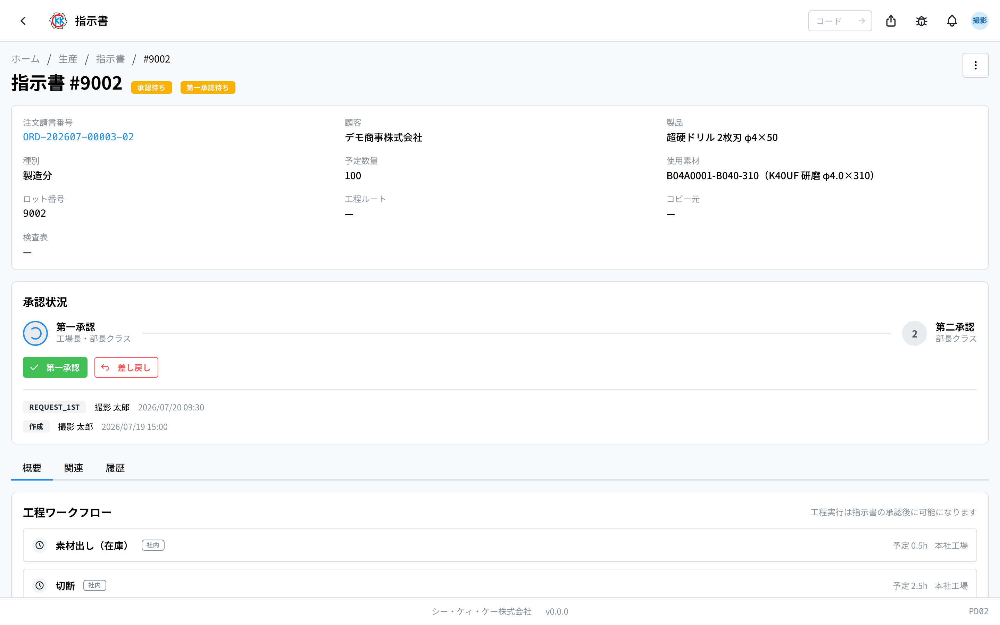
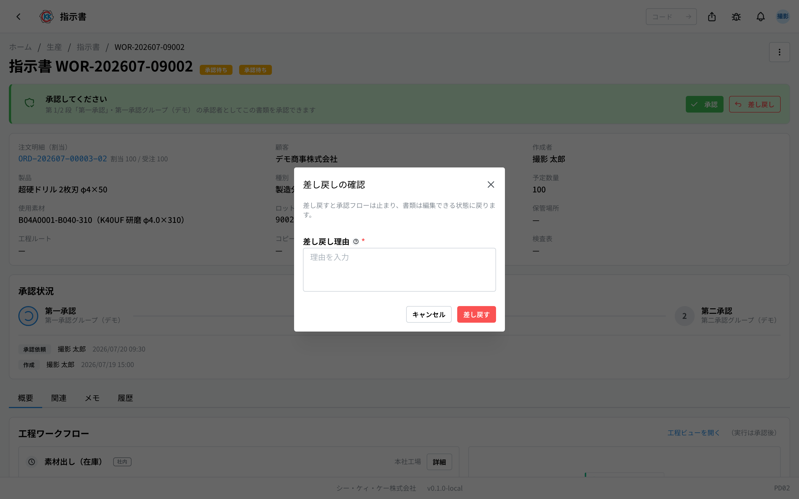
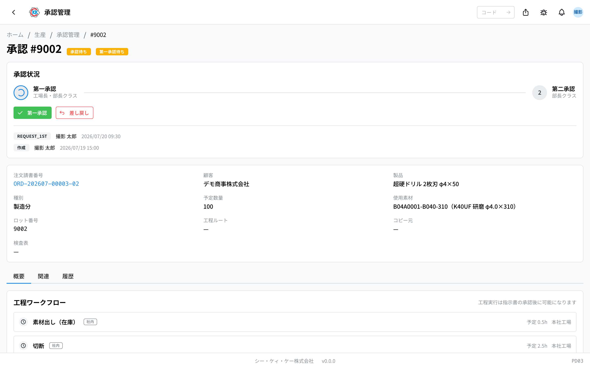

这是把等待审批的单据跨单据类型汇总显示在一个画面上的应用。可以把它想成审批的「收件箱」。操作码是 `PD03`。

> ⚠️ 本应用目前 **只能在测试环境中使用**。在可以正式使用之前，画面和步骤可能会有变化。

## 本应用能做什么

- 可以 **跨单据类型** 一览目前等待审批的单据。
- 点击某一行，会直接打开该单据的画面。
- 在那里可以进行「批准」或「退回」。
- 处理完的单据会自动从这个列表中消失。

会出现在列表中的单据如下。

- **指示書**（制造指示书）… 第一审批・第二审批（[制造指示书](/manual/zh/operations/production/work-order/user) PD02）
- **素材発注書**（材料订购单）… 下单之前的审批（[材料订购单](/manual/zh/operations/purchasing/purchase-order/user) PU02）
- **購買依頼**（采购申请）… [采购申请](/manual/zh/operations/purchasing/purchase-request/user) PU01
- **受注請書**（订单受理）… 虽然会出现在列表中，但由于还没有专用的审批画面，点击该行不会跳转

## 本页出现的词语

- **承認グループ**（审批组）… 允许审批的人员名单。只有名单中的人才能批准或退回。
- **代理**（代理人）… 在审批人不在期间，被按期间指定代为审批的人。
- **段階**（阶段）… 审批的顺序。制造指示书分为「第一」和「第二」两次。
- **差し戻し**（退回）… 内容有问题时，把单据退还给创建人。单据会回到「草稿」。

## 开始之前

- 要进行批准・退回，**必须属于该阶段的审批组**。不属于时，画面上不会出现按钮。
- 加入审批组和代理人的设置在[审批组](/manual/zh/operations/masters/approval-group/user)中进行。这不是自己设置的内容，需要时请与管理员商量。

## 画面的看法

打开应用后，会显示等待审批的单据。

- **種別**（类别）… 用带颜色的徽章显示是「指示書」（制造指示书）「素材発注書」（材料订购单）「購買依頼」（采购申请）「受注請書」（订单受理）中的哪一种。
- **対象番号**（对象编号）… 该单据的编号。
- **段階**（阶段）… 为「**第一**」或「**第二**」。制造指示书以外的单据只审批一次。
- **依頼者**（申请人）… 提交审批的人。
- **依頼日時**（申请日期时间）… 提交的日期和时间。**旧的排在上面**，让等待较久的申请排在前面。
- **備考**（备注）… 提交时填写的说明。
- 可以在上方搜索框搜索 **对象编号・申请人・备注**。也可以用「**種別**」（类别）「**段階**」（阶段）筛选。
- 带有「**旧データ**」（旧数据）徽章的行，是在记录方式变更之前提交的申请。仍可以照常审批。
- 列表为空时会显示「**承認待ちの依頼はありません**」（没有等待审批的申请）。

## 批准

1. 点击列表中的某一行，会打开该单据的画面。
2. 制造指示书的情况下，画面上方会有「**承認状況**」（审批状况），可以看出目前处于哪个阶段。
3. 如果轮到自己审批，就会出现「**第一承認**」（第一审批）或「**第二承認**」（第二审批）按钮（制造指示书以外的单据则是「**承認**」＝批准）。
4. 确认内容后点击按钮。

制造指示书分为 **第一审批 → 第二审批** 两个阶段。第二审批完成后，工厂就可以开始作业了。

> 💡 只有属于该阶段审批组的人，以及在期间内的代理人才能审批。看不到按钮时会显示「第一承認グループのメンバーのみ承認・差し戻しできます」（仅第一审批组成员可以批准或退回）。

## 退回

内容有问题时，把单据退还给创建人。

1. 点击「**差し戻し**」（退回）。
2. 会弹出「差し戻しの確認」（退回确认）的小窗口。
3. 在「**差し戻し理由**」（退回理由）中写明理由（必须填写）。
4. 点击「**差し戻す**」（退回）。

退回后，该单据会回到「**下書き**」（草稿），理由会以红色显示在创建人的画面上。创建人修改之后会再次提交审批。

## 审批专用画面

制造指示书的审批还有一个专用画面。它显示与指示书画面相同的内容，只是把「承認状況」（审批状况）放在最上方。从通知的链接等打开时，会使用这个画面。

## 审批的记录

进行批准・退回后，「承認状況」（审批状况）下方会保留 **审批记录**。可以看到谁在何时、在哪个阶段、是批准还是退回，以及评论内容。由代理人批准的会标注「（代理: 原承認者）」（代理：原审批人）。

使用本应用需要审批权限。

## 常见问题・遇到困难时

**Q. 列表中什么都没有显示。**
A. 目前没有等待审批的申请。已处理完的和已退回的不会出现在这个列表中。

**Q. 看不到审批按钮。**
A. 因为你不属于该阶段的审批组。请与管理员商量加入审批组。

**Q. 点击某一行也没有任何反应。**
A. 那是类别为「受注請書」（订单受理）的行。该单据还没有专用的审批画面，因此只是显示在列表中。

**Q. 点击退回按钮后出现「差し戻し理由を入力してください」（请输入退回理由）。**
A. 理由栏是空的。理由必须填写，请写好内容后再次点击「差し戻す」（退回）。

**Q. 刚才还在的申请从列表中消失了。**
A. 可能是其他有审批权限的人先处理了。处理完的申请会自动从这个列表中消失。单据本身仍可从各自的应用中打开。

**Q. 我休假期间审批就停住了。**
A. 可以按期间设置代理人。这属于[审批组](/manual/zh/operations/masters/approval-group/user)的设置，请与管理员商量。
