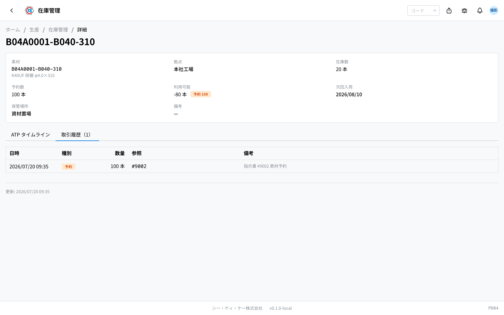

[在庫管理](/manual/ja/operations/production/product-inventory/user)（操作コード `PD04`）の「**素材**」タブと「**仕掛品**」タブの見かたです。素材が今どれだけ使えるか、そして今どれだけ作っている途中かを確認できます。

> ⚠️ このアプリは今のところ **テスト用の環境だけ** で使えます。本番で使えるようになるまでに、画面や手順が変わることがあります。

## このページでできること

- 素材が、どの拠点にどれだけあるかを確認できます。
- 取り置き（予約）されている分を除いた、**実際に使える本数** が分かります。
- 発注済みの素材が **いつ・どれだけ入ってくるか** を確認できます。
- 今どの指示書のどの工程に、何本が乗っているかを確認できます。

> 💡 素材の数はここで直接は直せません。数は毎日の業務にあわせて自動で動きます。この画面から手で行える操作は「**在庫移動**」（置き場所を変える）だけです。手順は[在庫管理](/manual/ja/operations/production/product-inventory/user)を参照してください。

## 用語（このページで出てくる言葉）

- **利用可能** … 在庫のうち、まだ取り置きされていない分です。実際に使える本数です。
- **予約（取り置き）** … これから作る分のために確保されている素材です。
- **次回入荷** … 発注済みの素材が、次に入ってくる予定の日です。
- **仕掛品（しかかりひん）** … 作りかけの品物のことです。工程の途中にあり、まだ在庫にはなっていません。

## 素材はどこから増えたり減ったりするのか

- **入る** … [素材入荷](/manual/ja/operations/purchasing/material-receipt/user)（PU03）で入荷を登録すると、入荷先の拠点の在庫が増えます。
- **取り置きされる** … 「製造分」の[指示書](/manual/ja/operations/production/work-order/user)が承認されると、使う素材が予定数量ぶん取り置きされます。
- **減る** … その指示書のすべての工程が完了すると、取り置きしていた素材が使った分として減ります。
- **入荷予定が出る** … 発注済みの[素材発注書](/manual/ja/operations/purchasing/purchase-order/user)（PU02）の明細から、次の入荷予定日と本数が表示されます。

## 素材タブの見かた

- **素材** … 素材コードと名称です。
- **拠点** … どの拠点にあるかです。
- **保管場所** … 「場所名 / 棚コード」の形で出ます。決まっていないものは「**未割当**」と出ます。
- **在庫数** … 実際にある数です（単位付きで出ます）。
- **利用可能** … そのうち取り置きされていない、実際に使える数です。
- **次回入荷** … 発注済みの素材が次に入ってくる予定日です。
- **移動** … 置き場所を変えるときに押すボタンです。
- 上の検索欄に素材コードや素材名を入れて探せます。「**拠点**」でも絞り込めます。
- 行をクリックすると、その素材在庫の詳しい画面が開きます。

## 詳しい画面を見る

行をクリックすると、その素材 1 件の詳しい画面が開きます。上のほうに素材・拠点・在庫数・予約数・利用可能・次回入荷・保管場所・備考が並びます。

### ATP タイムライン

「いま何本使えるか」から始めて、入荷予定を足していくと **いつ何本使えるようになるか** を、日付順に並べた表です。

- **時点** … いちばん上の行は「**現時点**」です。その下は入荷予定日です。入荷日が決まっていない分は「**未定**」と出ます。
- **入荷量** … その日に入ってくる予定の数です。
- **利用可能** … その日を過ぎたあとに使える数です（それまでの入荷を足した数です）。
- **参照** … もとになった発注書の番号です。

「利用可能」が **赤い数字（マイナス）** になっている日は、その時点では足りないという意味です。取り置きされた分が、手元の在庫と入荷予定を上回っています。発注を検討する目印になります。

### 取引履歴

素材が動いた記録です。日時・種別・数量・参照・備考が残ります。

種別は「**入庫**」「**出庫**」「**予約**」「**解除**」「**調整**」の 5 つです。

## 仕掛品タブの見かた

今どれだけ作っている途中かを、指示書と工程ごとに並べた画面です。

- 製品ごとにまとまり、「計 51」のように合計が出ます。
- その下に「**指示書番号**」「**工程**」「**仕掛数**」が並びます。
- 指示書番号をクリックすると、その[指示書](/manual/ja/operations/production/work-order/user)の画面が開きます。
- 進行中の指示書が無いときは「**進行中の仕掛品はありません**」と表示されます。

> ⚠️ 仕掛品はまだ在庫ではありません。実際の在庫に入るのは、指示書のすべての工程が完了したときです。

このアプリを使うには、在庫の権限が必要です。製品タブ・ロケーションタブ・在庫移動の手順は[在庫管理](/manual/ja/operations/production/product-inventory/user)を参照してください。

## よくある質問・困ったとき

**Q. 予約数が在庫数より多くなっています。おかしいのでは。**
A. 異常ではありません。指示書は在庫が足りなくても承認でき、そのときに必要な分が取り置きされます。足りない状態は「発注が必要」という合図です。ATP タイムラインで、入荷後に足りるかどうかを確認してください。

**Q.「利用可能」が赤いマイナスになっています。**
A. 取り置きされた分が、手元の在庫と入荷予定を上回っています。入荷を早めるか、追加の発注が必要かを検討してください。

**Q. 素材の数を手で直したいのですが。**
A. この画面からできるのは「在庫移動」（置き場所を変えること）だけです。数がずれている場合は棚卸しの調整が必要なので、管理者に相談してください。

**Q.「次回入荷」の欄が空です。**
A. その素材について、発注済みの素材発注書がありません。発注していない場合は、入荷予定は表示されません。

**Q. 仕掛品タブに何も出ません。**
A. 進行中の指示書が無い状態です。指示書が承認され、工程が始まると表示されます。

**Q. 仕掛品の数が製品タブに出ていません。**
A. 作っている途中の分は、まだ在庫になっていないためです。すべての工程が完了すると、製品タブに入ります。
