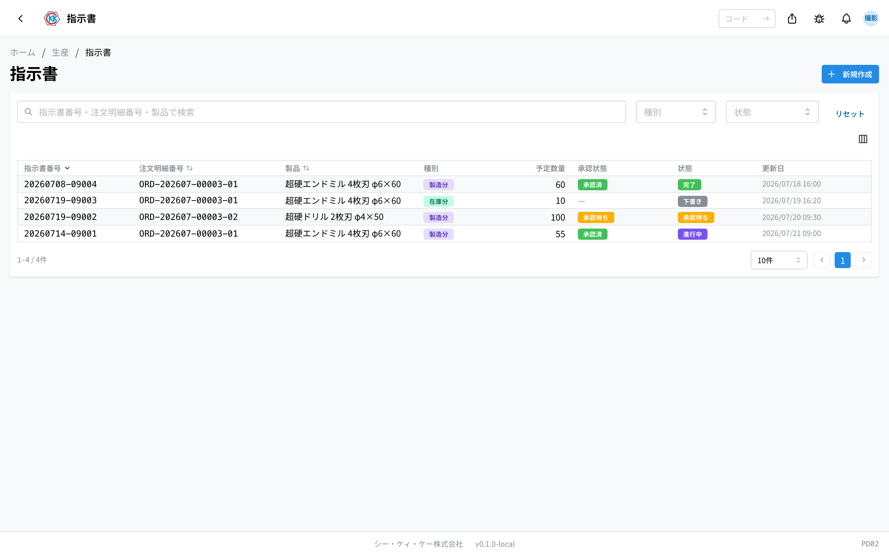
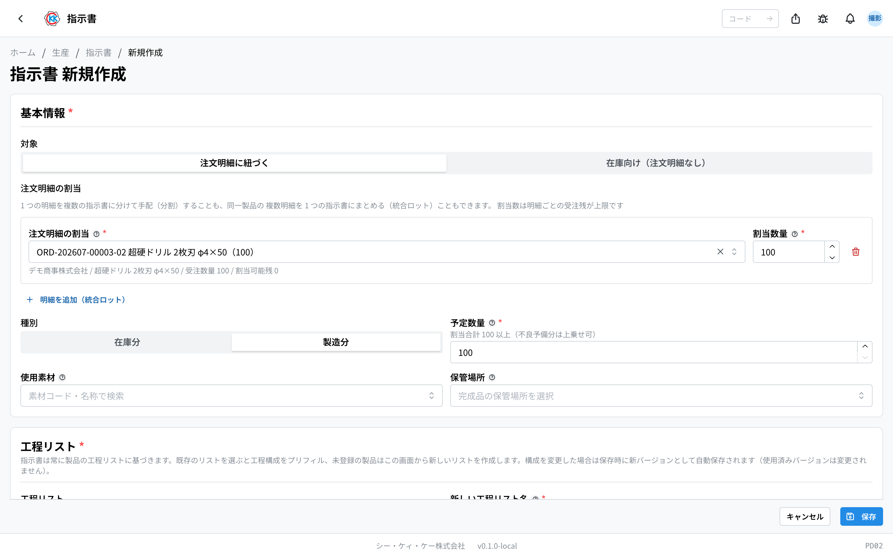
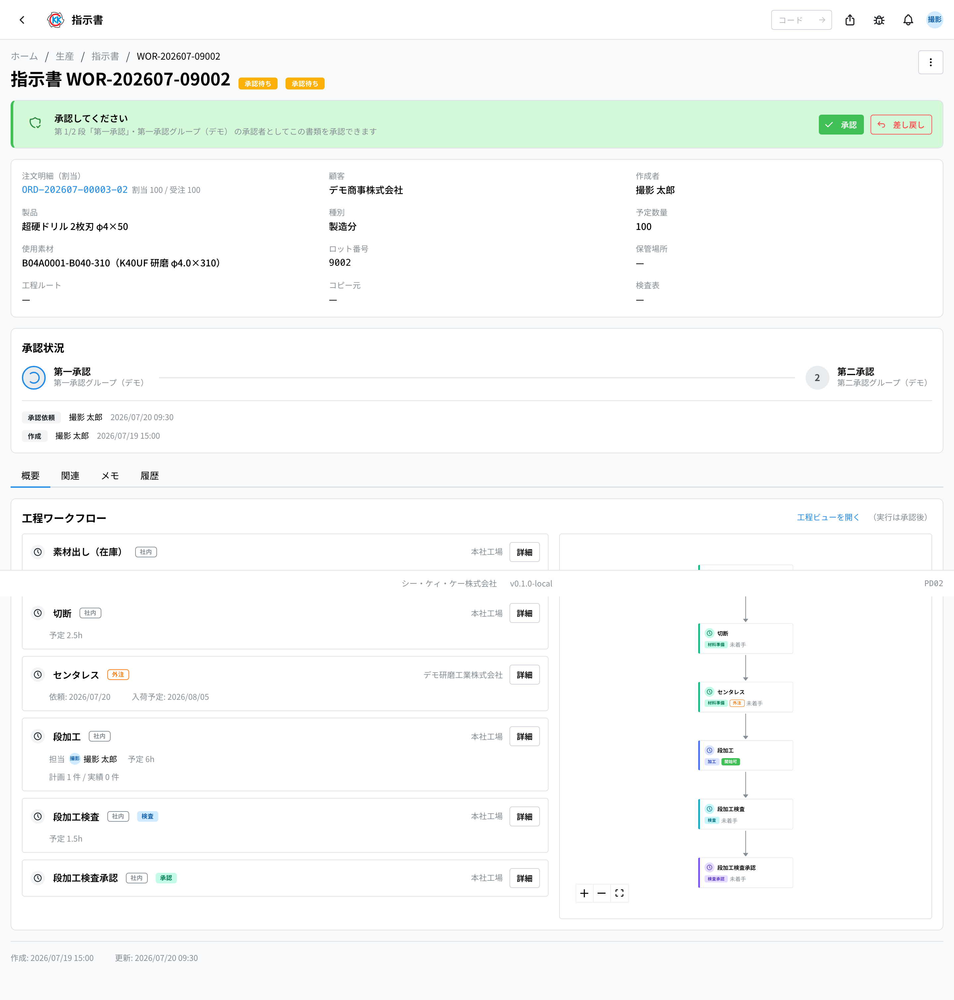
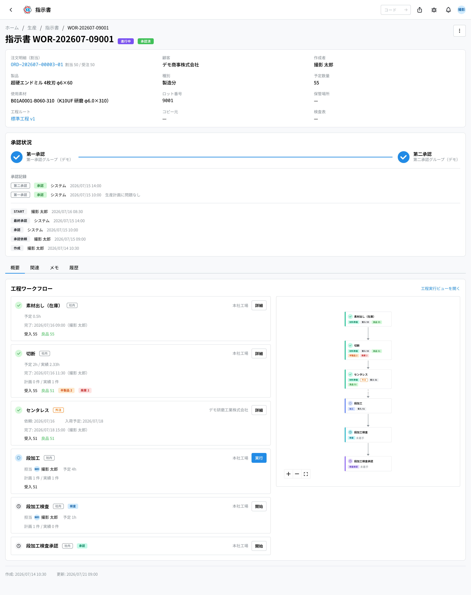
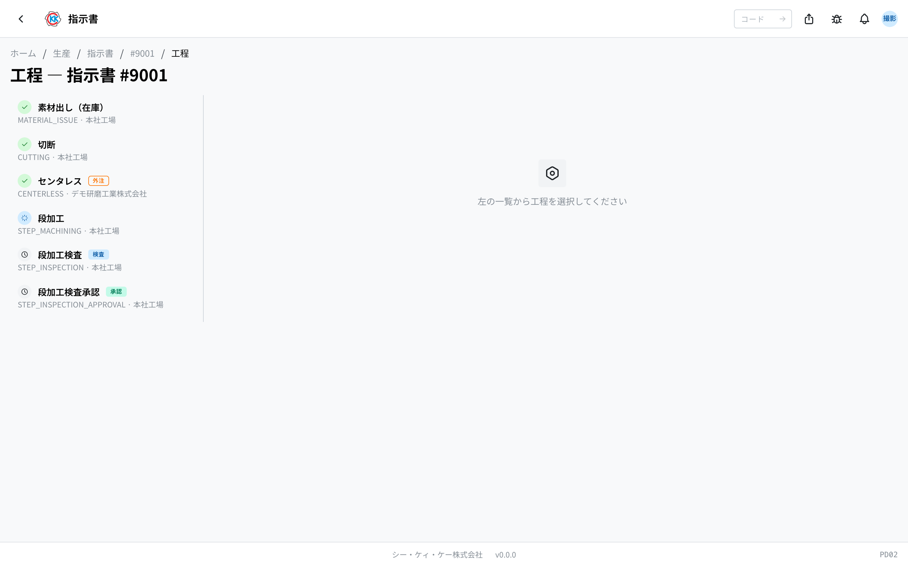
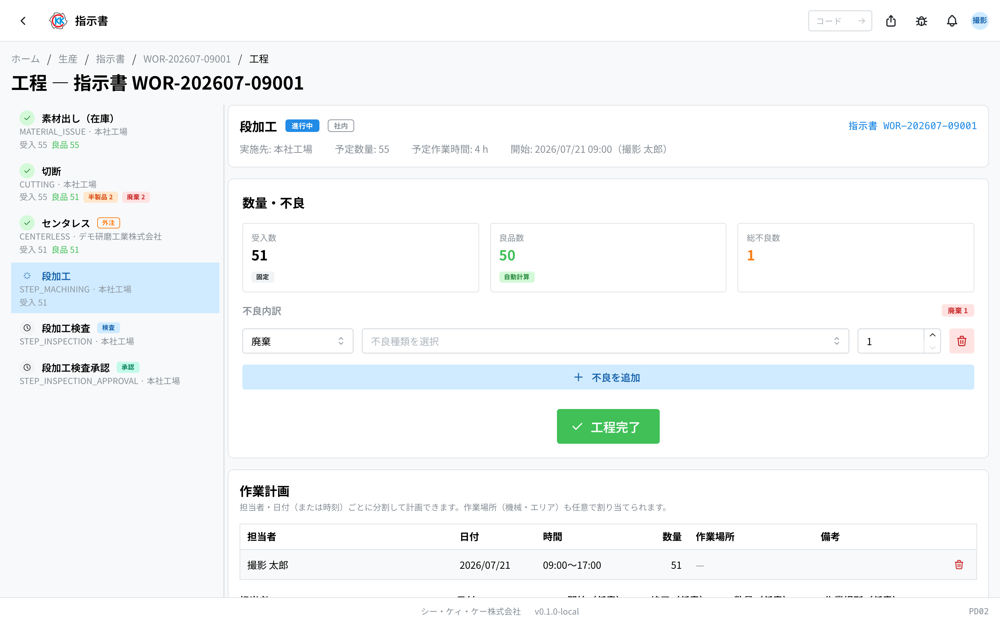

这是用来制作「在工厂做哪种产品、做几根、按什么顺序做」的单据（**指示書**，制造指示书），并记录从审批到作业完成全过程的应用。操作码是 `PD02`。

> ⚠️ 本应用目前 **只能在测试环境中使用**。在可以正式使用之前，画面和步骤可能会有变化。

## 本应用能做什么

- 可以根据客户的订单（注文請書＝销售订单）制作发给工厂的作业指示。
- 可以把制作好的指示书交给上级，获得 **承認**（审批）。
- 可以针对每一道作业（工序），记录 **开始了、结束了、做出了几根**。
- 出现不良品时，可以留下数量和原因。
- 全部作业完成后，做好的产品会 **自动进入库存**。

## 本页出现的词语

- **注文請書**（销售订单）… 把客户的订单按产品、按数量拆分后的公司内部单据。指示书就是选择它来创建的。
- **工程**（工序）… 「切断」「段加工」「检查」等作业的一个步骤。
- **工程リスト**（工序列表）… 事先登记好的、制造该产品时的工序排列。
- **ロット番号**（批次号）… 给制造出来的一批产品的编号。指示书的编号会直接成为批次号。
- **受入数 / 良品数**（接收数 / 良品数）… 接收数是进入该工序的根数，良品数是可以顺利进入下一道工序的根数。
- **承認グループ**（审批组）… 允许审批的人员名单。只有名单中的人才能审批。

## 开始之前

- 首先需要有 **注文請書**（销售订单）。销售订单由[订单受理](/manual/zh/operations/sales/order-acceptance/user)的导入画面生成，可以在「注文請書」（销售订单）画面（操作码 `PD01`）中确认。
- 在销售订单画面执行「**在庫照合**」（库存核对）后，已有的库存会被为该订单预留。不足的部分用本应用来制造。
- 负责审批的人必须事先登记在[审批组](/manual/zh/operations/masters/approval-group/user)中。

## 画面的看法

打开应用后，会显示至今创建过的指示书列表。

- **指示書番号**（指示书编号）… 类似 `#9001` 的流水号，由系统自动编号。这个编号同时也是批次号。
- **種別**（类别）… 分为「**在庫分**」（库存分，使用已有库存）和「**製造分**」（制造分，新制造）。
- **予定数量**（计划数量）… 计划制造的根数。
- **承認状態**（审批状态）… 用带颜色的徽章显示审批进行到哪一步，例如「第一承認待ち」（等待第一审批）「第一承認済」（第一审批完成）「第二承認待ち」（等待第二审批）「承認済」（已审批）「差し戻し」（退回）等。
- **状態**（状态）… 为「下書き」（草稿）「承認待ち」（等待审批）「承認済」（已审批）「進行中」（进行中）「完了」（已完成）「キャンセル」（取消）之一。
- 在上方搜索框输入指示书编号、销售订单编号、产品名称即可查找。也可以用「**種別**」（类别）「**状態**」（状态）筛选。
- 点击某一行，会打开该指示书的详情画面。

## 创建制造指示书

1. 点击列表画面右上角的「**新規作成**」（新建）（也可以从销售订单画面打开，那时销售订单已处于选中状态）。
2. 点击「**注文請書**」（销售订单）栏，选择作为依据的销售订单。可以按销售订单编号、产品、客户搜索。
3. 选择后，下方会显示客户名称、产品、订购数量。
4. 在「**種別**」（类别）中选择「在庫分」（库存分）或「製造分」（制造分）。
5. 在「**予定数量**」（计划数量）中输入制造的根数。
6. 选择「製造分」（制造分）时，请选择「**使用素材**」（使用材料）。
7. 「**検査表**」（检查表）会自动选好需要的项目。不足时可以再追加。
8. 选择「**工程リスト**」（工序列表）（见下一小节）。
9. 既可在公司内做也可外协的工序，请选择「**社内**」（公司内）或「**外注**」（外协）；公司内要选据点，外协要选外协厂。
10. 点击「**保存**」（保存）。

保存后会生成「**下書き**」（草稿）的指示书，并打开详情画面。

> 💡 「予定数量」（计划数量）下方有时会出现「最低 55（不良予備分は上乗せ可）」（最少 55，可另加不良备用量）这样的提示。这是扣除库存和其他指示书之后，最少需要的根数。少于该数量将无法保存。多做一些则不受限制。

材料不足时会出现「**素材在庫が 30 不足しています**」（材料库存不足 30）这样的提示。这只是提醒，仍然可以保存。没有后续到货预定时会显示「**入荷予定がありません。素材発注を検討してください**」（没有到货预定，请考虑订购材料）。

### 关于工序列表

工序的排列是按产品登记为「工程リスト」（工序列表）的。

- 选择销售订单后，该产品的工序列表会被自动选中，工序也会随之填入。
- 重新选择「**バージョン**」（版本）后，也可以使用以前的排列。
- 该产品还没有工序列表时，会显示「**この製品の工程リストは未登録です（下で新規作成）**」（该产品的工序列表尚未登记——请在下方新建）。输入「**新しい工程リスト名**」（新工序列表名称）（例如：标准工序）后保存，就会直接登记为新的列表。
- 增减工序时会出现「保存时将作为新版本保存」的提示。之前使用过的指示书的内容不会改变。

工序是从按类别分组的清单中勾选的。某道工序所需的检查等，会在勾选时自动一并添加。如果组合有问题，会出现红色提示，并且无法保存（「**工程構成にエラーがあります**」＝工序构成有错误）。请修改工序，直到红色提示消失。

保存之后，指示书的详情画面会以「**工程ルート**」（工序路线）显示所使用的工序列表名称和版本（例如：标准工序 v1）。可以从这里打开产品的工序列表。

## 获得审批

指示书在获得审批之前无法开始作业。审批分为 **两个阶段**。

1. 在指示书画面的「**承認状況**」（审批状况）处点击「**承認依頼**」（提交审批）。
2. 状态会变成「**承認待ち**」（等待审批）。从这时起，原来的销售订单将无法编辑。
3. 负责第一审批的人（厂长、部长级别）点击「**第一承認**」（第一审批）。
4. 接着由负责第二审批的人（部长级别）点击「**第二承認**」（第二审批）。
5. 两个阶段都完成后，状态会变成「**承認済**」（已审批），就可以开始作业了。

- 只有属于该阶段 **审批组的人**，以及按期间被指定的代理人才能审批。不属于时不会出现按钮，而会显示「第一承認グループのメンバーのみ承認・差し戻しできます」（仅第一审批组成员可以批准或退回）。
- 内容有问题时点击「**差し戻し**」（退回）。必须填写「**差し戻し理由**」（退回理由）。
- 被退回的指示书会回到「下書き」（草稿），画面上会以红色显示理由。修改后可以通过「**再承認依頼**」（再次提交审批）重新提交。
- 审批和退回的记录会保留在「承認状況」（审批状况）下方。由代理人批准的会标注「（代理: 原承認者）」（代理：原审批人）。

也可以从[审批管理](/manual/zh/operations/production/approval/user)（PD03）的列表中进行审批。

「製造分」（制造分）的指示书获得审批后，要使用的材料会为该指示书 **预留**。

## 推进工序

指示书画面的下方有「**工程ワークフロー**」（工序流程），工序会按顺序排列。

审批完成后，右上角会出现「**工程実行ビューを開く**」（打开工序执行视图）的链接。点击后会打开左侧是工序列表、右侧是作业记录画面的界面。审批之前会显示「工程実行は指示書の承認後に可能になります」（工序执行需在指示书获批后才可进行），无法打开。

### 开始作业

1. 从左侧列表中选择接下来要做的工序。
2. 点击「**工程開始**」（开始工序）。
3. 如果前一道工序还没完成等原因导致无法开始，会显示「**開始できません**」（无法开始）并列出理由。

开始作业后，该工序会变成由你正在使用的状态。其他人的画面上会显示「**別のユーザーがセッション中です**」（其他用户正在操作中），无法操作。

### 记录根数并完成

开始工序后，会出现「**数量・不良**」（数量・不良）的输入栏。

- **受入数**（接收数）… 进入该工序的根数。会自动填入前一道工序的良品数，这里无法修改（显示为「固定」）。
- **良品数**（良品数）… 自动计算（显示为「自動計算」）。输入不良品后会相应减少。
- **不良内訳**（不良明细）… 只在出现不良品时输入。点击「**不良を追加**」（添加不良），每一行选择以下内容：
  - 类别 … 「**半製品**」（半成品，退回库存）/「**廃棄**」（报废）/「**手直し**」（返修）
  - 原因 … 从「**不良種類を選択**」（选择不良种类）中选择（在[不良种类](/manual/zh/operations/masters/defect-type/user)中登记的内容）
  - 根数
- 最后点击「**工程完了**」（工序完成）。

在检查工序中，栏位名称会变成「**検査数**」（检查数）「**合格数**」（合格数）「**不合格（半製品）**」（不合格（半成品））等。不记录数量的工序不会出现输入栏，而会显示「この工程は数量記録なしで完了します（通過数 51）」（该工序不记录数量即可完成（通过数 51）），直接完成即可。

> ⚠️ 不良品合计超过接收数时，会显示「**不良の合計（55）が受入数（51）を超えています**」（不良合计（55）超过了接收数（51）），无法完成。请重新核对根数。

### 还可以记录的内容

- **検査記録**（检查记录）… 在检查工序中，按检查表的项目输入实测值。合格与否会根据项目的类型自动判定。不做全数检查的抽样检查中，会按规定的抽样数规则决定检查数。在检查审批工序中，可以批准合格的检查记录。
- **不良記録（任意）**（不良记录，可选）… 可以记下不良种类和具体情况。
- **作業計画 / 作業実績**（作业计划 / 作业实绩）… 可以用负责人、日期、时间、数量、作业场所来记录谁、何时、在哪里、做多少（做了多少）。
- **外注日程**（外协日程）… 外协工序中可以记录「依頼日」（委托日）「入荷予定日」（预计返回日）「入荷日」（返回日）「外注費」（外协费用）。

### 想重做时

- **中断（巻き戻し）**（中断・回退）… 填写理由，把进行中的工序退回到未开始。输入到一半的数量不会保留。
- **巻き戻し**（回退）… 把已完成的工序退回到未开始。如果下一道工序已经开始，或已经计入库存，则无法回退。

## 把返修的部分转到另一条路径（添加分支）

有时希望把返修的部分单独走另外的工序。

1. 在已完成工序的卡片上，点击三个点排列的按钮。
2. 选择「**分岐追加**」（添加分支）。
3. 在「**追加する工程（実行順）**」（要添加的工序（执行顺序））中选择想经过的工序。
4. 在「**分岐数量**」（分支数量）中输入要转过去的根数。
5. 在「**合流先（未着手の工程）**」（汇合目标（未开始的工序））中选择回到哪一道工序（不需要回归时留空即可）。
6. 点击「**分岐を追加**」（添加分支）。

创建分支后，工序流程的上方会出现工序流向图，可以看出从哪道工序、有多少根、流向了哪里。

## 全部完成时

所有工序完成后，指示书会自动变为「**完了**」（已完成）。

- 最后一道工序的良品会带着批次号进入产品库存。
- 划分为「半製品」（半成品）的部分会作为半成品进入库存。
- 之前预留的材料会作为已使用的部分从库存中扣减。

库存可以在[库存管理](/manual/zh/operations/production/product-inventory/user)（PD04）中确认。正在制造中的根数可以在同一应用的「**仕掛品**」（在制品）标签页中查看。

## 其他操作

- **編集**（编辑）… 只有「下書き」（草稿）时才能进行。点击画面右上角的「**編集**」（编辑）。
- **キャンセル**（取消）… 只有「下書き」（草稿）和「承認待ち」（等待审批）时才能进行。从右上角三个点排列的按钮中选择「**キャンセル**」（取消）。
- **コピー**（复制）… 从右上角三个点排列的按钮中选择「**コピー**」（复制），再选择对象销售订单，就会生成沿用工序、实施地点、检查表的草稿。从哪里复制而来会作为「**コピー元**」（复制来源）保留在详情画面上。如果存在比复制来源更新的版本，会提示考虑复制最新版。
- 详情画面的标签页为「**概要**」（概要，工序和备注）/「**関連**」（关联，原销售订单和复制来源）/「**履歴**」（历史，何时由谁做了修改）。

使用本应用需要制造指示书权限。

## 输入项

指示书制作画面的输入项一览。工序本身的排列在「工序列表」中确定。

| 项目 | 必填 | 填什么 |
|------|------|--------|
| [订单请书](#field-sales-order) | 选填 | 针对哪笔受订的指示书 |
| [对象产品](#field-product) | 必填 | 制造的产品 |
| [计划数量](#field-planned-quantity) | 必填 | 制造的数量 |
| [使用材料](#field-material) | 选填 | 使用的材料 |
| [工序列表 / 版本](#field-route) | 必填 | 使用哪一套工序排列 |
| [新工序列表名称](#field-new-route-name) | 条件必填 | 新建工序列表时的名称 |
| [检查表](#field-inspection-templates) | 选填 | 使用的检查表模板 |
| [备注](#field-notes) | 选填 | 补充说明 |

### 订单请书 [#field-sales-order]

针对哪笔受订的指示书。**仅为补充库存的指示书可以留空**（独立的库存用指示书）。

### 对象产品 [#field-product]

制造的产品。选择订单请书后会带入该受订的产品。

### 计划数量 [#field-planned-quantity]

制造的数量。会作为**工序接收数量的初始值**，也是区分库存出货部分与制造部分的依据。

### 使用材料 [#field-material]

使用的材料。指示书获得审批后，**该材料会从库存中被预留。**

### 工序列表 / 版本 [#field-route]

使用哪一套工序排列。从该产品已登记的工序列表中选择。**选择版本后会原样复制当时的排列** — 之后修改工序列表，已创建的指示书不会变化。

### 新工序列表名称 [#field-new-route-name]

当场新建工序列表时的名称。下次同一产品即可选择该排列。

### 检查表 [#field-inspection-templates]

该指示书使用的检查表模板。可多选，检查工序执行画面中可使用此处所选的模板。

### 备注 [#field-notes]

补充说明。

## 常见问题・遇到困难时

**Q. 看不到「工程実行ビューを開く」（打开工序执行视图）。**
A. 该指示书还没有获得审批。显示「工程実行は指示書の承認後に可能になります」（工序执行需在指示书获批后才可进行）时，请先获得审批。

**Q. 看不到审批按钮。**
A. 因为你不属于该阶段的审批组。画面会显示「第一承認グループのメンバーのみ承認・差し戻しできます」（仅第一审批组成员可以批准或退回）。请与管理员商量加入审批组。

**Q. 出现「別のユーザーがセッション中です」（其他用户正在操作中）而无法操作。**
A. 其他人正在推进该工序。请等待对方完成或中断。

**Q. 出现「不良の合計（55）が受入数（51）を超えています」（不良合计（55）超过了接收数（51））而无法完成。**
A. 不良各行输入的根数合计超过了接收到的根数。请重新核对每一行的根数。

**Q. 出现「工程構成にエラーがあります」（工序构成有错误）而无法保存。**
A. 所选工序的组合中缺少必要项。红色提示中会写明「〜需要〜」，请补上该工序。

**Q. 减少了计划数量后无法保存。**
A. 低于了「最低 55（不良予備分は上乗せ可）」（最少 55，可另加不良备用量）这样的最低根数。请输入不低于提示中数字的数量。

**Q. 已完成的工序无法回退。**
A. 可能是下一道工序已经开始，或指示书已完成并已计入库存。库存计入之后的数量偏差无法在本画面修正，请与管理员商量。
