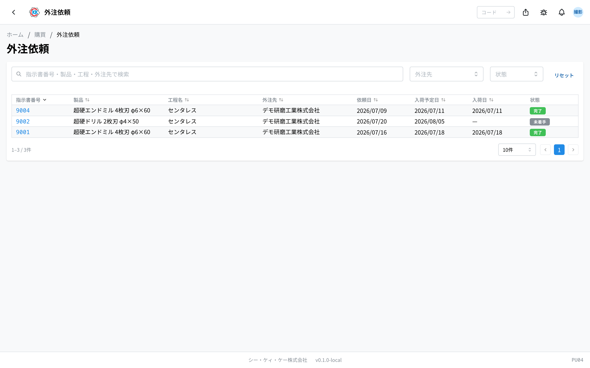
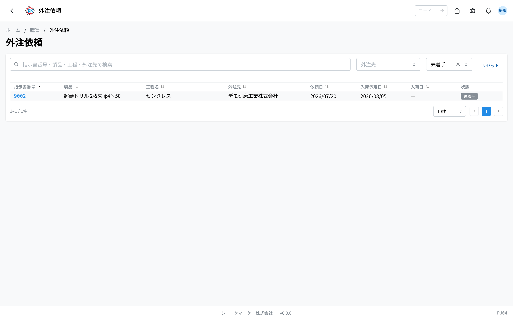
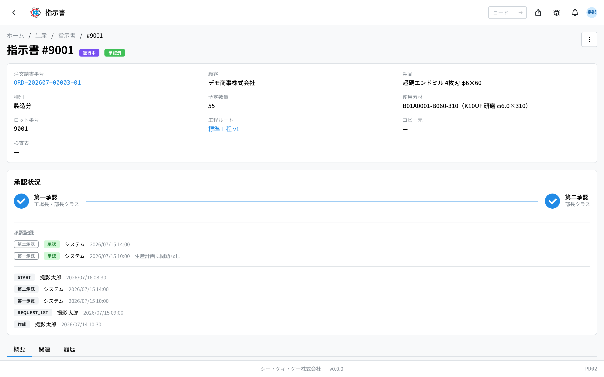

This is the **外注依頼** (outsourcing orders) app, where you check in one list the machining work you have asked outside companies to do. The operation code is `PU04`.

> ⚠️ This app is still being prepared, so it may not appear on the live system yet. If you cannot find it, please ask the person in charge at your company.

## What you can do with this app

- You can see all the machining work you have asked outside companies to do, in one table.
- You can see at a glance which work is at which company, and when it is due back.
- You can show only the items that have not come back yet.
- Click a row you are interested in and you go straight to the work screen for that step.
- It is handy first thing in the morning, to check what is due back today.

## Words used on this page

- **外注** (outsourcing) … asking an outside company to do part of the machining, such as centreless grinding or coating.
- **外注先** (outsourcing partner) … the company doing the work for you.
- **工程** (step) … one stage of the work of making a product.
- **指示書** (work order) … the instruction that says "make this many of this product". The steps are listed inside it.
- **依頼日** (sent date) … the day you sent the items to the outside company.
- **入荷予定日** (expected return date) … the day the finished work is expected to come back.
- **入荷日** (return date) … the day it actually came back.

## Before you start

This app is a **view-only screen**. You cannot add new outsourcing from here.

To make outsourcing appear in this list, open a step in a [work order](/manual/en/operations/production/work-order/user), choose 「**外注**」 (outsourced) as the place where it is done, and name the outsourcing partner. Partner companies are registered in the [supplier master](/manual/en/operations/masters/supplier/user).

You need outsourcing order permission to view this screen. If the screen does not open, please ask the person in charge at your company.

## How to read the screen

When you open the app, you see a list of the steps that have been sent out for outsourcing.

- **指示書番号** (work order number) … a blue number. Click it to open the [work order](/manual/en/operations/production/work-order/user) screen.
- **製品** (product) … the name of the product being made by that work.
- **工程名** (step name) … the name of the work you asked for, such as centreless grinding.
- **外注先** (outsourcing partner) … the name of the company doing the work.
- **依頼日 / 入荷予定日 / 入荷日** (sent date / expected return date / return date) … the day you sent it, the day it should come back, and the day it actually came back. Dates that have not happened yet are shown as 「—」.
- **状態** (status) … grey is 「未着手」 (not started), blue is 「進行中」 (in progress), green is 「完了」 (finished), and red is 「キャンセル」 (cancelled).

Type a work order number, a product, a step, or a partner into the search box at the top to narrow down the list. You can also narrow it down with 「**外注先**」 (outsourcing partner) and 「**状態**」 (status) on the right.

> 💡 The choices in 「外注先」 (outsourcing partner) are built automatically from the companies that appear in this list. A company you have not sent work to yet does not appear as a choice.

## Making outsourcing appear in this list

You cannot add it from this app. On the [work order](/manual/en/operations/production/work-order/user) screen, choose 「**外注**」 (outsourced) as the place where the step is done and name the partner company, and it appears in this list.

In the step list of a work order, outsourced steps carry an orange 「**外注**」 (outsourced) badge.

## Entering and fixing the dates

You cannot enter the sent date, expected return date, or return date in this list. You enter them on the work screen of the step.

1. In the list, click the row whose dates you want to enter.
2. The work screen for that step opens.
3. Look for the 「**外注日程**」 (outsourcing schedule) box near the bottom.
4. Enter 「**依頼日**」 (sent date), 「**入荷予定日**」 (expected return date), and 「**入荷日**」 (return date).
5. If you know the cost, enter 「**外注費**」 (outsourcing cost) as well.
6. Press 「**外注日程を保存**」 (Save outsourcing schedule).

Once you save, the dates also appear in the outsourcing order list.

## Questions and problems

**Q. The list is empty.**
A. There is no work order with an outsourced step yet. The screen shows 「**外注工程がありません（指示書の工程で外注を選ぶと表示されます）**」 (There are no outsourced steps — they appear once you choose outsourced for a step in a work order). Choose 「外注」 (outsourced) as the place where a step is done in a [work order](/manual/en/operations/production/work-order/user) and it will appear.

**Q. There is no 「新規作成」 (New) button in the list.**
A. This app is view-only. Outsourcing is registered as a step in a work order. You never create a document here.

**Q. I click a date box but I cannot type in it.**
A. You cannot change dates in the list table. Click the row to open the work screen for the step, and enter them in the 「外注日程」 (outsourcing schedule) box.

**Q. I opened the work screen, but the date boxes are grey and I cannot type in them.**
A. One of two things. Either the work order has not been approved yet (so the work cannot be started), or someone else is working on that step and the screen shows 「**別のユーザーがセッション中です**」 (Another user is working on this). Check the status of the work order, or speak to the person working on it.

**Q. The outsourcing partner shows 「—」.**
A. No partner company has been named for that step. Open the step on the work order screen and name the partner.

**Q. Do I also order material here?**
A. No. Buying material is done in [material purchase order](/manual/en/operations/purchasing/purchase-order/user). This app lists only the machining work you ask outside companies to do.
