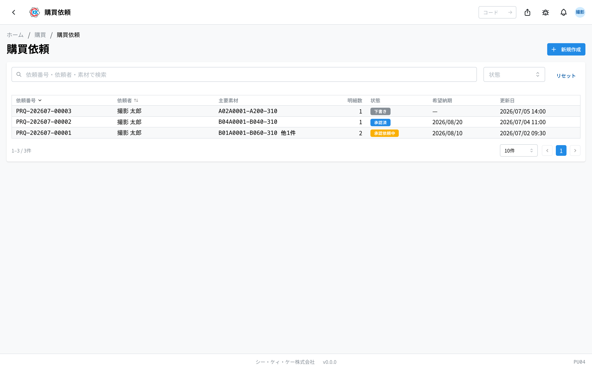
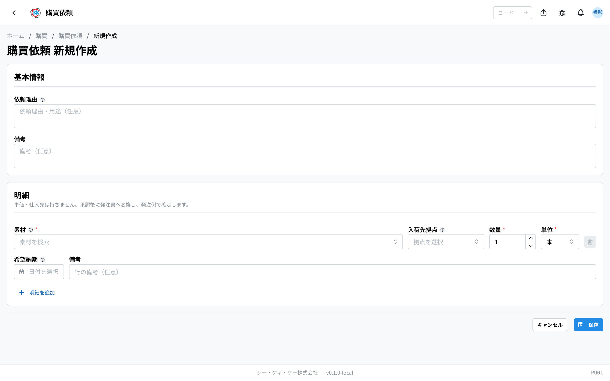
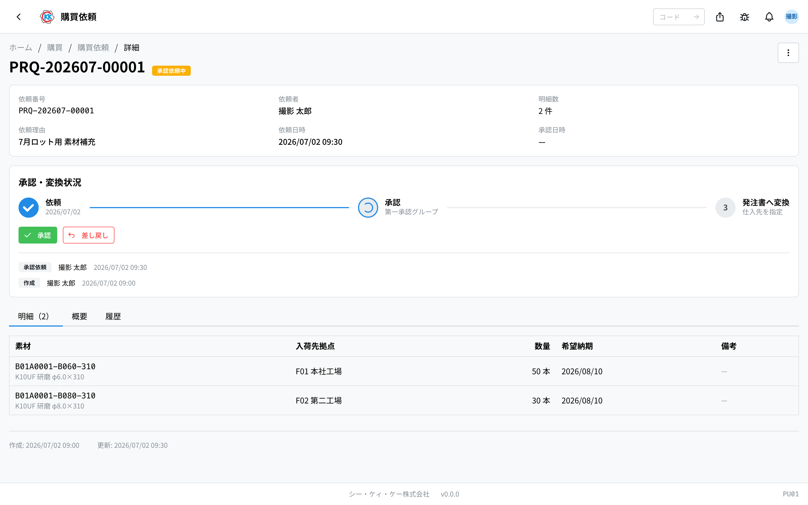
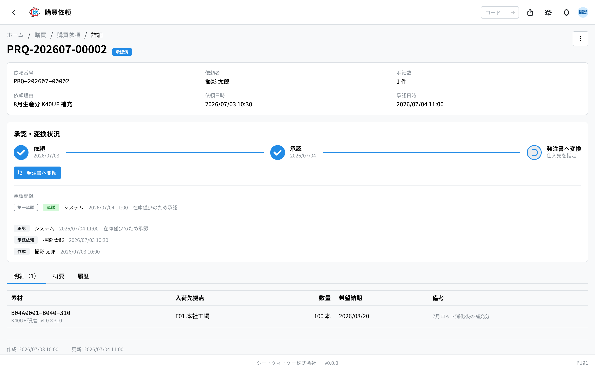
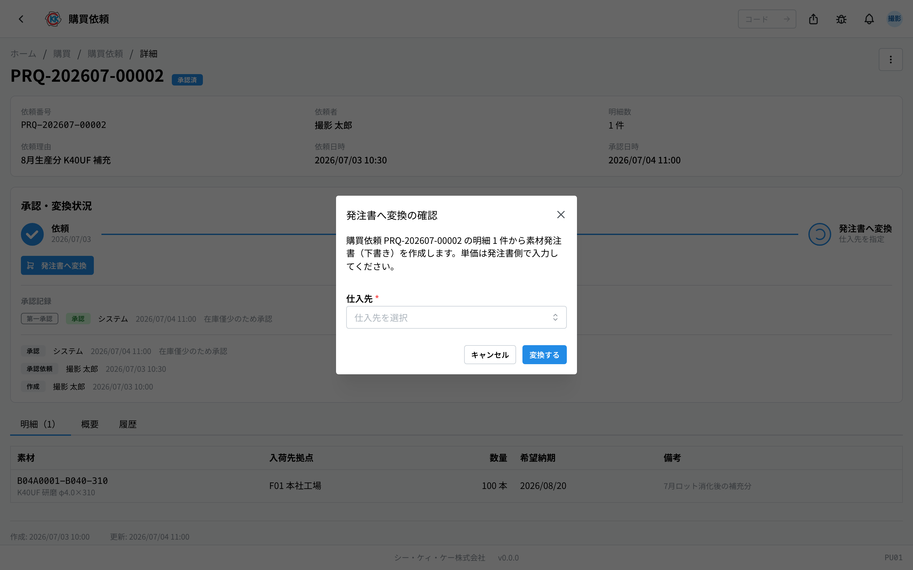

这是用来提出 **購買依頼**（采购申请），也就是向公司内部说明「希望购买这种材料」的应用。操作码是 `PU01`。

> ⚠️ 本应用仍在准备中，正式环境上可能还看不到。找不到时请咨询公司内的负责人。

## 本应用能做什么

- 只要写清「要什么、送到哪里、要几根、什么时候要」，就能提出购买请求。
- **不需要填写价格和供应商。** 这些由审批之后负责下单的人决定。
- 可以查看自己提出的申请现在是在等待审批，还是已经通过。
- 已审批的申请，按一个按钮就会变成[材料订购单](/manual/zh/operations/purchasing/purchase-order/user)。
- 当某种材料的库存变少、需要补货时使用。

## 本页出现的词语

- **明細**（明细）… 申请中的一行。写明「哪种材料、几根」。
- **素材**（材料）… 加工用的棒材等原料。只能从已登记在[材料主数据](/manual/zh/operations/masters/material/user)中的材料里选择。
- **入荷先拠点**（收货据点）… 接收这批材料的据点（工厂・营业所）。
- **希望納期**（希望交期）… 「希望在这一天之前拿到」的日期。
- **承認**（审批）… 上级同意这份申请。没有通过就无法进入订购。
- **差し戻し**（退回）… 上级说「这里请修改」，把申请退还给你。

## 开始之前

- 想申请的 **材料必须已登记在[材料主数据](/manual/zh/operations/masters/material/user)中**。未登记的材料无法选择。
- 想指定收货地点时，该 **[据点](/manual/zh/operations/masters/plant/user)必须已登记**。
- 创建和编辑需要采购权限。看不到按钮时请咨询公司内的负责人。

## 申请推进的顺序

采购申请按以下顺序推进。当前处在哪一步，可以通过画面上带颜色的徽章来判断。

1. **下書き**（草稿）… 只是你创建好的状态。可以反复修改。
2. **承認依頼中**（审批中）… 等待上级答复。这期间无法修改。
3. **承認済**（已审批）… 已获同意。可以变成订购单。
4. **発注済**（已下单）… 已变成订购单。之后的操作在[材料订购单](/manual/zh/operations/purchasing/purchase-order/user)中进行。

中途被上级退回时会变成「**差し戻し**」（退回），自己撤回时会变成「**キャンセル**」（取消）。

## 画面的看法

打开应用后，会显示至今提出过的采购申请列表。

- **依頼番号**（申请编号）… 以 `PRQ-` 开头的编号。由系统自动编号。
- **状態**（状态）… 用带颜色的徽章表示当前情况。灰色是「下書き」（草稿），黄色是「承認依頼中」（审批中），蓝色是「承認済」（已审批），紫色是「発注済」（已下单），红色是「差し戻し」（退回）或「キャンセル」（取消）。
- **主要素材**（主要材料）… 显示第一行的材料。有多行时会加上「他 2 件」（另 2 件）这样的说明。
- 在上方搜索框输入申请编号、申请人、材料编码，可以筛选出要找的申请。
- 用右侧的「**状態**」（状态）可以只显示等待审批的申请。
- 点击某一行，会打开该申请的详情画面。

## 创建采购申请

1. 点击列表画面右上角的「**新規作成**」（新建）。
2. 在「**依頼理由**」（申请理由）中写明为什么需要（留空也能保存）。
3. 点击明细的「**素材**」（材料）栏，用材料编码或名称搜索并选择。
4. 在「**入荷先拠点**」（收货据点）中选择接收的据点（留空也能保存）。
5. 在「**数量**」（数量）中输入需要的根数。
6. 确认「**単位**」（单位）（初始为「本」＝根）。
7. 在「**希望納期**」（希望交期）中输入希望拿到的日期（留空也可以）。
8. 要追加材料时，点击「**明細を追加**」（添加明细），重复第 3 到第 7 步。
9. 最后点击「**保存**」（保存）。

保存后会以「下書き」（草稿）登记，并打开详情画面。

> 💡 本画面没有价格栏。供应商和价格是在审批之后制作订购单时才决定的。

## 提交审批

确认内容后，请上级过目。

1. 打开申请的画面。
2. 点击「**承認・変換状況**」（审批・转换状况）框中的「**承認依頼**」（提交审批）。

状态会变成「**承認依頼中**」（审批中），申请会送到审批人那里。同一份申请也会出现在[审批管理](/manual/zh/operations/production/approval/user)画面上。

审批中无法修改内容。想修改时，可以先从「**…**」（三个点的按钮）中选择「**キャンセル**」（取消）后重新创建，或者请上级退回。

## 审批・退回（审批人的操作）

只有审批人才会看到以下按钮。

- 内容没问题时点击「**承認**」（批准）。状态会变成「承認済」（已审批）。
- 需要修改时点击「**差し戻し**」（退回）。会弹出「差し戻しの確認」（退回确认）的小窗口，请填写「**差し戻し理由**」（退回理由）后点击「**差し戻す**」（退回）。

> ⚠️ 退回理由必须填写。留空点击时会显示「**差し戻し理由を入力してください**」（请输入退回理由）。

被退回的申请状态会变成「**差し戻し**」（退回），理由会显示在申请人的画面上。修改内容后可以再次点击「承認依頼」（提交审批），不需要重新创建。

## 转换为订购单

已审批的申请要转换成订购单，才能向供应商下单。

1. 打开状态为「承認済」（已审批）的申请画面。
2. 点击「**発注書へ変換**」（转换为订购单）。

3. 会弹出「発注書へ変換の確認」（转换为订购单的确认）小窗口。
4. 选择「**仕入先**」（供应商）。
5. 点击「**変換する**」（转换）。

系统会创建一份沿用相同明细的[材料订购单](/manual/zh/operations/purchasing/purchase-order/user)（草稿），并跳转到该画面。申请一侧会变成「**発注済**」（已下单），并显示指向新订购单编号的链接。

> 💡 生成的订购单中，**所有单价都是 0 日元**。请从订购单的「編集」（编辑）中填入单价后，再提交订购单的审批。

## 确认内容

申请画面有 3 个标签页。

- **明細**（明细）… 材料、收货据点、数量、希望交期的一览。
- **概要**（概要）… 申请理由和备注。
- **履歴**（历史）… 何时由谁做了修改的记录。

「承認・変換状況」（审批・转换状况）框中，会显示 申请 → 审批 → 转换为订购单 的进度，以及谁在何时批准的记录。

## 输入项

采购申请画面的输入项一览。应用中输入栏旁边的 **?** 也可直接跳转到对应说明。

| 项目 | 必填 | 填什么 |
|------|------|--------|
| [申请理由](#field-reason) | 选填 | 为何需要（审批人会查看） |
| [备注](#field-notes) | 选填 | 对整份申请的补充 |
| [材料](#field-material) | 必填 | 需要的材料 |
| [到货基地](#field-plant) | 必填 | 接收的基地 |
| [数量](#field-quantity) | 必填 | 需要的数量 |
| [单位](#field-unit) | 必填 | 支・kg 等 |
| [希望交期](#field-desired-date) | 选填 | 希望何时到货 |
| [明细备注](#field-item-notes) | 选填 | 仅针对该材料的补充 |

### 申请理由 [#field-reason]

说明为何需要该材料。**审批人会据此判断**，写明「用于哪个产品的哪道工序」可以减少来回确认。

### 备注 [#field-notes]

对整份申请的补充。只与某一材料相关的内容，请写在明细的备注中。

### 材料 [#field-material]

选择需要的材料。列表中没有时，请先在[材料主数据](/manual/zh/operations/masters/material/user)中登记。

### 到货基地 [#field-plant]

接收该材料的基地。**会计入此处指定基地的库存**，请选择实际使用的地点。

### 数量 [#field-quantity]

输入需要的数量。之后的采购单也会沿用同一数量。

### 单位 [#field-unit]

支・kg・m 等计数单位。选择材料后会带入默认单位。

### 希望交期 [#field-desired-date]

希望到货的日期。**并非已确定的日程** — 实际的预计到货日在制作采购单时与供应商确定。

### 明细备注 [#field-item-notes]

仅针对该材料的补充（例如「与上次同一批次」）。

## 常见问题・遇到困难时

**Q. 看不到「承認」（批准）「差し戻し」（退回）按钮。**
A. 只有属于该级别审批组的人（或其代理人）才能审批。按钮位置会显示「**◯◯ のメンバーのみ承認・差し戻しできます**」（仅该组成员可以批准或退回）。

**Q. 看不到「編集」（编辑）按钮。**
A. 只有「下書き」（草稿）和「差し戻し」（退回）时才能修改。审批中、已审批、已下单时无法修改。强行操作会显示「**下書き・差し戻しの購買依頼のみ編集できます**」（仅草稿或被退回的采购申请可以编辑）。

**Q. 出现「明細を1件以上追加してください」（请至少添加 1 条明细）而无法保存。**
A. 一行材料都没有填。请先选择「素材」（材料），再点击「保存」（保存）。

**Q. 出现「素材を選択してください」（请选择材料）。**
A. 明细的「素材」（材料）栏是空的。请点击该栏，用材料编码或名称搜索，并从候选中选择。只是手动输入文字并不算已选择。

**Q. 想撤销申请。**
A. 在转换为订购单之前（草稿、审批中、已审批、退回），可以从画面右上角的「**…**」中选择「**キャンセル**」（取消）。需要填写理由。转换为订购单之后就无法撤销了。

**Q. 找不到填写价格的栏位。**
A. 采购申请没有价格栏。价格在转换为[材料订购单](/manual/zh/operations/purchasing/purchase-order/user)之后才输入。
