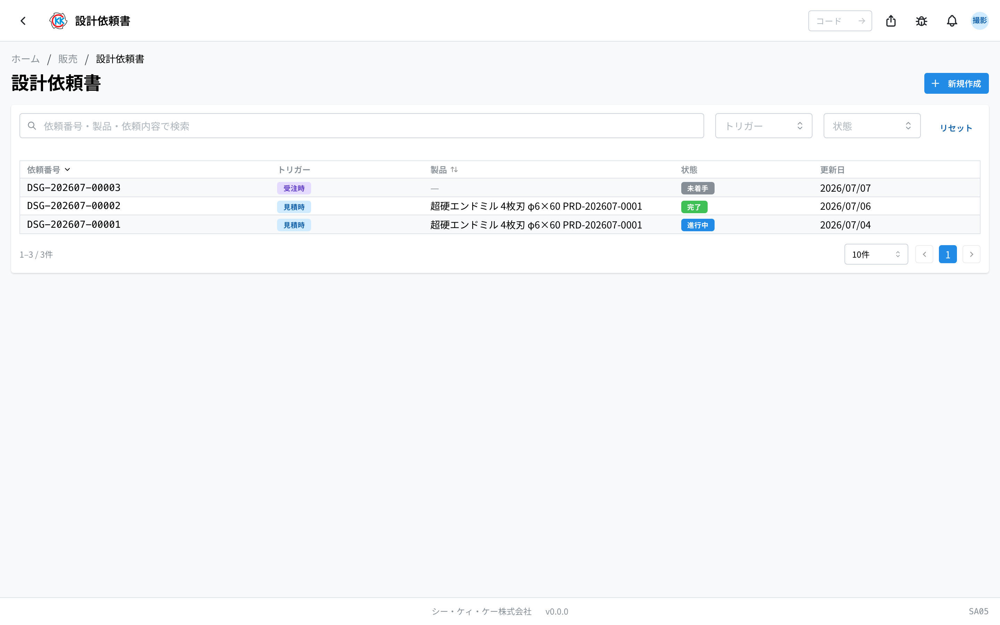
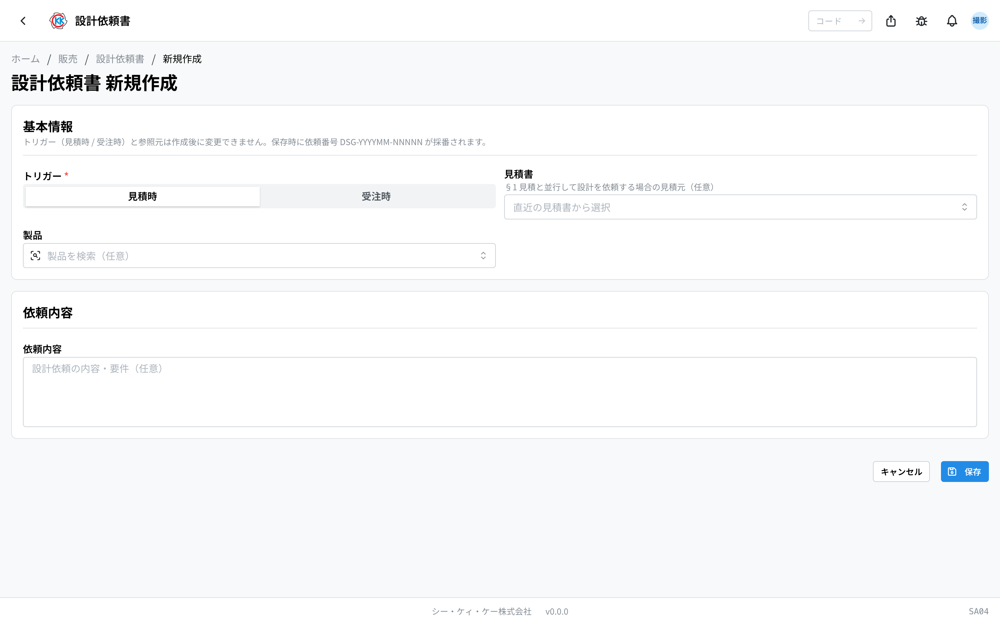
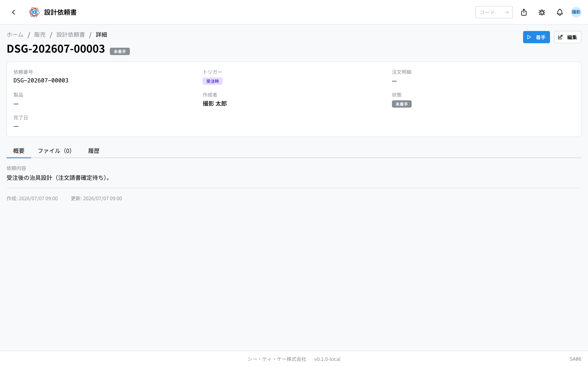
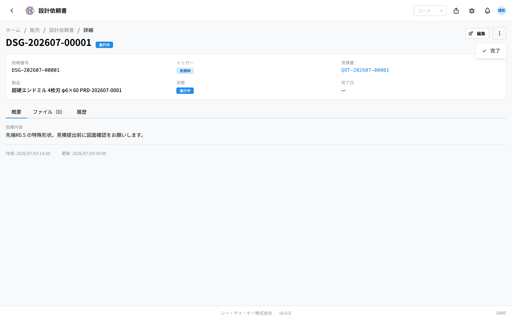
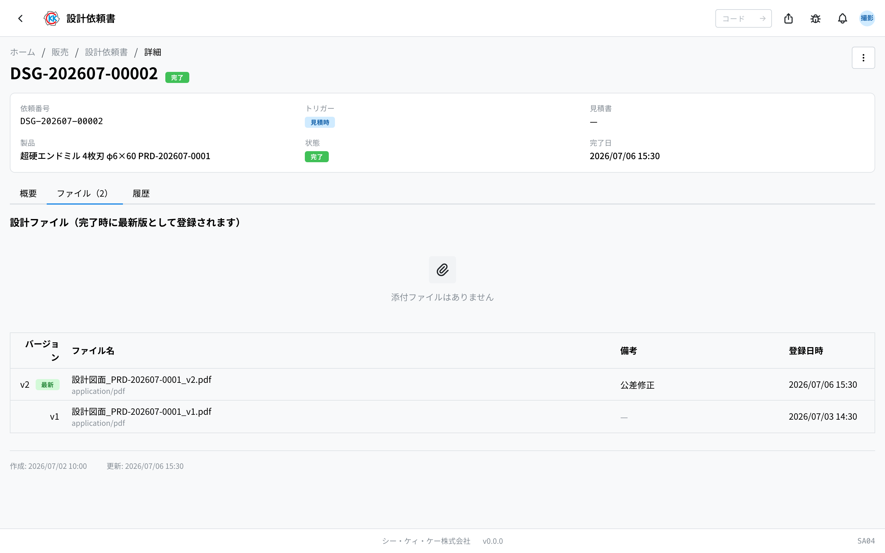

委托设计部门制作图纸，并把做好的图纸文件 **按版本（バージョン）保存下来** 的应用。操作码是 `SA05`。

> ⚠️ 本应用仍在试验公开中，画面和步骤今后可能会变更。

## 本应用能做什么

- 可以写下想委托设计的内容，登记成一份委托。
- 可以区分记录是报价时的委托，还是接单之后的委托。
- 可以用 **未着手（未开始）→ 進行中（进行中）→ 完了（完成）** 管理委托的进展。
- 可以附上做好的图纸文件，**按 v1、v2 分版本** 保存。
- 指定了产品时，完成后[产品主数据](/manual/zh/operations/masters/product/user)的最新图纸会随之更换。

客户来咨询特殊形状、需要图纸时使用。

## 本页出现的词

- **「トリガー」（触发）** … 以什么为契机委托设计的区分。从 **「見積時」（报价时）** 和 **「受注時」（接单时）** 中选一个。
- **「見積時」（报价时）** … 在提交报价单之前，同时请人制作图纸的情况。
- **「受注時」（接单时）** … 订单定下来之后再请人制作图纸的情况。
- **「依頼内容」（委托内容）** … 写下希望设计什么的文字栏。
- **「バージョン（版）」（版本）** … 每重做一次图纸就会增加的编号。按 v1、v2 递增，最新的那个会标上「最新」。
- **「未着手」（未开始）/「進行中」（进行中）/「完了」（完成）** … 委托目前的情况。

## 开始之前

- 如果图纸对象的[产品](/manual/zh/operations/masters/product/user)已经登记，完成时就能作为该产品的最新图纸保存下来（不选产品也可以提出委托）。
- 用「見積時」（报价时）登记时，先有[报价单](/manual/zh/operations/sales/quote/user)就能和该报价关联起来。
- 用「受注時」（接单时）登记时，先有订单明细就能关联起来（订单明细由[订单请书](/manual/zh/operations/sales/order-acceptance/user)的「注文確定」（确定）生成）。
- 要完成委托，**至少需要附上 1 个图纸文件**。

## 界面怎么看

打开应用后，会以列表显示至今的委托。

- **「依頼番号」（委托编号）** … 以 `DSG-` 开头的编号，保存后会自动编上。
- **「トリガー」（触发）** … 以徽章显示「見積時」（报价时）或「受注時」（接单时）。
- **「状態」（状态）** … 用彩色徽章显示目前的情况。灰色是「未着手」（未开始），蓝色是「進行中」（进行中），绿色是「完了」（完成）。
- 在上方搜索框里输入委托编号、产品名称或委托内容里的词，即可缩小范围。也可以用右侧的「トリガー」（触发）、「状態」（状态）筛选。
- 点击某一行，就会打开该委托的详细画面。

## 委托设计

1. 点击列表画面右上角的「**新規作成**」（新建）。
2. 在「**トリガー**」（触发）里点击选择「**見積時**」（报价时）或「**受注時**」（接单时）。
3. 选了报价时的话，在「**見積書**」（报价单）栏里选择作为依据的报价单（留空也能登记）。
4. 选了接单时的话，在「**订单明细**」（订单明细）栏里搜索并选择作为依据的订单明细（留空也能登记）。
5. 在「**製品**」（产品）栏里选择对象产品（留空也能登记）。
6. 在「**依頼内容**」（委托内容）里写下希望设计的内容。
7. 点击「**保存**」（保存）。

保存后会编上委托编号，并打开详细画面。

> ⚠️ 「トリガー」（触发），以及在那里选的报价单、订单明细 **之后不能更改**。弄错时请重新建立一份新的委托。

## 推进委托

刚建好时的状态是「**未着手**」（未开始）。

1. 要开始设计作业时，点击画面右上角的「**着手**」（开始）。
2. 状态会变成「**進行中**」（进行中）。

在未开始和进行中期间，点击右上角的「**編集**」（编辑），可以修改 **「製品」（产品）** 和 **「依頼内容」（委托内容）**。

## 附上图纸文件

1. 在委托画面打开「**ファイル**」（文件）标签页。
2. 点击右上角的「**アップロード**」（上传）。
3. 选择文件（PDF、图片、Excel、CSV。每个最大 20MB）。
4. 需要时在「**ラベル（任意）**」（标签·可选）里写上说明。
5. 点击「**アップロード**」（上传）。

想取消附件时，点击文件右侧的垃圾桶图标，再点击「**削除する**」（删除）。

只有在状态变成 **完了（完成）之前** 才能添加附件。

## 完成委托

1. 点击画面右上角的「**…**」。
2. 选择「**完了**」（完成）。
3. 会出现确认画面，点击「**完了**」（完成）。

完成后，当时最新的附件会 **登记为版本（v1、v2 …）**，并带上「**最新**」徽章，同时记录完成日期。指定了产品的委托，该产品的最新图纸也会切换到这个版本。

完成之后如果还需要修改，请从「**…**」点击「**差し戻し**」（退回），再点击「**差し戻す**」（退回）。状态会回到进行中，可以再次编辑和添加文件（完成日期会被清除）。

## 输入项

设计委托书画面的输入项一览。应用中输入栏旁边的 **?** 也可直接跳转到对应说明。

| 项目 | 必填 | 填什么 |
|------|------|--------|
| [触发时机](#field-trigger) | 必填 | 报价时或受订后 |
| [报价单](#field-quote) | 条件必填 | 报价时选择的对应报价单 |
| [订单明细](#field-order-line) | 条件必填 | 受订后选择的对应订单明细 |
| [产品](#field-product) | 选填 | 需要制图的产品 |
| [委托内容](#field-description) | 必填 | 希望设计什么 |

### 触发时机 [#field-trigger]

该委托是 **为了报价** 还是 **受订确定之后** 提出的。选择不同，接下来关联的是「报价单」还是「订单明细」。

### 报价单 [#field-quote]

触发时机为报价时选择。记录该设计对应哪份报价，便于日后追溯经过。

### 订单明细 [#field-order-line]

触发时机为受订后时选择，记录该设计对应哪笔受订。

### 产品 [#field-product]

需要制图的产品。**若为尚未登记的新产品，可以留空** — 待产品登记后再关联也可以。

### 委托内容 [#field-description]

写明希望设计什么。**制造负责人仅依据此内容制图**，请具体写明尺寸・形状・可参考的既有产品・注意事项等。

## 常见问题与困扰

**Q. 出现「設計ファイルを添付してから完了してください」（请先附上设计文件再完成），无法完成。**
A. 还没有附上图纸文件。请从「**ファイル**」（文件）标签页上传图纸后，再点击「完了」（完成）。

**Q. 完成的委托不能编辑。**
A. 规定完成后的委托既不能编辑，也不能添加文件。想修改时，请先用「**差し戻し**」（退回）回到进行中。

**Q. 触发或报价单栏改不了。**
A. 触发，以及在那里选的报价单、订单明细，建立之后就不能更改。弄错时请重新建立一份新的委托，弄错的那份可以就这样放着，或与负责人商量。

**Q. 报价单或订单明细是必须选的吗？**
A. 两者都是可选的。不关联任何单据也可以建立委托。

**Q. 出现「未着手の設計依頼書のみ着手できます」（只有未开始的设计委托单才能开始）。**
A. 该委托已经在进行中或已完成，不需要再点一次「着手」（开始）。

**Q. 完成之后想更换文件。**
A. 请用「差し戻し」（退回）回到进行中，上传新文件后，再点击「完了」（完成）。之前的版本会保留，同时增加新的版本。
