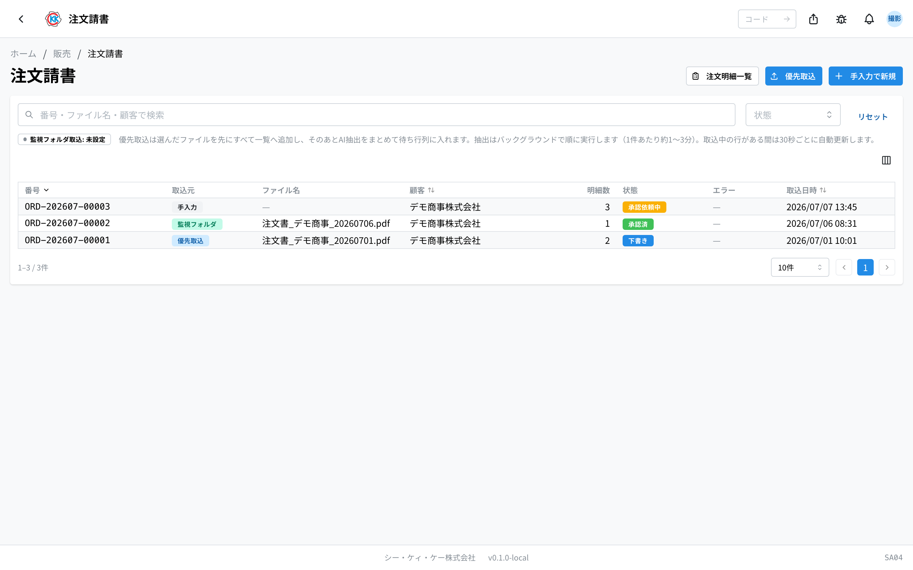
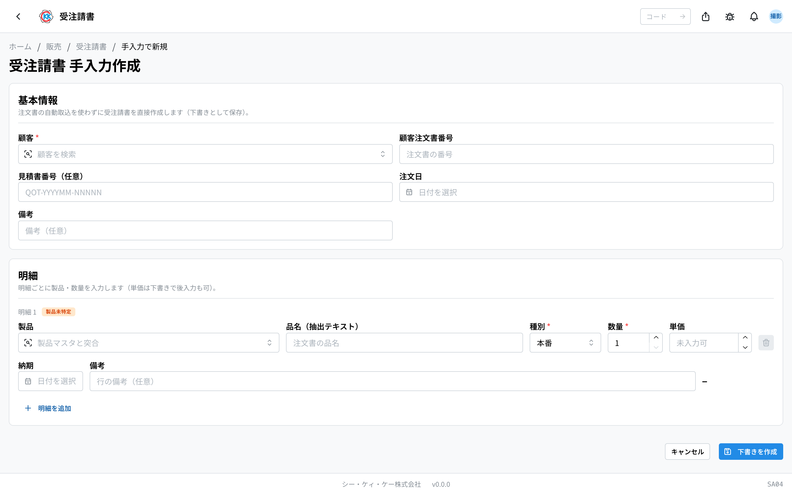
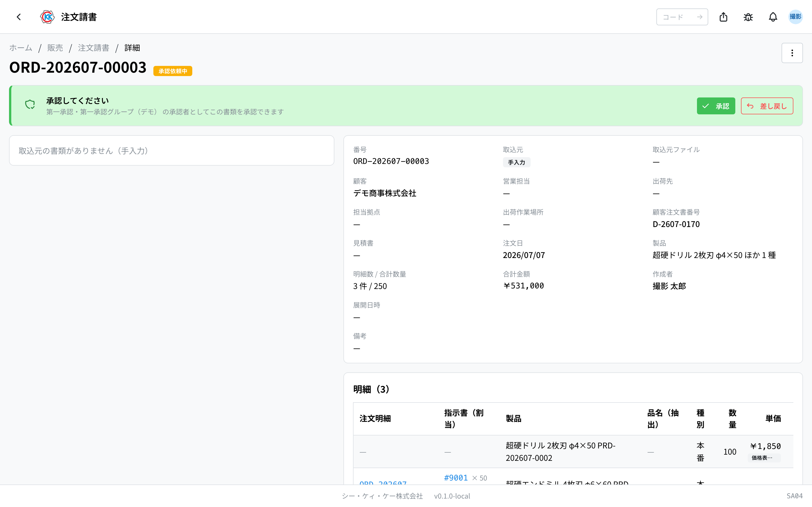
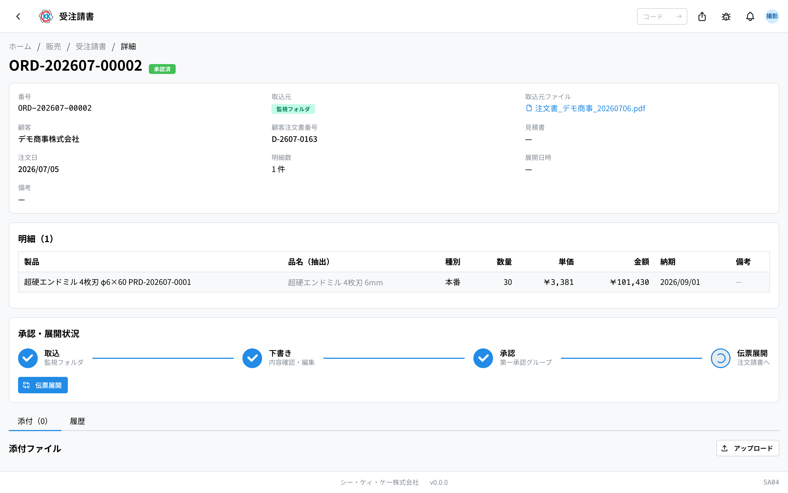

お客様から届いた注文書（PDF やスキャンした画像）をコンピューターが自動で読み取り、内容を確認して **注文明細** を作るところまで進めるアプリです。操作コードは `SA04` です。

> ⚠️ このアプリはまだ試験公開中です。画面や手順が今後変わることがあります。

## このアプリでできること

- 注文書のファイルを読み込ませると、**お客様名や品物・本数が自動で入力** された状態で登録できます。
- 読み取った内容を人の目で確認し、直してから次に進められます。
- 単価が[価格表](/manual/ja/operations/sales/price-list/user)と違う場合、**画面が知らせてくれます**。
- 上長の承認をもらってから、明細 1 行につき 1 枚の **注文明細** をまとめて作れます。
- 注文書のファイルが無いときは、手入力でも登録できます。

お客様から注文書（FAX やメール）を受け取ったときに使います。

## 用語（このページで出てくる言葉）

- **注文請書（じゅちゅううけしょ）** … お客様から受けた注文 1 件分の記録です。このアプリで扱うものです。
- **注文明細（じゅちゅうめいさい）** … 注文請書の明細 1 行ごとに作られる、社内の製造・出荷のもとになる伝票です。
- **明細（めいさい）** … 注文の中の 1 行のことです。「どの製品を何本」を書きます。
- **注文確定（でんぴょうてんかい）** … 注文請書から注文明細をまとめて作る操作のことです。
- **価格差異（かかくさい）** … 注文書に書かれた単価が、価格表の値段と違うことです。
- **取込中 / 下書き / 承認依頼中 / 承認済 / 確定済 / アーカイブ** … 注文請書の今の状況です。

## はじめる前に

- お客様が[取引先マスタ](/manual/ja/operations/masters/business-partner/user)に登録されている必要があります。登録が無いと、読み取ってもお客様が「未特定」のままになります。
- 注文された[製品](/manual/ja/operations/masters/product/user)が製品マスタに登録されている必要があります。
- 単価の確認をするために、[価格表](/manual/ja/operations/sales/price-list/user)が登録されていると便利です（無くても進められます）。
- 承認と差し戻しは、承認するグループに入っている人だけができます。

## 画面の見かた

アプリを開くと、取り込んだ注文書の一覧が表示されます。

- **番号** … `ORD-` で始まる番号です。取り込むと自動で付きます。
- **取込元** … どうやって登録されたかです。「監視フォルダ」「優先取込」「手入力」のどれかです。
- **顧客** … オレンジの「未特定」バッジが出ているものは、お客様が決まっていません。
- **状態** … 色つきのバッジで今の状況がわかります。
- **エラー** … 赤い「抽出失敗」バッジは、読み取りに失敗したという意味です。橙色の「再試行中」バッジは、システムが自動でもう一度読み取ろうとしている最中です（そのまま待てば結果が変わります）。バッジにカーソルを合わせると、原因と対処が読めます。
- 画面の上にある「監視フォルダ取込」のバッジで、自動の取り込みが使えるかどうかがわかります。
- 読み取り中の行があるあいだは、画面が 30 秒ごとに自動で新しくなります。

## 注文書を取り込む（3 つのやり方）

**1. 決められたフォルダに置く**

サーバーの取込フォルダにファイルを置くと、自動で取り込まれます。一覧の「**監視フォルダ取込: 有効**」と出ていれば使えます。

**2. その場でファイルを選ぶ**

1. 一覧画面の右上にある「**優先取込**」を押します。
2. 注文書のファイルを選びます（PDF・PNG・JPG・WebP。まとめて複数選べます）。
3. 画面の右上に進み具合が表示されます。1 件あたり **30 〜 60 秒ほど** かかります。

**3. 手で入力する**

1. 一覧画面の右上にある「**手入力で新規**」を押します。
2. 「**顧客**」を選びます（必ず必要です）。
3. 「**顧客注文書番号**」「**注文日**」など、わかる範囲で入れます。
4. 明細の行で「**製品**」「**種別**」「**数量**」を入れます（単価はあとから入れても構いません）。
5. 行を増やしたいときは「**明細を追加**」を押します。
6. 「**下書きを作成**」を押します。

## 読み取った内容を確認する

読み取りが終わると状態が「**下書き**」になります。内容を直せるのはこの状態のあいだだけです。

下書きの画面は**閲覧**（読むだけ）で開きます。直すときだけ「**編集**」に切り替えます。

1. 一覧から対象の行をクリックします。読み取った内容が一覧表示されるので、もとの注文書と見比べます。
2. 直すところがあれば「**編集**」を押します（画面右上、または上部のカードの中）。入力できる形に変わります。
3. 「**基本情報**」で、お客様・顧客注文書番号・注文日を確認します。
4. お客様が入っていない場合は「**顧客**」の欄で検索して選びます。
5. 見積書から続く注文のときは「**見積書番号（任意）**」に見積番号を入れます。
6. 「**明細**」で、製品・種別・数量・単価・納期を確認します。
7. オレンジの「**製品未特定**」バッジが付いている行は、「**製品**」の欄で正しい製品を選びます。
8. 画面のいちばん下の「**保存**」を押します。保存すると閲覧に戻ります。

直すのをやめるときは「**キャンセル**」を押します。変更していた場合は確認が出るので、「**変更を破棄**」で閲覧に戻ります。手入力で作った直後など、明細がまだ 1 行も無い下書きは、最初から編集の状態で開きます。

ファイル名のリンクを押すと、もとの注文書を別のタブで開いて見比べられます。

> 💡 単価が価格表と違う行には、オレンジの「**価格差異**」バッジと、正しい値段が表示されます。灰色の「**価格表なし**」は、そのお客様と製品の価格表がまだ無いという意味で、間違いではありません。

## 承認をお願いする

1. 閲覧の状態で、画面いちばん上のカードにある「**承認依頼**」を押します（編集中はこのボタンが出ません。先に保存してください）。
2. 価格差異があるときは「価格差異の確認」という画面が出ます。内容を確かめて「**差異を確認して依頼**」を押します。

状態が「**承認依頼中**」に変わります。

承認する人は、この画面で「**承認**」または「**差し戻し**」を押します。差し戻すときは理由を入力してから「**差し戻す**」を押します。差し戻された注文請書は「下書き」に戻るので、直してもう一度承認依頼します。

> ⚠️ 編集中は「**承認依頼**」が出ません。「**保存**」を押して閲覧に戻ってから依頼してください。

## 注文明細をつくる（注文確定）

承認されると、画面に「**注文確定**」のボタンが出ます。

1. 「**注文確定**」を押します。
2. 確認の画面で作られる枚数を確かめ、「**確定する**」を押します。

明細 1 行につき 1 枚の注文明細が作られます。番号は注文請書の番号に `-01`、`-02` … と続き番号が付きます。作られた注文明細は、画面の「**生成された注文明細**」のリンク、または一覧右上の「**注文明細一覧**」から開けます。

見積書番号を入れていた場合、その[見積書](/manual/ja/operations/sales/quote/user)は自動で「受諾済」になります。

作業が終わったら、右上の「…」メニューから「**アーカイブ**」を押して片付けます（任意です）。アーカイブしたものは、それ以降は編集できません。

## 入力項目

注文請書の画面で入力・確認する項目の一覧です。AI が読み取った内容もここに入るので、**読み取り結果を直す場所**でもあります。アプリの入力欄の横にある「?」からも、その項目の説明へ直接来られます。

| 項目 | 必須 | 何を入れるか |
|------|------|-------------|
| [顧客](#field-customer) | 必須 | 注文をくれたお客様 |
| [顧客注文書番号](#field-customer-order-ref) | 任意 | お客様側の注文書の番号 |
| [見積書番号](#field-quote-number) | 任意 | もとになった見積書 |
| [注文日](#field-order-date) | 任意 | お客様が注文した日 |
| [備考](#field-notes) | 任意 | 注文請書全体への補足 |
| [製品](#field-product) | 必須 | 注文された製品 |
| [品名（抽出テキスト）](#field-extracted-name) | — | 注文書に書かれていた品名 |
| [種別](#field-order-type) | 必須 | 本番・テストなどの区分 |
| [数量](#field-quantity) | 必須 | 注文された本数 |
| [単価](#field-unit-price) | 必須 | 1 本あたりの価格 |
| [納期](#field-delivery-date) | 任意 | 明細ごとの納期 |
| [明細の備考](#field-item-notes) | 任意 | その明細だけへの補足 |

### 顧客 [#field-customer]

注文をくれたお客様です。取り込んだ注文書から自動で判定されますが、**判定できないことがある**ので、その場合はここで選びます。顧客が決まらないと価格の照合ができません。

### 顧客注文書番号 [#field-customer-order-ref]

お客様側の注文書に書かれている番号です。後から問い合わせを受けたときに、この番号で探せます。

### 見積書番号 [#field-quote-number]

もとになった見積書です。指定すると、受諾したときにその見積書が自動で「受諾済」になります。

### 注文日 [#field-order-date]

お客様が注文した日です。注文書に書かれている日付を入れます。

### 備考 [#field-notes]

注文請書全体への補足です。明細ごとの補足は、各行の備考に書きます。

### 製品 [#field-product]

注文された製品です。**注文書の品名から自動で当てはめますが、当たらないことがあります** — その場合は手で選びます。製品が特定できていない明細は、そのままでは次へ進めません。

### 品名（抽出テキスト）[#field-extracted-name]

注文書に実際に書かれていた品名です。**読み取った内容をそのまま残すための欄**で、製品を特定する手がかりになります。

### 種別 [#field-order-type]

本番・テスト・サンプル・その他の区分です。価格はこの区分ごとに違います。

### 数量 [#field-quantity]

注文された本数です。読み取り結果が違っていれば直してください。

### 単価 [#field-unit-price]

1 本あたりの価格です。**価格表の単価と違うときは、その場で差異として示されます。** 差異があるときは、見積書に戻って価格を調整してから直してください。

### 納期 [#field-delivery-date]

その明細の納期です。明細に指定が無い場合は、ヘッダの希望納期が使われます。

### 明細の備考 [#field-item-notes]

その明細だけへの補足です（版数やカスタム内容など）。

## よくある質問・困ったとき

**Q. 赤い表示（抽出失敗）が出ました。**
A. 注文書の読み取りに失敗しています。表示には**何が起きたか・原因・次にすること**が出るので、まずそれを読んでください。一時的な失敗（読み取りサーバーの再起動中・混雑など）は**システムが自動で最大 3 回まで読み直します** — その間は橙色の「再試行中」になり、待つだけで直ることがあります。3 回とも失敗すると赤い表示で止まります。その場合は表示の中の「**再抽出**」でもう一度試すか、「**手入力に切り替え**」を押してその画面のまま入力してください。ファイルが壊れている・大きすぎるなど自動では直らない失敗は、再試行せずすぐ赤い表示になります。

**Q. お客様が「未特定」のままです。**
A. 注文書の会社名と取引先マスタが結び付きませんでした。下書きの画面で「顧客」を検索して選び、「保存」を押してください。よく表記がゆれるお客様は、[取引先マスタ](/manual/ja/operations/masters/business-partner/user)に別の書き方を登録しておくと次から自動で結び付きます。

**Q.「顧客が未特定です。顧客を選択して保存してください」と出て承認依頼できません。**
A. お客様が入っていません。「顧客」を選び、「保存」を押してから、もう一度「承認依頼」を押してください。

**Q.「明細 2 行目: 製品未特定または単価未入力のため確定できません」と出ます。**
A. 表示された行の製品か単価が空です。承認前の下書きに戻す必要があるため、承認した人に「**差し戻し**」をしてもらい、その行を直してから進めてください。

**Q. 承認のボタンが出ません。**
A. 承認と差し戻しは、承認するグループに入っている人だけができます。画面には「第一承認グループのメンバーのみ承認・差し戻しできます」と表示されます。担当の方に依頼してください。

**Q. 下書きの内容を直せません。**
A. 下書きの画面は読むだけの状態で開きます。まず「**編集**」を押してください（画面右上、または上部のカードの中）。内容を直せるのは状態が「下書き」のあいだだけです。承認依頼中・承認済・確定済では直せません。「下書きの注文請書のみ編集できます」と出た場合は、差し戻してもらってください。

**Q. 取り込みが終わりません。**
A. 読み取りには 1 件あたり 30 〜 60 秒ほどかかります。複数のファイルを選んだときは 1 件ずつ順番に処理されるので、その分の時間がかかります。
