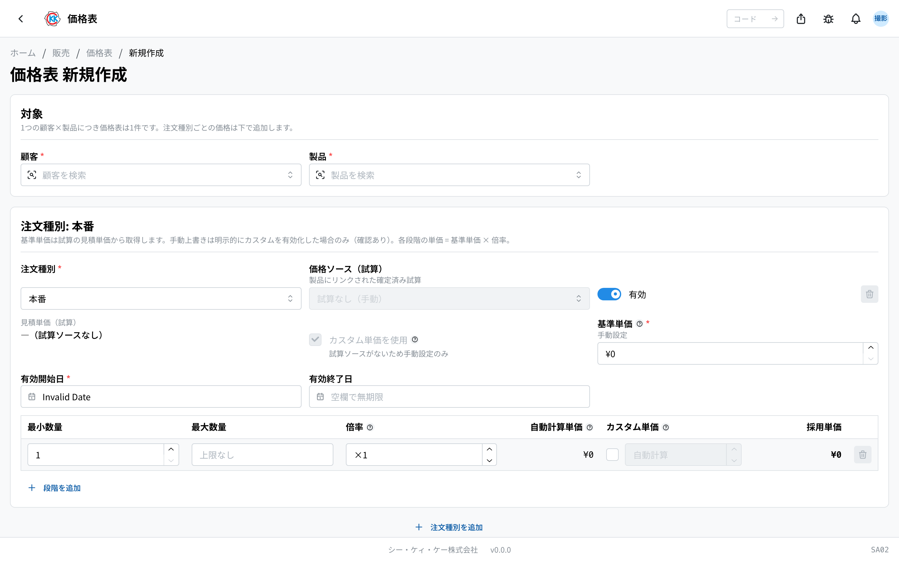
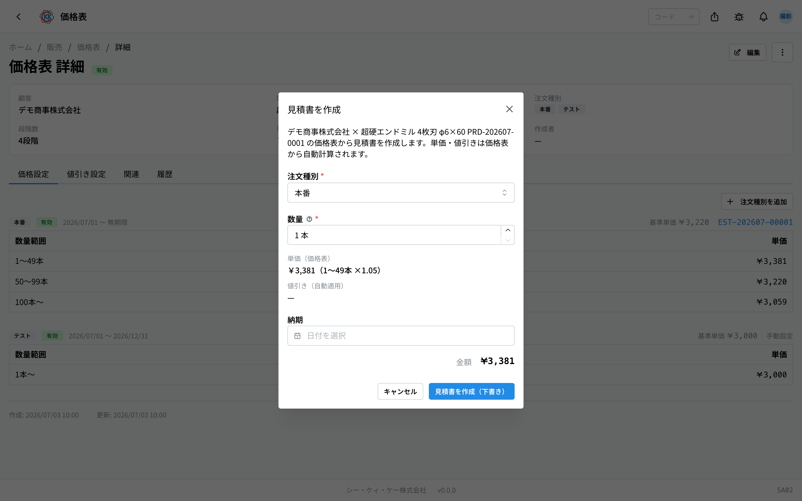

お客様ごとに「この[製品](/manual/ja/operations/masters/product/user)はいくら」という値段を登録しておく台帳です。操作コードは `SA02` です。

## このアプリでできること

- [お客様](/manual/ja/operations/masters/business-partner/user)ごとの製品の売値を登録できます。
- 登録しておくと、[見積書](/manual/ja/operations/sales/quote/user)の金額が **自動で入ります**（見積書の画面で金額を手入力する必要はありません）。
- [注文請書](/manual/ja/operations/sales/order-acceptance/user)では、お客様の注文書の単価とここの値段が **自動で見比べられ**、違っていれば知らせてくれます。
- 「**たくさん買うと 1 本あたりが安くなる**」という数量ごとの値段を設定できます。
- 期間限定のキャンペーン値引きを登録しておけます。
- この価格表からそのまま見積書をつくれます。

お客様との値段が決まったときに登録し、以後はここを直せば見積書の金額も変わります。

## 用語（このページで出てくる言葉）

- **価格表** … 「お客様 1 社 × 製品 1 つ」で 1 件です。同じ組み合わせは 1 件しか作れません。
- **注文種別（ちゅうもんしゅべつ）** … **本番 / テスト / サンプル / その他** の区分です。同じ製品でも区分ごとに値段を変えられます。
- **基準単価** … その注文種別の基本の値段です。ふつうは[試算](/manual/ja/operations/sales/trial-estimate/user)の結果から入ります。
- **段階（数量段階）** … 「1〜49 本はこの値段、50〜99 本はこの値段」という数量ごとの区切りです。
- **倍率** … 基準単価を何倍にするかの数字です。1 より小さくすると安くなります。
- **値引きルール** … 期間と本数の条件を決めておくと、見積書をつくるときに自動で引かれる値引きです。

## はじめる前に

- 対象の[お客様](/manual/ja/operations/masters/business-partner/user)と[製品](/manual/ja/operations/masters/product/user)が登録されている必要があります。
- 値段のもとにする[試算](/manual/ja/operations/sales/trial-estimate/user)があると便利です。試算に製品を指定して「確定」しておくと、この画面で選べるようになり、金額が自動で入ります。
- 試算がなくても、値段を手で入力して登録できます。

## 画面の見かた

アプリを開くと、登録済みの価格表が一覧で表示されます。1 行が「お客様 × 製品」1 件です。

- **注文種別** … その価格表に登録されている区分がバッジで並びます。
- **段階** … 数量の区切りがいくつあるかです。
- **単価** … いちばん安い値段からいちばん高い値段までの範囲です。
- **値引き** … ピンクのバッジの数字は、使える値引きルールの件数です。
- **試算元** … どの試算から値段を取り込んだかです。「手動」は手で入力したものです。
- **状態** … 「有効」「無効」で使えるかどうかがわかります。
- 行をクリックすると詳しい画面が開きます。

## 価格表をつくる

1. 一覧画面の右上にある「**新規作成**」を押します。
2. 「**顧客**」の欄をクリックし、お客様を選びます。
3. 「**製品**」の欄をクリックし、製品を選びます。
4. 「**注文種別**」で区分（はじめは「本番」）を選びます。
5. 「**価格ソース（試算）**」の欄をクリックし、値段のもとにする試算を選びます。選ぶと「**基準単価**」に金額が自動で入ります。
6. 「**有効開始日**」を選びます。
7. テストとサンプルの場合は「**有効終了日**」も必ず選びます。
8. 数量の表で「**最小数量**」「**最大数量**」「**倍率**」を入れます。
9. 区切りを増やしたいときは「**段階を追加**」を押します。
10. 別の区分の値段も登録するときは「**注文種別を追加**」を押し、5 〜 9 をくり返します。
11. 「**保存**」を押します。

倍率を入れると「**自動計算単価**」と「**採用単価**」にその場で金額が表示されるので、確認しながら入力できます。

> 💡 数量の区切りは「1〜49 本は倍率 1.05、50〜99 本は 1.00、100 本〜は 0.95」のように設定します。たくさん買うほど 1 本あたりが安くなる、という決め方です。

> ⚠️ 「この製品にリンクされた確定済みの試算はありません」と出たときは、その製品の試算がまだ確定していません。試算を使いたい場合は先に[試算](/manual/ja/operations/sales/trial-estimate/user)で製品を指定して確定してください。試算を使わない場合は「**カスタム単価を使用**」にチェックを入れ、基準単価を手で入力します。

## 登録した内容を見る

価格表の画面には、4 つのタブがあります。

- **価格設定** … 注文種別ごとの基準単価・有効期間・数量ごとの単価の一覧です。
- **値引き設定** … 値引きルールの一覧です。
- **関連** … どの試算から値段が入ったか、この価格表から作った見積書の一覧です。
- **履歴** … いつ誰が変更したかの記録です。

数量の表で「**手動**」というオレンジのバッジが付いている行は、倍率での計算ではなく手で入れた値段が使われています。

## 値段を直す

1. 価格表の画面の右上にある「**編集**」を押します。
2. 直したいところ（基準単価・有効期間・数量の段階）を変えます。
3. 「**保存**」を押します。

- **お客様と製品は、作ったあとは変えられません。** 別の組み合わせが必要なときは新しく作ってください。
- 保存済みの注文種別と、その値段のもとにした試算も変えられません。
- ある数量の区切りだけ特別な値段にしたいときは、その行の「**カスタム単価**」にチェックを入れ、金額を入力します。確認の画面が出るので「**カスタム設定する**」を押します。

## 値引きルールを登録する

1. 価格表の画面で「**値引き設定**」タブを開きます。
2. 値引きを付けたい注文種別の右にある「**値引きルールを追加**」を押します。
3. 「**名称**」に、あとでわかる名前を入れます（例: 夏季キャンペーン）。
4. 「**値引き種別**」で「**率（%）**」か「**金額（¥/本）**」を選びます。
5. 値引きの数字を入れます。
6. 「**数量下限**」「**数量上限**」で、何本以上のときに使うかを決めます（上限は空欄で制限なしです）。
7. 「**有効開始日**」を選びます。終了日は空欄で無期限になります。
8. 「**追加**」を押します。

登録した値引きは、条件（期間と本数）に合っていれば見積書をつくるときに自動で引かれます。条件に合うルールが複数あるときは、値引き額がいちばん大きいものが使われます。

ルールを直すときは鉛筆のマーク、消すときはゴミ箱のマークを押します。

## この価格表から見積書をつくる

1. 価格表の画面の右上の「**…**」（点が 3 つのボタン）を押します。
2. 「**見積書を作成**」を選びます。
3. 「**注文種別**」と「**数量**」を入れます。単価と値引きが自動で表示されます。
4. 必要なら「**納期**」を入れます。
5. 「**見積書を作成（下書き）**」を押します。

内容が入った状態で[見積書](/manual/ja/operations/sales/quote/user)の作成画面が開きます。一覧の行の「**…**」からも同じ操作ができます。

## そのほかの操作

価格表の画面の右上の「**…**」から、次のこともできます。

- **有効期間を変更** … 値段はそのままで、期間だけを新しい期間に付け替えます。
- **別の顧客・製品へコピー** … 同じ値段の設定を、別のお客様や製品にコピーします（試算とのつながりは外れ、手で入力した扱いになります）。
- **削除** … その価格表を消します。取り消せません。

一覧では、行の左のチェックボックスで複数選んでから「**有効化**」「**無効化**」「**一括削除**」もできます。

## 入力項目

価格表の画面で入力する項目の一覧です。アプリの入力欄の横にある「?」からも、その項目の説明へ直接来られます。

| 項目 | 必須 | 何を入れるか |
|------|------|-------------|
| [顧客](#field-customer) | 必須 | 価格を決める相手 |
| [製品](#field-product) | 必須 | 価格を決める製品 |
| [有効（価格表全体）](#field-active) | — | この価格表を使うかどうか |
| [注文種別](#field-order-type) | 必須 | 本番・テストなどの区分 |
| [価格ソース（試算）](#field-estimate) | 任意 | 基準単価のもとにする試算 |
| [基準単価](#field-base-price) | 必須 | 数量段階のもとになる単価 |
| [有効開始日](#field-valid-from) | 必須 | この価格を使い始める日 |
| [有効終了日](#field-valid-until) | 任意 | この価格を使い終わる日 |
| [倍率](#field-multiplier) | 必須 | 数量段階ごとの掛け率 |
| [カスタム単価](#field-custom-price) | 任意 | 段階ごとに単価を手で決める |

### 顧客 [#field-customer]

価格を決める相手です。**顧客と製品の組み合わせで 1 つの価格表**になり、作った後は変えられません。相手を間違えたときは、作り直してください。

### 製品 [#field-product]

価格を決める製品です。顧客と同じく、作った後は変えられません。

### 有効（価格表全体）[#field-active]

この価格表を使うかどうかです。**外すと見積書で単価が引けなくなります。** 使わなくなった価格表を残したまま止めたいときに使います。

### 注文種別 [#field-order-type]

本番・テスト・サンプル・その他の区分です。**同じ顧客・製品でも、種別ごとに違う価格を持てます。** サンプルは金額 0 で扱います。

### 価格ソース（試算）[#field-estimate]

基準単価のもとにする試算です。**確定した試算だけ選べます。** 選ぶとその試算の見積単価が基準単価に入り、試算は「価格表登録済」になって編集できなくなります（過去の価格が後から変わらないようにするためです）。手で入れたい場合は選ばなくても構いません。

### 基準単価 [#field-base-price]

数量段階のもとになる単価です。段階ごとの単価は、この単価に倍率を掛けて決まります。

### 有効開始日 [#field-valid-from]

この価格を使い始める日です。見積書を作るとき、**その時点で有効な価格**が使われます。

### 有効終了日 [#field-valid-until]

この価格を使い終わる日です。空にすると期限なしになります。**テスト・サンプルの価格は終了日を入れる運用**です。

### 倍率 [#field-multiplier]

数量の範囲ごとの掛け率です。たくさん買うほど単価を下げたいときに、1 より小さい値を入れます。

### カスタム単価 [#field-custom-price]

その段階だけ単価を手で決めたいときに使います。入れると倍率での計算より優先されます。

## よくある質問・困ったとき

**Q.「同一の顧客・製品の価格表が既に存在します。既存の価格表を編集してください。」と出ます。**
A. そのお客様とその製品の価格表はすでにあります。新しく作らず、既存の価格表を開いて「編集」から注文種別や値段を追加してください。作成画面でも、重複しているときは赤い案内と既存の価格表へのリンクが表示されます。

**Q. 顧客と製品の欄が灰色になっていて選べません。**
A. 作成したあとの価格表では、お客様と製品は変えられない決まりです。別の組み合わせが必要なときは、一覧から新しく作成してください。

**Q. 保存しようとすると「テスト・サンプルは有効終了日が必須です」と出ます。**
A. テストとサンプルの値段には、いつまで有効かの終了日が必ず必要です。「有効終了日」を選んでから保存してください。

**Q. 基準単価の欄に数字を入れられません。**
A. 試算から値段を取り込んでいる場合、基準単価は試算の金額のまま使う決まりです。別の金額にしたいときは「**カスタム単価を使用**」にチェックを入れてください（確認の画面が出ます）。

**Q. 見積書で「この数量に該当する価格段階がありません」と出ます。**
A. 入力した本数に合う数量の区切りが価格表にありません。「編集」から、その本数を含む段階を追加してください（いちばん上の段階の「最大数量」を空欄にすると、上限なしになります）。

**Q. 価格表を直したのに、前に作った見積書の金額が変わりません。**
A. 見積書は作ったときの金額をそのまま残す仕組みです。新しい金額にしたいときは、その[見積書](/manual/ja/operations/sales/quote/user)を開いて「編集」→「保存」をすると、そのときの価格表の金額が入り直します。
