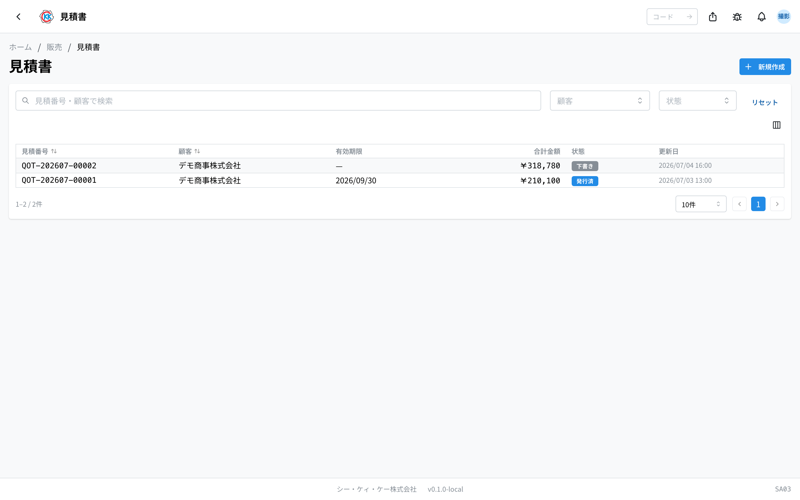
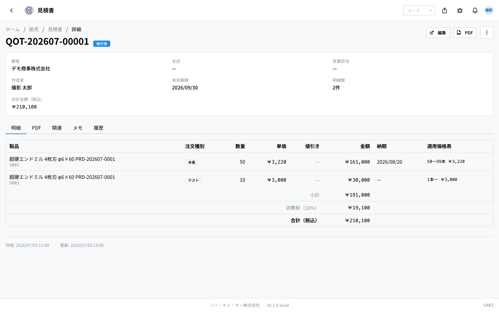
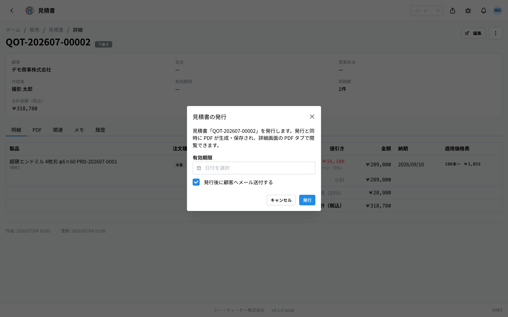
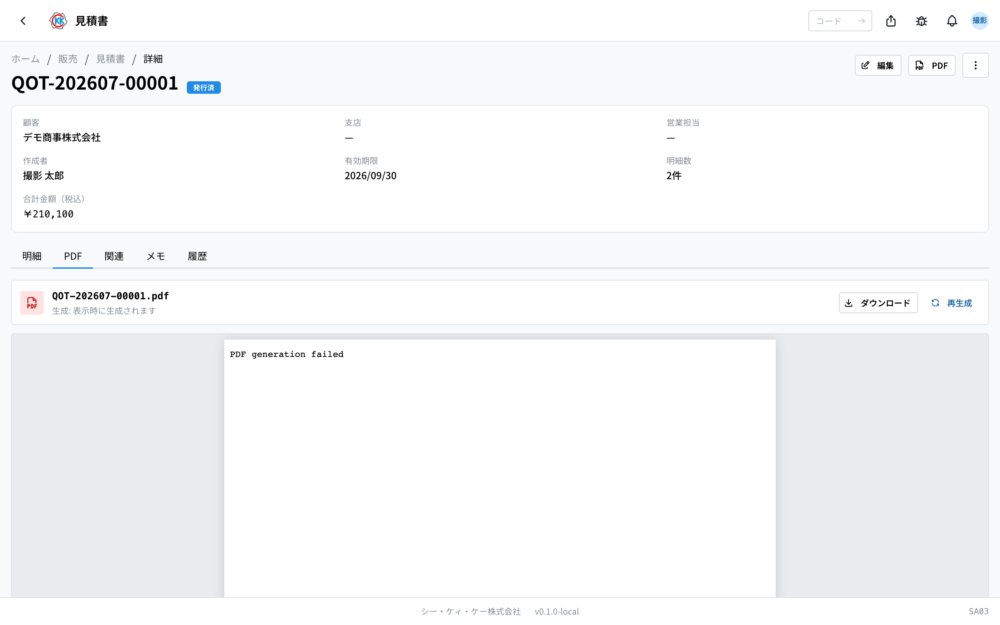

お客様に提出する **見積書** を作り、PDF にして発行するアプリです。操作コードは `SA03` です。

> このアプリが属するフロー … [販売の流れ](/manual/ja/process/sales)

## このアプリでできること

- お客様に出す見積書をつくれます。
- 製品と本数を選ぶだけで、**金額が自動で計算** されます（電卓は不要です）。
- できあがった見積書を **PDF** にして、印刷したりメールで送ったりできます。
- 「まだ検討中」「受注できた」など、見積書の今の状況を記録できます。
- 似た内容の見積書は **複製** して作り直せます。

## 用語（このページで出てくる言葉）

- **明細（めいさい）** … 見積書の中の 1 行のこと。「どの製品を何本」を書きます。
- **注文種別（ちゅうもんしゅべつ）** … 本番・テスト・サンプルなどの区分です。同じ製品でも区分ごとに金額が変わります。
- **価格表** … お客様ごとの製品の値段を、あらかじめ登録しておく台帳です。見積書の金額はここから自動で入ります。
- **下書き / 発行済** … 下書きはまだ社内だけの状態、発行済はお客様に出せる状態です。

## はじめる前に

見積書をつくるには、**そのお客様とその製品の[価格表](/manual/ja/operations/sales/price-list/user)が先に登録されている必要があります**。価格表が無いと、金額が計算できないため保存できません。

まだ価格表が無いときは、先に[試算](/manual/ja/operations/sales/trial-estimate/user)で単価を計算し、[価格表](/manual/ja/operations/sales/price-list/user)に登録してください。

## 画面の見かた

アプリを開くと、これまでに作った見積書の一覧が表示されます。

- **見積番号** … `QOT-` で始まる番号です。システムが自動で付けます。
- **状態** … 色つきのバッジで今の状況がわかります。灰色は「下書き」、青は「発行済」、緑は「受諾済」です。
- 上の検索欄に見積番号やお客様の名前を入れると、探している見積書を絞り込めます。
- 行をクリックすると、その見積書の詳しい画面が開きます。

## 見積書をつくる

1. 一覧画面の右上にある「**新規作成**」を押します。
2. 「**顧客**」の欄をクリックして、お客様を選びます。
3. お客様に支店がある場合は「**支店**」も選びます（無ければそのままで大丈夫です）。
4. 「**有効期限**」に、この見積が有効な期日を入れます（空欄のままでも保存できます）。
5. 明細の行で「**製品**」「**注文種別**」「**数量**」を選びます。
6. 入力すると、**単価・値引き・金額が自動で表示されます**。金額は手で直す必要はありません。
7. 製品ごとに納期が決まっている場合は「**納期**」も入れます。
8. 行を増やしたいときは「**明細を追加**」を押します。
9. 最後に「**保存**」を押します。

保存すると「下書き」として登録され、詳しい画面が開きます。

> 💡 金額はお客様ごとの価格表から自動で入ります。値段を変えたいときは、この画面ではなく[価格表](/manual/ja/operations/sales/price-list/user)のほうを直してください。

> ⚠️ 行に「**価格表なし**」と赤く表示されたときは、そのお客様とその製品の価格表がまだありません。そのままでは保存できないので、先に価格表を登録してください。

## 内容を確認する

保存した見積書の画面には、4 つのタブがあります。

- **明細** … 製品・本数・金額の一覧です。下に小計・消費税・合計が出ます。
- **PDF** … 発行したあとの PDF を見たり、ダウンロードしたりできます。
- **関連** … どの価格表・どの試算から金額が入ったかを確認できます。
- **履歴** … いつ誰が変更したかの記録です。

## 発行する（お客様に出せる状態にする）

1. 見積書の画面の右上「**…**」（点が 3 つのボタン）を押します。
2. 「**発行**」を選びます。
3. 「見積書の発行」という小さな画面が出るので、**有効期限** を確認します。
4. お客様にメールで送りたいときは「**発行後に顧客へメール送付する**」にチェックを入れます。
5. 「**発行**」を押します。

発行すると状態が「**発行済**」に変わり、**PDF が自動で作られます**。

PDF タブを開くと、できあがった見積書を見たり、ダウンロードして印刷したりできます。

## 発行したあとの記録

お客様から返事があったら、見積書の状態を変えて記録しておきます。

1. 画面右上の「**編集**」を押します。
2. 「**状態**」の欄を選び直します。
   - 注文をいただけた → 「**受諾済**」
   - お断りされた → 「**却下**」
   - 期限が過ぎた → 「**期限切れ**」
3. 「**保存**」を押します。

> 💡 [注文請書](/manual/ja/operations/sales/order-acceptance/user)の作業でこの見積書の番号を指定した場合は、自動で「受諾済」になります。手で変える必要はありません。

## 似た見積書をつくる

前に作った見積書とほぼ同じ内容を出すときは、作り直さずに複製できます。

1. コピー元の見積書を開きます。
2. 右上の「**…**」から「**複製**」を押します。
3. 同じ内容の下書きができるので、変えたいところだけ直して保存します。

見積番号は新しい番号が自動で付きます。

## 入力項目

見積書の画面で入力する項目の一覧です。アプリの入力欄の横にある「?」からも、その項目の説明へ直接来られます。

| 項目 | 必須 | 何を入れるか |
|------|------|-------------|
| [顧客](#field-customer) | 必須 | 見積書を出すお客様 |
| [支店](#field-customer-branch) | 任意 | 宛先の支店（登録がある場合） |
| [有効期限](#field-valid-until) | 任意 | 見積が有効な最終日 |
| [状態](#field-status) | — | 見積書のいまの扱い |
| [製品](#field-product) | 必須 | 見積もる製品 |
| [注文種別](#field-order-type) | 必須 | 本番・テストなどの区分 |
| [数量](#field-quantity) | 必須 | 本数 |
| [単価（価格表）](#field-unit-price) | 自動 | 価格表から入る単価 |
| [値引き（自動）](#field-discount) | 自動 | 価格表の値引きルールの結果 |
| [納期](#field-delivery-date) | 任意 | 明細ごとの納入予定日 |
| [備考](#field-notes) | 任意 | 社内向けの補足 |

### 顧客 [#field-customer]

見積書を出すお客様を選びます。**ここで選んだ顧客の価格表から単価が決まる**ため、最初に選んでください。顧客を変えると、すでに入力した明細の単価も選び直しになります。

### 支店 [#field-customer-branch]

宛先の支店を選びます。その顧客に支店が登録されていないときは選べません（空のままで問題ありません）。

### 有効期限 [#field-valid-until]

この見積が有効な最終日です。日付を過ぎた見積書は、一覧で「期限切れ」として扱えます。空のままにもできます。

### 状態 [#field-status]

見積書のいまの扱いです。新しく作ると「下書き」から始まります。お客様に出せる状態にするときは、この欄ではなく画面の「発行」を使ってください。

### 製品 [#field-product]

見積もる製品を選びます。選ぶと、顧客・注文種別・数量の組み合わせに合う単価が価格表から自動で入ります。**価格表に無い製品を選ぶと単価が入らず、警告が出ます。**

### 注文種別 [#field-order-type]

本番・テスト・サンプル・その他の区分です。**同じ製品でも種別ごとに価格が違う**ため、実際の注文に合わせて選んでください（サンプルは金額 0 で扱います）。

### 数量 [#field-quantity]

本数を入れます。価格表で数量の範囲ごとに単価が決まっている場合は、入れた数量に応じて単価が変わります。

### 単価（価格表）[#field-unit-price]

価格表から自動で入る単価です。**手では入力できません。** 金額を変えたいときは、価格表側の基準単価や数量の設定を直してください。

### 値引き（自動）[#field-discount]

価格表の値引きルールに当てはまった場合に、自動で引かれる金額です。こちらも手入力はできません。

### 納期 [#field-delivery-date]

その明細をお客様へ納入する予定日です。明細ごとに指定できます。決まっていなければ空のままにできます。

### 備考 [#field-notes]

社内向けの補足です。見積書の PDF には出ません。

## よくある質問・困ったとき

**Q. 金額の欄に自分で数字を入れられません。**
A. 見積書では金額を手入力できない仕組みです。金額はお客様ごとの[価格表](/manual/ja/operations/sales/price-list/user)から自動で入ります。値段を変えたいときは価格表を直してください。

**Q.「該当する価格表がありません」と出て保存できません。**
A. そのお客様とその製品の価格表がまだ登録されていません。先に[試算](/manual/ja/operations/sales/trial-estimate/user)で単価を出し、[価格表](/manual/ja/operations/sales/price-list/user)に登録してから、もう一度お試しください。

**Q. お客様を選び直したら、金額が変わりました。**
A. 正常な動きです。金額はお客様ごとに決まっているため、お客様を変えるとそのお客様の価格表で計算し直されます。

**Q. 有効期限を過ぎたのに、状態が「発行済」のままです。**
A. 期限が来ても状態は自動では変わりません。「編集」から「期限切れ」に変えてください。

**Q. 数量を増やしたら単価が下がりました。**
A. 正常な動きです。価格表で「たくさん注文すると 1 本あたりが安くなる」設定になっている場合、数量に応じて単価が変わります。

**Q. 間違えて発行してしまいました。**
A. 発行を取り消す操作はありません。内容が違う場合は、正しい内容で新しく作り直し（複製が便利です）、間違えたほうを「却下」にしておくと分かりやすくなります。
