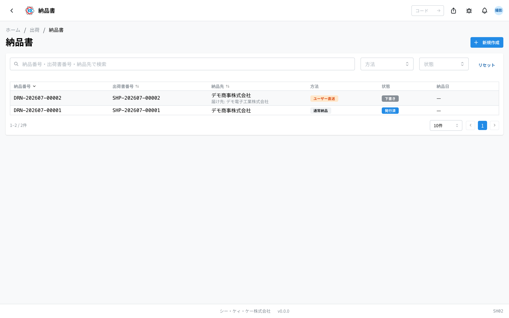
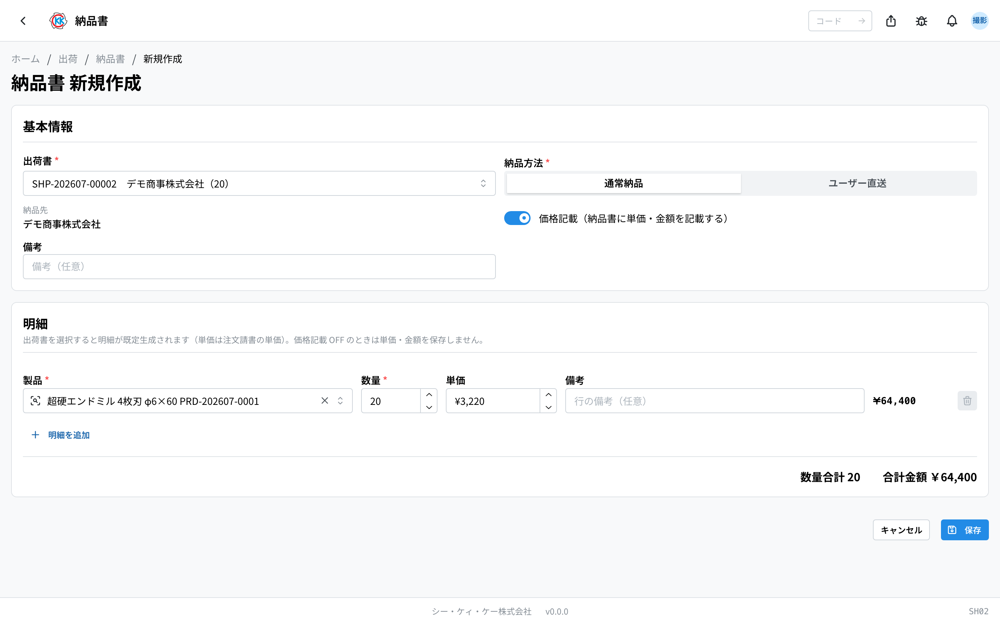
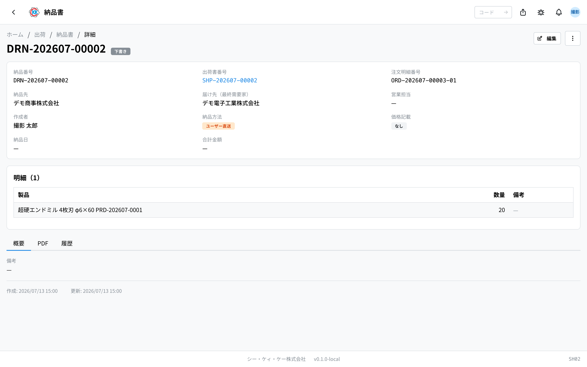
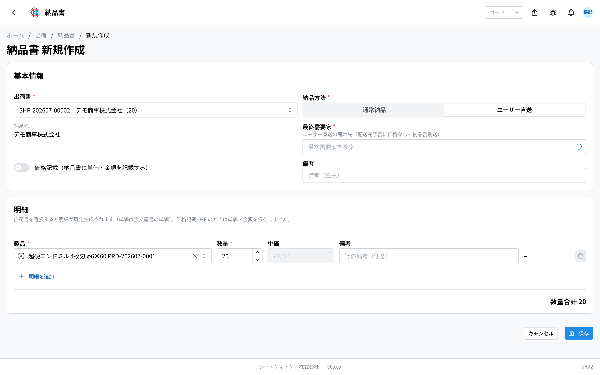
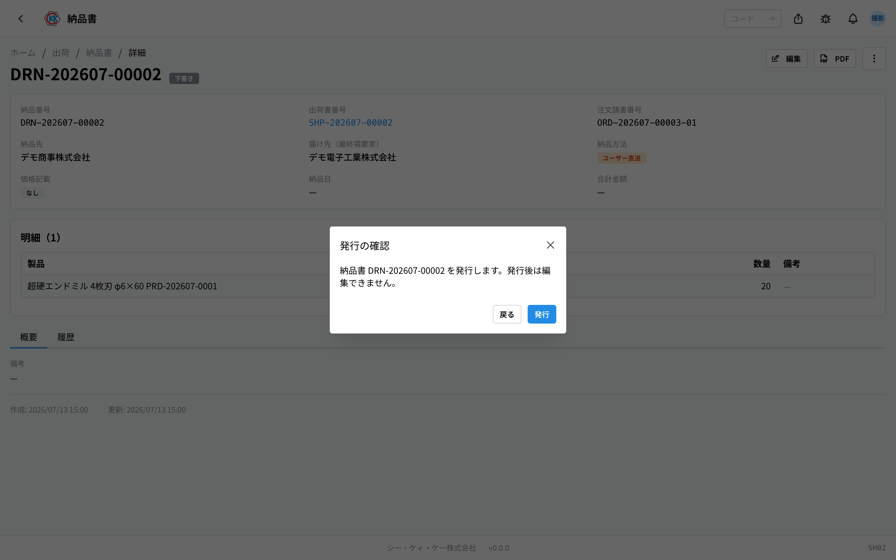
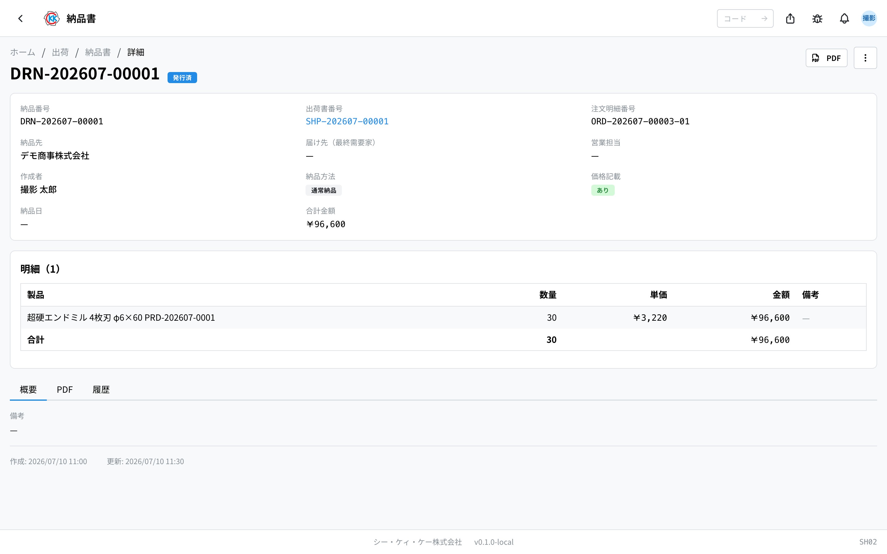

用来做随发货产品一起送达的 **送货单**（納品書）。操作代码是 `SH02`。

> ⚠️ 本应用还在准备中。正式启用之前，界面和步骤可能会有变化。

## 本应用能做什么

- 可以做出交给收货方的送货单。
- 只要选一张[出货单](/manual/zh/operations/shipping/shipping-order/user)，**收货方和货物内容会自动填好**。
- 可以选择 **写上 / 不写上** 金额。
- 可以把送货单转成 **PDF**，打印出来或随货附上。
- 可以记录「已发行」「已送达」这些当前状况。

## 本页出现的词

- **出荷書（出货单）** … 记录发了什么、发了多少的单据。送货单以它为依据来做。
- **納品先（送货对象）** … 下订单的客户。由出货单自动决定。
- **通常納品 / ユーザー直送（普通送货 / 直送最终需求方）** … 「通常納品」是送到下订单的客户处，「ユーザー直送」是直接送到实际使用产品的公司。
- **最終需要家（最终需求方）** … 实际使用产品的公司。直送时的收货方就是它。
- **価格記載（记载价格）** … 送货单上是否写出单价和金额的设置。

## 开始之前

- 需要先有[出货单](/manual/zh/operations/shipping/shipping-order/user)，而且这张出货单必须是「**確定**」（确定）或「**出荷済**」（已发货）。「下書き」（草稿）状态的出货单做不了送货单。
- 要直送最终需求方时，收货公司必须已经登记为[最终需求方](/manual/zh/operations/masters/end-user/user)。
- 做送货单需要送货单权限。如果不能用，请联系管理员。

## 界面怎么看

打开应用后，会看到之前做过的送货单一览。

- **納品番号（送货单号）** … 以 `DRN-` 开头的编号，由系统自动编。
- **方法（方式）** … 橙色的「ユーザー直送」（直送最终需求方）是直接送到使用产品的公司，灰色的「通常納品」（普通送货）是送到客户处。
- **状態（状态）** … 灰色是「下書き」（草稿），蓝色是「発行済」（已发行），绿色是「納品済」（已送达）。
- 上面的搜索框里可以输入送货单号、出货单号、送货对象名称来筛选。
- 一览里显示的是 **从自己所属据点发出的送货单** 和 **自己做的送货单**。
- 点一行就能打开这张送货单的详细界面。

## 做一张送货单

1. 点一览界面右上角的「**新規作成**」（新建）。
2. 点「**出荷書**」（出货单）栏，选对应的出货单。
3. 「**納品先**」（送货对象）和明细（产品、数量、单价）会 **自动填好**。
4. 在「**納品方法**」（送货方式）里选「**通常納品**」（普通送货）或「**ユーザー直送**」（直送最终需求方）。
5. 不想写上金额时，把「**価格記載（納品書に単価・金額を記載する）**」（记载价格 — 在送货单上写出单价和金额）的开关关掉。
6. 数量和实际不一样时，修改明细里的「**数量**」（数量）。
7. 点「**保存**」（保存）。

保存后会登记为「**下書き**」（草稿），并打开详细界面。

> 💡 从出货单界面的「**納品書を作成**」（创建送货单）开始的话，出货单已经事先选好，做起来更快。

## 写上金额、不写上金额

送货单上是否写出单价和金额，由「**価格記載**」（记载价格）开关决定。

- 选「**通常納品**」（普通送货）时，一开始是「写上」。
- 选「**ユーザー直送**」（直送最终需求方）时，会自动切换成「不写上」。这是为了不让使用产品的公司看到金额。
- 一开始的设置只是参考，需要时可以自己用开关改。

关掉开关后，单价栏就不能输入了。就这样保存的话，**界面上和 PDF 里都不会出现金额**。

## 直送最终需求方

要直接送到使用产品的公司时，按下面做。

1. 在「**納品方法**」（送货方式）里点「**ユーザー直送**」（直送最终需求方）。
2. 会出现「**最終需要家**」（最终需求方）栏，选收货公司。
3. 其他输入和普通送货一样。

没选「最終需要家」就保存的话，会出现「**最終需要家を選択してください**」（请选择最终需求方）。

## 发行并送达

送货单按「下書き」（草稿）→「発行済」（已发行）→「納品済」（已送达）三个阶段推进。操作在界面右上角的「**…**」（三个点的按钮）里进行。

### 1. 发行

1. 在送货单界面点右上角的「**…**」。
2. 选「**発行**」（发行）。
3. 弹出「発行の確認」（发行确认）后，点「**発行**」（发行）。

发行后状态变成「**発行済**」（已发行），**就不能再编辑了**。

### 2. 送到之后

1. 点右上角的「**…**」。
2. 选「**納品済みにする**」（标记为已送达）。
3. 弹出「納品の確認」（送达确认）后，点「**納品済みにする**」（标记为已送达）。

当天的日期会记为 **納品日（送达日）**，状态变成「**納品済**」（已送达）。

另外，这张送货单的编号，之后会作为「由来」（来源）显示在[发票](/manual/zh/operations/billing/invoice/user)的明细里。从发票可以马上打开这张送货单。

## 打印（PDF）

点界面右上角的「**PDF**」，送货单的 PDF 会在新标签页里打开，可以从那里打印或保存。草稿状态也能打印，所以也可以用来在发出之前做确认。

> ⚠️ 送货单没有删除操作。做出来的送货单删不掉，所以请 **趁还是草稿的时候** 仔细确认内容。

## 常见问题与困扰

**Q. 出货单栏里找不到想要的出货单。**
A. 能选的只有「確定」（确定）或「出荷済」（已发货）的出货单。如果还是「下書き」（草稿），请先在[出货单](/manual/zh/operations/shipping/shipping-order/user)那边「確定」。

**Q. 想把送货对象改成别的公司，却选不了。**
A. 送货对象是根据出货单背后的销售订单上的客户自动决定的，在这个界面改不了。收货方不对时，请从正确的出货单重新做一张。

**Q. 出现「…は出荷書に含まれていません」（…不在出货单里），保存不了。**
A. 明细里放了出货单上没有的产品。请删掉那一行，或改选出货单上有的产品。

**Q. 出现「…の数量 60 が出荷数量 50 を超えています」（…的数量 60 超过了发货数量 50），保存不了。**
A. 写的支数比实际发出的多。请把数量改到不超过出货单的支数。

**Q. 以「不写金额」保存之后，又想写上金额了。**
A. 还是「下書き」（草稿）时，可以用「編集」（编辑）把开关重新打开。不过单价没有保存，请重新输入。发行之后就改不了了，请重新做一张。

**Q. 发行之后才发现内容有错。**
A. 没有撤销发行的操作。请用正确的内容重新做一张送货单，弄错的那张不要交给客户。
