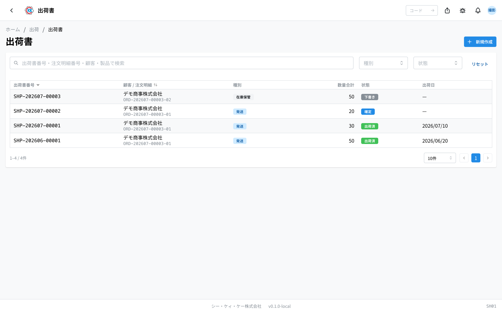
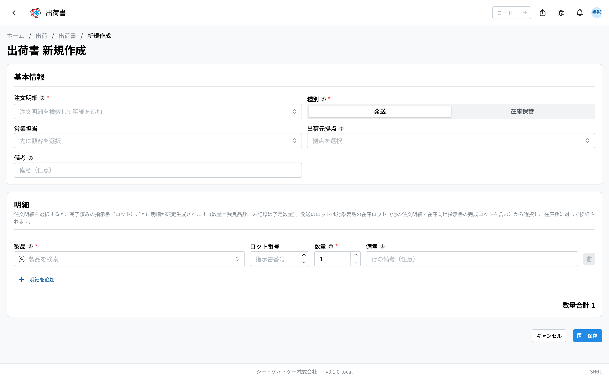
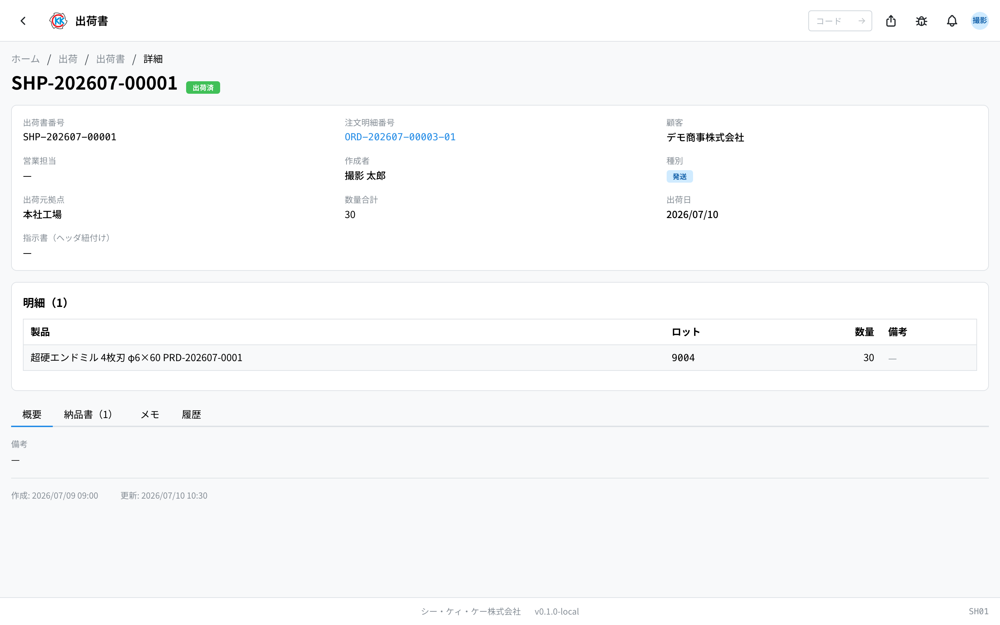
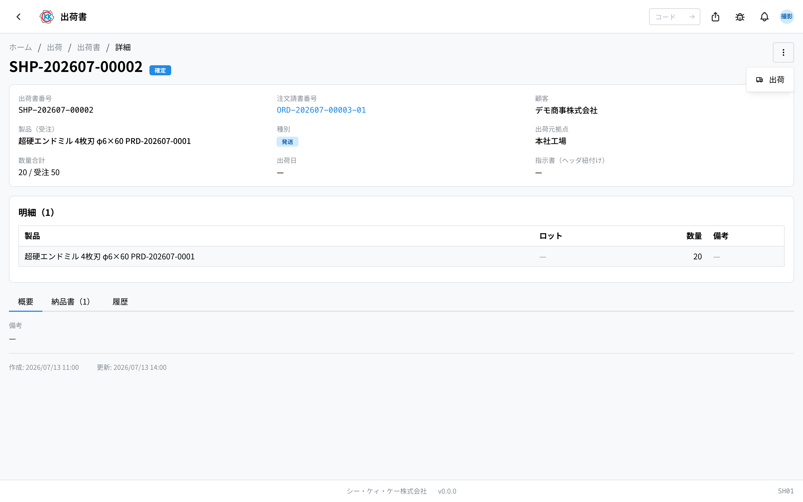
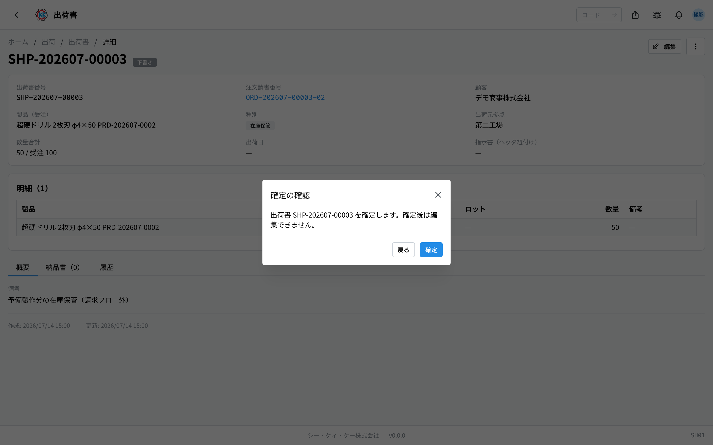
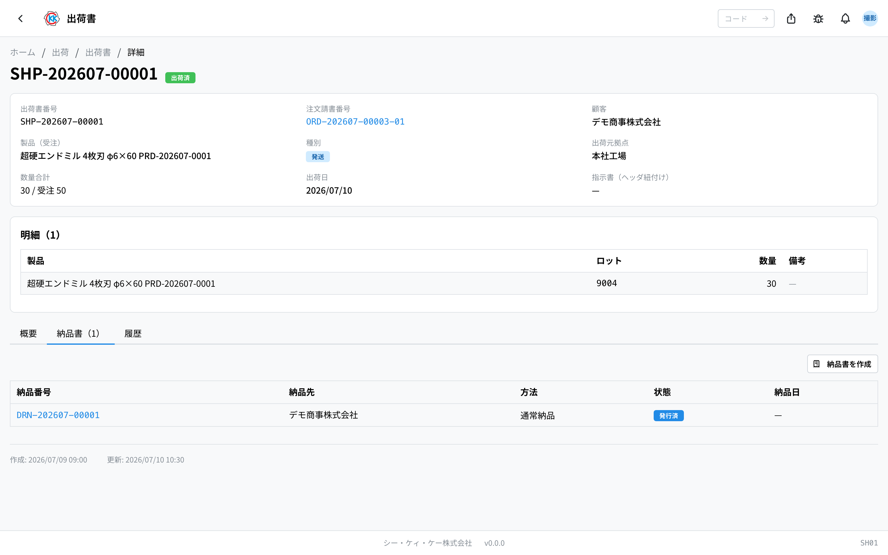

把做好的产品发给客户时，用来记录 **发了什么、发了多少** 的 **出货单**（出荷書）。操作代码是 `SH01`。

> ⚠️ 本应用还在准备中。正式启用之前，界面和步骤可能会有变化。

## 本应用能做什么

- 可以做一张出货单，写清要发的产品和数量。
- 只要选一张销售订单，**做好的部分会自动填进明细里**（不用重新手打）。
- 记录发货以后，**库存会自动减少**。
- 可以从出货单做出[送货单](/manual/zh/operations/shipping/delivery-note/user)。
- 不发出去、留在公司里保管的部分（比如多做的备品）也可以记录。

出货单是很重要的单据，以后做[发票](/manual/zh/operations/billing/invoice/user)时就以它为依据。

## 本页出现的词

- **注文請書（销售订单）** … 写明「发给哪个客户、什么产品、多少支、什么时候交」的单据。做出货单时要看它。
- **指示書（制造指示书）** … 发给工厂的单据，写着「请做这么多这个产品」。做完的指示书的量才可以发货。
- **批次（ロット）** … 一次做出来的一批产品的编号。指示书的编号就是批次号。
- **発送 / 在庫保管（发送 / 留库保管）** … 「発送」是发给客户的部分，「在庫保管」是不发出去、留在公司保管的部分。
- **明細（明细）** … 出货单里的一行，写着「什么产品、多少支」。

## 开始之前

- 要发的那部分，必须先登记好 **注文請書（销售订单）**。
- 请确认产品已经做好（[指示書](/manual/zh/operations/production/work-order/user)已经完成）。完成的指示书的量会自动填进明细。
- 做出货单或发货需要出货权限。如果不能用，请联系管理员。

## 界面怎么看

打开应用后，会看到之前做过的出货单一览。

- **出荷書番号（出货单号）** … 以 `SHP-` 开头的编号，由系统自动编。
- **種別（类别）** … 蓝色的「発送」（发送）是发给客户的部分，灰色的「在庫保管」（留库保管）是留在公司的部分。
- **状態（状态）** … 灰色是「下書き」（草稿），蓝色是「確定」（确定），绿色是「出荷済」（已发货）。
- 上面的搜索框里可以输入出货单号、销售订单号、客户名称、产品名称来筛选。这个搜索框是用来 **查找已经做好的出货单** 的，和新建时选择销售订单的那个栏位是两回事。
- 一览里显示的是 **从自己所属据点发出的出货单**。
- 点一行就能打开这张出货单的详细界面。

## 做一张出货单

1. 点一览界面右上角的「**新規作成**」（新建）。
2. 点「**注文請書**」（销售订单）栏，选要发货的销售订单。在这个栏位里，是用 **客户名称、产品名称、客户的订单编号** 来查找的（与一览界面的搜索框不同，这里无法用 `ORD-` 开头的销售订单号查找）。
3. 做好的指示书的量会 **自动填进明细**（一张指示书一行）。数量填的是这张指示书做出的良品数（还没有记录时，就是原本预定做的数量）。
4. 在「**種別**」（类别）里选「**発送**」（发送）或「**在庫保管**」（留库保管）。一般保持「発送」即可。
5. 在「**出荷元拠点**」（发货据点）里选从哪里发出。
6. 把明细里的「**数量**」（数量）改成实际要发的支数。
7. 想加一行时点「**明細を追加**」（添加明细），想删一行时点该行右边的垃圾桶图标。
8. 点「**保存**」（保存）。

保存后会登记为「**下書き**」（草稿），并打开详细界面。

> 💡 选了销售订单之后，这张订单的内容（客户、产品、接单支数、已完成的指示书件数）会显示在一条蓝色横幅里。请确认无误后再继续。

> ⚠️ 销售订单保存之后就不能改了。选错时，请把这张出货单取消，重新做一张。

## 确认内容

上方会显示出货单号、销售订单号、客户、产品、类别、发货据点、数量、发货日。

- **数量合計（数量合计）** … 像「30 / 受注 50」这样，把要发的支数和订购的支数并排显示。
- 下面的「明細」（明细）里列出产品、批次、数量、备注。
- 有三个标签页：**概要**（概要）是备注，**納品書**（送货单）是从这张出货单做出的送货单一览，**履歴**（历史）是谁在什么时候改了什么的记录。

## 发货前的三个阶段

出货单按「下書き」（草稿）→「確定」（确定）→「出荷済」（已发货）三个阶段推进。操作在界面右上角的「**…**」（三个点的按钮）里进行。

### 1. 把内容定下来（确定）

1. 在出货单界面点右上角的「**…**」。
2. 选「**確定**」（确定）。
3. 会弹出一个叫「確定の確認」（确定确认）的小窗口，看完内容后点「**確定**」（确定）。

确定之后 **就不能再编辑了**，但可以开始做送货单。

### 2. 实际发出之后（发货）

1. 点右上角的「**…**」。
2. 选「**出荷**」（发货）。
3. 弹出「出荷の確認」（发货确认）后，点「**出荷する**」（发货）。

发货后，当天的日期会记为 **出荷日（发货日）**，状态变成「**出荷済**」（已发货）。同时，发出的数量会从[产品库存](/manual/zh/operations/production/product-inventory/user)里减掉，销售订单那边也会自动变成「一部出荷」（部分发货）或「出荷済」（已发货）。

### 弄错时（取消）

只有在「下書き」（草稿）期间，才能从右上角的「**…**」里用「**キャンセル**」（取消）删掉。确定之后就不能删了。

## 不发出去、留在公司保管（留库保管）

多做的备品等不发给客户、留在公司保管时，请在「**種別**」（类别）里选「**在庫保管**」（留库保管）。

- 用「在庫保管」发货时，产品会 **增加** 到保管地的库存里。
- 不会成为请款对象。销售订单的状态也不会变。

在类别里选了「在庫保管」之后，界面上会显示相应的说明。

## 做送货单

1. 在出货单界面打开「**納品書**」（送货单）标签页。
2. 点「**納品書を作成**」（创建送货单）。
3. 会打开[送货单](/manual/zh/operations/shipping/delivery-note/user)的创建界面，出货单已经事先选好。

这个标签页里也会列出从这张出货单做出的送货单（送货单号、送货对象、方式、状态、送货日）。

## 常见问题与困扰

**Q. 在新建界面的「注文請書」（销售订单）栏里，搜索不到想发货的销售订单。**
A. 这个栏位里请输入 **客户名称、产品名称、客户的订单编号**。在这里用 `ORD-` 开头的销售订单号是找不到的（它和一览界面上方的搜索框是两回事，那边可以用销售订单号查找）。如果还是找不到，可能那张销售订单已经是「出荷済」（已发货）或已取消。

**Q. 选了销售订单，明细却只填了一行。**
A. 还没有已完成的指示书时，只会加一行空行。请等产品做好后重做，或者手动输入要发的支数。

**Q. 出现「受注数量 50 を超える出荷になります（累計 60）」（发货量超过接单数量 50，累计 60），发不了货。**
A. 同一张销售订单里，您要发的支数超过了订购的支数。请减少这张出货单的数量，或确认之前已经发过的量。

**Q. 出现「在庫が不足」（库存不足），发不了货。**
A. 发货据点里没有足够的库存。请在[产品库存](/manual/zh/operations/production/product-inventory/user)里确认数量后再试一次。

**Q. 内容弄错想改，但找不到「編集」（编辑）。**
A. 只有在「下書き」（草稿）期间才能编辑。确定之后就改不了了，请保留那张出货单，用正确的内容重新做一张。

**Q. 已经发货了，销售订单却没变成「出荷済」（已发货）。**
A. 请确认类别是不是「在庫保管」（留库保管）。这个类别是留在公司保管的记录，所以销售订单的状态不会变。另外，只发了订购支数的一部分时，会变成「一部出荷」（部分发货）。
