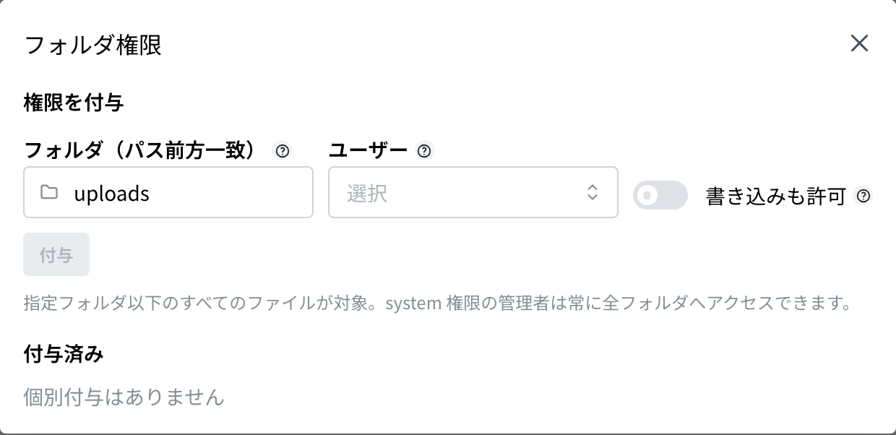

这是一个可以像打开电脑上的文件夹一样，**打开并查看** 保存在系统里的文件的应用。操作代码是 `SY06`。

除了自己上传的文件以外，报价单、发票等由系统自动生成的 PDF 也都放在这里。

## 本应用能做什么

- 逐层进入文件夹，查看里面的文件。
- 选中文件后，可以在右侧确认内容（图片和 PDF）。
- 可以 **下载** 文件，也可以在新标签页中 **打开**。
- 可以往允许的文件夹里 **上传** 文件。
- 可以按文件名跨文件夹查找。
- 系统管理员可以逐人设定「这个人可以查看这个文件夹」。

## 本页出现的词语

- **文件夹** … 放文件的容器。和电脑上的文件夹是一样的概念。
- **系统文件** … 电脑或应用自动生成的 **残留碎片文件**，例如 `.DS_Store`、`Thumbs.db`、`~$报告.xlsx`、`图纸.png.tmp` 等。平时是隐藏的。报价单、发票的 PDF 是业务文件，**不属于系统文件**（平时就会显示）。
- **文件夹权限** … 「这个人可以查看这个文件夹里的内容」这样的规定。由系统管理员设定。

## 开始之前

- 只要已登录，任何人都可以打开本应用，不需要特别的权限。
- 但是 **每个人能看到的文件不一样**。只会显示与自己有关的文件。能看到什么，取决于以下情况。
  1. 系统管理员 … 可以看到全部文件。
  2. 被允许了某个文件夹的人 … 可以看到该文件夹里的内容。
  3. 拥有某个应用权限的人 … 可以看到该应用生成的 PDF。例如可以使用报价单的人，就能看到报价单的 PDF。

## 打开方式

按主页「システム」（系统）里的 **ファイル管理**（文件管理）。或者在画面上方的搜索框里输入 `SY06`。

## 画面说明

- 画面上方会从「**すべて**」（全部）开始依次显示当前所在的位置。点击文字即可返回到那个位置。
- 「**名前**」（名称）… 文件或文件夹的名称。PDF 带红色标记，图片带蓝色标记。
- 「**サイズ**」（大小）… 文件的大小。
- 「**更新日時**」（更新时间）… 最后一次保存的时间。
- 名称旁边带有灰色「**システム**」（系统）标记的文件，是系统自动生成的。
- 点击文件夹即可进入其中。点击文件后，右侧会显示内容。

画面右上角有以下按钮。

- 「**更新**」（刷新）… 重新读取为最新状态。
- 「**アップロード**」（上传）… 添加文件。**只有在允许写入的文件夹里** 才会显示。
- 「**フォルダ権限**」（文件夹权限）… 只对系统管理员显示。

## 更改显示方式

用画面左上角的 3 个标记可以更改排列方式。把鼠标放到标记上会显示名称。

- 「**リスト**」（列表）… 依次排列名称、大小、更新时间的常规显示。
- 「**アイコン**」（图标）… 以较大的标记排列。找照片时很方便。
- 「**カラム**」（分栏）… 把文件夹的层级从左到右排开显示。层级较深时很方便。

里面没有内容时，会显示「**空のフォルダ**」（空文件夹）。

## 查找文件

1. 在画面上方的搜索框「**ファイル名・パスで検索（全フォルダ横断）**」（按文件名・路径搜索（跨全部文件夹））中，输入文件名的一部分。
2. 不论在哪个文件夹里，名称相符的文件都会全部列出。
3. 不再查找时，把输入的文字删掉即可。

> 💡 报价单、发票的 PDF 平时就会列出。如果没有出现，可能是您没有查看该文件夹的许可。

## 打开・下载文件

1. 点击想查看的文件。
2. 右侧会显示文件的内容。图片和 PDF 可以当场确认。
3. 按「**開く**」（打开），会在新标签页中放大显示。
4. 按「**ダウンロード**」（下载），会保存到电脑上。

右侧还会显示「**パス**」（路径，即保存的位置）、「**サイズ**」（大小）、「**更新日時**」（更新时间）和「**種類**」（类型）。

## 上传文件

1. 打开想放入的文件夹。
2. 按画面右上角的「**アップロード**」（上传）。
3. 从电脑上选择文件。
4. 显示「**アップロードしました**」（已上传）就完成了。

> 💡 保存时，文件名的开头会自动加上日期等文字。这是为了防止被同名文件覆盖，也是为了以后能知道文件是什么时候放进来的。内容不会改变。

如果找不到「**アップロード**」按钮，说明您没有往该文件夹写入的许可。请与系统管理员联系。

## 删除文件

1. 点击想删除的文件。
2. 按右侧的「**削除**」（删除）。
3. 会出现名为「**ファイルの削除**」（删除文件）的确认框。看清内容后按「**削除**」。想取消时按「**戻る**」（返回）。

> ⚠️ **删除的文件无法恢复。** 报价单、发票的 PDF 会被相应单据的画面引用。请不要删除与业务单据有关的文件。

没有显示「**削除**」按钮的文件，说明您没有删除的许可。

## 设定谁可以查看文件夹（仅系统管理员）

从画面右上角的「**フォルダ権限**」（文件夹权限）进行设定。

1. 按「**フォルダ権限**」。
2. 在「**フォルダ（パス前方一致）**」（文件夹（路径开头匹配））中，填入想允许的文件夹。**该文件夹里的全部内容都会成为对象。**
3. 在「**ユーザー**」（用户）中，选择要允许的人。
4. 如果还希望对方能放入和删除文件，请打开「**書き込みも許可**」（同时允许写入）。只需要查看时，保持原样即可。
5. 按「**付与**」（授予）。

下方的「**付与済み**」（已授予）会列出当前允许的内容。「**読み書き**」（读写）是可以查看、放入、删除的人，「**読み取り**」（只读）是只能查看的人。想取消时，按该行的「**削除**」。

还没有允许任何人时，会显示「**個別付与はありません**」（没有单独授予）。

## 输入项

文件管理仅在新建文件夹与设定访问权限时需要输入。

| 项目 | 必填 | 填什么 |
|------|------|--------|
| [文件夹名称](#field-folder-name) | 必填 | 新建文件夹的名称 |
| [显示系统文件](#field-show-system-files) | — | 是否显示残留文件 |
| [文件夹（路径前缀匹配）](#field-grant-folder) | 必填 | 授予权限的文件夹 |
| [用户](#field-grant-user) | 必填 | 授予权限的对象 |
| [同时允许写入](#field-grant-write) | — | 是否可放入与删除 |

### 文件夹名称 [#field-folder-name]

新建文件夹的名称。文件实际上并非存放于文件夹，而是**按命名方式分类**，因此文件夹名称即为保存位置的标识。

### 显示系统文件 [#field-show-system-files]

是否显示「.DS_Store」「\*.tmp」等由 OS 或工具自动生成的**残留文件**。平时应隐藏，仅在需要清理时开启。**PDF 等业务文件不包含在内。**

### 文件夹（路径前缀匹配） [#field-grant-folder]

授予权限的文件夹。采用**前缀匹配**，因此该文件夹之下的全部内容均为对象。

### 用户 [#field-grant-user]

允许查看该文件夹的对象。

### 同时允许写入 [#field-grant-write]

开启后，不仅可查看，还可**放入与删除文件**。请仅授予确有需要的人。

## 常见问题・遇到麻烦时

**Q. 画面上方出现红框，显示「ストレージ（SeaweedFS）に接続できません。SEAWEED_FILER_URL とコンテナの稼働状況をご確認ください。」（无法连接存储（SeaweedFS）。请确认 SEAWEED_FILER_URL 和容器的运行状况。）**
A. 保存文件的设备停止了。在此期间不会显示文件一览。请联系系统管理员。

**Q. 找不到本该存在的文件。**
A. 有两种可能。一是您没有查看该文件夹的许可，请与系统管理员联系。二是该文件是以 `.` 开头或以 `.tmp` 等结尾的残留碎片文件而被隐藏了，此时请打开「**システムファイル**」（系统文件）开关。

**Q. 没有「アップロード」按钮。**
A. 您没有往当前打开的文件夹写入的许可。请换到别的文件夹，或者请系统管理员处理。

**Q. 出现了「アップロード失敗」（上传失败）。**
A. 如果同时显示「**このフォルダへのアップロード権限がありません**」（没有向该文件夹上传的权限），说明您没有往该文件夹放入文件的许可。除此以外，可能是通信问题，请再试一次。

**Q. 不小心把文件删除了。**
A. 无法从这个画面恢复。请与系统管理员商量从备份恢复。

**Q. 上传之后文件名变了。**
A. 这是正常现象。为了不被同名文件覆盖，会自动加上日期等文字。内容保持不变。
