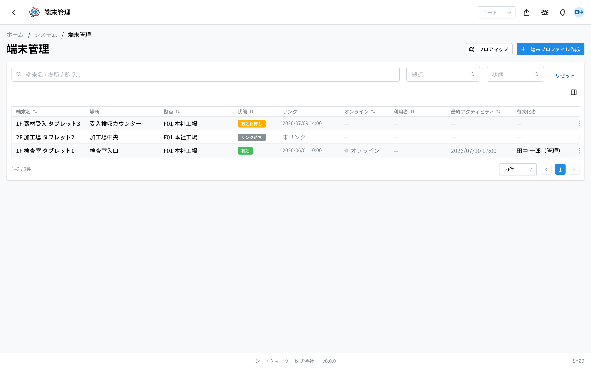
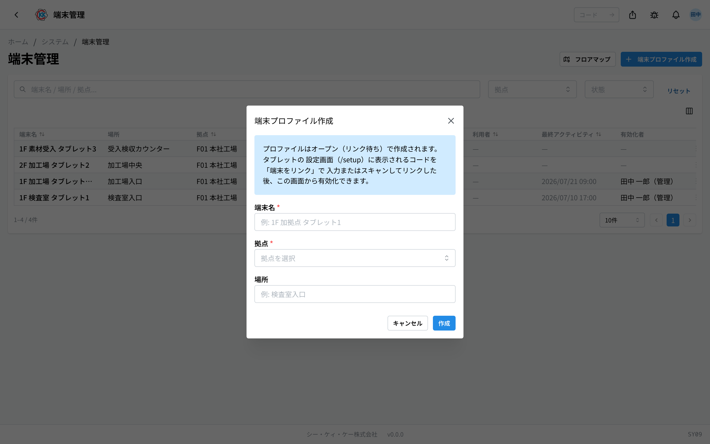
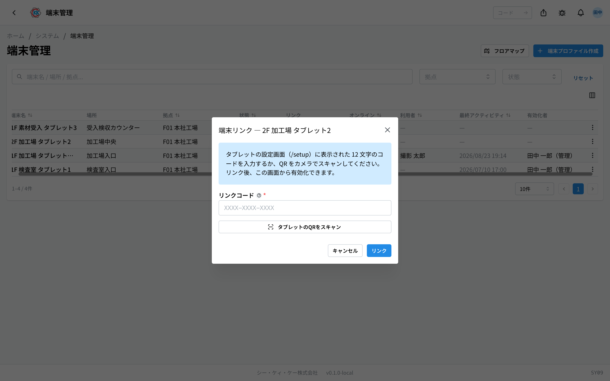
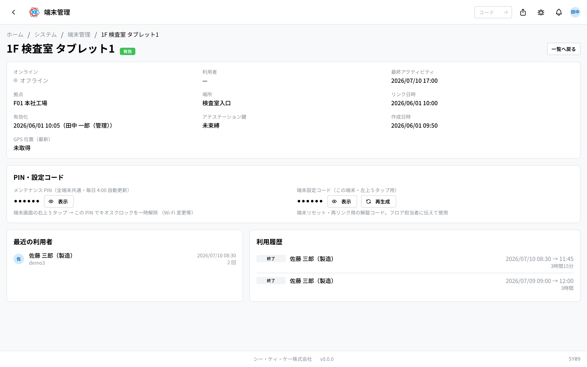

这是一个用来注册放在工厂里的 **共享平板**、让它可以使用的应用。操作代码是 `SY09`。

现在哪台平板正在运行、谁在使用，也可以在这个画面上确认。

## 本应用能做什么

- 注册新的平板，让它变成可以使用的状态。
- 修改平板的名称、据点、放置位置。
- 确认现在处于在线状态的平板，以及正在使用的人。
- 应对平板的故障与更换。
- 在 **フロアマップ**（楼层地图，即据点的平面示意图）上放置平板的位置。
- 查看哪台平板由谁、在什么时候使用过的记录。

## 术语（本页出现的词）

- **キオスク端末（kiosk 终端）** … 指放在工厂里的共享平板。在这个画面上称为「端末」（终端）。
- **端末プロファイル（终端档案）** … 指「放在 1 楼检查室的平板」这样 **按放置位置准备的注册位**。先创建这个位，之后再把真正的平板与它绑定。
- **リンク（链接）** … 把注册位和真正的平板绑定起来的操作。
- **リンクコード（链接代码）** … 显示在平板画面上的 12 位暗号。用它来完成链接。
- **拠点（据点）** … 指工厂或营业所。

## 开始之前

- 使用本应用需要 **kiosk 管理权限**。如果打不开，请联系系统管理员。
- 平板本身的准备（安装专用应用、连接网络）在这个画面上无法进行。请参见公司内部的操作手册。
- 员工要登录，需要先在 [QR卡管理](/manual/zh/operations/system/kiosk-card/user) 中发行卡片。

## 打开方式

按主页画面「システム」（系统）中的 **端末管理**（终端管理）。或者在画面上方的搜索框中输入 `SY09`。

## 画面说明

打开应用后，已注册的平板会以列表形式排列。

- **端末名**（终端名） … 给平板起的名称。
- **場所**（位置） … 关于放置地点的备注。
- **拠点**（据点） … 这台平板属于哪个据点。
- **状態**（状态） … 目前的情况。共有以下 5 种。
  - **リンク待ち**（待链接） … 只创建了注册位，还没有和真正的平板绑定。
  - **有効化待ち**（待启用） … 已经和平板绑定。剩下只要启用即可。
  - **有効**（有效） … 可以使用的状态。
  - **無効**（无效） … 暂时停用中。可以恢复。
  - **取り消し**（作废） … 已完全停止使用。无法恢复。
- **リンク**（链接） … 与平板绑定的日期时间。还没有绑定时显示「**未リンク**」（未链接）。
- **オンライン**（在线） … 现在已连接时显示绿色圆点和「**オンライン**」（在线）；未连接时显示灰色圆点和「**オフライン**」（离线）。
- **利用者**（使用者） … 当前登录在该平板上的人。
- **最終アクティビティ**（最后活动） … 最后一次被操作的日期时间。
- **有効化者**（启用者） … 把这台平板设为可用状态的人。

可以用上方的搜索框「**端末名 / 場所 / 拠点...**」（终端名 / 位置 / 据点...）查找。用「**拠点**」「**状態**」筛选，用「**リセット**」（重置）清除条件。点击行即可打开该平板的详情画面。

## 注册平板

注册分 3 个阶段。**先创建注册位，再与平板绑定，最后设为可以使用的状态。**

### 步骤 1 — 创建注册位

1. 按画面右上角的「**端末プロファイル作成**」（创建终端档案）。
2. 在「**端末名**」（终端名）中输入易懂的名称（例：1F 加工 平板1）。
3. 选择「**拠点**」（据点）。
4. 在「**場所**」（位置）中输入放置地点的备注（可选。例：检查室入口）。
5. 按「**作成**」（创建）。

会生成一行状态为「**リンク待ち**」（待链接）的记录。

### 步骤 2 — 与平板绑定

1. 平板一侧的设置画面上会显示 **12 位代码** 和 QR 码。
2. 在列表中，按该注册位所在行的「**…**」（三个点的按钮）。
3. 选择「**端末をリンク**」（链接终端）。
4. 在「**リンクコード**」（链接代码）中输入平板上显示的 12 位字符。
5. 或者按「**タブレットのQRをスキャン**」（扫描平板的 QR），用摄像头读取平板上的 QR 码。
6. 按「**リンク**」（链接）。

状态会变为「**有効化待ち**」（待启用）。

> ⚠️ 代码 **只有 10 分钟** 有效。超过时间时，请在平板一侧重新显示。

### 步骤 3 — 设为可以使用的状态

1. 从该行的「**…**」中选择「**有効化**」（启用）。
2. 会出现确认画面，请阅读内容后按「**有効化**」。

状态会变为「**有効**」（有效），并且 **平板一侧的画面会自动切换到登录画面**。这样员工就可以使用了。

## 修改名称或放置位置

1. 从该行的「**…**」中选择「**編集**」（编辑）。
2. 修改「**端末名**」（终端名）、「**拠点**」（据点）、「**場所**」（位置）。
3. 按「**保存**」（保存）。

> ⚠️ **修改据点后，之前放在楼层地图上的图钉会被取下。** 这是因为平面示意图是按据点分开管理的。修改据点之后，请在新据点的楼层地图上重新放置。

## 更换或停用平板

从行的「**…**」中，可以根据情况进行下列操作。

- 「**無効化**」（停用） … 暂时使其无法使用。可以用「**再有効化**」（重新启用）恢复。适用于送修期间等情况。
- 「**再有効化**」（重新启用） … 让停用中的平板重新可以使用。
- 「**リンク解除**」（解除链接） … 解除平板与注册位的绑定，回到「待链接」状态。名称、据点、位置、楼层地图的图钉都会原样保留。**在把平板换成新机器时使用。** 可以把新平板重新绑定到同一个注册位。
- 「**鍵リセット**」（密钥重置） … 在把平板初始化或更换之后使用。按下之后，该平板的应用下次连接时会重新登记。
- 「**削除**」（删除） … 只能删除还没有绑定过（待链接）的注册位。
- 「**取り消し**」（作废） … 使平板完全无法使用。

> ⚠️ 「**取り消し**」 **无法恢复**。已经打开的登录也会当场断开。要再次使用，需要从新的注册位重新创建。

## 平板的详情画面

点击列表中的行，会打开该台平板的画面。

上方会排列在线状态、使用者、据点、位置、链接日期时间等信息。

- 「**アテステーション鍵**」（认证密钥） … 用来确认这台平板是真机的、每台终端各自的暗号一样的东西。还没有确定时显示「**未束縛**」（未绑定）。
- 「**GPS 位置（最新）**」（GPS 位置（最新）） … 从平板发来的最新位置。没有收到时显示「**未取得**」（未获取）。

### PIN・设置代码

有 2 个用于在现场操作平板的号码。两者平时都以「••••••」隐藏，按「**表示**」（显示）即可查看（经过 60 秒后会再次隐藏）。

- 「**メンテナンス PIN（全端末共通・毎日 4:00 自動更新）**」（维护 PIN（全终端通用・每天 4:00 自动更新）） … 用来让平板画面临时可以自由操作的号码。例如修改 Wi-Fi 设置时使用。连续点击终端画面左上角 5 次，就会出现输入框。
- 「**端末設定コード（この端末・左上 5 タップ用）**」（终端设置代码（本终端・用于左上角点击 5 次）） … 只属于这一台平板的号码。在重置终端或重新绑定时使用。按「**再生成**」（重新生成）会变成新的号码，**之前的号码将无法使用**。

> ⚠️ 按下「**表示**」的操作会被记录下来。号码请只告知现场负责人，不要张贴公示。

### 使用记录

- 「**最近の利用者**」（最近的使用者） … 经常使用该平板的人，以及使用次数。
- 「**利用履歴**」（使用记录） … 谁在什么时候登录、什么时候退出的一览。还没有被使用时会显示「**利用履歴はまだありません**」（还没有使用记录）。

## 楼层地图（放置到平面示意图上）

如果把平板的位置放在据点的平面示意图上，就能一眼看出哪里的机器正在运转。

1. 按列表画面右上角的「**フロアマップ**」（楼层地图）。
2. 在上方的「**拠点**」（据点）中选择想查看的据点。
3. 会按楼层排列标签页，请选择想查看的楼层。

图钉的颜色，绿色表示在线，灰色表示离线。如果有人登录，还会显示该人的姓名。双击图钉，会打开该平板的详情画面。保管场所的图钉也会一并显示，供参考。

### 编辑平面示意图

打开画面上方的「**編集モード**」（编辑模式）开关后，可以进行下列操作。

- 可以 **拖动图钉移动位置**。松手后，该位置会自动保存。
- 点击右侧「**未配置の端末**」（未布置的终端）中的平板，它会被放到平面示意图的中央。之后再用拖动调整位置。
- 想取下已放置的平板时，按右侧「**配置済み**」（已布置）一行中的标记（「**ピンを解除**」，解除图钉）。
- 用「**フロアを追加**」（添加楼层）增加楼层。用「**名称変更**」（重命名）修改楼层名称。
- 用「**図面をアップロード**」（上传图纸）「**図面を差し替え**」（替换图纸）放入平面示意图的图片（PNG / JPG / WEBP / SVG，最大 10MB）。
- 用「**フロアを削除**」（删除楼层）删除楼层。但是，放有平板或保管场所的楼层无法删除。请先取下图钉。

在还没有平面示意图的据点，会显示「**この拠点にはフロアマップがありません。**」（该据点没有楼层地图。）。请打开编辑模式，从「**フロアを追加**」创建。

## 输入项

| 项目 | 必填 | 填什么 |
|------|------|--------|
| [设备名称（日语 / English）](#field-name) | 必填 | 列表与日志中显示的设备名称 |
| [基地](#field-plant) | 必填 | 放置该设备的基地 |
| [位置](#field-location) | 选填 | 在基地内的放置位置 |
| [关联码](#field-link-code) | 必填 | 平板端显示的确认用编码 |

### 设备名称（日语 / English） [#field-name]

显示在列表、平面图与操作履历徽章中的名称。请使用「第一工厂 入口」这类**能找到实物的名称**，并同时填写日语与英语。

### 基地 [#field-plant]

放置该设备的基地。设备按基地分列。

### 位置 [#field-location]

在基地内的放置位置。在平面图上放置图钉后，画面上也可看到位置。

### 关联码 [#field-link-code]

平板端画面上显示的确认用编码。**请先在本画面创建设备条目**，再读取（或输入）平板显示的编码，将该条目与实机绑定。

- 未绑定的条目**无法启用**
- 更换设备时请执行**解除关联**。名称、基地与图钉将保留，可重新绑定新的实机

## 常见问题・遇到困难时

**Q. 出现「コードが無効か期限切れです。タブレット側で再表示してください」（代码无效或已过期。请在平板一侧重新显示）。**
A. 链接代码为 12 位，只有 10 分钟有效。请在平板一侧重新显示代码后再试一次。

**Q. 出现「オープンな（未リンクの）プロファイルにのみリンクできます」（只能链接到开放的（未链接的）档案）。**
A. 该注册位上已经绑定了别的平板。想换成新平板时，请先按「**リンク解除**」（解除链接），然后重新链接。

**Q. 已经启用了，却一直显示离线。**
A. 请确认平板是否已开机、是否已连接网络。显示有时会稍有延迟才反映出来。

**Q. 平板坏了，要换成新机器。**
A. 请按该终端的「**リンク解除**」（解除链接）。名称、据点、位置、楼层地图的图钉都会原样保留，因此可以把新平板重新链接到同一个注册位。

**Q. 用摄像头读不出 QR 码。**
A. 如果显示「**カメラを起動できません。カメラ権限と HTTPS 接続を確認してください。**」（无法启动摄像头。请确认摄像头权限和 HTTPS 连接。），请允许浏览器使用摄像头。如果仍不顺利，也可以手动输入 12 位代码来完成注册。

**Q. 修改据点后，平板从楼层地图上消失了。**
A. 这是正常现象。平面示意图按据点分开管理，因此修改据点后图钉会被取下。请在新据点的楼层地图上重新放置。

**Q. 出现「リンク済み・有効化済みの端末は削除できません（取り消しを使用してください）」（已链接・已启用的终端无法删除（请使用作废））。**
A. 用「削除」（删除）能清除的，只有还没有和平板绑定的注册位。不再使用的平板请使用「**取り消し**」（作废）。
