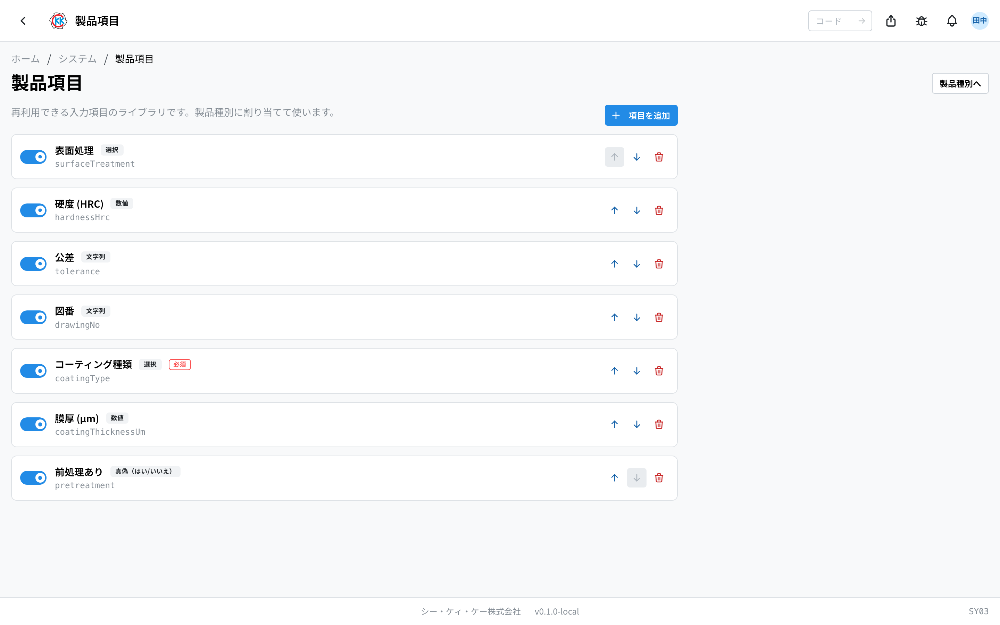
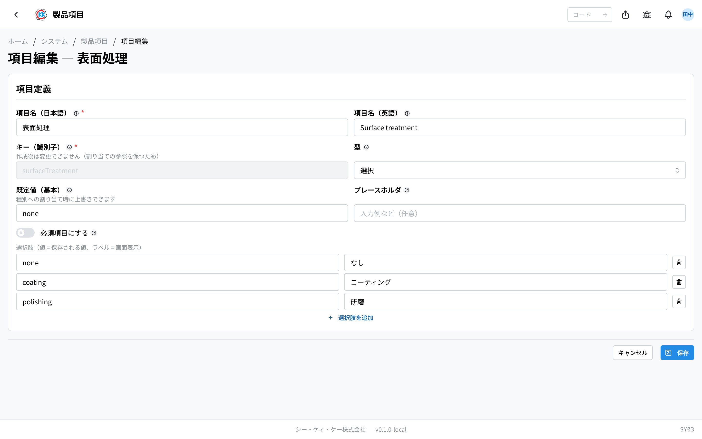
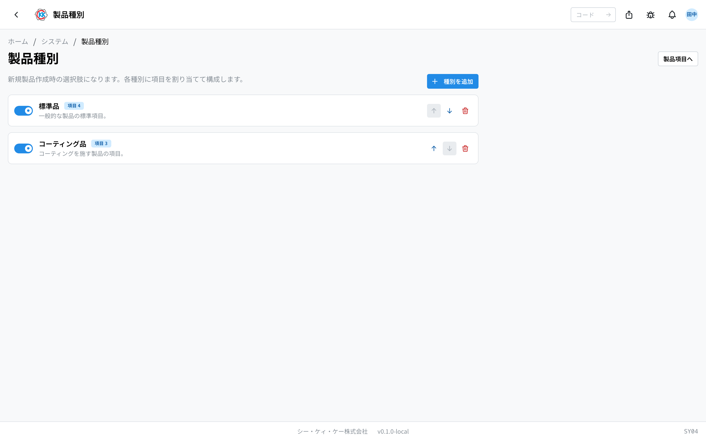
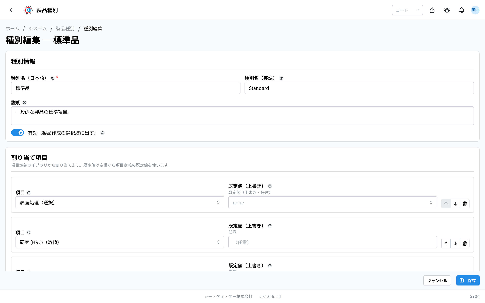
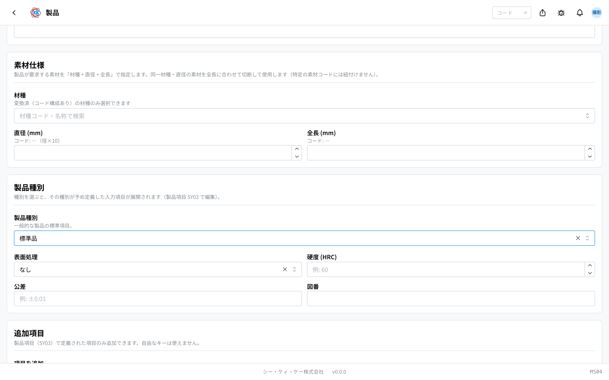

用来事先准备好登记[产品](/manual/zh/operations/masters/product/user)时出现的输入栏的设置。设置分为两个界面。

- **製品項目（产品项目）**（操作代码 `SY03`）… 一个一个地做输入栏的地方。
- **製品種別（产品种别）**（操作代码 `SY04`）… 把做好的输入栏组合起来，做成产品「模板」的地方。

> ⚠️ 这项设置需要系统权限。而且改了这里，**所有人的产品登记界面** 都会跟着变。

## 本设置能做什么

- 可以给产品增加「表面处理」「硬度」等本公司需要的输入栏。
- 可以为每个输入栏决定填的是文字、数字还是日期。
- 可以把输入栏组合成「标准品」「涂层品」等模板。
- 可以给模板设定事先填好的值（默认值）。
- 不再使用的输入栏和模板，可以不删除，只是暂时停用。

## 本页出现的词

- **項目（项目）** … 一个输入栏。例如「表面处理」「硬度」。
- **キー（键）** … 系统用来区分这个输入栏的名字，不会显示在界面上。
- **型（类型）** … 这个栏里能填的值的种类。设成「数值」后，数字以外的东西就填不进去。
- **製品種別（产品种别）** … 由输入栏组合而成的产品模板。例如「标准品」。
- **割り当て（分配）** … 把输入栏装进模板里。
- **既定値（默认值）** … 一开始就已经填好的值。

## 开始之前

- 请先在「**製品項目**」（产品项目）里做输入栏，之后再在「**製品種別**」（产品种别）里组合。顺序反了的话，就没有可以分配的输入栏。
- 打开方式：在主页的「系统」里选「**製品項目**」（产品项目），或者在上面的搜索框里输入 `SY03`。
- 两个界面可以通过各自右上角的「**製品種別へ**」（前往产品种别）「**製品項目へ**」（前往产品项目）按钮互相切换。

## 1. 做输入栏（产品项目）

一览里列出之前做过的输入栏。点某行的名字，就会打开编辑界面。

- 左边的开关可以切换这个输入栏 **用 / 不用**。关掉之后颜色会变淡。
- 右边的 **↑ ↓** 可以改变排列顺序。
- 右边的垃圾桶图标可以删除。删除后，模板里的分配也会一并解除。
- 要新建时，点右上角的「**項目を追加**」（添加项目）。

### 做一个输入栏

1. 点一览右上角的「**項目を追加**」（添加项目）。
2. 在「**項目名（日本語）**」（项目名（日语））里填要显示在界面上的名字（例如：表面処理）。
3. 在「**項目名（英語）**」（项目名（英语））里填同样意思的英语。
4. 在「**キー（識別子）**」（键（标识符））里填写以半角英文字母或下划线（`_`）开头的名字。从第 2 个字符开始也可以使用数字（例如 `surfaceTreatment`）。
5. 在「**型**」（类型）里选要填的值的种类。
6. 有想一开始就填好的值时，填进「**既定値（基本）**」（默认值（基本））。
7. 想在栏里显示浅色的输入示例时，填进「**プレースホルダ**」（占位提示）。
8. 想做成必须填写的栏时，把「**必須項目にする**」（设为必填项目）打开。
9. 点「**保存**」（保存）。

> ⚠️ 「キー（識別子）」（键（标识符））一旦保存就 **不能再改**。因为模板的分配是靠这个名字连起来的。想改名字时，请重新做一个新的项目。

### 型（能填的值的种类）

| 型 | 能填的东西 |
|---|---|
| 文字列（字符串） | 任意文字。想固定格式时，可以用「パターン（正規表現）」（模式（正则表达式））来规定形式 |
| 数値（数值） | 只能填数字。还可以用「最小値」（最小值）「最大値」（最大值）来规定范围 |
| 真偽（はい/いいえ）（真伪（是/否）） | 变成用开关选「是」「否」的形式 |
| 選択（选择） | 变成从事先准备好的选项里挑选的形式 |
| 日付（日期） | 只能填日期 |

选了「**選択**」（选择）时，下面会出现选项栏。填入「**値**」（值 — 保存的内容）和「**表示ラベル**」（显示标签 — 界面上出现的文字），用「**選択肢を追加**」（添加选项）来增加行。

## 2. 做模板（产品种别）

一览的用法和产品项目一样：用开关切换用还是不用，用 ↑ ↓ 排序，用垃圾桶图标删除。名字右边的蓝色徽章，是这个模板里装着的输入栏数量。

### 做一个模板

1. 点一览右上角的「**種別を追加**」（添加种别）。
2. 在「**種別名（日本語）**」（种别名（日语））里填名字（例如：標準品）。
3. 在「**種別名（英語）**」（种别名（英语））里填同样意思的英语。
4. 在「**説明**」（说明）里写这个模板在什么时候用（留空也没关系）。
5. 点「**項目を割り当て**」（分配项目）。
6. 在出现的「**項目**」（项目）栏里，选要装进去的输入栏。
7. 想只在这个模板里事先填好某个值时，填进「**既定値（上書き）**」（默认值（覆盖））。
8. 按需要重复 6〜7。
9. 排列顺序可以用每行的 **↑ ↓** 来改。
10. 点「**保存**」（保存）。

> 💡 「既定値（上書き）」（默认值（覆盖））留空时，会直接使用产品项目那边设定的默认值。只有在想让各个模板用不同的值时才填。

把「**有効（製品作成の選択肢に出す）**」（有效 — 在创建产品时作为选项显示）的开关关掉后，这个模板就不会出现在产品登记界面的选项里。不再使用的模板，用这个办法停用比删除更安全。

## 3. 登记产品时的样子

[产品](/manual/zh/operations/masters/product/user)的新建界面上，会出现一个叫「**製品種別**」（产品种别）的栏。

1. 在「**製品種別**」（产品种别）里选一个模板。
2. 这个模板里装着的输入栏，会出现在下面。
3. 默认值已经填好了，只改需要改的地方即可。

模板里没有的输入栏，也可以在下面的「**追加項目**」（追加项目）里选着加上。这里出现的，只有在「製品項目」（产品项目）里做过的输入栏。

填的值和类型对不上时，保存时会有提示，改好之后再保存一次即可。

## 常见问题与困扰

**Q. 在产品登记界面上，选不了自己做的模板。**
A. 请在一览里确认那个模板的开关是不是关着的。颜色变淡的行就是「不用」的状态。

**Q. 一个能分配给模板的输入栏都没有。**
A. 能分配的只有开关打开的输入栏。请先在「製品項目」（产品项目）里做输入栏，或者把停用的输入栏的开关打开。

**Q. 出现「キーは英字/アンダースコア始まりの識別子にしてください」（键必须是以英文字母或下划线开头的标识符）。**
A. 键请以半角英文字母或下划线（`_`）开头。从第 2 个字符开始也可以使用数字。日语、以数字开头、连字符或空格之类的符号都不能用（例如 `surfaceTreatment`）。

**Q. 出现「同じキーの項目が既に存在します」（已存在相同键的项目）。**
A. 这个键已经被用了，请换一个名字。

**Q. 出现「選択肢を1つ以上追加してください」（请至少添加一个选项）。**
A. 类型设成了「選択」（选择），却没有可选的内容。请用「選択肢を追加」（添加选项）至少加一个。

**Q. 出现「同じ項目が重複して割り当てられています」（同一项目被重复分配）。**
A. 同一个模板里把同一个输入栏装了两次。请用垃圾桶图标删掉其中一行。

**Q. 删了输入栏之后，模板里也没了。**
A. 这是正常的。删掉输入栏后，用着这个输入栏的模板的分配也会一并解除。只是想暂时不用的话，请把开关关掉，而不是删除。
