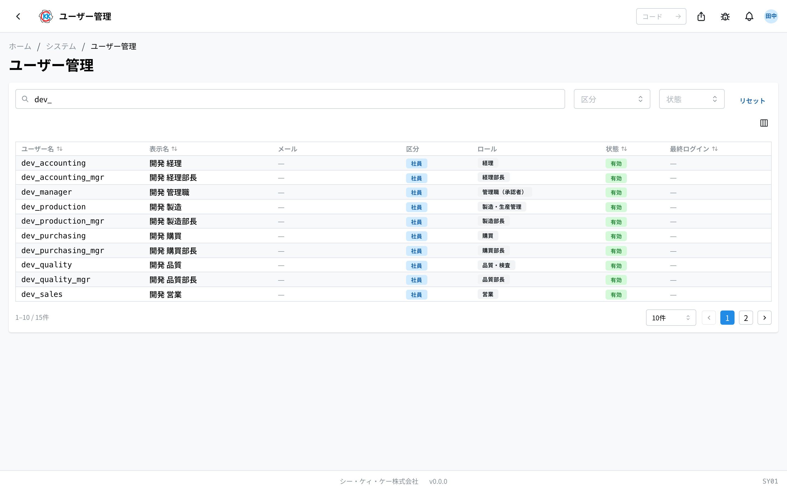

An app for seeing the list of people who use the system and checking **what each person is allowed to do**. The operation code is `SY01`.

This app is **for looking, not for changing**. You cannot add a person or change a name here (there is one exception — please see "Changing 所属拠点 (assigned sites)" below).

## What you can do with this app

- You can see everyone registered in the system in one list.
- You can narrow the list down by name or email address to find the person you are looking for.
- When you choose one person, you can check the **roles** they have been given and the list of **things they can do**.
- You can use it when you want to find out why a person cannot open a certain screen.

## Words used on this page

- **ロール (role)** … the person's job role. Roles are registered as a set, such as 「営業」 (sales) or 「工場担当」 (plant staff), and each role decides which screens the person can use.
- **権限 (permission)** … permission to do something, such as "you may look at this screen" or "you may save". It comes together with the role.
- **拠点 (site)** … a factory or an office. Some people have a rule that they can only see the data for their own site.
- **区分 (group)** … the kind of person. There are three: **社員** (employee) / **ゲスト** (guest) / **システム** (system — not a person, but work the system itself carries out).

## Before you start

- You need **system administration permission** to open this app. If you cannot open it, the screen shows 「この操作の権限がありません（system:READ）」 (You do not have permission for this operation). Please ask your system administrator.
- You cannot add people, delete people, or change their names in this app. People are managed by the company's shared login system.

## How to open it

Press **ユーザー管理** (User Management) inside 「システム」 (System) on the home screen. Or type `SY01` into the search box at the top of the screen.

## How to read the screen

When you open the app, the list of registered people is shown.

- **ユーザー名** (Username) … the ID used to log in.
- **表示名** (Display name) … the name shown on the screen.
- **メール** (Email) … the registered email address. When there is none, 「—」 is shown.
- **区分** (Group) … one of **システム** (system) / **社員** (employee) / **ゲスト** (guest).
- **ロール** (Roles) … the roles the person has been given. There may be more than one.
- **状態** (Status) … people who can log in now are 「**有効**」 (active); people who have been stopped are 「**無効**」 (inactive).
- **最終ログイン** (Last login) … the date and time of the last login. For someone who has never logged in, 「—」 is shown.

When you type into the search box at the top, 「**ユーザー名 / 表示名 / メール / ロール...**」 (Username / Display name / Email / Role...), only the people whose details contain those characters stay in the list. You can also narrow the list with 「**区分**」 and 「**状態**」. To clear all of the conditions, press 「**リセット**」 (Reset).

Click a row to open that person's detail screen.

## Checking one person

Click a row in the list to open that person's screen. The basic information is lined up near the top.

- **ユーザー名** / **区分** / **メール** / **最終ログイン** / **社員 ID** (Employee ID) … the same as in the list.
- **ログイン方式** (Login method) … 「**パスワード + SSO**」 (Password + SSO) means the person can sign in either with a password for this system or with the company's shared login. 「**SSO のみ**」 (SSO only) means the person signs in with the company's shared login only.

Below that, three tables are lined up.

### ロール割当 (Role assignments) — which roles the person has

- 「**ロール**」 shows the name of the role, and 「**状態**」 shows whether it is in effect now.
- Roles that were taken away in the past stay on record. A row with a date in 「**解除日時**」 (Removed on) is not in effect now.
- When there is nothing, 「**ロールが割り当てられていません**」 (No roles are assigned) is shown. This person cannot do anything yet.

### 所属拠点 (Assigned sites) — which site the person belongs to

- These are the factories and offices the person belongs to.
- If a permission has the rule "can only see their own site" and this is empty, **the person can see no data at all**. When someone has been given a permission but still sees nothing, please check here.
- When there is nothing, 「**所属拠点がありません**」 (No assigned sites) is shown.

### 実効権限 (Effective permissions) — what the person can actually do

This is the list of what the person can actually do right now. If the person has several roles, **everything from all of them put together is what that person can do**. The same row may appear twice, but that is not a problem.

Here is how to read the table.

- 「**権限コード**」 (Permission code) … which app it is about (`quote` is 見積書 (quotes), `master` is マスタ (master data), `system` is system administration, and so on).
- 「**アクション**」 (Action) … what the person may do: 閲覧 (look only), 作成 (create), 更新 (change), 削除 (remove), 書き出し (export), 承認 (approve), and 管理 (operations for administrators).
- 「**スコープ**」 (Scope) … how far the permission reaches: 全社 (the whole company), 拠点 (their own site only), 地域 (their own region only), 自分の担当 (only the data they are responsible for), and so on. For site and region, the targets follow in brackets.

When there is nothing, 「**権限がありません**」 (No permissions) is shown.

## Changing 所属拠点 (assigned sites) — system administrators only

This is the only item in this app that can be rewritten. The selection box and the 「**保存**」 (Save) button are shown only to people who have system administration permission.

1. Open the detail screen of the person you want to change.
2. Click the 「**所属拠点**」 field.
3. Choose a site from the list. You can choose more than one.
4. To take a site away, click it once more to deselect it.
5. Press 「**保存**」.

When 「**保存しました**」 (Saved) and 「**所属拠点を更新しました**」 (Assigned sites updated) are shown, you are finished.

> ⚠️ When you take a site away, the person will see less data. Screens with the rule "only their own site" may become empty.

> 💡 A site with 「（無効）」 (inactive) next to it may appear in the selection box. It is a site that is no longer in use, but it is still assigned to this person, so it is shown.

## Input fields

A user's name and email are **imported from Active Directory** and cannot be changed here. The only input on this screen is the plant assignment.

| Field | Required | What to enter |
|-------|----------|---------------|
| [Assigned plants](#field-plants) | Optional | The plants this user works with |

### Assigned plants [#field-plants]

The plants the user is responsible for. Several can be selected.

The "plant" range of a permission is **decided by the overlap with what is selected here**. Someone whose permission is "view within their plant" sees only data for the plants listed here. If this is empty, plant-ranged permissions show nothing.

Only a system administrator can edit it; everyone else sees the current assignment as badges.

## Questions and problems

**Q. I want to add someone who has just joined, but there is no add button.**
A. You cannot add people from this app. Information about people is brought in from the company's shared login system. Please ask your system administrator.

**Q. I want to change someone's role.**
A. On this screen you can only look; you cannot change anything. Please ask your system administrator.

**Q. 「この操作の権限がありません（system:ADMIN）」 (You do not have permission for this operation) is shown and I cannot save the assigned sites.**
A. Only system administrators can change assigned sites. Everyone else can only look. Please ask your system administrator.

**Q. Someone was given a role, but they say they still cannot open the screen.**
A. Open that person's detail screen and look for the matching row in 「**実効権限**」 (Effective permissions). If the row is there but the data is empty, please also check whether 「**所属拠点**」 is empty.

**Q. The same permission code appears on two rows in 「実効権限」.**
A. That is normal. It happens when the person has two roles and the same permission comes from both. What they can actually do is the two rows put together.

**Q. I want to know who changed this person's assigned sites, and when.**
A. You can check in the [Activity Log](/manual/en/operations/system/activity-log/user). Every change is recorded.
