一つの注文が、単価の計算から請求まで進んでいく**標準の流れ**を通しで追いかけるページです。各段階を「だれが・なにを操作するか」と「システムが自動でおこなうこと」に分けて説明します。画像の**赤い枠**は、その段階で押すボタン・確認する欄です。各画面の詳しい操作は、それぞれの操作マニュアルへのリンクから読めます。

## 全体の流れ

```
試算 ──→ 価格表 ──→ 見積書 ──→ 注文請書 ──→ 注文明細の確定
（単価を計算）（顧客ごとの価格）（お客様へ提示）（注文を受ける）（受注の確定）

  ──→ 指示書 ──→ 承認 ──→ 製造 ──→ 出荷書 ──→ 納品書 ──→ 請求書
 （製造の指示） （確認）（工程を実行）（送り出す）（届ける）（締めて請求）
```

## この流れの登場人物

| 担当 | 受け持つ段階 |
|------|-------------|
| 社内営業 | 試算・価格表・見積書 |
| 社内営業補助 | 注文請書・注文明細・指示書・出荷書・納品書 |
| 承認者（工場長・部長） | 注文請書の承認・指示書の承認 |
| 製造 | 工程の実行（数量・不良の記録） |
| 経理 | 締日処理・請求書 |

## 1. 試算 — 単価のもとを作る

### だれが・なにを（操作）

1. [試算](/manual/ja/operations/sales/trial-estimate/user)（`SA01`）で製品の材料・寸法・加工の条件を入力し、保存します。


2. 内容が固まったら、操作メニューから「確定」にします。

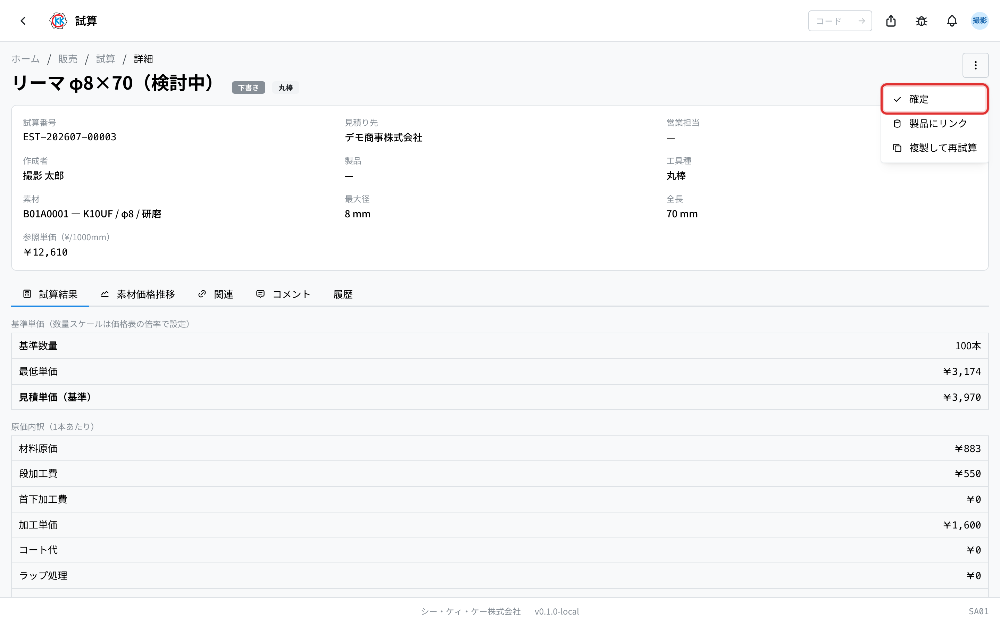

### システムが自動でおこなうこと

- 保存すると試算番号（EST-）が自動で付きます。
- 材料構成（材種・直径・黒皮/研磨）を選ぶと、参照単価が仕入実績から自動で入ります（実績が無いときは材種の既定単価が使われます）。
- 確定した試算だけが、次の価格表で単価のもとに選べるようになります。

## 2. 価格表 — 顧客ごとの単価を決める

### だれが・なにを（操作）

1. [価格表](/manual/ja/operations/sales/price-list/user)（`SA02`）で顧客と製品を選び、確定済みの試算を単価のもとに選びます（手で入力することもできます）。
2. 注文種別（本番・テスト・サンプル・その他）ごとの価格と数量の段階を決めて、保存します。


### システムが自動でおこなうこと

- 価格・有効期間が保存され、以後の見積書・注文でこの価格表が参照されます。
- 単価のもとに使った試算は「価格表登録済」になり、そのままでは編集できなくなります（過去の金額が後から変わらないようにするためです）。

## 3. 見積書 — お客様に金額を提示する

### だれが・なにを（操作）

1. [見積書](/manual/ja/operations/sales/quote/user)（`SA03`）で顧客・製品・数量を入力します。

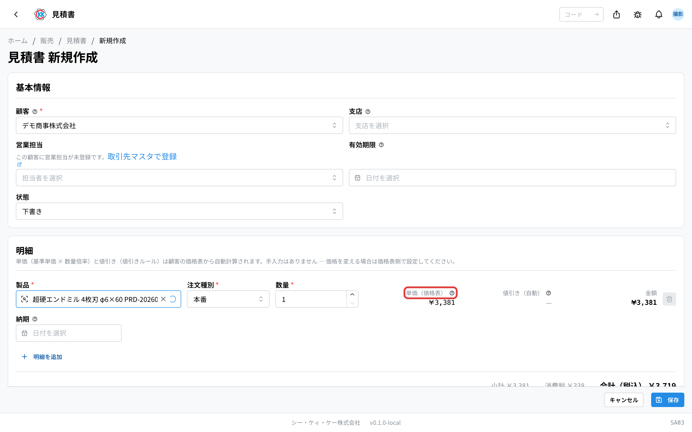

2. 内容がよければ、操作メニューから「発行」します。

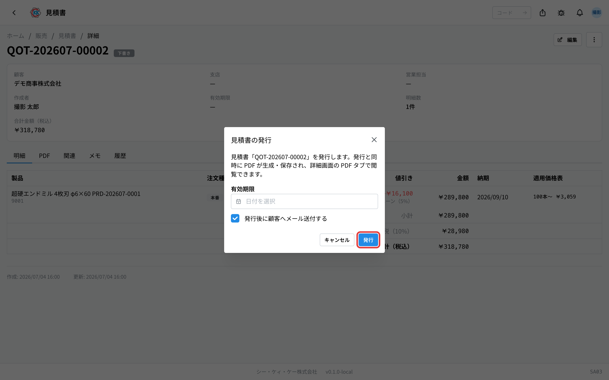

### システムが自動でおこなうこと

- 顧客と製品を選ぶと、価格表から単価が自動で入ります（数量の段階・値引きも自動で反映されます）。
- 保存すると見積番号（QOT-）が自動で付きます。
- 発行すると PDF が保存され、お客様へ提出できる状態になります。

> 💡 価格表に無い製品は単価が入らず、警告が出ます。先に試算 → 価格表の順に作ってから見積書を作ってください。

## 4. 注文請書 — 注文を受け取る

### だれが・なにを（操作）

1. お客様から届いた注文書（FAX・PDF）を[注文請書](/manual/ja/operations/sales/order-acceptance/user)（`SA04`）に取り込み、読み取り結果を画面で確認・修正します。
2. 内容が確定したら承認を依頼します。承認者は内容を確認して「承認」します。

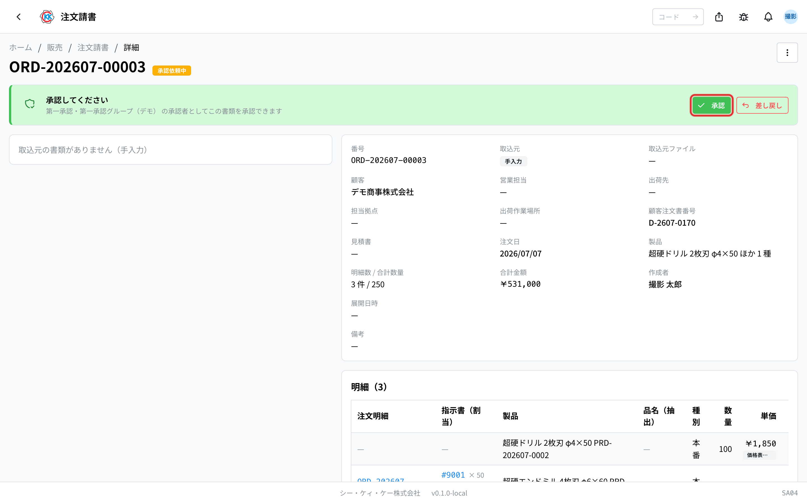

### システムが自動でおこなうこと

- 取り込んだ注文書の読み取りが自動で行われ、顧客・製品・数量・価格が下書きに入ります。
- 合計金額が自動で計算されます。
- 注文の価格と見積・価格表の価格が自動で突き合わされ、違いがあると画面に表示されます。

> ⚠️ 価格差異が出たときは、見積書に戻って調整するか、注文請書側の価格を直してから先へ進めてください。


## 5. 注文明細の確定 — 受注が確定する

### だれが・なにを（操作）

1. 承認された注文請書を開き、「確定」します。確認画面で「展開する」を押すと確定します。

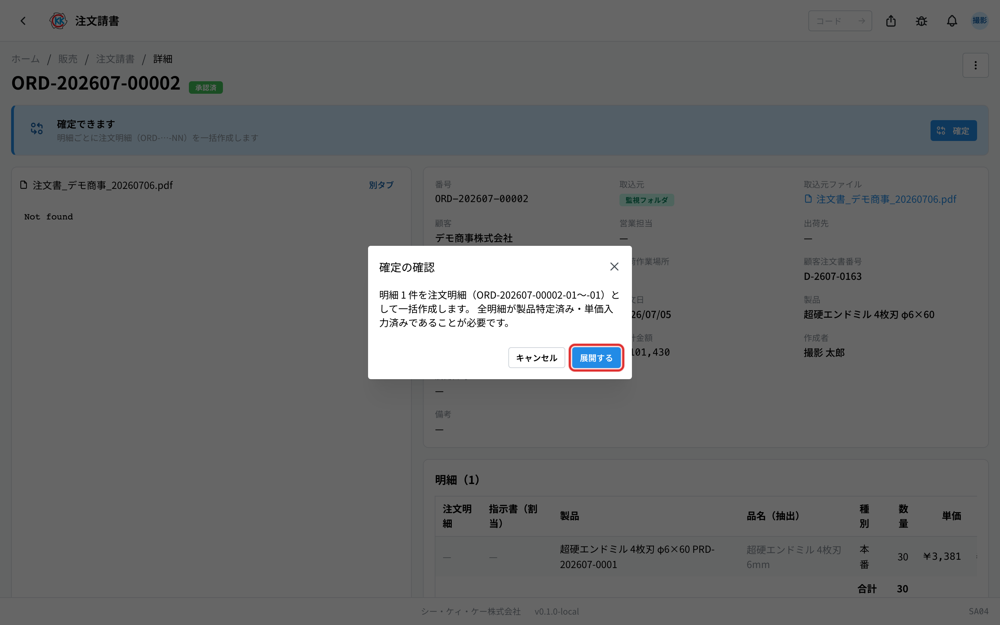

### システムが自動でおこなうこと

- 明細ごとに**注文明細**が作られ、枝番付きの番号（ORD-…-NN）が自動で付きます。
- 金額がこの時点の内容で確定します。

## 6. 指示書 — 製造の段取りを決める

### だれが・なにを（操作）

1. 注文明細から[指示書](/manual/ja/operations/production/work-order/user)（`PD02`）を作ります。在庫から出す分と新しく作る分を分け、製造分は工程を順番に並べます（前回作った指示書のコピーもできます）。
2. できたら保存し、承認を依頼します。

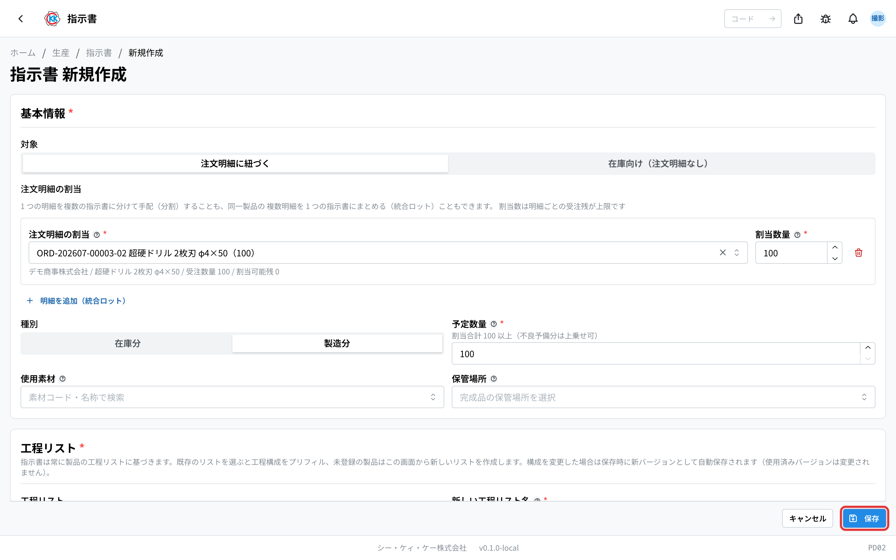

### システムが自動でおこなうこと

- 指示書番号（通し番号）が自動で付きます。この番号はそのままロット番号になり、指示書の帳票には現場で読み取る QR が印字されます。
- 在庫から出す分は、その在庫が引き当てられて他の注文に使われないようになります。

## 7. 承認 — 製造を始めてよいか確認する

### だれが・なにを（操作）

1. 承認者が[承認管理](/manual/ja/operations/production/approval/user)（`PD03`）または指示書の画面で内容を確認し、「承認」します。内容に問題があれば「差し戻し」ます。


### システムが自動でおこなうこと

- 承認を依頼すると指示書が編集できなくなり、承認者に通知が届きます。
- 各段の承認が記録され、次の段の承認者へ通知されます。
- すべての段が承認されると、製造を開始できる状態になります。

## 8. 製造 — 現場が工程を実行する

### だれが・なにを（操作）

1. 現場の担当者が指示書の工程一覧から自分の工程を開き、「開始」します。

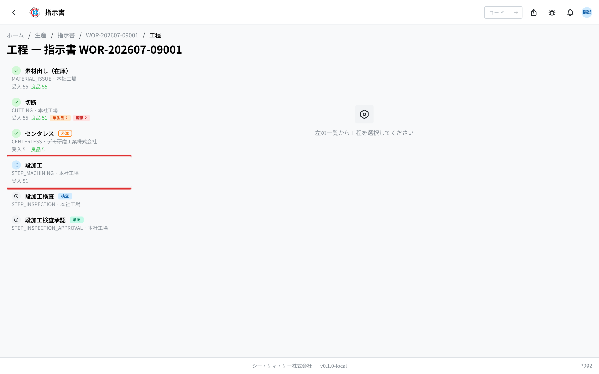

2. 加工が終わったら、受入数・良品数・不良の内訳を入力して「完了」します。


### システムが自動でおこなうこと

- 開始すると、その工程は他の人が同時に操作できないようになります（二重実行の防止）。
- 開始〜完了の作業時間と、入力した数量・不良が実績として記録されます。
- 最後の工程が完了すると、完成した数が製品在庫に入り、注文への引き当てが確定します。

> 💡 現場の共有タブレットでも同じ操作ができます。指示書の QR を読み取ると、その指示書の工程一覧が開きます。


## 9. 出荷書 — 送り出す

### だれが・なにを（操作）

1. [出荷書](/manual/ja/operations/shipping/delivery-order/user)（`SH01`）で注文請書を選ぶと、出荷できる注文明細が入ります。完成したロットから出荷する数を決めて保存します。


2. 内容がよければ「確定」し、実際に送り出したら「出荷」にします。

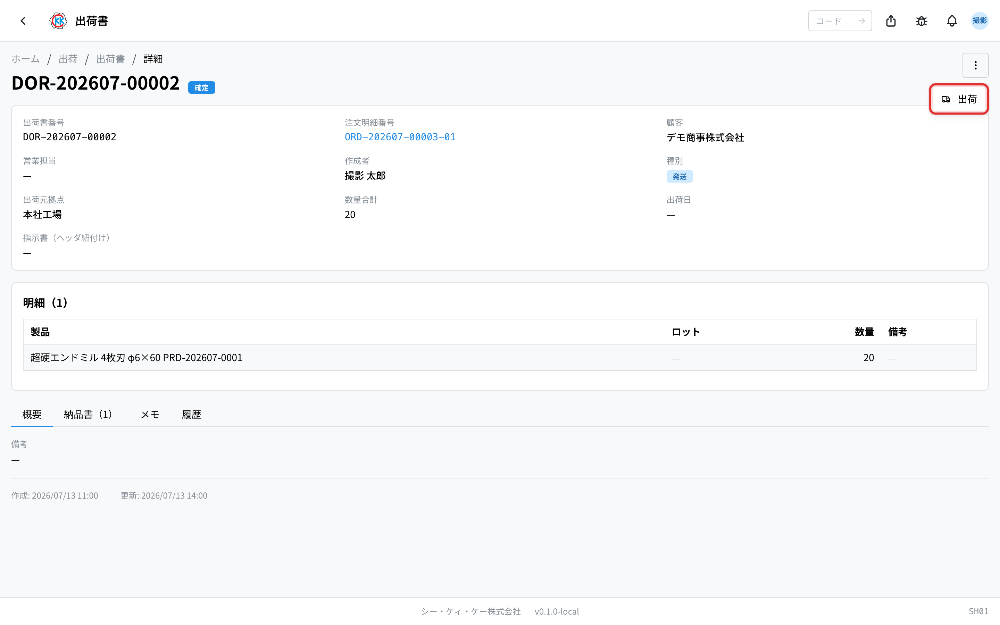

### システムが自動でおこなうこと

- 保存すると出荷書番号（DOR-）が自動で付きます。
- 出荷にすると在庫が減り、注文明細の状態が「一部出荷」または「出荷済」に変わります。

## 10. 納品書 — 届ける

### だれが・なにを（操作）

1. 出荷書から[納品書](/manual/ja/operations/shipping/delivery-note/user)（`SH02`）を作り、納品方法（通常納品・ユーザー直送）と価格記載の有無を決めます。

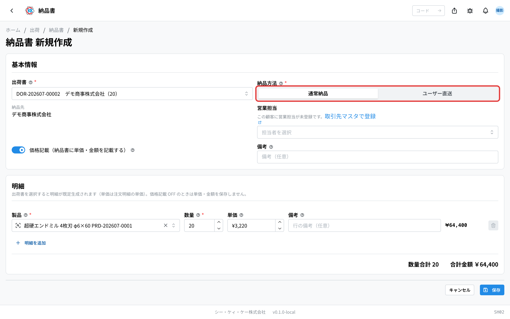

2. 内容がよければ「発行」し、お客様に届いたら「納品済」にします。

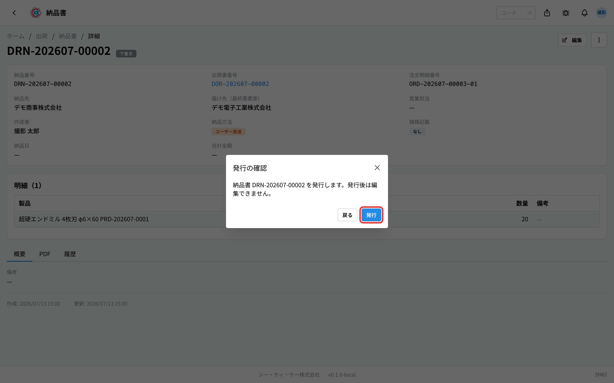

### システムが自動でおこなうこと

- 保存すると納品番号（DRN-）が自動で付きます。
- 発行すると PDF が保存されます。ユーザー直送では価格の載らない書式になります。

## 11. 請求書 — 締めて請求する

### だれが・なにを（操作）

1. [締日処理](/manual/ja/operations/billing/billing-closing/user)（`BL02`）で顧客ごとの締日を選び、「締日処理を実行」します。


2. 締めた内容を確認し、「請求書を生成」します。

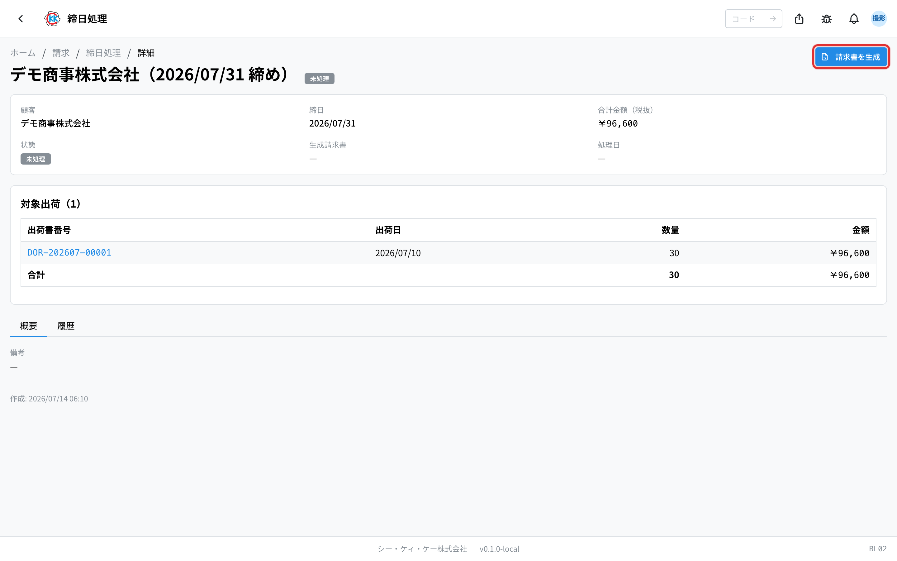

3. [請求書](/manual/ja/operations/billing/invoice/user)（`BL01`）を発行してお客様へ送り、「送付済」にします。入金を確認したら「支払済」にします。

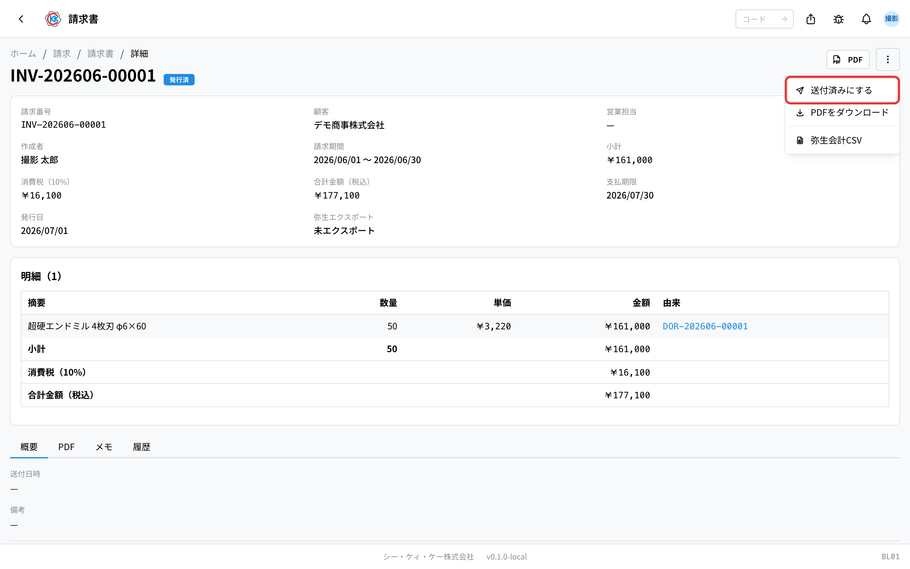

### システムが自動でおこなうこと

- 締日処理を実行すると、その期間に納品した分が自動で集計されます。
- 請求書を生成すると請求番号（INV-）が自動で付き、発行で PDF が保存されます。
- 締めた分は弥生会計向けの CSV として書き出せます。

## 全体の状態の動き

| 書類 | 状態の移り変わり |
|------|-----------------|
| 試算 | 下書き → 確定 → 価格表登録済 |
| 見積書 | 下書き → 発行済 → 受諾済 |
| 注文請書 | 取込中 → 下書き → 承認依頼中 → 承認済 → 確定済 |
| 注文明細 | 下書き → 確定 → 製造中 → 一部出荷 → 出荷済 |
| 指示書 | 下書き → 承認待ち → 承認済 → 進行中 → 完了 |
| 出荷書 | 下書き → 確定 → 出荷済 |
| 納品書 | 下書き → 発行済 → 納品済 |
| 締日処理 | 未処理 → 処理済 → エクスポート済 |
| 請求書 | 下書き → 発行済 → 送付済 → 支払済 |

## 関連ページ

- 分野ごとの詳しい流れ … [販売の流れ](/manual/ja/process/sales) / [購買の流れ](/manual/ja/process/purchasing) / [生産の流れ](/manual/ja/process/production) / [出荷の流れ](/manual/ja/process/shipping) / [請求の流れ](/manual/ja/process/billing)
- 各アプリの操作と入力欄の意味 … 左の **操作方法**
- はじめて使う方 … [スタートマニュアル](/manual/ja/start)
