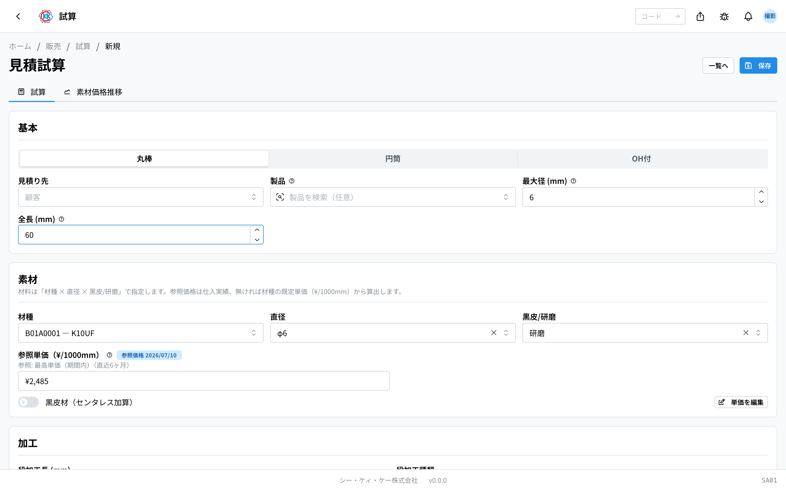
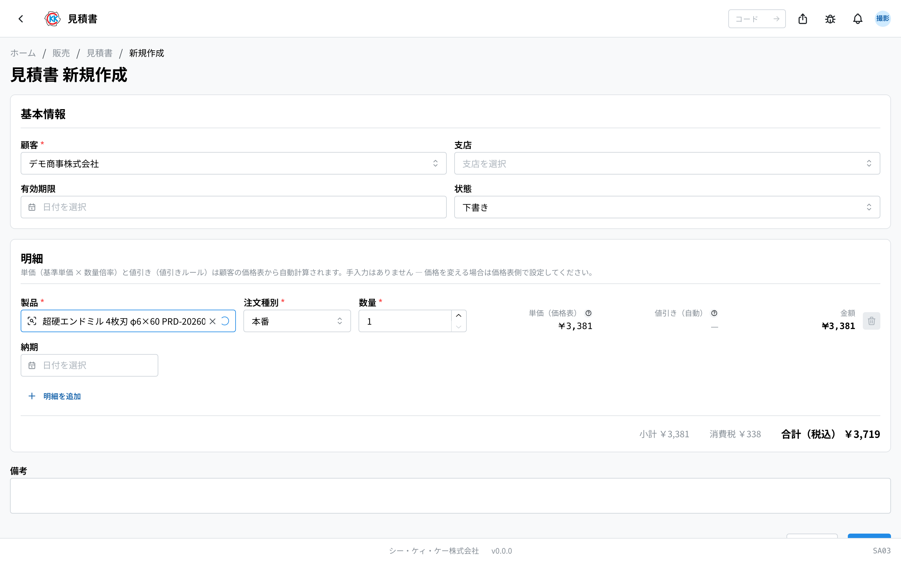
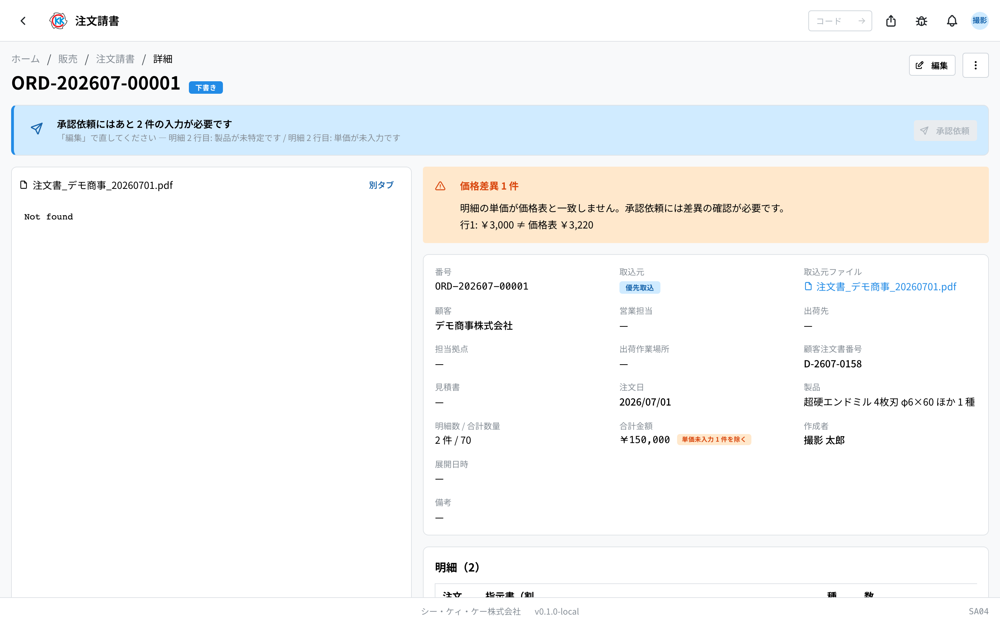

単価を決めてから注文を受け、製造の指示に渡すまでの流れをまとめたページです。「いまどの段階で、次に誰が何をするのか」を確認するときに開いてください。各アプリの詳しい操作は、それぞれの操作マニュアルへのリンクから読めます。

## 全体の流れ

```
試算 ──→ 価格表 ──→ 見積書 ──→ 注文請書 ──→ 注文明細 ──→ 指示書
（単価を計算）（顧客ごとの価格）（お客様へ提示）（注文を受ける）（受注の確定）（製造の指示）
                                     ↑         │
                                     └─ 価格が違うときは戻って調整
```

設計図が無い製品では、この流れと並行して **設計依頼書** を起票します。

## 段階ごとの担当とアプリ

| 段階 | 何をするか | 担当 | 使うアプリ |
|------|-----------|------|-----------|
| 1. 単価を計算する | 材料費や加工費から、その製品の見積単価を計算します | 社内営業 | [試算](/manual/ja/operations/sales/trial-estimate/user)（`SA01`） |
| 2. 顧客ごとの価格を決める | 顧客と製品の組み合わせで価格表を作ります。数量が多いほど安くする設定もここで決めます | 社内営業 | [価格表](/manual/ja/operations/sales/price-list/user)（`SA02`） |
| 3. 見積書を出す | 価格表の単価で見積書を作り、PDF をお客様へ提出します | 社内営業 | [見積書](/manual/ja/operations/sales/quote/user)（`SA03`） |
| 4. 注文を受ける | お客様から届いた注文書を取り込み、内容を確認して受諾します | 社内営業補助 | [注文請書](/manual/ja/operations/sales/order-acceptance/user)（`SA04`） |
| 5. 受注を確定する | 受諾した内容から注文明細が作られます（製品ごと） | 社内営業補助 | 注文明細（`PD01`） |
| 6. 製造を指示する | 在庫分と製造分に分けて指示書を作ります（工程を並べるのは製造分。在庫分は固定構成です） | 社内営業補助 | [指示書](/manual/ja/operations/production/work-order/user)（`PD02`） |
| （並行）設計図が無いとき | 設計依頼書を起票し、製造が図面を作ります | 社内営業 / 社内営業補助 → 製造 | [設計依頼書](/manual/ja/operations/sales/design-request/user)（`SA05`） |

## それぞれの段階でおきること

### 1. 単価を計算する（試算）

製品の材料・寸法・加工の条件を入れると、見積単価が計算されます。計算した試算は「下書き」で保存され、内容が固まったら「確定」にします。**確定した試算だけが価格表の単価のもとに使えます**。一度価格表で使った試算は「価格表登録済」になり、そのままでは編集できません（作り直すときは複製します）。



### 2. 顧客ごとの価格を決める（価格表）

顧客と製品の組み合わせで 1 つの価格表を作ります。注文種別（本番・テスト・サンプル・その他）ごとに価格を分けて持て、数量の範囲ごとに単価を変えられます。確定済みの試算を単価のもとに選べます（手で入力することもできます）。


### 3. 見積書を出す（見積書）

顧客と製品を選ぶと、価格表から単価が自動で入ります。**価格表に無い製品は単価が入らず、警告が出ます** — その場合は先に試算と価格表を作ってください。内容がよければ「発行」します。発行すると PDF が保存され、お客様へ提出できる状態になります。



### 4. 注文を受ける（注文請書）

お客様から届いた注文書（FAX・PDF）を取り込みます。読み取りは自動で行われ、その結果を画面で確認・修正します。見積の価格と注文の価格が違う場合はその場で分かるので、必要なら見積書に戻って調整します。内容が確定したら承認を依頼し、承認されると次の段階へ進みます。



### 5〜6. 受注の確定と製造の指示（注文明細・指示書）

注文請書を確定すると、明細ごとに **注文明細** が作られます。続いて、その注文明細に対して **指示書** を作ります。指示書では在庫から出す分と新しく作る分を分けます（工程を順番に並べるのは製造分。在庫分は「製品出し」＋任意の「出荷前検査」の固定構成です）。ここから先は生産の流れになります。確定した注文請書からは、そのまま**出荷書の作成**へも進めます。


## 書類の状態

| 書類 | 状態の移り変わり |
|------|-----------------|
| 試算 | 下書き → 確定 → 価格表登録済 |
| 見積書 | 下書き → 発行済 → 受諾済 / 却下 / 期限切れ |
| 注文請書 | 取込中 → 下書き → 承認依頼中 → 承認済 → 確定済 → アーカイブ / キャンセル（キャンセルは依頼 → 承認で確定） |
| 注文明細 | 下書き → 確定 → 製造中 → 一部出荷 → 出荷済（キャンセルは注文請書ごとの依頼でのみ） |
| 指示書 | 下書き → 承認待ち → 承認済 → 進行中 → 完了 |
| 設計依頼書 | 未着手 → 進行中 → 完了 |

## 止まりやすいところ

**見積書で単価が入らない**
価格表にその顧客・製品の行がありません。試算 → 価格表の順に作ってから、もう一度見積書を作ってください。

**試算を直したいのに編集できない**
価格表で使った試算は「価格表登録済」になり、編集できません。複製して新しい試算として作り直してください。過去の見積の金額が後から変わらないようにするためのしくみです。

**注文の価格が見積と違う**
注文請書の画面で差異が分かります。見積書に戻って価格を調整してから、注文請書の内容を直してください。

**注文請書が次に進まない**
承認依頼が済んでいるか、承認者が承認したかを確認してください。承認済みになると注文明細・指示書へ進められます。

## 関連ページ

- 一つの注文を通しで追う … [標準フロー](/manual/ja/process/default-flow)
- 各アプリの操作と入力欄の意味 … 左の **操作方法 › 販売**
- はじめて使う方 … [スタートマニュアル](/manual/ja/start)
