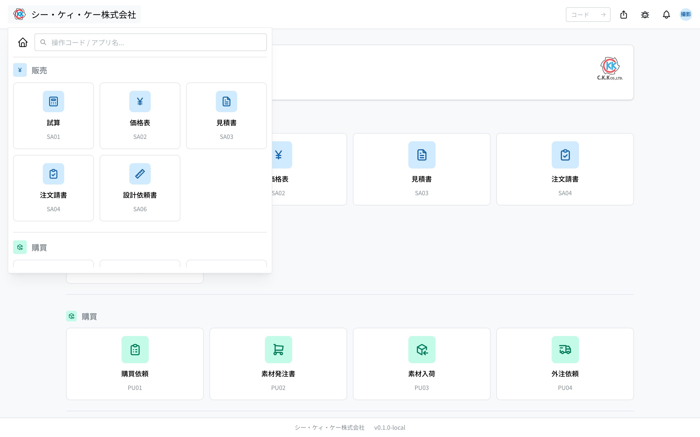
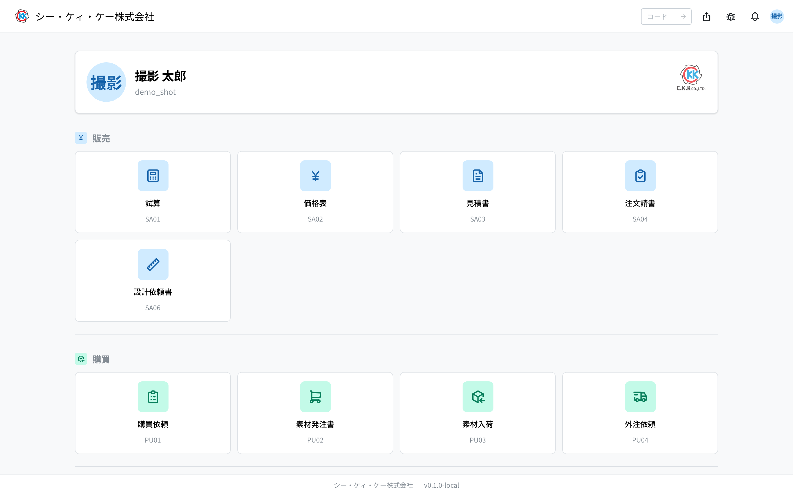

Welcome to the CKK Business Management System. This page is an introduction for **first-time users**. Technical terms are explained in the Glossary at the end.

## What this system is

An in-house system that unifies quoting, orders, manufacturing, shipping, and billing. You'll start with the three sales apps: **Trial Estimate, Price List, and Quote**.

- **Trial Estimate** — works out "what it costs to make this product" from cost.
- **Price List** — a ledger of selling prices per customer.
- **Quote** — creates the quote you send to a customer; the unit price is filled in automatically from the price list.

These three connect in order: **Trial Estimate → Price List → Quote** (see "4. The sales flow").

## 1. Signing in

1. Open the internal portal URL in your browser.
2. Sign in with the **SSO (company account)** button. Development accounts are available from the input fields that appear when you press the "Sign in with a development account" button at the bottom of the login screen.
3. Once in, click the round avatar (top right) and check that your name and department are correct.

## 2. Reading the screen

- Click the **logo (top left)** → the app launcher opens.
- **Center search box** — type an app name or an "operation code" (e.g. `SA01`) and press Enter to jump straight to that screen.
- **Bell (top right)** — notifications. **Avatar** — Profile, Notification Settings, Home Screen Settings, Display Settings, Sign out.
- **Home** — available apps grouped by category. Apps you lack permission for are hidden, and the set of published apps also differs per environment (production / development).

## 3. Operation codes (screen numbers)

Every screen has a 4-character code. Remembering them lets you jump from the search box.

- `SA01` Trial Estimate / `SA02` Price List / `SA03` Quote
- `MS01` Customers / `MS02` End Users / `MS0B` Approval Settingss

## 4. The sales flow (start here)

Sales moves in this order: **trial estimate → price list → quote → order acceptance**.
Who does what at each step, and which app they use, is described in
[The sales flow](/manual/en/process/sales).

- Work out a unit price … [Trial Estimate](/manual/en/operations/sales/trial-estimate/user) (`SA01`)
- Set the price for a customer … [Price List](/manual/en/operations/sales/price-list/user) (`SA02`)
- Issue a quote … [Quote](/manual/en/operations/sales/quote/user) (`SA03`)

For detailed steps and what each input field means, open **Operations** in the sidebar.

## 5. Getting help

- **Can't find a screen** — you may lack the required permission; ask an administrator.
- **Got a notification** — review it from the bell (top right).
- **Change your own settings** — they all live in the top-right avatar menu: **Profile** for your notification email and password, **Home Screen Settings** for favorite apps and display mode, and **Display Settings** for the interface language, date/time format and time zone (see the [User Settings Manual](/manual/en/user-settings)).

## Glossary

- **Trial Estimate** — computing a selling price from cost; the groundwork for a quote.
- **Reference price / purchase history** — how much a material was purchased for (past purchasing records). The estimate's material cost is derived from this.
- **Tool type** — the product type. By default there are three (Round bar, Cylinder, OH); administrators can add more. Inputs and formulas differ per type.
- **Lot** — a quantity batch made together. Larger quantities lower the per-piece price.
- **Order type** — Production, Test, Sample (amount 0), or Other. Prices can differ per type for the same product.
- **Setup / shape-out** — pre-machining preparation cost, amortized across the quantity to a per-piece amount.
- **Confirmed / Draft** — Draft (editable) → Confirmed (locked). A confirmed estimate can be picked when creating a price list.
