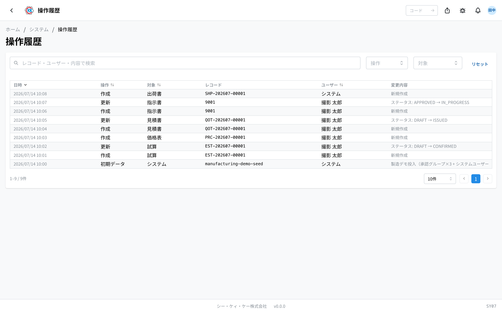
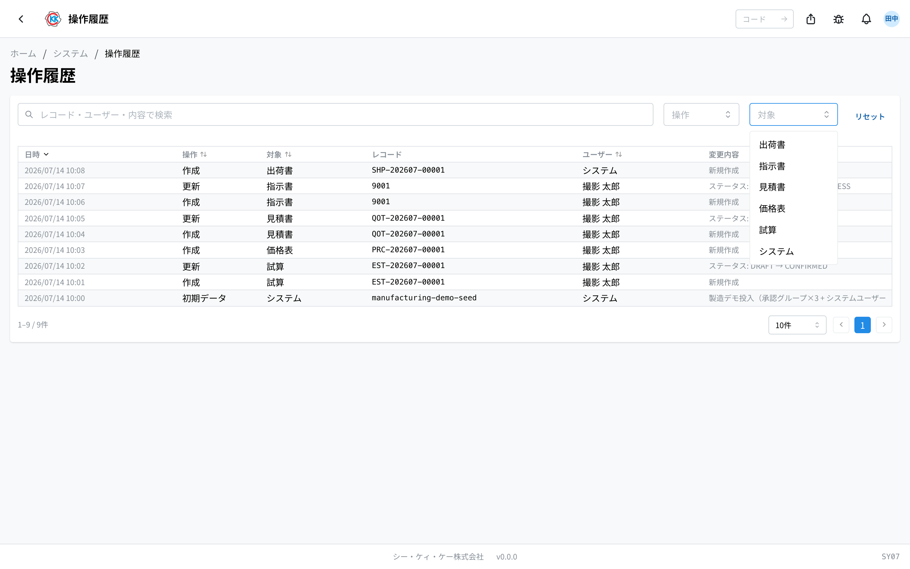
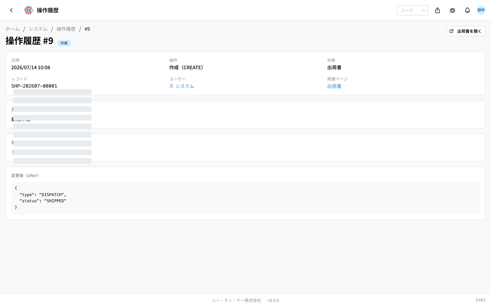
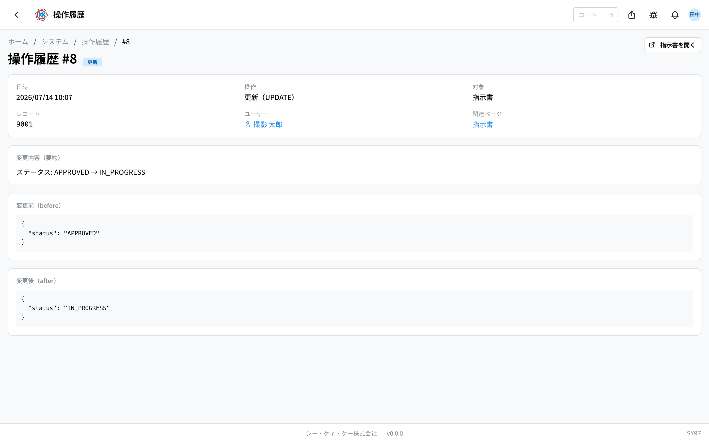

这是一个可以从整个系统中一并查询「**谁・什么时候・把哪条数据・怎样改动了**」的应用。操作代码是 `SY07`。

这是一个只能查看的应用。无法在这个画面上修改或删除记录。

## 本应用能做什么

- 把所有应用的改动记录汇总起来，按时间顺序查看。
- 可以用单据编号，或者改动人的姓名来查找。
- 选中一条，就能对照查看**改动前和改动后的内容**。
- 可以从记录直接跳转到被改动的那份单据的画面。
- 想查「是谁改了这个数字」「金额是从什么时候变的」时使用。

## 术语（本页出现的词）

- **レコード**（记录）… 指一条数据。一份报价单、一个产品，就是这样的单位。在这个画面上，用该单据的编号（如 `QOT-…`）来显示。
- **対象**（对象）… 表示是哪一类数据。报价单、试算、价格表、据点等分类。
- **変更内容**（变更内容）… 关于哪个项目、怎样变化的简短汇总。

## 开始之前

- 打开本应用需要 **系统管理权限**。如果打不开，请与系统管理员联系。
- 如果只想看某一份单据的历史，比起这个画面，**那份单据画面上的「履歴」（历史）标签** 更快找到。内容是一样的。

## 打开方式

按主页画面「システム」（系统）中的 **操作履歴**（操作历史）。或者在画面上方的搜索框里输入 `SY07`。

## 会记录和不会记录的内容

在**保存数据时**会自动记录。

- **作成**（创建）… 新建数据时。
- **更新**（更新）… 修改已有数据时。
- **削除**（删除）… 删除数据时。
- **初期データ**（初始数据）/ **マイグレーション**（迁移）… 系统最初放入数据，或者成批转移数据时的记录。不是人的操作。

另一方面，**只是查看的操作不会被记录**。打开画面、登录、下载 PDF 这类操作不会出现在这里。

## 画面的看法

打开应用后，记录按由新到旧排列。

- **日時**（日期时间）… 进行该操作的日期和时间。
- **操作**（操作）… 通常是 作成（创建）/ 更新（更新）/ 削除（删除）中的一种。不是人、而是系统进行的处理，有时也会显示「**初期データ**」（初始数据）「**マイグレーション**」（迁移）。
- **対象**（对象）… 是哪一类数据（报价单、试算、价格表等）。
- **レコード**（记录）… 该单据的编号。没有编号的数据显示为「—」。
- **ユーザー**（用户）… 进行操作的人的姓名。不是人、而是系统进行的处理，显示为「**システム**」（系统）。
- **変更内容**（变更内容）… 关于什么发生了怎样变化的汇总。按「项目名: 改动前 → 改动后」的形式排列。

> 💡 这个画面上显示的，最多是**由新到旧的 300 条**。想查比这更早的记录时，请与系统管理员联系。

## 查找・筛选

1. 在上方的搜索框「**レコード・ユーザー・内容で検索**」（按记录・用户・内容搜索）里，输入单据编号或人的姓名。
2. 用「**操作**」（操作）可以按操作的种类筛选。通常排列的是创建、更新、删除；有系统进行的处理时，还可以选择「初期データ」（初始数据）「マイグレーション」（迁移）。
3. 用「**対象**」（对象）可以筛选出报价单、产品等数据的种类。
4. 想清除全部条件时，按「**リセット**」（重置）。

没有符合条件的内容时，会显示「**操作履歴がありません**」（没有操作历史）。

## 详细查看一条

点击列表中的行，就会打开该条的画面。

上方排列着日期时间・操作・对象・记录・用户。

- 点击「**ユーザー**」（用户）的姓名，就会打开那个人的信息（[ユーザー管理](/manual/zh/system/user-management/user)，用户管理）。
- 「**関連ページ**」（相关页面）中显示单据名称时，可以移动到那份单据的画面。
- 画面右上角也会出现「**〈应用名〉を開く**」（打开〈应用名〉）的按钮。按下后，被改动的那份单据会直接打开。无法把单据确定为一份时，按钮会变成「**〈应用名〉で表示**」（在〈应用名〉中显示），打开该应用中已经筛选好的列表。

## 对照改动前和改动后

详情画面的下方，会原样排列出记录下来的内容。

- 「**変更内容（要約）**」（变更内容（摘要））… 只把发生变化的项目简短汇总起来。平时看这里就够了。
- 「**変更前（before）**」（改动前）… 修改之前的内容。
- 「**変更後（after）**」（改动后）… 修改之后的内容。

新建的记录中，「変更前（before）」会显示为「**なし**」（无）。删除的记录中，「変更後（after）」会显示为「**なし**」。

> 💡 「変更前」「変更後」的内容，是按系统保存时的形式原样显示的。里面会混有英文的项目名和符号，但这不是异常。想确认哪里发生了变化，看「変更内容（要約）」最简单。

## 常见问题・遇到麻烦时

**Q. 我只想看某一份报价单的历史。**
A. 打开那份报价单的画面，看「**履歴**」（历史）标签最快。想在这个画面上查时，请在搜索框里输入报价单编号。

**Q. 找不到我要找的旧记录。**
A. 这个画面上显示的，只有由新到旧的 300 条。需要比这更早的记录时，请与系统管理员联系。

**Q. 我想知道谁登录了。**
A. 这个画面上看不出来。这里记录的只有数据被创建、被修改、被删除时的记录。需要登录记录时，请与系统管理员联系。

**Q. 「ユーザー」变成了「システム」。是谁操作的？**
A. 不是人，而是系统自动进行的处理。夜间的自动处理、数据的导入等就属于这一类。

**Q.「対象」中显示「アプリ管理」（应用管理）的记录是什么？**
A. 是在 [アプリ管理](/manual/zh/system/app-management/user)（应用管理）中，切换应用显示或不显示的记录。

**Q. 右上角不出现「〈应用名〉を開く」的按钮。**
A. 如果无法从该记录把单据确定为一份，按钮就不会出现。请记下「レコード」中显示的编号，到那个应用的画面上去找。
