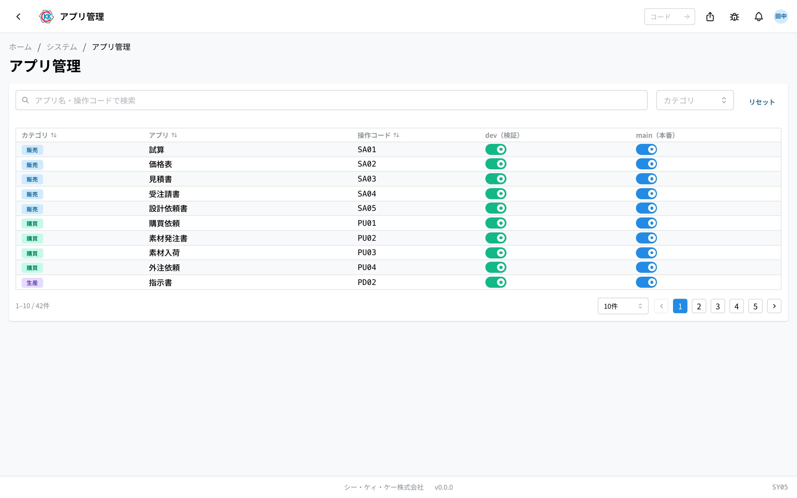
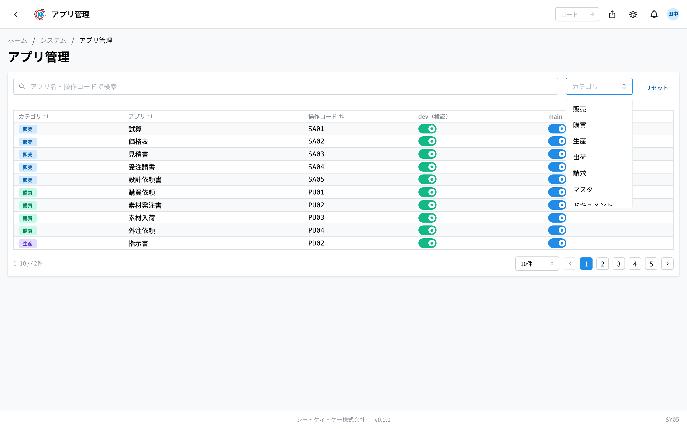

用 **开关来切换** 哪些应用显示在公司同事画面上的应用。操作代码为 `SY05`。

关掉开关后，该应用会从大家的主页上消失。数据不会被删除。

## 本应用能做什么

- 可以用一览的方式查看系统中的所有应用。
- 可以按应用，分别切换 **练习用画面** 和 **正式画面** 上的显示与不显示。
- 新应用准备好后，可以打开正式画面的开关来发布。
- 想暂时隐藏某个应用时也可以使用。

## 用语（本页出现的词）

- **dev（検証）（dev — 验证）** … 指用于练习和确认的画面。这里不是实际工作的数据，而是用来试验的地方。
- **main（本番）（main — 正式）** … 指大家日常工作中使用的、真正的画面。
- **操作コード（操作代码）** … 每个应用固定的 4 位字符记号（如 `SA02`）。在画面上方的搜索框中输入，就能跳转到该应用。

## 开始之前

- 打开本应用需要 **系统管理权限**。打不开时，请咨询系统管理员。
- 切换开关后，**会立即反映到所有人的画面上**。在工作时间段关掉正式画面的开关，应用会当场无法使用。请注意切换的时机。

## 打开方式

点击主页「システム」（系统）中的 **アプリ管理**（应用管理）。或者在画面上方的搜索框中输入 `SY05`。

## 画面的看法

打开应用后，系统中的应用会排列成一览。

- **カテゴリ**（类别）… 该应用的分类（販売（销售）/ 購買（采购）/ 生産（生产）/ 出荷（发货）/ 請求（开票）/ マスタ（主数据）/ ドキュメント（文档）/ システム（系统））。
- **アプリ**（应用）… 应用的名称。
- **操作コード**（操作代码）… `SY05` 这样的 4 位字符记号。
- **dev（検証）** … 是否显示在练习用画面上的开关。
- **main（本番）** … 是否显示在正式画面上的开关。

在上方的搜索框「**アプリ名・操作コードで検索**」（按应用名・操作代码搜索）中输入文字后，只会留下您要找的应用。也可以用「**カテゴリ**」按分类筛选。想清除全部条件时，请点击「**リセット**」（重置）。

## 切换显示与不显示

1. 找到想要切换的应用所在的行。
2. 点击「**dev（検証）**」或「**main（本番）**」的开关。
3. 画面右下方出现「**有効化しました**」（已启用）或「**無効化しました**」（已停用）时，就表示已经切换完成。

切换会 **立即反映到所有人的画面上**。再点一次，随时都能改回原样。

> ⚠️ 切换失败时，开关会自动回到原来的位置，并出现红色的「**エラー**」（错误）提示。这种情况下并没有切换成功。

## 两个开关的区别

即使是同一个应用，练习用和正式用的开关也是分开的。由于两者的初始状态不同，请注意以下几点。

- **dev（検証）** … 什么都不做的话，是 **显示** 的状态。只对想隐藏的应用关掉开关。
- **main（本番）** … 什么都不做的话，是 **不显示** 的状态。**只有打开了开关的应用** 才会出现在正式画面上。

也就是说，**「打开 main 的开关」本身就等于把该应用向公司内部发布**。打开之前，请先在练习用画面上充分确认。

尚未在正式画面上发布的应用，在练习用画面上会带着橙色的「**DEV**」标记显示。这是「这个应用还不能在正式画面上使用」的标志。

## 关掉开关后会怎样

- 该应用会从大家的主页和应用一览中 **消失**。
- 输入操作代码也不会再出现。
- 从把它加入收藏的人的画面上也会消失。
- 直接打开以前的网址也打不开了。
- **已经输入的数据不会消失。** 重新打开开关，就能照原样继续使用。

## 常见问题・遇到困难时

**Q. 点了开关后，出现红色的「エラー」（错误）并且回到了原样。**
A. 可能是没有切换的权限，或者是通信失败了。切换需要系统管理员的权限。请委托系统管理员处理。

**Q. 已经打开了开关，但应用没有出现在某个人的画面上。**
A. 开关只是「是否把应用显示在画面上」的设置。除此之外，那个人还必须拥有使用该应用的权限。请在 [用户管理](/manual/zh/system/user-management/user) 中确认那个人的权限。

**Q. 想使用的应用没有出现在这个一览中。**
A. 这个一览是根据系统中内置的应用自动生成的。要增加新应用，需要开发方进行相应的工作。请咨询系统管理员。

**Q. 不小心关掉了正式画面的开关。**
A. 再点一次重新打开，就会立即恢复原样。数据并没有消失。

**Q. 想知道是谁在什么时候做了切换。**
A. 可以在 [操作历史](/manual/zh/system/activity-log/user) 中确认。把「**対象**」（对象）筛选为「**アプリ管理**」（应用管理），就只会列出切换的记录。

**Q. 想只在维护期间隐藏某个应用。**
A. 请关掉该应用的开关。工作结束后重新打开就能恢复使用。数据会原样保留。
