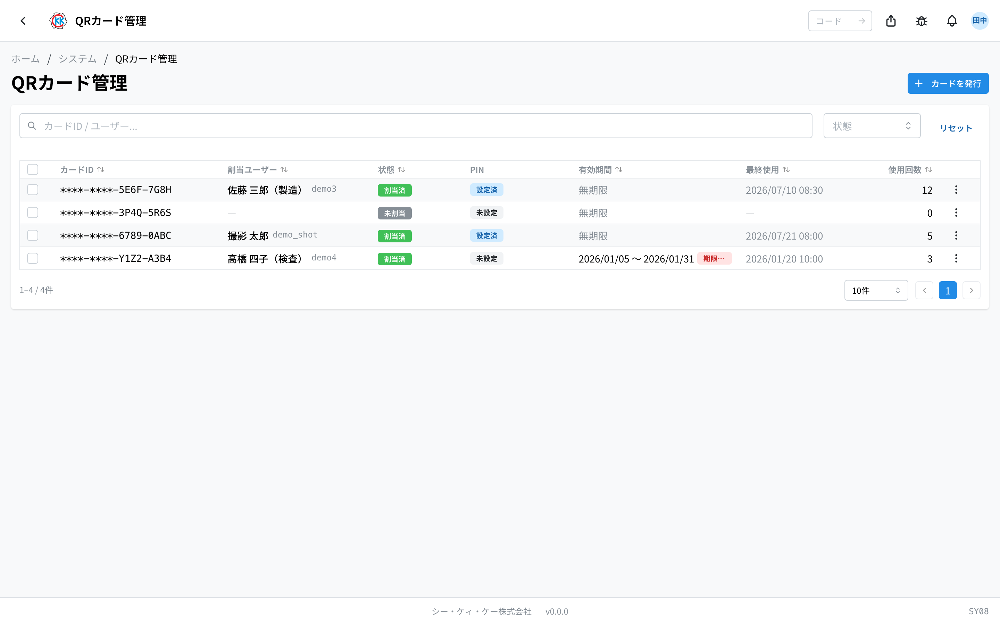
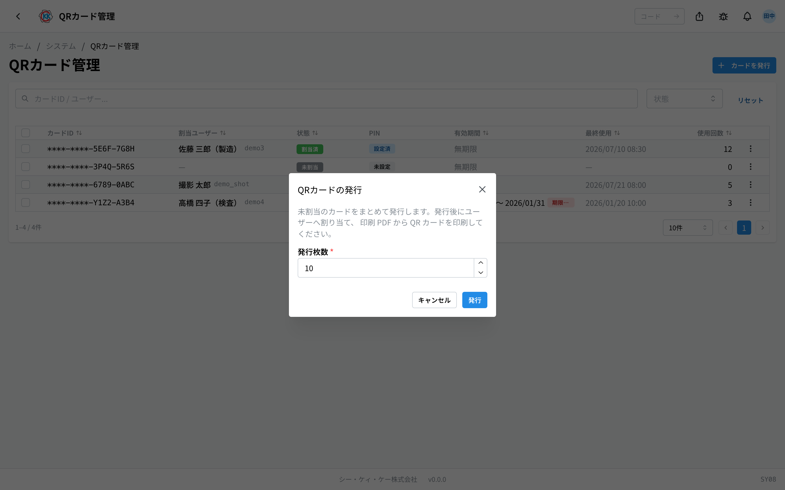
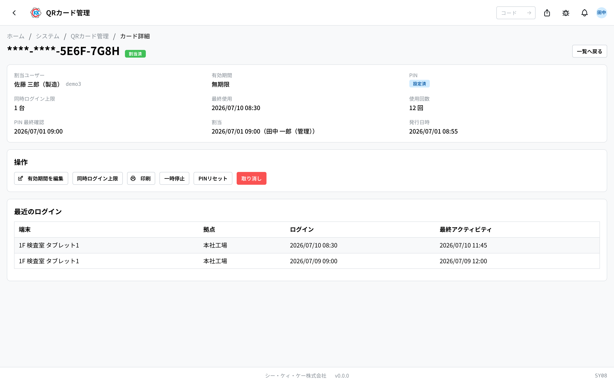

This app issues the **QR cards** that employees use to log in to the **shared tablets** placed on the factory floor, and helps you hand those cards out. The operation code is `SY08`.

An employee holds the card up to the tablet and enters a PIN that they chose themselves to log in.

## What you can do with this app

- Issue QR cards in batches (1–100 cards at a time).
- Assign the issued cards to individual employees.
- **Print** the cards. One A4 sheet holds 10 business-card-size cards.
- **Disable** a card that has been lost.
- **Erase** the PIN of someone who has forgotten it, so they can set a new one.
- Create temporary cards that only work for a set period (visiting helpers, trainees, and so on).

## Terms used on this page

- **QR card** … a card with a QR code printed on it, held up to the tablet to log in.
- **PIN** … a secret number that only the person themselves knows. It stops someone else from using the card if it is picked up.
- **Kiosk device** … the shared tablet placed on the factory floor.
- **Temporary card** … a card that only works for a limited period. Login is blocked outside that period.

## Before you start

- You need the **kiosk management permission** to use this app. If you cannot open it, please ask your system administrator.
- You can only give a card to someone who is **registered in this system and in an active state**. People who are not registered yet cannot be assigned a card.
- The tablet side also has to be prepared (registered in [Device Management](/manual/en/system/kiosk-device/user)).

## How to open it

On the home screen, under 「システム」 (System), press **QRカード管理** (QR Card Management). Or type `SY08` into the search box at the top of the screen.

## Reading the screen

When you open the app, the cards that have been issued are listed.

- **カードID** (Card ID) … the number that identifies the card. For safety, only the **last 8 characters** are shown.
- **割当ユーザー** (Assigned user) … the person you gave the card to. Cards not yet handed out show "—".
- **状態** (Status) … the current situation. There are four: **未割当** (Unassigned — not yet given to anyone) / **割当済** (Assigned — usable) / **一時停止** (Suspended — put on hold) / **取り消し** (Revoked — made unusable).
- **PIN** … shows 「**設定済**」 (Set) if the person has chosen a PIN, or 「**未設定**」 (Not set) if not. If it has been stopped after repeated wrong entries, 「**ロック中**」 (Locked) appears in red.
- **有効期間** (Validity period) … cards with no time limit show 「**無期限**」 (Unlimited). Cards with a set period show dates, and are marked 「**期限切れ**」 (Expired) once the period is over, or 「**開始前**」 (Not yet started) if it has not begun.
- **最終使用** (Last used) … the date and time the card was last used to log in.
- **使用回数** (Use count) … how many times the card has been used to log in so far.

You can search with the box at the top, 「**カードID / ユーザー...**」 (Card ID / user...). Narrow the list with 「**状態**」 (Status), and clear your conditions with 「**リセット**」 (Reset). Clicking a row opens the detail screen for that card.

## Issuing cards

First, create a batch of "blank cards" that do not belong to anyone yet.

1. Press 「**カードを発行**」 (Issue cards) at the top right of the screen.
2. Enter the number of cards you need in 「**発行枚数**」 (Number of cards to issue) — 1 to 100.
3. Press 「**発行**」 (Issue).

When 「**発行しました**」 (Issued) appears, you are done. All the new cards appear in the list with the status 「**未割当**」 (Unassigned).

## Assigning a card to a person

1. Find an 「未割当」 (Unassigned) card in the list.
2. Press the 「**…**」 button (the three dots) at the right end of the row.
3. Choose 「**ユーザーに割当**」 (Assign to user).
4. Choose the person you are giving it to in 「**割当先ユーザー**」 (User to assign to).
5. Press 「**割当**」 (Assign).

The status changes to 「**割当済**」 (Assigned).

> ⚠️ **One person can hold only one card.** You cannot assign a card to someone who already has one. To swap a card, first set the old card to 「取り消し」 (Revoked).

### When you want a card limited to a set period

For visiting helpers, trainees, and others who should only use a card for a certain period, assign it from the card's detail screen.

1. In the list, click the row of an 「未割当」 (Unassigned) card to open its detail screen.
2. Press 「**ユーザーに割当**」 (Assign to user).
3. Choose 「**割当先ユーザー**」 (User to assign to).
4. Enter 「**有効開始日**」 (Valid from) and 「**有効終了日**」 (Valid until). If you leave them blank, the start is right now and there is no end.
5. Press 「**割当**」 (Assign).

The card can be used **through the whole of the end date**. Login is blocked outside the period.

## Printing cards and handing them out

1. In the list, tick the checkbox at the left of each card you want to print. You can select any number of them.
2. Press 「**選択したカードを印刷**」 (Print selected cards) at the bottom of the screen.
3. A PDF for printing opens in another tab.
4. Print it on A4 paper.

One sheet holds **10 cards** (2 columns × 5 rows) at business-card size (91×55 mm). Cutting along the small cross marks in the corners gives a clean finish.

To print just one card, choose 「**印刷**」 (Print) from the 「**…**」 menu on that row.

> 💡 The card ID shown in the list is **only the last 8 characters** (the front part is hidden behind "*"). The printed QR code contains all of the information, so please handle printed cards with care.

## After you hand the card to the employee

Give the printed card to the person. The rest is done by them on the tablet.

1. They hold the QR code up to the tablet.
2. The first time they use it, they **choose their own PIN** on the spot.
3. From then on, they log in by holding up the card and entering their PIN.

Only the person knows their PIN. **An administrator cannot see it or choose one on their behalf.**

## Helping someone who is stuck

From the 「**…**」 menu on a card's row, you can do the following.

- 「**PINロック解除**」 (Unlock PIN) … use this for someone who is locked out after entering the wrong PIN repeatedly. Pressing it lets them use the card again straight away. Their PIN stays the same.
- 「**PINリセット**」 (Reset PIN) … use this for someone who has forgotten their PIN. The current PIN is erased, and they choose a new one at their next login.
- 「**一時停止**」 (Suspend) … temporarily stops logins with that card. 「**再開**」 (Resume) puts it back.
- 「**再開**」 (Resume) … makes a suspended card usable again.
- 「**取り消し**」 (Revoke) … makes the card permanently unusable.

> ⚠️ 「**取り消し**」 (Revoke) **cannot be undone**. The moment you press it, any tablet currently logged in with that card is logged out on the spot. Use it when a card has been lost, or the person has left the company.

## The card detail screen

Clicking a row in the list opens the screen for that single card.

The upper part shows the assigned user, validity period, PIN, last used, use count, and so on. The 「**操作**」 (Actions) area has these buttons.

- 「**有効期間を編集**」 (Edit validity period) … extend or shorten the usable period, or set it back to unlimited.
- 「**同時ログイン上限**」 (Concurrent login limit) … decides how many tablets can be logged in at the same time with one card (1–10). When the limit is exceeded, the oldest device is logged out automatically.
- 「印刷」 (Print), 「一時停止」 (Suspend), 「再開」 (Resume), 「PINロック解除」 (Unlock PIN), 「PINリセット」 (Reset PIN), and 「取り消し」 (Revoke) can also be done here.

At the very bottom, 「**最近のログイン**」 (Recent logins) lets you check which tablet the card was used on, and when.

## FAQ and troubleshooting

**Q. An employee has lost their card.**
A. Set that card to 「**取り消し**」 (Revoke). Then issue a new card, assign it, print it, and hand it over.

**Q. Someone says they have forgotten their PIN.**
A. Press 「**PINリセット**」 (Reset PIN) on that card. They will choose a new PIN the next time they log in on a tablet.

**Q. The PIN column shows 「ロック中」 (Locked) in red.**
A. When the wrong PIN is entered **5 times in a row**, that card becomes unusable for **15 minutes**. It clears by itself after those 15 minutes, but if it is urgent, press 「**PINロック解除**」 (Unlock PIN).

**Q. I get the message 「このユーザーには既に割当済のカードがあります。先に既存カードを取り消してください」 ("This user already has an assigned card. Please revoke the existing card first").**
A. That person already has another card. Only one card per person is allowed, so set the old card to 「**取り消し**」 (Revoke) before assigning the new one.

**Q. A card shows 「期限切れ」 (Expired) and the employee cannot log in.**
A. The card's validity period has ended. Extend the end date with 「**有効期間を編集**」 (Edit validity period) on the detail screen, or switch to a new card.

**Q. The person I want to assign the card to does not appear in the list of choices.**
A. That person is either not registered in the system, or is currently in an unusable state. Check their status in [User Management](/manual/en/system/user-management/user).

**Q. I want to move a card to a different person.**
A. You cannot change who a card is assigned to. Set the current card to 「**取り消し**」 (Revoke) and assign a new card to that person.
