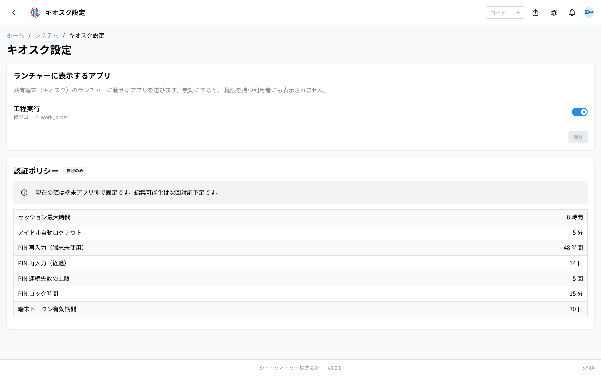

Operation code **SY0A**. Choose which apps appear on the shared tablets' (kiosk) launcher and review the kiosk authentication policy.

> This app is currently available **in the development (dev) environment only**. Screens and steps may change before the production release.

## What you can do with this app

- Toggle the **apps shown on the kiosk launcher** ON/OFF.
- Review the kiosk **authentication policy** (session length, PIN, and lock rules) — currently view-only.

This app requires the **kiosk management (kiosk) permission** (toggling requires the update action).

## How to open

- Home (System) → **Kiosk Settings**, or type `SY0A` in the search box.

## Apps shown on the launcher

Use the switches to choose which apps appear on the shared-terminal (kiosk) launcher. **Disabling an app hides it even from users who hold its permission.** Press **Save** to apply your changes.

The only app currently available on the kiosk is **Step Execution** (permission code: `work_order`). Future kiosk apps will appear in this list.

## Authentication policy (view-only)

The kiosk login and session rules are shown as a table. The current values are fixed on the device-app side and cannot be changed from this screen (making them editable is planned for a future release).

| Item | Value |
| --- | --- |
| Maximum session length | 8 hours |
| Idle auto-logout | 5 minutes |
| PIN re-entry (device unused) | 48 hours |
| PIN re-entry (elapsed) | 14 days |
| Consecutive PIN failure limit | 5 times |
| PIN lock duration | 15 minutes |
| Device token lifetime | 30 days |

## FAQ

- **An app does not appear on the kiosk** … Check that its switch here is ON and that the user holds the app's permission (e.g. Step Execution requires `work_order`). Only apps meeting both conditions appear on the launcher.
- For device registration and activation, see [Device Management](/manual/en/system/kiosk-device/user); for login QR cards, see [QR Card Management](/manual/en/system/kiosk-card/user).
