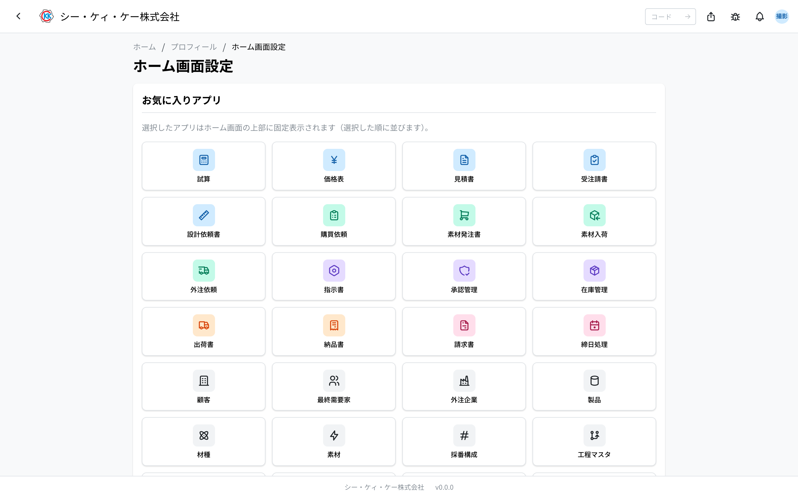
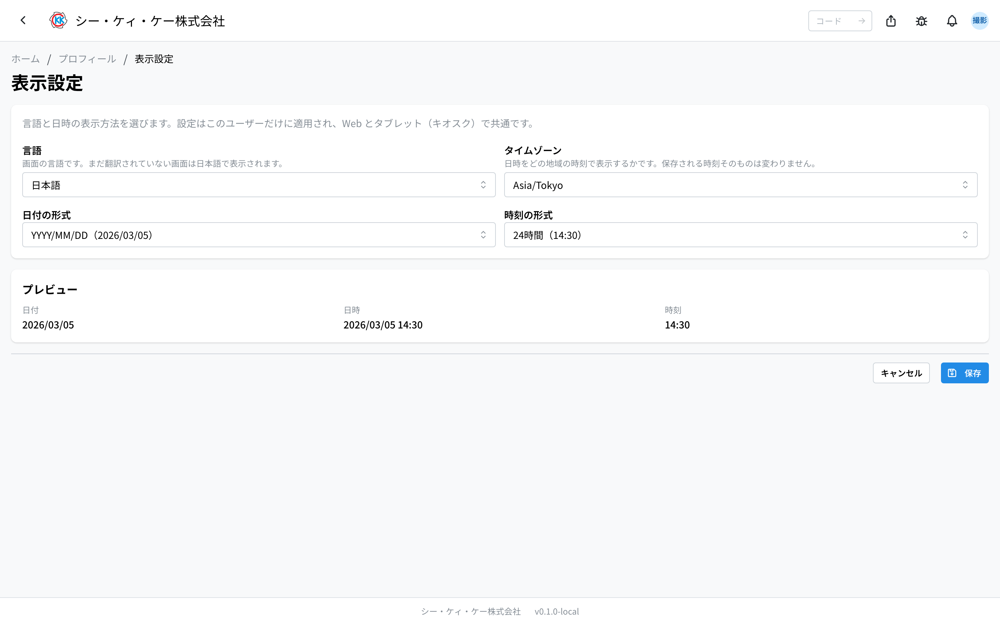

与自己账号相关的设置。从右上角头像菜单 →“个人资料”/“通知设置”/“主页设置”/“显示设置”打开。

> 💡 个人设置全部集中在该头像菜单中。主页上没有设置按钮。

## 个人资料

- **显示名称 / 所属部门**：与公司目录（AD）同步。如需更改请联系信息系统部门。
- **邮箱（通知地址）**：接收通知的邮箱地址。若为空，则不发送邮件通知。

## 密码

- 若使用 SSO 登录，密码由公司账号一侧管理。
- 如需更改系统内账号的密码，请在“个人资料 → 修改密码”中操作：输入当前密码与新密码（两次）。

## 通知

- **应用内通知**：显示在页头的铃铛处，可用“全部标记为已读”统一处理。
- **邮件通知**：发送至个人资料中的邮箱。
- **推送通知**：在“个人资料 → 通知设置”中按设备启用后，锁屏 / 桌面即可收到通知。

## 按平台启用推送通知

- **Chrome / Edge（电脑）**：“个人资料 → 通知设置”→“在此设备上启用”，并在浏览器的通知权限提示中选择“允许”。
- **Android（Chrome）**：步骤相同。若出现“安装应用”按钮，安装后可从主屏幕启动（可选）。还需在系统设置中允许 Chrome 的通知。
- **iPhone / iPad（iOS 16.4 及以上）**：无法在 Safari 标签页中启用。请使用 Safari 的分享按钮 →“添加到主屏幕”，从主屏幕的“CKK”图标重新打开后，再点击“在此设备上启用”。
- 若误将通知设为拦截，请在浏览器的网站设置中将通知改回“允许”后再重新启用。

## 已注册设备

- 在“个人资料 → 通知设置”的“已注册设备”中，可查看并删除已启用推送通知的设备。请删除不再使用的终端。

## 主页设置

通过头像菜单中的“主页设置”，可自定义主页的排列。

- **收藏应用** … 点击卡片选择应用后，它们会作为“收藏”集中显示在主页最上方，显示顺序即选择顺序。
- **显示模式** … 可在“标准（按类别）”与“自定义（按分组）”之间切换。自定义模式下按自建分组排列应用，未加入任何分组的应用会集中在“其他”。
- **自定义分组** … 在“新分组”中输入分组名并添加。每个分组可以重命名、上移 / 下移、删除，并可选择所属应用（一个应用最多只能属于一个分组；已在其他分组中的应用无法选择）。

## 显示设置

通过头像菜单中的“**显示设置**”，可以更改界面语言以及日期时间的显示方式。设置**仅适用于本人**，且在网页端与车间平板（kiosk）通用。

- **语言** … 可选择 日本語 / English / 中文。
- **日期格式** … 可选择 `2026/03/05`、`2026-03-05`、`05/03/2026`、`03/05/2026`。
- **时间格式** … 24 小时制（14:30）或 12 小时制（2:30 PM）。
- **时区** … 以哪个地区的时间显示日期时间。在海外厂区或出差时使用可据此调整。选项中会附带该地区的**当前时间**，一眼即可看出时差。

选择后会立即反映到下方的“**预览**”，保存前即可确认效果。保存后会应用到**所有显示日期时间的位置**（列表、详情、历史等）。

> 💡 **更改时区不会改变已记录的时间本身。** 只是改为以哪个地区的时钟来读取同一事件。

### 部分画面仍为日语

即使选择 English / 中文，**尚未翻译的画面仍以日语显示**（并非故障）。目前会切换的是右上角菜单、通知面板以及本显示设置画面。日期、时间、时区设置从一开始就对所有画面生效。

### 单据（PDF）不遵循此设置

报价单、送货单、发票等 PDF **始终以日本时间和统一格式**打印，以免同一份已完成的单据因查看者不同而显示不同日期。

## 手册语言

- 手册（/manual）可通过右上角的语言链接在 日本語 / English / 中文 之间切换。应用本身的语言请在上方的“**显示设置**”中更改。
